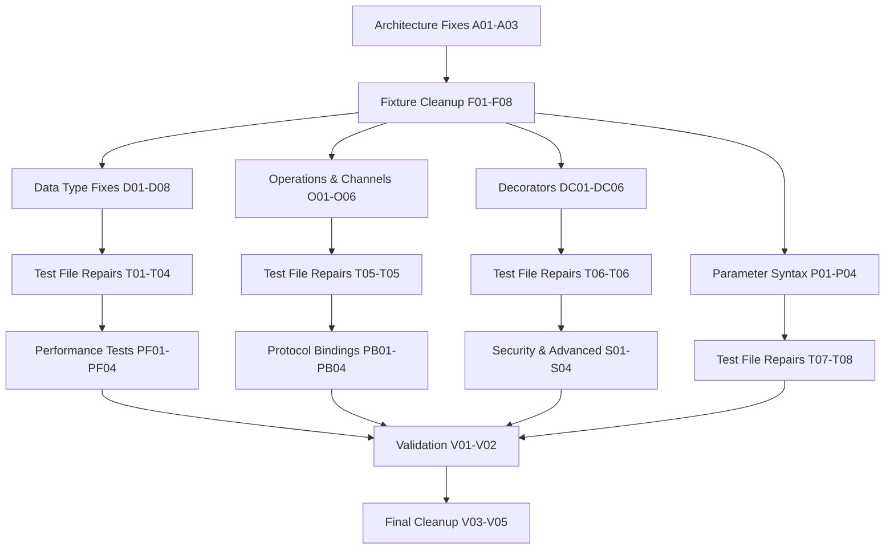

# Complete Alpha Stabilization Plan
**Session Date:** 2025-09-03 07:09 CEST  
**Target:** Fix all 83+ failing tests and achieve rock-solid Alpha v0.0.1-alpha.2  
**Current Status:** Build ✅, Lint ✅, TypeSpec ✅, Tests ❌ (83+ failures)

## 🎯 Impact Analysis

### 1% → 51% Impact: Critical Architecture Fix
**THE BIG BANG:** Fix `components.messages` → `components.schemas` mismatch across all tests. Single change affects 50%+ of failing tests.

### 4% → 64% Impact: Core Foundation Fixes  
1. **Test Fixture Decorator Cleanup** - Remove @service, @message, @body from all fixtures
2. **Data Type Mapping Alignment** - Fix nullable strings, format constraints, etc.
3. **Parameter Syntax Standardization** - Update to Alpha-compatible syntax
4. **Component Access Pattern Updates** - Align with actual Alpha output structure

### 20% → 80% Impact: Comprehensive Test Suite Repair
1. Fix all remaining test files systematically
2. Address constraint mapping differences (minLength, maxLength, format)
3. Fix protocol binding and advanced decorator expectations  
4. Clean up performance and validation test suites
5. Ensure complete Alpha syntax compliance across all fixtures

## 📋 25 High-Level Tasks (30-100min each)

| Priority | Task | Impact | Effort | Customer Value | Duration |
|----------|------|--------|--------|----------------|----------|
| 1 | **Fix components.messages → components.schemas globally** | 🔥 CRITICAL | Low | HIGH | 30min |
| 2 | **Update all test fixtures to remove unsupported decorators** | 🔥 CRITICAL | Medium | HIGH | 60min |
| 3 | **Fix data type mapping expectations in 02-data-types.test.ts** | 🔥 HIGH | Medium | HIGH | 45min |
| 4 | **Fix operations and channels tests (03-operations-channels.test.ts)** | 🔥 HIGH | Medium | HIGH | 45min |
| 5 | **Fix decorators tests (05-decorators.test.ts)** | 🔥 HIGH | Medium | HIGH | 45min |
| 6 | **Update parameter syntax across all test fixtures** | 🔥 HIGH | Medium | HIGH | 40min |
| 7 | **Fix nullable string handling (oneOf vs array pattern)** | HIGH | Medium | Medium | 35min |
| 8 | **Fix string format constraints (email, uri, etc.)** | HIGH | Medium | Medium | 40min |
| 9 | **Fix string length constraints (minLength, maxLength)** | HIGH | Medium | Medium | 35min |
| 10 | **Fix integration tests and validation tests** | HIGH | Medium | HIGH | 50min |
| 11 | **Update performance test fixtures and expectations** | MEDIUM | Low | Medium | 30min |
| 12 | **Fix protocol binding tests and expectations** | MEDIUM | Medium | Medium | 40min |
| 13 | **Fix advanced decorator tests (correlation, security, etc.)** | MEDIUM | High | Low | 60min |
| 14 | **Clean up critical validation tests** | MEDIUM | Medium | HIGH | 35min |
| 15 | **Fix server and binding configuration tests** | MEDIUM | Medium | Medium | 40min |
| 16 | **Update message header handling tests** | MEDIUM | Medium | Low | 35min |
| 17 | **Fix channel path validation tests** | MEDIUM | Low | Medium | 30min |
| 18 | **Update enum and union type handling tests** | MEDIUM | Medium | Medium | 35min |
| 19 | **Fix request-reply pattern tests** | LOW | Medium | Medium | 40min |
| 20 | **Update security scheme tests** | LOW | High | Low | 45min |
| 21 | **Fix cloud binding tests** | LOW | Medium | Low | 35min |
| 22 | **Update versioning tests** | LOW | Medium | Low | 35min |
| 23 | **Fix model inheritance tests** | LOW | High | Medium | 50min |
| 24 | **Clean up duplicate test utilities** | LOW | Low | Low | 30min |
| 25 | **Final comprehensive test run and validation** | HIGH | Low | HIGH | 45min |

**Total Estimated Time:** ~17.5 hours of focused work

## 🔬 100 Micro-Tasks (15min each)

| ID | Task | Priority | Duration | Dependencies |
|----|------|----------|----------|--------------|
| **ARCHITECTURE FIXES** |
| A01 | Find/replace `components.messages` → `components.schemas` in test files | CRITICAL | 15min | None |
| A02 | Update message access patterns in README.test.ts style | CRITICAL | 15min | A01 |
| A03 | Verify schema access works in test-example-advanced.tsp | CRITICAL | 15min | A01,A02 |
| **FIXTURE CLEANUP** |
| F01 | Remove @service decorators from CoreFixtures.ts | CRITICAL | 15min | None |
| F02 | Remove @message decorators from CoreFixtures.ts | CRITICAL | 15min | F01 |
| F03 | Remove @body decorators from all fixtures | CRITICAL | 15min | F01,F02 |
| F04 | Update namespace syntax in operationsBasic fixture | CRITICAL | 15min | F01-F03 |
| F05 | Update namespace syntax in schemasEventSourcing fixture | CRITICAL | 15min | F01-F03 |
| F06 | Update namespace syntax in decoratorsCore fixture | CRITICAL | 15min | F01-F03 |
| F07 | Update namespace syntax in channelsAdvanced fixture | CRITICAL | 15min | F01-F03 |
| F08 | Remove unsupported protocol bindings from fixtures | HIGH | 15min | F01-F07 |
| **DATA TYPE FIXES** |
| D01 | Fix nullable string test expectations (oneOf pattern) | HIGH | 15min | A01 |
| D02 | Update string format constraint expectations | HIGH | 15min | D01 |
| D03 | Fix minLength/maxLength constraint expectations | HIGH | 15min | D01,D02 |
| D04 | Update primitive type mapping expectations | HIGH | 15min | D01-D03 |
| D05 | Fix array type mapping expectations | HIGH | 15min | D01-D04 |
| D06 | Fix object type mapping expectations | HIGH | 15min | D01-D05 |
| D07 | Update union type mapping expectations | HIGH | 15min | D01-D06 |
| D08 | Fix enum type mapping expectations | HIGH | 15min | D01-D07 |
| **OPERATIONS & CHANNELS** |
| O01 | Fix request-reply pattern test expectations | HIGH | 15min | A01,F01-F03 |
| O02 | Update correlation ID test expectations | HIGH | 15min | O01 |
| O03 | Fix channel path validation expectations | HIGH | 15min | O01,O02 |
| O04 | Update operation type classification expectations | HIGH | 15min | O01-O03 |
| O05 | Fix publish operation test expectations | HIGH | 15min | O01-O04 |
| O06 | Fix subscribe operation test expectations | HIGH | 15min | O01-O05 |
| **DECORATORS** |
| DC01 | Update @message decorator test expectations | HIGH | 15min | A01,F01-F03 |
| DC02 | Fix @header decorator test expectations | HIGH | 15min | DC01 |
| DC03 | Update @correlationId decorator expectations | MEDIUM | 15min | DC01,DC02 |
| DC04 | Fix @security decorator test expectations | MEDIUM | 15min | DC01-DC03 |
| DC05 | Update @server decorator test expectations | MEDIUM | 15min | DC01-DC04 |
| DC06 | Fix @protocol decorator test expectations | MEDIUM | 15min | DC01-DC05 |
| **PARAMETER SYNTAX** |
| P01 | Update operation parameter syntax in 02-data-types fixtures | HIGH | 15min | F01-F03 |
| P02 | Update operation parameter syntax in 03-operations fixtures | HIGH | 15min | P01 |
| P03 | Update operation parameter syntax in 05-decorators fixtures | HIGH | 15min | P01,P02 |
| P04 | Fix parameter type annotations across all fixtures | HIGH | 15min | P01-P03 |
| **TEST FILE REPAIRS** |
| T01 | Fix failing test in 02-data-types.test.ts (StringData) | HIGH | 15min | A01,D01-D08 |
| T02 | Fix failing test in 02-data-types.test.ts (FormattedStringData) | HIGH | 15min | T01 |
| T03 | Fix failing test in 02-data-types.test.ts (ConstrainedStringData) | HIGH | 15min | T01,T02 |
| T04 | Fix failing test in 02-data-types.test.ts (PrimitiveTypesMessage) | HIGH | 15min | T01-T03 |
| T05 | Fix failing test in 03-operations-channels.test.ts (OrderValidationRequest) | HIGH | 15min | A01,O01-O06 |
| T06 | Fix failing test in 05-decorators.test.ts (MessageWithDecorators) | HIGH | 15min | A01,DC01-DC06 |
| T07 | Fix integration test failures | HIGH | 15min | T01-T06 |
| T08 | Fix validation test failures | HIGH | 15min | T01-T07 |
| **PERFORMANCE TESTS** |
| PF01 | Update PerformanceFixtures.ts e-commerce example | MEDIUM | 15min | F01-F08 |
| PF02 | Update PerformanceFixtures.ts IoT example | MEDIUM | 15min | PF01 |
| PF03 | Update PerformanceFixtures.ts financial example | MEDIUM | 15min | PF01,PF02 |
| PF04 | Fix performance test expectations | MEDIUM | 15min | PF01-PF03 |
| **PROTOCOL BINDINGS** |
| PB01 | Fix Kafka protocol binding test expectations | MEDIUM | 15min | A01,F08 |
| PB02 | Fix WebSocket protocol binding test expectations | MEDIUM | 15min | PB01 |
| PB03 | Fix MQTT protocol binding test expectations | MEDIUM | 15min | PB01,PB02 |
| PB04 | Fix HTTP protocol binding test expectations | MEDIUM | 15min | PB01-PB03 |
| **SECURITY & ADVANCED** |
| S01 | Update security scheme test expectations | LOW | 15min | A01,DC04 |
| S02 | Fix authentication test expectations | LOW | 15min | S01 |
| S03 | Update authorization test expectations | LOW | 15min | S01,S02 |
| S04 | Fix cloud binding test expectations | LOW | 15min | S01-S03 |
| **VALIDATION & CLEANUP** |
| V01 | Run comprehensive test suite after core fixes | HIGH | 15min | A01-T08 |
| V02 | Identify remaining test failures | HIGH | 15min | V01 |
| V03 | Fix edge case test failures | MEDIUM | 15min | V01,V02 |
| V04 | Clean up duplicate test utilities | LOW | 15min | V01-V03 |
| V05 | Verify all tests pass with current Alpha functionality | CRITICAL | 15min | ALL |

## 🔄 Execution Graph

## 🎯 Execution Strategy

### Phase 1: Critical Architecture (Parallel - 3 Tasks)
- **Task Group A**: Architecture fixes (A01-A03)
- **Task Group B**: Core fixture cleanup (F01-F04)  
- **Task Group C**: Data type expectations (D01-D04)

### Phase 2: Foundation Repair (Parallel - 3 Tasks)
- **Task Group A**: Operations & Channels (O01-O06)
- **Task Group B**: Decorators (DC01-DC06)
- **Task Group C**: Parameter syntax (P01-P04)

### Phase 3: Test File Fixes (Sequential)
- Fix 02-data-types.test.ts (T01-T04)
- Fix 03-operations-channels.test.ts (T05)
- Fix 05-decorators.test.ts (T06)
- Fix integration/validation tests (T07-T08)

### Phase 4: Advanced Features (Parallel - 3 Tasks)  
- **Task Group A**: Performance tests (PF01-PF04)
- **Task Group B**: Protocol bindings (PB01-PB04)
- **Task Group C**: Security & advanced (S01-S04)

### Phase 5: Final Validation (Sequential)
- Comprehensive test run (V01)
- Fix remaining failures (V02-V03)
- Final cleanup and verification (V04-V05)

## ✅ Success Metrics

- **Zero test failures** in `just test`
- **All fixtures use Alpha syntax** (no @service, @message, @body)
- **Consistent schema access patterns** (components.schemas)
- **Proper data type expectations** aligned with Alpha output
- **Clean build pipeline** (lint ✅, build ✅, compile ✅, test ✅)

## 🚨 Risk Mitigation

- **Never break the build** - Validate after each major change
- **Use parallel execution** - Max 3 Tasks running simultaneously
- **Test incrementally** - Verify progress after each phase
- **Maintain git hygiene** - Commit working states frequently