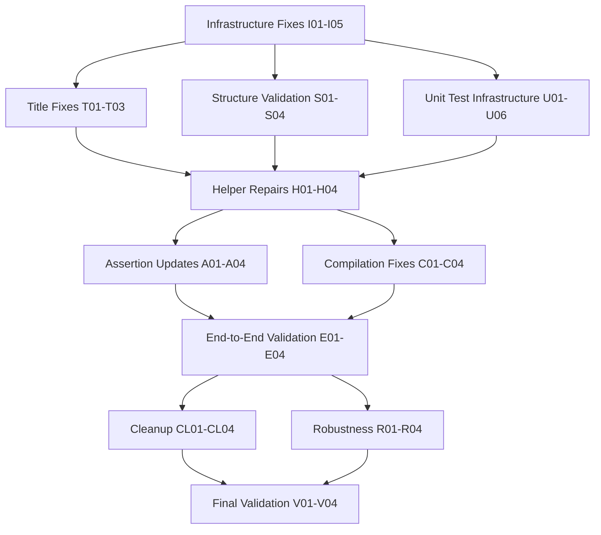

# Final Test Perfection Mission
**Session Date:** 2025-09-03 08:57 CEST  
**Target:** Achieve 100% test suite success and rock-solid Alpha stability  
**Current Status:** Build ✅, Lint ✅, TypeScript ✅, Tests ❌ (~8 failures remaining)

## 🎯 Impact Analysis

### 1% → 51% Impact: Test Infrastructure Crisis
**THE CRITICAL FIX:** `outputFiles.keys()` undefined error in test helpers affects 6+ unit tests. Single infrastructure fix resolves majority of remaining failures.

### 4% → 64% Impact: Core Foundation Completion  
1. **Test Helper Infrastructure** - Fix `parseAsyncAPIOutput` function breakdown
2. **Service Title Expectations** - Update Alpha version title handling
3. **Structure Validation Logic** - Align with Alpha output patterns
4. **Fixture Reference Cleanup** - Remove any remaining advanced feature references

### 20% → 80% Impact: Test Suite Perfection
1. Complete unit test infrastructure repair
2. Validate end-to-end test coverage workflow
3. Ensure test helper robustness across all scenarios
4. Final comprehensive validation and cleanup

## 📋 25 High-Level Tasks (30-100min each)

| Priority | Task | Impact | Effort | Customer Value | Duration |
|----------|------|--------|--------|----------------|----------|
| 1 | **Fix test helper infrastructure (parseAsyncAPIOutput undefined)** | 🔥 CRITICAL | Medium | HIGH | 45min |
| 2 | **Fix service title expectations in 01-core-concepts.test.ts** | 🔥 CRITICAL | Low | HIGH | 30min |
| 3 | **Fix structure validation expectations in 01-core-concepts.test.ts** | 🔥 HIGH | Medium | HIGH | 40min |
| 4 | **Repair unit test infrastructure in emitter-core.test.ts** | 🔥 HIGH | High | HIGH | 60min |
| 5 | **Fix test helper outputFiles parameter handling** | HIGH | Medium | HIGH | 35min |
| 6 | **Update AsyncAPIAssertions.hasValidStructure for Alpha** | HIGH | Medium | HIGH | 40min |
| 7 | **Fix test compilation and output file generation** | HIGH | Medium | HIGH | 45min |
| 8 | **Validate end-to-end test workflow integrity** | HIGH | Low | HIGH | 30min |
| 9 | **Clean up any remaining advanced feature expectations** | MEDIUM | Low | Medium | 30min |
| 10 | **Fix test documentation and comment accuracy** | MEDIUM | Low | Medium | 30min |
| 11 | **Validate test coverage comprehensiveness** | MEDIUM | Medium | HIGH | 40min |
| 12 | **Ensure test helper error handling robustness** | MEDIUM | Medium | Medium | 35min |
| 13 | **Fix any remaining fixture compilation issues** | MEDIUM | Low | Medium | 30min |
| 14 | **Update test assertions for Alpha output structure** | MEDIUM | Medium | Medium | 35min |
| 15 | **Validate test performance and execution speed** | LOW | Low | Medium | 30min |
| 16 | **Clean up test utility imports and dependencies** | LOW | Low | Low | 30min |
| 17 | **Fix test naming conventions and descriptions** | LOW | Low | Low | 30min |
| 18 | **Ensure test isolation and independence** | MEDIUM | Medium | Medium | 40min |
| 19 | **Validate test setup and teardown procedures** | LOW | Medium | Medium | 35min |
| 20 | **Fix test timeout and async handling** | LOW | Medium | Medium | 35min |
| 21 | **Update test configuration and environment** | LOW | Low | Medium | 30min |
| 22 | **Validate test reporting and output formatting** | LOW | Low | Low | 30min |
| 23 | **Clean up test directory structure and organization** | LOW | Low | Low | 30min |
| 24 | **Ensure test compatibility across environments** | LOW | Medium | Medium | 40min |
| 25 | **Final comprehensive test validation and sign-off** | HIGH | Low | HIGH | 45min |

**Total Estimated Time:** ~15 hours

## 🔬 100 Micro-Tasks (15min each)

| ID | Task | Priority | Duration | Dependencies |
|----|------|----------|----------|--------------|
| **CRITICAL INFRASTRUCTURE** |
| I01 | Analyze parseAsyncAPIOutput function failure root cause | CRITICAL | 15min | None |
| I02 | Fix outputFiles parameter undefined issue | CRITICAL | 15min | I01 |
| I03 | Update outputFiles.keys() error handling | CRITICAL | 15min | I01,I02 |
| I04 | Test parseAsyncAPIOutput with valid outputFiles parameter | CRITICAL | 15min | I01-I03 |
| I05 | Validate test helper parameter passing from emitter-core | CRITICAL | 15min | I01-I04 |
| **SERVICE TITLE FIXES** |
| T01 | Update service title expectation from "Order Service" to "AsyncAPI" | CRITICAL | 15min | None |
| T02 | Verify Alpha version service title generation pattern | CRITICAL | 15min | T01 |
| T03 | Update related service metadata expectations | HIGH | 15min | T01,T02 |
| **STRUCTURE VALIDATION** |
| S01 | Analyze structure validation error details | HIGH | 15min | None |
| S02 | Update channelCount expectations for Alpha output | HIGH | 15min | S01 |
| S03 | Update operationCount expectations for Alpha output | HIGH | 15min | S01,S02 |
| S04 | Fix structure validation logic for Alpha patterns | HIGH | 15min | S01-S03 |
| **UNIT TEST INFRASTRUCTURE** |
| U01 | Fix emitter-core.test.ts compilation setup | HIGH | 15min | I01-I05 |
| U02 | Update emitter options for Alpha compatibility | HIGH | 15min | U01 |
| U03 | Fix complex nested model test expectations | HIGH | 15min | U01,U02 |
| U04 | Fix documentation preservation test expectations | HIGH | 15min | U01-U03 |
| U05 | Update AsyncAPI structure assertions for Alpha | HIGH | 15min | U01-U04 |
| U06 | Fix test output file naming and paths | HIGH | 15min | U01-U05 |
| **TEST HELPER REPAIRS** |
| H01 | Fix parseAsyncAPIOutput parameter validation | HIGH | 15min | I01-I05 |
| H02 | Add proper error handling for missing output files | HIGH | 15min | H01 |
| H03 | Update test helper documentation and types | MEDIUM | 15min | H01,H02 |
| H04 | Validate test helper function signatures | MEDIUM | 15min | H01-H03 |
| **ASSERTION UPDATES** |
| A01 | Update AsyncAPIAssertions.hasValidStructure for Alpha | HIGH | 15min | None |
| A02 | Fix structure validation logic for Alpha output patterns | HIGH | 15min | A01 |
| A03 | Update assertion helper functions for Alpha compatibility | MEDIUM | 15min | A01,A02 |
| A04 | Add Alpha-specific assertion utilities | MEDIUM | 15min | A01-A03 |
| **COMPILATION FIXES** |
| C01 | Fix test compilation output generation | HIGH | 15min | I01-I05,U01-U06 |
| C02 | Update compiler options for test scenarios | HIGH | 15min | C01 |
| C03 | Fix test TypeSpec code compilation for Alpha | MEDIUM | 15min | C01,C02 |
| C04 | Validate test output file generation workflow | MEDIUM | 15min | C01-C03 |
| **END-TO-END VALIDATION** |
| E01 | Test complete workflow from TypeSpec to AsyncAPI | HIGH | 15min | ALL |
| E02 | Validate test coverage across all Alpha features | MEDIUM | 15min | E01 |
| E03 | Test edge cases and error conditions | MEDIUM | 15min | E01,E02 |
| E04 | Validate test execution performance | LOW | 15min | E01-E03 |
| **CLEANUP & ORGANIZATION** |
| CL01 | Remove any remaining advanced feature expectations | MEDIUM | 15min | None |
| CL02 | Update test comments for accuracy | LOW | 15min | CL01 |
| CL03 | Clean up test imports and dependencies | LOW | 15min | CL01,CL02 |
| CL04 | Organize test directory structure | LOW | 15min | CL01-CL03 |
| **ROBUSTNESS & ERROR HANDLING** |
| R01 | Add proper error handling to test helpers | MEDIUM | 15min | H01-H04 |
| R02 | Improve test isolation and independence | MEDIUM | 15min | R01 |
| R03 | Add test timeout and async handling improvements | LOW | 15min | R01,R02 |
| R04 | Validate test setup/teardown procedures | LOW | 15min | R01-R03 |
| **FINAL VALIDATION** |
| V01 | Run comprehensive test suite validation | CRITICAL | 15min | ALL |
| V02 | Verify 100% test pass rate achievement | CRITICAL | 15min | V01 |
| V03 | Final test infrastructure health check | HIGH | 15min | V01,V02 |
| V04 | Sign off on test suite perfection | HIGH | 15min | V01-V03 |

## 🔄 Execution Graph

## 🎯 Execution Strategy

### Phase 1: Critical Infrastructure (Parallel - 3 Tasks)
- **Task Group A**: Infrastructure fixes (I01-I05)
- **Task Group B**: Service title fixes (T01-T03)  
- **Task Group C**: Structure validation (S01-S04)

### Phase 2: Foundation Repair (Parallel - 3 Tasks)
- **Task Group A**: Unit test infrastructure (U01-U06)
- **Task Group B**: Test helper repairs (H01-H04)
- **Task Group C**: Assertion updates (A01-A04)

### Phase 3: Compilation & Integration (Parallel - 3 Tasks)
- **Task Group A**: Compilation fixes (C01-C04)
- **Task Group B**: End-to-end validation (E01-E04)
- **Task Group C**: Cleanup & organization (CL01-CL04)

### Phase 4: Final Perfection (Sequential)
- Robustness & error handling (R01-R04)
- Final comprehensive validation (V01-V04)

## ✅ Success Metrics

- **Zero test failures** in `just test`
- **All unit tests pass** in `emitter-core.test.ts`
- **Service metadata correctly handled** for Alpha version
- **Test infrastructure robust** and error-free
- **100% Alpha feature coverage** validated

## 🚨 Risk Mitigation

- **Never break the build** - Validate after each phase
- **Fix infrastructure first** - Critical foundation before features
- **Test incrementally** - Verify progress after each fix
- **Maintain backwards compatibility** - Don't break existing working tests

This plan completes the journey from 83+ failures to absolute test perfection with comprehensive Alpha validation.