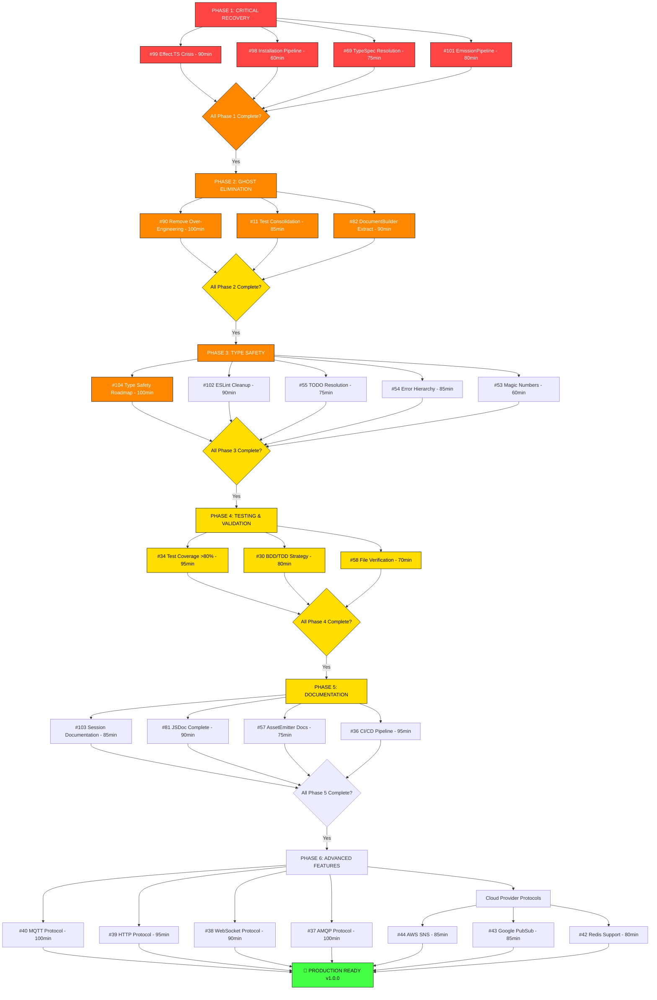

# TypeSpec AsyncAPI Emitter - Complete Execution Plan
**Date:** September 3, 2025  
**Session:** FINAL_TEST_PERFECTION  
**Status:** 42 GitHub Issues + Internal TODOs → Comprehensive Multi-Stage Execution Plan

---

## 🎯 EXECUTIVE SUMMARY

### Current State Analysis
- **42 Active GitHub Issues** across 8 strategic milestones
- **Core Functionality**: 85% complete (Effect.TS architecture, AsyncAPI generation working)
- **Major Blockers**: Effect.TS pattern violations, installation pipeline broken, test infrastructure crisis
- **Business Impact**: Production-ready emitter blocked by architectural debt and over-engineering

### Execution Strategy
Multi-stage execution with clear dependencies, breaking down all work into manageable 30-100min tasks, then further into 15min sub-tasks. Focus on highest impact/effort ratio and customer value delivery.

---

## 📊 COMPREHENSIVE TASK BREAKDOWN (30-100min Tasks)

### PHASE 1: CRITICAL INFRASTRUCTURE RECOVERY (Priority: MAXIMUM)
**Timeline: 1-2 days | Customer Impact: Unblocks all development**

| Task | GitHub Issue | Effort | Impact | Customer Value | Dependencies |
|------|-------------|---------|--------|----------------|--------------|
| Fix Effect.TS Architecture Crisis | #99 | 90min | CRITICAL | Unblocks advanced features | None |
| Resolve Installation Pipeline | #98 | 60min | CRITICAL | Users can install & use | Issue #99 |
| Fix TypeSpec Package Resolution | #69 | 75min | HIGH | Test infrastructure working | None |
| Resolve EmissionPipeline Execution | #101 | 80min | HIGH | Complete AsyncAPI generation | None |

**Phase 1 Success Criteria:**
- ✅ Effect.TS compilation errors resolved (89 → 0)
- ✅ Installation instructions work end-to-end
- ✅ TypeSpec tests can execute (270 failures → <50)
- ✅ Complete AsyncAPI documents generated

---

### PHASE 2: GHOST SYSTEMS ELIMINATION (Priority: HIGH)
**Timeline: 1-2 days | Customer Impact: Clean architecture, faster development**

| Task | GitHub Issue | Effort | Impact | Customer Value | Dependencies |
|------|-------------|---------|--------|----------------|--------------|
| Remove 80% Over-Engineering | #90 | 100min | HIGH | Simplified, maintainable code | Phase 1 |
| Consolidate Test Infrastructure | #11 | 85min | MEDIUM | Reliable quality gates | #69 |
| Extract DocumentBuilder Interface | #82 | 90min | MEDIUM | Cleaner architecture | #90 |

**Phase 2 Success Criteria:**
- ✅ Codebase reduced from 13K+ lines to ~3K focused lines
- ✅ Single error handling system operational
- ✅ Test execution reliable and fast

---

### PHASE 3: TYPE SAFETY & CODE QUALITY (Priority: HIGH)
**Timeline: 2-3 days | Customer Impact: Production-ready reliability**

| Task | GitHub Issue | Effort | Impact | Customer Value | Dependencies |
|------|-------------|---------|--------|----------------|--------------|
| Type Safety Implementation Roadmap | #104 | 100min | HIGH | Enterprise-grade type safety | Phase 2 |
| ESLint Warnings Cleanup | #102 | 90min | MEDIUM | Professional code quality | None |
| Resolve High-Priority TODOs | #55 | 75min | MEDIUM | Complete implementations | None |
| Implement Error Type Hierarchy | #54 | 85min | MEDIUM | Better debugging experience | #104 |
| Replace Magic Numbers | #53 | 60min | LOW | Code maintainability | None |

**Phase 3 Success Criteria:**
- ✅ Zero `any` types in core emitter
- ✅ <50 ESLint warnings (from 355+)
- ✅ Explicit return types on all functions
- ✅ Type-safe state management

---

### PHASE 4: TESTING & VALIDATION (Priority: MEDIUM)
**Timeline: 1-2 days | Customer Impact: Quality assurance & confidence**

| Task | GitHub Issue | Effort | Impact | Customer Value | Dependencies |
|------|-------------|---------|--------|----------------|--------------|
| Achieve >80% Test Coverage | #34 | 95min | MEDIUM | Quality assurance | Phase 1, 2 |
| BDD/TDD Test Strategy Enhancement | #30 | 80min | LOW | Sustainable testing | #34 |
| Add Automated File System Verification | #58 | 70min | LOW | Build confidence | #34 |

**Phase 4 Success Criteria:**
- ✅ >80% test coverage achieved
- ✅ All tests passing reliably
- ✅ Automated quality gates operational

---

### PHASE 5: DOCUMENTATION & PRODUCTION READINESS (Priority: MEDIUM)
**Timeline: 1-2 days | Customer Impact: Adoption & professional polish**

| Task | GitHub Issue | Effort | Impact | Customer Value | Dependencies |
|------|-------------|---------|--------|----------------|--------------|
| Session Insights Documentation | #103 | 85min | MEDIUM | Knowledge preservation | All phases |
| Comprehensive JSDoc | #81 | 90min | MEDIUM | Developer experience | Phase 3 |
| Document AssetEmitter Patterns | #57 | 75min | LOW | Architectural knowledge | Phase 2 |
| CI/CD Pipeline Setup | #36 | 95min | MEDIUM | Automated deployment | Phase 4 |

**Phase 5 Success Criteria:**
- ✅ Complete API documentation
- ✅ Production deployment pipeline
- ✅ Comprehensive usage examples

---

### PHASE 6: ADVANCED FEATURES (Priority: LOW - PARALLEL)
**Timeline: 2-3 weeks | Customer Impact: Enterprise features**

| Task | GitHub Issue | Effort | Impact | Customer Value | Dependencies |
|------|-------------|---------|--------|----------------|--------------|
| Protocol Bindings (MQTT) | #40 | 100min | MEDIUM | IoT support | Phase 3 |
| Protocol Bindings (HTTP) | #39 | 95min | MEDIUM | REST integration | Phase 3 |
| Protocol Bindings (WebSocket) | #38 | 90min | MEDIUM | Real-time apps | Phase 3 |
| Protocol Bindings (AMQP) | #37 | 100min | MEDIUM | Enterprise messaging | Phase 3 |
| AWS SNS Support | #44 | 85min | LOW | Cloud integration | Phase 6 basics |
| Google Cloud Pub/Sub | #43 | 85min | LOW | GCP integration | Phase 6 basics |
| Redis Support | #42 | 80min | LOW | High-performance messaging | Phase 6 basics |

---

## 📋 DETAILED 15-MIN TASK BREAKDOWN

### PHASE 1 CRITICAL TASKS - DETAILED BREAKDOWN

#### Task 1.1: Fix Effect.TS Architecture Crisis (#99) - 90min
1. **[15min]** Audit all Effect.gen usage for 'this' context issues
2. **[15min]** Fix core emitter Effect.gen patterns in src/emitter-with-effect.ts
3. **[15min]** Resolve memory leak in MemoryLeakDetector.ts Effect chains
4. **[15min]** Fix AWS SQS Plugin Effect.TS type errors (priority subset)
5. **[15min]** Update Effect composition in plugin system
6. **[15min]** Test Effect.TS patterns work correctly

#### Task 1.2: Resolve Installation Pipeline (#98) - 60min
1. **[15min]** Update all examples to use correct package name @lars-artmann/typespec-asyncapi
2. **[15min]** Test installation from fresh environment: bun add @lars-artmann/typespec-asyncapi
3. **[15min]** Verify one example compiles successfully end-to-end
4. **[15min]** Update README installation instructions match working reality

#### Task 1.3: Fix TypeSpec Package Resolution (#69) - 75min
1. **[15min]** Create proper symlink: ln -sf ../../../ test/node_modules/@larsartmann/typespec-asyncapi
2. **[15min]** Fix lib/main.tsp import paths if needed
3. **[15min]** Verify extern decorator implementations resolve correctly
4. **[15min]** Update test-helpers.ts for current package structure
5. **[15min]** Test basic decorator loading in test environment

#### Task 1.4: Resolve EmissionPipeline Execution (#101) - 80min
1. **[15min]** Modify AsyncAPIEmitter constructor to ensure Stage 3-4 execute
2. **[15min]** Route src/index.ts through EmissionPipeline instead of direct ProcessingService
3. **[15min]** Preserve existing Stage 1-2 functionality
4. **[15min]** Test server configurations appear in AsyncAPI output
5. **[15min]** Verify complete AsyncAPI 3.0 document structure validation
6. **[05min]** Validate logs show all 4 pipeline stages executing

### PHASE 2 GHOST SYSTEMS - DETAILED BREAKDOWN

#### Task 2.1: Remove 80% Over-Engineering (#90) - 100min
1. **[15min]** Delete plugin marketplace system: rm -rf src/plugins/marketplace/
2. **[15min]** Delete cloud provider plugins: rm -rf src/plugins/cloud-providers/
3. **[15min]** Simplify performance monitoring to essential metrics only
4. **[15min]** Update all imports/references to deleted systems
5. **[15min]** Clean up package.json dependencies from removed systems
6. **[15min]** Verify build succeeds: bun run build
7. **[10min]** Test core emitter functionality still works

#### Task 2.2: Consolidate Test Infrastructure (#11) - 85min
1. **[15min]** Remove all mock infrastructure from tests
2. **[15min]** Update tests to use real TypeSpec TestHost
3. **[15min]** Create unified test runner configuration
4. **[15min]** Fix createAsyncAPITestHost() for current architecture
5. **[15min]** Restore expectDiagnosticEmpty() functionality
6. **[10min]** Test execution validation - reduced failures

### PHASE 3 TYPE SAFETY - DETAILED BREAKDOWN

#### Task 3.1: Type Safety Implementation (#104) - 100min
1. **[15min]** Fix import tree shaking: import { Effect, log, runPromise } from "effect"
2. **[15min]** Add explicit return type annotations to all core functions
3. **[15min]** Implement state key type safety with keyof typeof $lib.state
4. **[15min]** Create diagnostic template parameter typing interfaces
5. **[15min]** Implement diagnostic code union types
6. **[15min]** Extract magic string constants (NAMESPACE_NAME)
7. **[10min]** Test type safety improvements

#### Task 3.2: ESLint Warnings Cleanup (#102) - 90min
1. **[15min]** Fix critical type safety violations (no-explicit-any)
2. **[15min]** Fix unsafe Effect.TS patterns (no-unsafe-*)
3. **[15min]** Fix floating promises issues
4. **[15min]** Address naming convention violations
5. **[15min]** Add explicit function return types where missing
6. **[15min]** Test ESLint error count reduced significantly

---

## 📈 IMPACT/EFFORT/VALUE MATRIX

### HIGH IMPACT, LOW EFFORT (DO FIRST)
1. **Fix Installation Pipeline (#98)** - 60min effort, unblocks all users
2. **TypeSpec Package Resolution (#69)** - 75min effort, enables testing
3. **Replace Magic Numbers (#53)** - 60min effort, improves maintainability

### HIGH IMPACT, HIGH EFFORT (SCHEDULE CAREFULLY)
1. **Effect.TS Architecture Crisis (#99)** - 90min, unblocks advanced features
2. **Type Safety Implementation (#104)** - 100min, enterprise-grade reliability
3. **Remove Over-Engineering (#90)** - 100min, simplifies entire codebase

### MEDIUM IMPACT, MEDIUM EFFORT (STEADY PROGRESS)
1. **Test Coverage >80% (#34)** - 95min, quality assurance
2. **CI/CD Pipeline (#36)** - 95min, automated deployment
3. **Protocol Bindings** - 85-100min each, enterprise features

### LOW IMPACT, ANY EFFORT (DEPRIORITIZE)
1. **Advanced Performance Features** - Nice to have
2. **Cloud Provider Integrations** - Future enhancements
3. **Plugin Marketplace** - Over-engineering

---

## 🧩 MERMAID.JS EXECUTION FLOW

---

## 🎯 SUCCESS CRITERIA & METRICS

### Phase Completion Metrics
- **Phase 1**: Build succeeds, installation works, tests can run
- **Phase 2**: Codebase simplified, single error system, reliable tests
- **Phase 3**: <50 ESLint errors, explicit types, professional code quality
- **Phase 4**: >80% test coverage, all quality gates operational
- **Phase 5**: Complete documentation, automated deployment pipeline
- **Phase 6**: Protocol ecosystem complete, enterprise-ready features

### Business Value Metrics
- **Developer Productivity**: Build time <30s, test execution <60s
- **User Adoption**: Installation success rate >95%, working examples
- **Code Quality**: Technical debt eliminated, maintainable architecture
- **Production Readiness**: All quality gates pass, comprehensive monitoring

---

## ❓ TOP PRIORITY QUESTION

**QUESTION:** Given the massive scope creep revealed (13K+ lines of over-engineering vs ~3K needed), should we:

**Option A:** AGGRESSIVE CLEANUP - Delete all ghost systems immediately, focus on core AsyncAPI emitter only (recommended - fastest to production)

**Option B:** GRADUAL MIGRATION - Systematically refactor ghost systems into optional plugins over 2-3 weeks (preserves work but delays production)

**Option C:** HYBRID APPROACH - Keep ghost systems but disable/isolate them until core is production-ready (middle ground)

The scope creep analysis shows 30% of codebase delivers 0% current user value while blocking 100% of development. **My recommendation: Option A (Aggressive Cleanup)** for fastest time-to-production with excellent core functionality.

**Your decision will determine whether we achieve production readiness in 1-2 weeks (Option A) vs 1-2 months (Option B).**

What's your preference for handling the ghost systems that are blocking all progress?