# PARETO EXECUTION PLAN: 80/20 Rule Applied to TypeSpec AsyncAPI

**Date:** September 3, 2025 16:39  
**Session:** PARETO_EXECUTION_PLAN  
**Strategy:** Systematic 1%→4%→20% high-impact execution

---

## 🎯 PARETO ANALYSIS RESULTS

Based on evidence-based investigation and GitHub issue analysis, applying the 80/20 rule to maximize customer value delivery:

### 🚀 **1% WORK → 51% RESULTS** (MAXIMUM IMPACT)

**Focus:** User Experience & Installation Pipeline  
**Customer Impact:** From 0% working installs → 95% working installs

| Task                               | Issue | Time  | Customer Impact                  | Business Value                  |
| ---------------------------------- | ----- | ----- | -------------------------------- | ------------------------------- |
| Fix Installation Documentation     | #98   | 45min | Users can actually install & use | Unblocks ALL community adoption |
| Update All Examples Package Names  | #98   | 30min | Examples work end-to-end         | First impression success        |
| Create One Perfect Working Example | #98   | 45min | Zero → One success path          | Removes adoption barrier        |

**Total: 120 minutes → 51% customer value**  
**ROI: 25.5x return on time investment**

---

### 🔧 **4% WORK → 64% RESULTS** (HIGH IMPACT)

**Focus:** Test Infrastructure & Quality Gates  
**Customer Impact:** From unreliable → production-ready

| Task                            | Issue | Time  | Customer Impact      | Business Value         |
| ------------------------------- | ----- | ----- | -------------------- | ---------------------- |
| Fix TypeSpec Package Resolution | #69   | 60min | Test suite works     | Development confidence |
| Fix Test Import/Export Issues   | #11   | 90min | All tests executable | Quality assurance      |
| Enable Performance Monitoring   | Arch  | 45min | Production metrics   | Enterprise readiness   |
| Create Test Coverage Reports    | #34   | 75min | Quality visibility   | Confidence metrics     |

**Total: 270 minutes → 13% additional value (64% cumulative)**  
**ROI: 2.9x return on time investment**

---

### 📊 **20% WORK → 80% RESULTS** (SUBSTANTIAL)

**Focus:** Production Polish & Enterprise Features  
**Customer Impact:** Good → Excellent professional experience

| Task                          | Issue    | Time   | Customer Impact              | Business Value           |
| ----------------------------- | -------- | ------ | ---------------------------- | ------------------------ |
| Type Safety Implementation    | #104     | 100min | Enterprise-grade reliability | Professional credibility |
| ESLint Cleanup & Code Quality | #102     | 90min  | Maintainable codebase        | Development velocity     |
| Documentation & JSDoc         | #81,#103 | 85min  | Developer experience         | Adoption enablement      |
| CI/CD Pipeline Setup          | #36      | 95min  | Automated deployment         | Production readiness     |
| EmissionPipeline Completion   | #101     | 80min  | Complete AsyncAPI generation | Feature completeness     |

**Total: 450 minutes → 16% additional value (80% cumulative)**  
**ROI: 2.1x return on time investment**

---

## 📋 COMPREHENSIVE TASK BREAKDOWN (30-100min Tasks)

### 🏆 PHASE 1: 1% → 51% VALUE (2 hours)

| Priority | Task                             | Issue | Effort | Impact   | Customer Value        | Dependencies |
| -------- | -------------------------------- | ----- | ------ | -------- | --------------------- | ------------ |
| 1        | Fix Installation Instructions    | #98   | 45min  | MAXIMUM  | Users can install     | None         |
| 2        | Update Package Names in Examples | #98   | 30min  | CRITICAL | Examples work         | Task 1       |
| 3        | Create Perfect Working Example   | #98   | 45min  | HIGH     | Success demonstration | Task 2       |

**Phase 1 Success Criteria:**

- ✅ `bun add @lars-artmann/typespec-asyncapi` works
- ✅ At least one example compiles end-to-end
- ✅ README instructions match reality
- ✅ New users can succeed in <10 minutes

---

### 🔧 PHASE 2: 4% → 64% VALUE (4.5 hours)

| Priority | Task                              | Issue    | Effort | Impact | Customer Value            | Dependencies |
| -------- | --------------------------------- | -------- | ------ | ------ | ------------------------- | ------------ |
| 4        | Fix TypeSpec Package Resolution   | #69      | 60min  | HIGH   | Test infrastructure works | Phase 1      |
| 5        | Resolve Test Import/Export Issues | #11      | 90min  | HIGH   | All tests executable      | Task 4       |
| 6        | Enable Performance Monitoring     | Internal | 45min  | MEDIUM | Production metrics        | None         |
| 7        | Setup Test Coverage Reporting     | #34      | 75min  | MEDIUM | Quality visibility        | Task 5       |

**Phase 2 Success Criteria:**

- ✅ Test suite runs without errors
- ✅ >80% test coverage achieved
- ✅ Performance monitoring active
- ✅ Quality gates operational

---

### 📊 PHASE 3: 20% → 80% VALUE (7.5 hours)

| Priority | Task                          | Issue    | Effort | Impact | Customer Value         | Dependencies |
| -------- | ----------------------------- | -------- | ------ | ------ | ---------------------- | ------------ |
| 8        | Type Safety Implementation    | #104     | 100min | HIGH   | Enterprise reliability | Phase 2      |
| 9        | ESLint Cleanup & Code Quality | #102     | 90min  | MEDIUM | Maintainable code      | None         |
| 10       | Complete Documentation        | #81,#103 | 85min  | MEDIUM | Developer experience   | Phase 1,2    |
| 11       | CI/CD Pipeline Setup          | #36      | 95min  | MEDIUM | Automated deployment   | All phases   |
| 12       | EmissionPipeline Completion   | #101     | 80min  | LOW    | Feature completeness   | Phase 2      |

**Phase 3 Success Criteria:**

- ✅ Zero `any` types in critical code
- ✅ <50 ESLint warnings
- ✅ Complete API documentation
- ✅ Automated deployment pipeline

---

## 🧩 DETAILED 15-MIN TASK BREAKDOWN

### 🏆 PHASE 1 MICRO-TASKS (51% VALUE)

#### Task 1.1: Fix Installation Instructions (45min)

1. **[15min]** Update README.md installation section with correct package name
2. **[15min]** Test installation from fresh environment
3. **[15min]** Update troubleshooting section with known working solutions

#### Task 1.2: Update Package Names in Examples (30min)

1. **[15min]** Find/replace all @typespec/asyncapi → @lars-artmann/typespec-asyncapi
2. **[15min]** Test compilation of updated examples

#### Task 1.3: Create Perfect Working Example (45min)

1. **[15min]** Choose simplest viable example (basic operations)
2. **[15min]** Ensure it compiles and generates valid AsyncAPI
3. **[15min]** Document step-by-step usage instructions

### 🔧 PHASE 2 MICRO-TASKS (64% CUMULATIVE VALUE)

#### Task 2.1: Fix TypeSpec Package Resolution (60min)

1. **[15min]** Create proper symlink for test environment
2. **[15min]** Fix import paths in lib/main.tsp
3. **[15min]** Verify decorator implementations resolve
4. **[15min]** Test basic TypeSpec compilation in test environment

#### Task 2.2: Resolve Test Import/Export Issues (90min)

1. **[15min]** Fix SERIALIZATION_FORMAT_OPTIONS export/import
2. **[15min]** Fix Effect.TS imports in test files
3. **[15min]** Update test expectations to match working reality
4. **[15min]** Fix createAsyncAPITestHost() configuration
5. **[15min]** Test unified test runner execution
6. **[15min]** Validate test failure reduction (270 → <50)

#### Task 2.3: Enable Performance Monitoring (45min)

1. **[15min]** Uncomment PerformanceMonitor in AsyncAPIEmitter
2. **[15min]** Verify integration works with existing systems
3. **[15min]** Test performance metrics collection during compilation

#### Task 2.4: Setup Test Coverage Reporting (75min)

1. **[15min]** Configure Bun test coverage settings
2. **[15min]** Generate baseline coverage report
3. **[15min]** Identify critical paths needing tests
4. **[15min]** Write tests for highest priority uncovered code
5. **[15min]** Achieve >80% coverage target

### 📊 PHASE 3 MICRO-TASKS (80% CUMULATIVE VALUE)

#### Task 3.1: Type Safety Implementation (100min)

1. **[15min]** Fix import tree shaking (specific Effect imports)
2. **[15min]** Add explicit return type annotations to core functions
3. **[15min]** Implement state key type safety
4. **[15min]** Create diagnostic template parameter typing
5. **[15min]** Extract magic string constants
6. **[15min]** Test type safety improvements
7. **[10min]** Validate zero `any` types in core code

#### Task 3.2: ESLint Cleanup & Code Quality (90min)

1. **[15min]** Fix critical type safety violations
2. **[15min]** Fix unsafe Effect.TS patterns
3. **[15min]** Fix floating promises issues
4. **[15min]** Address naming convention violations
5. **[15min]** Add explicit function return types
6. **[15min]** Test ESLint error reduction (<50 target)

#### Task 3.3: Complete Documentation (85min)

1. **[15min]** Add JSDoc to all public interfaces
2. **[15min]** Document architectural decisions
3. **[15min]** Create comprehensive usage examples
4. **[15min]** Document error handling patterns
5. **[15min]** Write performance guidelines
6. **[10min]** Review and polish documentation

#### Task 3.4: CI/CD Pipeline Setup (95min)

1. **[15min]** Create GitHub Actions workflow file
2. **[15min]** Configure build and test automation
3. **[15min]** Setup quality gates (ESLint, TypeScript, tests)
4. **[15min]** Configure deployment automation
5. **[15min]** Test CI/CD pipeline end-to-end
6. **[15min]** Setup notifications and reporting
7. **[05min]** Document CI/CD usage

#### Task 3.5: EmissionPipeline Completion (80min)

1. **[15min]** Modify AsyncAPIEmitter to execute all 4 stages
2. **[15min]** Route index.ts through EmissionPipeline
3. **[15min]** Test server configurations appear in output
4. **[15min]** Verify complete AsyncAPI document structure
5. **[15min]** Test all pipeline stages execute
6. **[05min]** Validate logs show complete execution

---

## 🧩 MERMAID.JS EXECUTION FLOW

```mermaid
graph TD
    A[🚀 START: PARETO EXECUTION] --> B{1% → 51% VALUE}

    %% PHASE 1: MAXIMUM IMPACT
    B --> C[Fix Installation Instructions - 45min]
    B --> D[Update Package Names - 30min]
    B --> E[Create Working Example - 45min]

    C --> F{Phase 1 Complete?}
    D --> F
    E --> F

    %% PHASE 2: HIGH IMPACT
    F -->|51% VALUE ACHIEVED| G{4% → 64% VALUE}
    G --> H[Fix TypeSpec Resolution - 60min]
    G --> I[Fix Test Infrastructure - 90min]
    G --> J[Enable Performance Monitoring - 45min]
    G --> K[Setup Test Coverage - 75min]

    H --> L{Phase 2 Complete?}
    I --> L
    J --> L
    K --> L

    %% PHASE 3: SUBSTANTIAL IMPACT
    L -->|64% VALUE ACHIEVED| M{20% → 80% VALUE}
    M --> N[Type Safety Implementation - 100min]
    M --> O[ESLint Cleanup - 90min]
    M --> P[Complete Documentation - 85min]
    M --> Q[CI/CD Pipeline - 95min]
    M --> R[EmissionPipeline Completion - 80min]

    N --> S{Phase 3 Complete?}
    O --> S
    P --> S
    Q --> S
    R --> S

    %% SUCCESS
    S -->|80% VALUE ACHIEVED| T[🎯 PRODUCTION READY v1.0.0]

    %% PARALLEL GROUPS
    subgraph "GROUP A: User Experience"
        C
        D
        E
    end

    subgraph "GROUP B: Quality Infrastructure"
        H
        I
        J
        K
    end

    subgraph "GROUP C: Production Polish"
        N
        O
        P
        Q
        R
    end

    %% STYLING
    classDef phase1 fill:#ff4444,stroke:#000,color:#fff
    classDef phase2 fill:#ff8800,stroke:#000,color:#fff
    classDef phase3 fill:#ffdd00,stroke:#000,color:#000
    classDef success fill:#44ff44,stroke:#000,color:#000
    classDef group fill:#e1f5fe,stroke:#01579b,color:#000

    class C,D,E phase1
    class H,I,J,K phase2
    class N,O,P,Q,R phase3
    class T success
```

---

## 📊 ROI ANALYSIS & BUSINESS IMPACT

### Investment vs Returns

| Phase       | Time Investment | Customer Value   | ROI Multiplier | Business Impact                        |
| ----------- | --------------- | ---------------- | -------------- | -------------------------------------- |
| **Phase 1** | 2 hours         | 51%              | **25.5x**      | Community can actually use the product |
| **Phase 2** | 4.5 hours       | +13% (64% total) | **2.9x**       | Production-quality assurance           |
| **Phase 3** | 7.5 hours       | +16% (80% total) | **2.1x**       | Enterprise-grade polish                |
| **TOTAL**   | 14 hours        | 80%              | **5.7x**       | Production-ready AsyncAPI emitter      |

### Customer Journey Transformation

**BEFORE (Current State):**

- 0% installation success rate
- No working examples
- Test failures blocking development
- Architectural uncertainty

**AFTER PHASE 1 (51% Value):**

- 95% installation success rate
- Working examples demonstrate value
- Clear user journey from install → success

**AFTER PHASE 2 (64% Value):**

- Reliable test suite provides confidence
- Quality metrics enable improvement
- Performance monitoring for production

**AFTER PHASE 3 (80% Value):**

- Enterprise-grade type safety
- Professional documentation
- Automated deployment pipeline

---

## 🎯 SUCCESS METRICS & VALIDATION

### Phase 1 Success Criteria (51% Value)

- [ ] `bun add @lars-artmann/typespec-asyncapi` succeeds
- [ ] At least one example compiles without errors
- [ ] New user can generate AsyncAPI in <10 minutes
- [ ] Installation success rate >95%

### Phase 2 Success Criteria (64% Value)

- [ ] Test suite executes without infrastructure errors
- [ ] > 80% test coverage achieved and maintained
- [ ] Performance monitoring captures real metrics
- [ ] Quality gates prevent regression

### Phase 3 Success Criteria (80% Value)

- [ ] Zero `any` types in critical code paths
- [ ] <50 ESLint warnings (professional code quality)
- [ ] Complete API documentation with examples
- [ ] Automated CI/CD pipeline operational

### Business Success Metrics

- **Community Adoption**: GitHub stars increase >50%
- **Developer Experience**: Install → success time <10 minutes
- **Production Readiness**: All quality gates pass
- **Maintainability**: Development velocity increases 2x

---

## 🚀 EXECUTION STRATEGY

### Parallel Execution Groups

**Group A: User Experience** (Phase 1 focus)

- Installation fixes
- Example updates
- Documentation alignment

**Group B: Quality Infrastructure** (Phase 2 focus)

- Test infrastructure repair
- Coverage reporting
- Performance monitoring

**Group C: Production Polish** (Phase 3 focus)

- Type safety implementation
- Code quality improvements
- CI/CD automation

### Risk Mitigation

- **Build Protection**: Never break existing functionality
- **Incremental Validation**: Test each task completion
- **Rollback Plans**: Git commits enable quick rollback
- **Quality Gates**: Automated validation prevents regression

### Communication & Tracking

- **Progress Updates**: After each phase completion
- **Issue Management**: Close resolved GitHub issues
- **Documentation**: Update architectural decisions
- **Success Celebration**: Acknowledge milestone achievements

---

## 🎖️ COMPLETION DEFINITION

**DONE = ALL THREE PHASES COMPLETE + VALIDATED**

✅ **Phase 1 Complete**: Users can install and succeed immediately  
✅ **Phase 2 Complete**: Quality infrastructure operational  
✅ **Phase 3 Complete**: Production-ready enterprise features  
✅ **Integration Validated**: All systems working together  
✅ **Performance Verified**: >35K ops/sec AsyncAPI generation  
✅ **Community Ready**: Documentation enables adoption

**Total Investment**: 14 hours systematic execution  
**Total Return**: 80% customer value delivery  
**Business Outcome**: Production-ready TypeSpec AsyncAPI emitter

---

This Pareto execution plan maximizes customer value delivery through systematic focus on highest-impact work, ensuring efficient path to production readiness.
