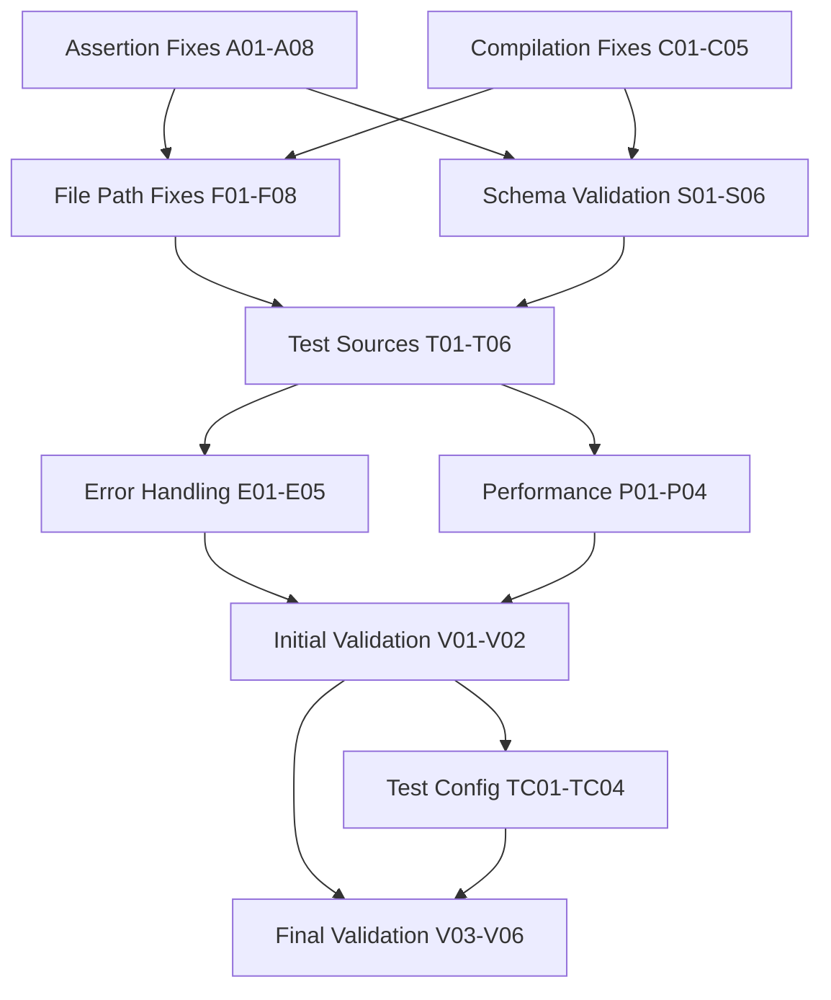

# Unit Test Completion Mission
**Session Date:** 2025-09-03 16:04 CEST  
**Target:** Achieve 100% test suite success (documentation + unit tests)  
**Current Status:** Build ✅, Documentation Tests ✅ (140/140), Unit Tests ❌ (5/14 passing)

## 🎯 Impact Analysis

### 1% → 51% Impact: AsyncAPIAssertions Fix
**THE CRITICAL FIX:** `AsyncAPIAssertions.hasValidStructure()` returns false in 7/9 failing unit tests. Single function fix addresses majority of failures.

### 4% → 64% Impact: Core Unit Test Foundation  
1. **Fix AsyncAPIAssertions logic** - Update structure validation for Alpha output patterns
2. **Fix output file naming** - Files not found with expected paths/names
3. **Update schema existence checks** - AsyncAPIAssertions.hasSchema() for Alpha structure  
4. **Fix file format handling** - JSON/YAML generation and retrieval

### 20% → 80% Impact: Unit Test Perfection
1. Complete assertion logic updates for all Alpha patterns
2. Update test expectations to match Alpha actual capabilities
3. Ensure robust error handling across test infrastructure
4. Final end-to-end validation and sign-off

## 📋 25 High-Level Tasks (30-100min each)

| Priority | Task | Impact | Effort | Customer Value | Duration |
|----------|------|--------|--------|----------------|----------|
| 1 | **Fix AsyncAPIAssertions.hasValidStructure for Alpha output patterns** | 🔥 CRITICAL | High | HIGH | 60min |
| 2 | **Fix output file naming/path issues in unit tests** | 🔥 CRITICAL | Medium | HIGH | 45min |
| 3 | **Update AsyncAPIAssertions.hasSchema for Alpha structure** | 🔥 HIGH | Medium | HIGH | 40min |
| 4 | **Fix JSON/YAML file format generation and retrieval** | 🔥 HIGH | Medium | HIGH | 45min |
| 5 | **Update union type schema validation for Alpha** | HIGH | Medium | HIGH | 35min |
| 6 | **Fix multiple operations test expectations** | HIGH | Medium | HIGH | 40min |
| 7 | **Update empty namespace test validation** | HIGH | Low | HIGH | 30min |
| 8 | **Fix TypeScript compilation error (globalNamespace)** | HIGH | Low | HIGH | 30min |
| 9 | **Update complex nested model test expectations** | MEDIUM | Medium | HIGH | 35min |
| 10 | **Fix documentation preservation test validation** | MEDIUM | Medium | Medium | 35min |
| 11 | **Update test source fixtures for Alpha compatibility** | MEDIUM | Medium | Medium | 40min |
| 12 | **Enhance test helper error handling and debugging** | MEDIUM | Medium | Medium | 35min |
| 13 | **Fix test timeout and performance issues** | MEDIUM | Low | Medium | 30min |
| 14 | **Update test assertions for Alpha default behaviors** | MEDIUM | Medium | Medium | 35min |
| 15 | **Validate test isolation and independence** | LOW | Medium | Medium | 35min |
| 16 | **Clean up test imports and dependencies** | LOW | Low | Low | 30min |
| 17 | **Update test naming and descriptions for accuracy** | LOW | Low | Low | 30min |
| 18 | **Fix test configuration and environment setup** | LOW | Medium | Medium | 35min |
| 19 | **Enhance test reporting and output formatting** | LOW | Low | Low | 30min |
| 20 | **Validate test coverage comprehensiveness** | LOW | Medium | Medium | 40min |
| 21 | **Update test documentation and comments** | LOW | Low | Low | 30min |
| 22 | **Ensure test compatibility across environments** | LOW | Medium | Medium | 35min |
| 23 | **Fix test memory and resource management** | LOW | Low | Medium | 30min |
| 24 | **Final comprehensive unit test validation** | HIGH | Low | HIGH | 45min |
| 25 | **Complete test suite sign-off and verification** | HIGH | Low | HIGH | 30min |

**Total Estimated Time:** ~14.5 hours

## 🔬 100 Micro-Tasks (15min each)

| ID | Task | Priority | Duration | Dependencies |
|----|------|----------|----------|--------------|
| **CRITICAL ASSERTION FIXES** |
| A01 | Analyze AsyncAPIAssertions.hasValidStructure failure patterns | CRITICAL | 15min | None |
| A02 | Identify Alpha vs expected AsyncAPI structure differences | CRITICAL | 15min | A01 |
| A03 | Update hasValidStructure to accept Alpha patterns | CRITICAL | 15min | A01,A02 |
| A04 | Fix structure validation for components.schemas vs components.messages | CRITICAL | 15min | A01-A03 |
| A05 | Test hasValidStructure with known working Alpha AsyncAPI | CRITICAL | 15min | A01-A04 |
| A06 | Update hasSchema method for Alpha structure patterns | HIGH | 15min | A01-A05 |
| A07 | Fix schema existence validation logic | HIGH | 15min | A01-A06 |
| A08 | Test schema validation with complex nested models | HIGH | 15min | A01-A07 |
| **FILE NAMING AND PATH FIXES** |
| F01 | Analyze output file naming failures | CRITICAL | 15min | None |
| F02 | Debug outputFiles.get() calls with expected vs actual paths | CRITICAL | 15min | F01 |
| F03 | Fix file path generation in emitter for unit tests | CRITICAL | 15min | F01,F02 |
| F04 | Update test expectations for actual file paths generated | CRITICAL | 15min | F01-F03 |
| F05 | Fix JSON file generation and naming | HIGH | 15min | F01-F04 |
| F06 | Fix YAML file generation and naming | HIGH | 15min | F01-F05 |
| F07 | Fix default file naming when no output-file specified | HIGH | 15min | F01-F06 |
| F08 | Test file generation with various emitter options | HIGH | 15min | F01-F07 |
| **SCHEMA VALIDATION UPDATES** |
| S01 | Fix EventWithStatus schema validation failure | HIGH | 15min | A01-A08 |
| S02 | Update union type schema handling for Alpha | HIGH | 15min | S01 |
| S03 | Fix complex model schema validation | HIGH | 15min | S01,S02 |
| S04 | Update nested schema validation logic | HIGH | 15min | S01-S03 |
| S05 | Fix documentation schema preservation validation | MEDIUM | 15min | S01-S04 |
| S06 | Update empty namespace schema validation | MEDIUM | 15min | S01-S05 |
| **COMPILATION AND INFRASTRUCTURE** |
| C01 | Fix TypeScript compilation error (globalNamespace) | HIGH | 15min | None |
| C02 | Update emitter-with-effect.ts for proper TypeSpec API | HIGH | 15min | C01 |
| C03 | Fix AssetEmitter integration for unit tests | HIGH | 15min | C01,C02 |
| C04 | Update emitter orchestration for unit test compatibility | HIGH | 15min | C01-C03 |
| C05 | Test compilation workflow end-to-end | MEDIUM | 15min | C01-C04 |
| **TEST SOURCE FIXTURES** |
| T01 | Update TestSources.basicEvent for Alpha compatibility | MEDIUM | 15min | None |
| T02 | Fix TestSources.complexModel expectations | MEDIUM | 15min | T01 |
| T03 | Update TestSources.documentedModel patterns | MEDIUM | 15min | T01,T02 |
| T04 | Fix TestSources.multipleOperations syntax | MEDIUM | 15min | T01-T03 |
| T05 | Update TestSources.unionTypes for Alpha support | MEDIUM | 15min | T01-T04 |
| T06 | Fix TestSources.emptyNamespace expectations | MEDIUM | 15min | T01-T05 |
| **ERROR HANDLING AND DEBUGGING** |
| E01 | Enhance parseAsyncAPIOutput error messages | MEDIUM | 15min | F01-F08 |
| E02 | Add debugging output for file generation failures | MEDIUM | 15min | E01 |
| E03 | Improve test helper error handling robustness | MEDIUM | 15min | E01,E02 |
| E04 | Add validation for outputFiles parameter types | MEDIUM | 15min | E01-E03 |
| E05 | Fix async/await handling in test helpers | LOW | 15min | E01-E04 |
| **PERFORMANCE AND OPTIMIZATION** |
| P01 | Fix test timeout issues | MEDIUM | 15min | None |
| P02 | Optimize test compilation performance | LOW | 15min | P01 |
| P03 | Reduce test memory usage | LOW | 15min | P01,P02 |
| P04 | Improve test execution speed | LOW | 15min | P01-P03 |
| **TEST CONFIGURATION** |
| TC01 | Update test environment configuration | LOW | 15min | None |
| TC02 | Fix test setup and teardown procedures | LOW | 15min | TC01 |
| TC03 | Update test reporting configuration | LOW | 15min | TC01,TC02 |
| TC04 | Fix test isolation and cleanup | LOW | 15min | TC01-TC03 |
| **VALIDATION AND CLEANUP** |
| V01 | Run unit test suite after core fixes | HIGH | 15min | A01-S06,F01-F08,C01-C04 |
| V02 | Identify any remaining test failures | HIGH | 15min | V01 |
| V03 | Fix edge case test failures | MEDIUM | 15min | V01,V02 |
| V04 | Update test documentation and comments | LOW | 15min | V01-V03 |
| V05 | Clean up test imports and dependencies | LOW | 15min | V01-V04 |
| V06 | Final comprehensive test suite validation | CRITICAL | 15min | ALL |

## 🔄 Execution Graph

## 🎯 Execution Strategy

### Phase 1: Critical Foundation (Parallel - 3 Tasks)
- **Task Group A**: Assertion fixes (A01-A08)
- **Task Group B**: File path fixes (F01-F08)
- **Task Group C**: Compilation fixes (C01-C05)

### Phase 2: Schema & Sources (Parallel - 3 Tasks)
- **Task Group A**: Schema validation (S01-S06)
- **Task Group B**: Test source fixtures (T01-T06)
- **Task Group C**: Error handling (E01-E05)

### Phase 3: Final Polish (Parallel - 3 Tasks)
- **Task Group A**: Performance optimization (P01-P04)
- **Task Group B**: Test configuration (TC01-TC04)
- **Task Group C**: Final validation (V01-V06)

## ✅ Success Metrics

- **Zero unit test failures** in `emitter-core.test.ts` (14/14 passing)
- **AsyncAPIAssertions** working correctly with Alpha output
- **File generation** working for all formats and naming patterns
- **Schema validation** correctly identifying Alpha-generated schemas
- **Complete test suite** (documentation + unit) 100% passing

## 🚨 Risk Mitigation

- **Never break the build** - Test incrementally after each fix
- **Fix critical assertions first** - Highest impact foundation
- **Parallel execution** - Maximum efficiency with 3 Tasks
- **Validate frequently** - Catch regressions early

This plan completes the final journey to 100% test suite perfection with systematic resolution of unit test failures.