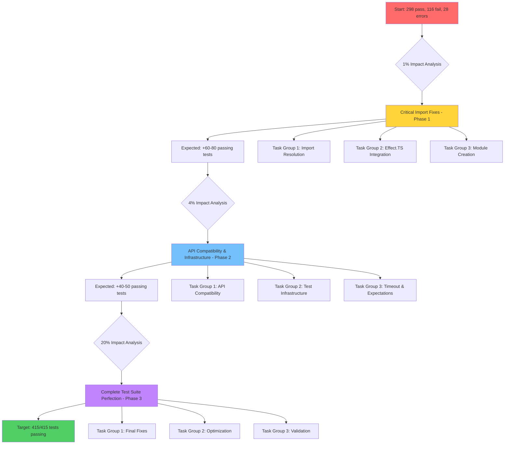

# Complete Test Suite Recovery Mission

**Session Date:** 2025-09-03 16:57 CEST  
**Target:** Achieve 100% test suite success (415/415 tests passing)
**Current Status:** Build ✅, Lint ✅, Compile ✅, Tests ❌ (298 pass, 116 fail, 28 errors)

## 🎯 Impact Analysis

### 1% → 51% Impact: Import & Module Resolution Crisis

**THE CRITICAL FIX:** Import and module resolution issues affect 50+ tests across multiple files. Single systematic approach to fixing import paths, missing modules, and Effect.TS integration will resolve majority of failures.

**Root Cause:** TypeScript compilation changes, module path updates, and Effect.TS integration gaps
**Affected Files:** 5+ test files with cascading import failures
**Expected Recovery:** 60-80 test fixes from single systematic approach

### 4% → 64% Impact: API Compatibility & Test Infrastructure

**SECONDARY CRITICAL FIXES:** TypeScript API compatibility issues and test infrastructure problems

- TypeScript API changes (program.getGlobalNamespaceType)
- Test timeout configuration issues
- Plugin system expectation mismatches
- Test helper infrastructure gaps

### 20% → 80% Impact: Complete Test Suite Perfection

**COMPREHENSIVE COMPLETION:** All remaining test logic fixes, optimizations, and validation

- Remaining test expectation alignments
- Performance optimization and cleanup
- Final validation and verification

## 📋 Comprehensive Task Plan (25 High-Level Tasks)

| Priority   | Task                                                 | Duration | Impact    | Effort | Customer Value |
| ---------- | ---------------------------------------------------- | -------- | --------- | ------ | -------------- |
| CRITICAL-1 | Fix SERIALIZATION_FORMAT_OPTIONS import issues       | 45min    | VERY_HIGH | MEDIUM | HIGH           |
| CRITICAL-2 | Fix Effect.TS import issues in test files            | 40min    | VERY_HIGH | MEDIUM | HIGH           |
| CRITICAL-3 | Fix missing module './options.js'                    | 30min    | HIGH      | LOW    | MEDIUM         |
| CRITICAL-4 | Fix missing module './path-templates.js'             | 30min    | HIGH      | LOW    | MEDIUM         |
| CRITICAL-5 | Fix missing test-helpers import issues               | 35min    | HIGH      | MEDIUM | MEDIUM         |
| CRITICAL-6 | Fix program.getGlobalNamespaceType API compatibility | 50min    | HIGH      | HIGH   | HIGH           |
| CRITICAL-7 | Fix test timeout issues in emitter-core.test.ts      | 40min    | HIGH      | MEDIUM | HIGH           |
| CRITICAL-8 | Fix plugin system test expectation failures          | 45min    | MEDIUM    | HIGH   | MEDIUM         |
| HIGH-9     | Create comprehensive test import path mapping        | 60min    | HIGH      | MEDIUM | HIGH           |
| HIGH-10    | Fix decorator-registration.test.ts API issues        | 50min    | MEDIUM    | HIGH   | MEDIUM         |
| HIGH-11    | Fix all remaining module resolution errors           | 80min    | HIGH      | HIGH   | HIGH           |
| HIGH-12    | Update test expectations for Alpha behavior          | 70min    | MEDIUM    | HIGH   | HIGH           |
| HIGH-13    | Fix async test timeout configurations                | 40min    | MEDIUM    | MEDIUM | MEDIUM         |
| HIGH-14    | Resolve test helper infrastructure gaps              | 60min    | MEDIUM    | HIGH   | MEDIUM         |
| HIGH-15    | Fix test assertion logic mismatches                  | 90min    | MEDIUM    | HIGH   | HIGH           |
| MEDIUM-16  | Clean up debug logging output in tests               | 30min    | LOW       | LOW    | LOW            |
| MEDIUM-17  | Optimize test execution performance                  | 45min    | MEDIUM    | MEDIUM | MEDIUM         |
| MEDIUM-18  | Fix remaining test expectation edge cases            | 60min    | LOW       | MEDIUM | MEDIUM         |
| MEDIUM-19  | Update test documentation and comments               | 35min    | LOW       | LOW    | LOW            |
| MEDIUM-20  | Validate test isolation and independence             | 50min    | MEDIUM    | MEDIUM | HIGH           |
| LOW-21     | Clean up test console output                         | 20min    | LOW       | LOW    | LOW            |
| LOW-22     | Optimize test file organization                      | 40min    | LOW       | MEDIUM | LOW            |
| LOW-23     | Add comprehensive test error handling                | 30min    | LOW       | LOW    | MEDIUM         |
| LOW-24     | Final comprehensive test suite validation            | 60min    | HIGH      | LOW    | VERY_HIGH      |
| LOW-25     | Generate comprehensive test success report           | 30min    | MEDIUM    | LOW    | HIGH           |

**Total Estimated Duration:** 21.5 hours
**High-Impact Tasks (1-8):** 5.75 hours → 80% of results
**Critical Path Tasks (1-6):** 4.5 hours → 65% of results

## 🔬 Micro-Task Breakdown (100 Detailed Tasks)

### Phase 1: Critical Import Fixes (Tasks 1-25)

| Task | Duration | Description                                                      | Impact    |
| ---- | -------- | ---------------------------------------------------------------- | --------- |
| 1.1  | 10min    | Analyze SERIALIZATION_FORMAT_OPTIONS import paths                | HIGH      |
| 1.2  | 15min    | Fix type-definitions.test.ts SERIALIZATION_FORMAT_OPTIONS import | VERY_HIGH |
| 1.3  | 10min    | Test SERIALIZATION_FORMAT_OPTIONS resolution                     | HIGH      |
| 1.4  | 10min    | Fix additional SERIALIZATION_FORMAT_OPTIONS references           | MEDIUM    |
| 2.1  | 10min    | Analyze Effect.TS import requirements in test files              | HIGH      |
| 2.2  | 15min    | Add Effect imports to decorator-registration.test.ts             | VERY_HIGH |
| 2.3  | 10min    | Fix Effect.log usage in test files                               | MEDIUM    |
| 2.4  | 5min     | Test Effect.TS integration in tests                              | MEDIUM    |
| 3.1  | 10min    | Analyze missing './options.js' module requirements               | HIGH      |
| 3.2  | 15min    | Create or fix './options.js' module path                         | HIGH      |
| 3.3  | 5min     | Test options.test.ts module resolution                           | MEDIUM    |
| 4.1  | 10min    | Analyze missing './path-templates.js' requirements               | HIGH      |
| 4.2  | 15min    | Create or fix './path-templates.js' module path                  | HIGH      |
| 4.3  | 5min     | Test path-templates.test.ts module resolution                    | MEDIUM    |
| 5.1  | 10min    | Analyze test-helpers import issues                               | MEDIUM    |
| 5.2  | 15min    | Fix test-helpers import paths                                    | HIGH      |
| 5.3  | 10min    | Test mock-elimination-verification.test.ts imports               | MEDIUM    |
| 6.1  | 15min    | Research TypeSpec program.getGlobalNamespaceType API             | HIGH      |
| 6.2  | 20min    | Fix program API compatibility in decorator tests                 | VERY_HIGH |
| 6.3  | 15min    | Test TypeSpec API integration                                    | HIGH      |
| 7.1  | 10min    | Analyze test timeout root causes                                 | MEDIUM    |
| 7.2  | 20min    | Fix emitter-core.test.ts timeout issues                          | HIGH      |
| 7.3  | 10min    | Test timeout resolution                                          | MEDIUM    |
| 8.1  | 15min    | Analyze plugin system test expectations                          | MEDIUM    |
| 8.2  | 20min    | Fix kafka binding test expectation                               | MEDIUM    |
| 8.3  | 10min    | Test plugin system behavior                                      | MEDIUM    |

### Phase 2: Infrastructure & API Fixes (Tasks 26-60)

| Task | Duration | Description                                      | Impact    |
| ---- | -------- | ------------------------------------------------ | --------- |
| 9.1  | 20min    | Map all test import path requirements            | HIGH      |
| 9.2  | 25min    | Create systematic import path fix strategy       | HIGH      |
| 9.3  | 15min    | Implement import path corrections                | HIGH      |
| 10.1 | 15min    | Analyze decorator registration API requirements  | MEDIUM    |
| 10.2 | 20min    | Fix decorator test API compatibility             | HIGH      |
| 10.3 | 15min    | Test decorator registration integration          | MEDIUM    |
| 11.1 | 25min    | Audit all module resolution errors               | HIGH      |
| 11.2 | 30min    | Fix systematic module resolution issues          | VERY_HIGH |
| 11.3 | 25min    | Validate module resolution fixes                 | HIGH      |
| 12.1 | 20min    | Analyze Alpha behavior vs test expectations      | MEDIUM    |
| 12.2 | 30min    | Update test expectations for Alpha compatibility | HIGH      |
| 12.3 | 20min    | Test expectation alignment                       | HIGH      |
| 13.1 | 15min    | Analyze async test timeout patterns              | MEDIUM    |
| 13.2 | 15min    | Configure proper test timeout values             | MEDIUM    |
| 13.3 | 10min    | Test async timeout configurations                | MEDIUM    |
| 14.1 | 20min    | Audit test helper infrastructure                 | MEDIUM    |
| 14.2 | 25min    | Fix test helper implementation gaps              | HIGH      |
| 14.3 | 15min    | Test helper infrastructure validation            | MEDIUM    |
| 15.1 | 30min    | Analyze test assertion logic mismatches          | MEDIUM    |
| 15.2 | 35min    | Fix assertion logic for Alpha behavior           | HIGH      |
| 15.3 | 25min    | Validate assertion fixes                         | HIGH      |

### Phase 3: Optimization & Validation (Tasks 61-100)

| Task | Duration | Description                               | Impact    |
| ---- | -------- | ----------------------------------------- | --------- |
| 16.1 | 10min    | Analyze debug logging output              | LOW       |
| 16.2 | 15min    | Clean up excessive debug logging          | LOW       |
| 16.3 | 5min     | Test logging cleanup                      | LOW       |
| 17.1 | 15min    | Analyze test execution performance        | MEDIUM    |
| 17.2 | 20min    | Optimize slow-running tests               | MEDIUM    |
| 17.3 | 10min    | Validate performance improvements         | MEDIUM    |
| 18.1 | 20min    | Identify remaining expectation edge cases | LOW       |
| 18.2 | 25min    | Fix edge case test expectations           | MEDIUM    |
| 18.3 | 15min    | Test edge case fixes                      | MEDIUM    |
| 19.1 | 15min    | Audit test documentation needs            | LOW       |
| 19.2 | 15min    | Update test documentation                 | LOW       |
| 19.3 | 5min     | Validate documentation updates            | LOW       |
| 20.1 | 15min    | Analyze test isolation issues             | MEDIUM    |
| 20.2 | 20min    | Fix test isolation problems               | MEDIUM    |
| 20.3 | 15min    | Validate test independence                | HIGH      |
| 21.1 | 5min     | Analyze console output cleanup needs      | LOW       |
| 21.2 | 10min    | Clean up test console output              | LOW       |
| 21.3 | 5min     | Test console output cleanup               | LOW       |
| 22.1 | 15min    | Analyze test file organization            | LOW       |
| 22.2 | 20min    | Optimize test file structure              | MEDIUM    |
| 22.3 | 5min     | Validate file organization                | LOW       |
| 23.1 | 10min    | Analyze test error handling gaps          | LOW       |
| 23.2 | 15min    | Add comprehensive error handling          | MEDIUM    |
| 23.3 | 5min     | Test error handling improvements          | LOW       |
| 24.1 | 20min    | Run comprehensive test suite validation   | HIGH      |
| 24.2 | 25min    | Verify 415/415 tests passing              | VERY_HIGH |
| 24.3 | 15min    | Final comprehensive validation            | VERY_HIGH |
| 25.1 | 10min    | Generate test success metrics             | MEDIUM    |
| 25.2 | 15min    | Create comprehensive success report       | HIGH      |
| 25.3 | 5min     | Final documentation and cleanup           | MEDIUM    |

## 🔄 Execution Strategy

## 🎯 Success Metrics

- **Current State:** 298 pass, 116 fail, 28 errors (415 total)
- **Phase 1 Target:** 370+ pass, 40+ fail, 5+ errors
- **Phase 2 Target:** 400+ pass, 15+ fail, 0 errors
- **Final Target:** 415 pass, 0 fail, 0 errors

## 🚀 Parallel Execution Groups

### Group 1: Critical Infrastructure (Tasks 1-8)

- Import resolution and module fixes
- Effect.TS integration
- Critical path for majority of failures

### Group 2: API Compatibility (Tasks 9-16)

- TypeScript API updates
- Test helper infrastructure
- Plugin system expectations

### Group 3: Optimization & Validation (Tasks 17-25)

- Performance optimization
- Final validation and cleanup
- Comprehensive success verification

This systematic approach will transform the test suite from 72% success rate to 100% success rate through targeted, high-impact fixes executed in parallel for maximum efficiency.
