# FINAL PRODUCTION EXECUTION PLAN: 80/20 Pareto Analysis
**Date:** September 3, 2025 19:08  
**Session:** FINAL_PRODUCTION_EXECUTION  
**Strategy:** 1%→51%, 4%→64%, 20%→80% systematic execution to v1.0.0

---

## 🎯 PARETO ANALYSIS RESULTS

Based on comprehensive investigation and current state analysis:

### 🚀 **1% WORK → 51% VALUE** (MAXIMUM IMPACT - 2 hours)
**Focus:** Production Deployment Enablement  
**ROI:** 25.5x return on investment

| Task | Issue | Time | Customer Impact | Business Value |
|------|-------|------|-----------------|----------------|
| Setup CI/CD Pipeline | #36 | 90min | Automated quality gates | Production deployment ready |
| Close Resolved Issues | #98,#69,#11 | 30min | Clean project status | Clear development progress |

**Total: 2 hours → 51% production value**

---

### 🔧 **4% WORK → 64% VALUE** (HIGH IMPACT - 4.5 hours) 
**Focus:** Quality Assurance & Developer Experience  
**ROI:** 3.2x return on investment

| Task | Issue | Time | Customer Impact | Business Value |
|------|-------|------|-----------------|----------------|
| Configure Test Coverage | #34 | 100min | >80% coverage visibility | Quality confidence |
| Add Comprehensive JSDoc | #81 | 90min | Developer API docs | Adoption enablement |
| ESLint Final Cleanup | #102 | 60min | Professional code quality | Maintainability |

**Total: 4.5 hours → 13% additional value (64% cumulative)**

---

### 📊 **20% WORK → 80% VALUE** (SUBSTANTIAL - 7 hours)
**Focus:** Enterprise Production Polish  
**ROI:** 1.6x return on investment

| Task | Issue | Time | Customer Impact | Business Value |
|------|-------|------|-----------------|----------------|
| Type Safety Implementation | #104 | 120min | Enterprise reliability | Professional credibility |
| Error Type Hierarchy | #54 | 90min | Better error experience | Debug productivity |
| TODO Comments Resolution | #55 | 80min | Code completion | Professional polish |
| Magic Numbers Replacement | #53 | 70min | Code maintainability | Development velocity |
| Performance Documentation | #94 | 60min | Capacity planning | Enterprise adoption |

**Total: 7 hours → 16% additional value (80% cumulative)**

---

## 📋 COMPREHENSIVE 30-100MIN TASK BREAKDOWN

### 🏆 **PHASE 1: 1% → 51% VALUE** (Maximum Impact)

| Priority | Task | Issue | Effort | Impact | Customer Value | Dependencies |
|----------|------|-------|--------|--------|----------------|--------------|
| 1 | GitHub Actions Workflow Setup | #36 | 60min | MAXIMUM | Automated production pipeline | None |
| 2 | Quality Gates Configuration | #36 | 30min | HIGH | Automated validation | Task 1 |
| 3 | Close Resolved Issues | #98,#69,#11 | 30min | HIGH | Project status clarity | None |

**Phase 1 Success Criteria:**
- ✅ GitHub Actions workflow operational
- ✅ Automated build/test/lint pipeline
- ✅ Resolved issues properly closed
- ✅ Production deployment ready

---

### 🔧 **PHASE 2: 4% → 64% VALUE** (High Impact)

| Priority | Task | Issue | Effort | Impact | Customer Value | Dependencies |
|----------|------|-------|--------|--------|----------------|--------------|
| 4 | Test Coverage Configuration | #34 | 50min | HIGH | Coverage visibility | Phase 1 |
| 5 | Coverage Report Generation | #34 | 50min | MEDIUM | Quality metrics | Task 4 |
| 6 | JSDoc Core Interfaces | #81 | 45min | MEDIUM | API documentation | None |
| 7 | JSDoc Implementation Details | #81 | 45min | MEDIUM | Complete docs | Task 6 |
| 8 | ESLint Critical Violations Fix | #102 | 60min | MEDIUM | Code quality | None |

**Phase 2 Success Criteria:**
- ✅ >80% test coverage achieved and measured
- ✅ Complete JSDoc documentation
- ✅ <30 ESLint warnings (professional standard)
- ✅ Quality metrics visible

---

### 📊 **PHASE 3: 20% → 80% VALUE** (Substantial Polish)

| Priority | Task | Issue | Effort | Impact | Customer Value | Dependencies |
|----------|------|-------|--------|--------|----------------|--------------|
| 9 | Type Safety Core Implementation | #104 | 60min | HIGH | Enterprise reliability | Phase 2 |
| 10 | Type Safety Advanced Features | #104 | 60min | MEDIUM | Type system polish | Task 9 |
| 11 | Error Type Hierarchy Design | #54 | 45min | MEDIUM | Error experience | Phase 2 |
| 12 | Error Type Implementation | #54 | 45min | MEDIUM | Debug productivity | Task 11 |
| 13 | TODO Comments Systematic Review | #55 | 40min | LOW | Code completion | None |
| 14 | TODO Implementation | #55 | 40min | LOW | Professional polish | Task 13 |
| 15 | Magic Numbers Extraction | #53 | 35min | LOW | Maintainability | None |
| 16 | Magic Numbers Replacement | #53 | 35min | LOW | Code clarity | Task 15 |
| 17 | Performance Documentation | #94 | 60min | LOW | Enterprise adoption | Phase 1,2 |

**Phase 3 Success Criteria:**
- ✅ Zero `any` types in critical paths
- ✅ Professional error handling system
- ✅ Complete code implementation (no TODOs)
- ✅ Named constants throughout
- ✅ Performance guidance documentation

---

## 🧩 DETAILED 15-MIN MICRO-TASK BREAKDOWN

### 🏆 **PHASE 1 MICRO-TASKS** (51% VALUE)

#### Task 1.1: GitHub Actions Workflow Setup (60min)
1. **[15min]** Create `.github/workflows/ci.yml` with basic structure
2. **[15min]** Configure Node.js setup and dependency installation
3. **[15min]** Add build and lint steps to workflow
4. **[15min]** Add test execution and basic validation steps

#### Task 1.2: Quality Gates Configuration (30min)  
1. **[15min]** Configure test coverage thresholds in workflow
2. **[15min]** Add automated failure conditions and status reporting

#### Task 1.3: Close Resolved Issues (30min)
1. **[15min]** Add closing comments to #98, #69, #11 with resolution details
2. **[15min]** Update milestone progress and issue labels

### 🔧 **PHASE 2 MICRO-TASKS** (64% CUMULATIVE VALUE)

#### Task 2.1: Test Coverage Configuration (50min)
1. **[15min]** Configure Bun test coverage settings in package.json
2. **[15min]** Add coverage scripts and thresholds
3. **[15min]** Test coverage collection on sample files
4. **[05min]** Verify coverage data generation

#### Task 2.2: Coverage Report Generation (50min)
1. **[15min]** Generate HTML coverage reports
2. **[15min]** Configure coverage exclusions for generated/test files
3. **[15min]** Add coverage badges and reporting to CI
4. **[05min]** Validate >80% coverage achieved

#### Task 2.3: JSDoc Core Interfaces (45min)
1. **[15min]** Add JSDoc to AsyncAPIEmitter class and main methods
2. **[15min]** Document EmissionPipeline and core service interfaces
3. **[15min]** Add JSDoc to public API functions in index.ts

#### Task 2.4: JSDoc Implementation Details (45min)
1. **[15min]** Document decorator functions with usage examples
2. **[15min]** Add JSDoc to utility functions and helpers
3. **[15min]** Generate and verify JSDoc HTML output

#### Task 2.5: ESLint Critical Violations Fix (60min)
1. **[15min]** Fix remaining no-explicit-any violations
2. **[15min]** Fix unsafe member access patterns
3. **[15min]** Fix floating promises and async patterns
4. **[15min]** Validate ESLint error count <30

### 📊 **PHASE 3 MICRO-TASKS** (80% CUMULATIVE VALUE)

#### Task 3.1: Type Safety Core Implementation (60min)
1. **[15min]** Add explicit return types to all core emitter methods
2. **[15min]** Replace generic Error types with specific error classes
3. **[15min]** Implement type-safe state management
4. **[15min]** Add generic type constraints where needed

#### Task 3.2: Type Safety Advanced Features (60min)
1. **[15min]** Implement proper TypeScript utility types
2. **[15min]** Add type guards for runtime type checking
3. **[15min]** Implement branded types for IDs and tokens
4. **[15min]** Add conditional types for API variations

#### Task 3.3: Error Type Hierarchy Design (45min)
1. **[15min]** Design error class hierarchy (AsyncAPIError base class)
2. **[15min]** Define specific error types (ValidationError, CompilationError, etc.)
3. **[15min]** Implement What/Reassure/Why/Fix/Escape error patterns

#### Task 3.4: Error Type Implementation (45min)
1. **[15min]** Implement error classes with proper inheritance
2. **[15min]** Update error throwing throughout codebase
3. **[15min]** Add error recovery and graceful degradation patterns

#### Task 3.5: TODO Comments Systematic Review (40min)
1. **[15min]** Scan codebase for all TODO comments and categorize
2. **[15min]** Prioritize TODOs by impact and create implementation plan
3. **[10min]** Document decision to defer vs implement each TODO

#### Task 3.6: TODO Implementation (40min)
1. **[15min]** Implement highest priority TODOs (type safety)
2. **[15min]** Implement medium priority TODOs (error handling)
3. **[10min]** Remove or update remaining TODO comments

#### Task 3.7: Magic Numbers Extraction (35min)
1. **[15min]** Identify all magic numbers and strings in codebase
2. **[10min]** Design constants structure and naming conventions
3. **[10min]** Create constants files with proper organization

#### Task 3.8: Magic Numbers Replacement (35min)
1. **[15min]** Replace magic numbers with named constants
2. **[10min]** Update imports and references
3. **[10min]** Verify no magic numbers remain in core code

#### Task 3.9: Performance Documentation (60min)
1. **[15min]** Document current performance benchmarks and thresholds
2. **[15min]** Create capacity planning guide
3. **[15min]** Document performance monitoring setup
4. **[15min]** Add performance troubleshooting guide

---

## 🧩 MERMAID.JS EXECUTION FLOW

```mermaid
graph TD
    A[🚀 START: FINAL PRODUCTION EXECUTION] --> B{1% → 51% VALUE}
    
    %% PHASE 1: MAXIMUM IMPACT
    B --> C[GitHub Actions Workflow - 60min]
    B --> D[Quality Gates Config - 30min]
    B --> E[Close Resolved Issues - 30min]
    
    C --> F{Phase 1 Complete?}
    D --> F
    E --> F
    
    %% PHASE 2: HIGH IMPACT  
    F -->|51% VALUE ACHIEVED| G{4% → 64% VALUE}
    G --> H[Test Coverage Config - 50min]
    G --> I[Coverage Reports - 50min]
    G --> J[JSDoc Core - 45min]
    G --> K[JSDoc Details - 45min]
    G --> L[ESLint Cleanup - 60min]
    
    H --> M{Phase 2 Complete?}
    I --> M
    J --> M
    K --> M
    L --> M
    
    %% PHASE 3: SUBSTANTIAL IMPACT
    M -->|64% VALUE ACHIEVED| N{20% → 80% VALUE}
    N --> O[Type Safety Core - 60min]
    N --> P[Type Safety Advanced - 60min]
    N --> Q[Error Hierarchy - 45min]
    N --> R[Error Implementation - 45min]
    N --> S[TODO Review - 40min]
    N --> T[TODO Implementation - 40min]
    N --> U[Magic Numbers Extract - 35min]
    N --> V[Magic Numbers Replace - 35min]
    N --> W[Performance Docs - 60min]
    
    O --> X{Phase 3 Complete?}
    P --> X
    Q --> X
    R --> X
    S --> X
    T --> X
    U --> X
    V --> X
    W --> X
    
    %% SUCCESS
    X -->|80% VALUE ACHIEVED| Y[🎯 PRODUCTION READY v1.0.0]
    
    %% PARALLEL EXECUTION GROUPS
    subgraph "GROUP A: DEPLOYMENT PIPELINE"
        C
        D
        E
    end
    
    subgraph "GROUP B: QUALITY ASSURANCE"
        H
        I
        L
    end
    
    subgraph "GROUP C: DEVELOPER EXPERIENCE"
        J
        K
        O
        P
    end
    
    subgraph "GROUP D: CODE POLISH"
        Q
        R
        S
        T
        U
        V
        W
    end
    
    %% STYLING
    classDef phase1 fill:#ff4444,stroke:#000,color:#fff
    classDef phase2 fill:#ff8800,stroke:#000,color:#fff  
    classDef phase3 fill:#ffdd00,stroke:#000,color:#000
    classDef success fill:#44ff44,stroke:#000,color:#000
    
    class C,D,E phase1
    class H,I,J,K,L phase2
    class O,P,Q,R,S,T,U,V,W phase3
    class Y success
```

---

## 🎯 PARALLEL EXECUTION STRATEGY

### **GROUP A: Deployment Pipeline** (Phase 1 Focus)
- CI/CD workflow setup
- Quality gates configuration  
- Issue management cleanup

### **GROUP B: Quality Assurance** (Phase 2 Focus)
- Test coverage configuration
- Coverage reporting setup
- ESLint cleanup completion

### **GROUP C: Developer Experience** (Phase 2-3 Bridge)
- JSDoc documentation
- Type safety implementation
- API polish

### **GROUP D: Code Polish** (Phase 3 Focus)  
- Error handling improvements
- TODO resolution
- Magic numbers cleanup
- Performance documentation

---

## 📊 SUCCESS METRICS & VALIDATION

### Phase 1 Success (51% Value)
- [ ] GitHub Actions workflow runs successfully
- [ ] Automated build/test/lint pipeline operational
- [ ] All resolved issues (#98, #69, #11) properly closed
- [ ] Production deployment pipeline ready

### Phase 2 Success (64% Value)  
- [ ] >80% test coverage achieved and measured
- [ ] Complete JSDoc documentation generated
- [ ] <30 ESLint warnings (professional standard)
- [ ] Quality metrics visible in CI pipeline

### Phase 3 Success (80% Value)
- [ ] Zero `any` types in critical code paths
- [ ] Professional error handling system implemented
- [ ] All high-priority TODOs resolved
- [ ] Named constants replace magic numbers
- [ ] Performance documentation complete

### Production Readiness Validation
- [ ] Full CI/CD pipeline operational
- [ ] All quality gates pass consistently
- [ ] Complete API documentation available
- [ ] Performance benchmarks documented
- [ ] Enterprise-grade code quality achieved

---

## 🚀 FINAL RECOMMENDATION

**EXECUTE PHASES 1-3 IN SEQUENCE WITH PARALLEL TASK GROUPS**

**Total Investment:** 13.5 hours systematic execution  
**Total Return:** 80% production value delivery  
**Business Outcome:** Production-ready TypeSpec AsyncAPI emitter v1.0.0

**Timeline:** 2-3 focused work days to complete entire production roadmap

**Ready to execute with maximum efficiency and zero verschlimmbessern!**