# PARETO COMPLETION EXECUTION PLAN

**Date:** 2025-09-03 19:08  
**Session:** PARETO_COMPLETION_EXECUTION  
**Strategy:** 1% → 4% → 20% systematic execution for 80% project completion

---

## 🎯 PARETO ANALYSIS RESULTS

Based on current test failures and infrastructure analysis, applying 80/20 rule to maximize completion value:

### 🚀 **1% WORK → 51% RESULTS** (MAXIMUM IMPACT)

**Focus:** File Generation & Path Resolution Core Issues  
**Customer Impact:** From broken file output → Working AsyncAPI generation

| Task                             | Issue    | Time  | Customer Impact              | Business Value               |
| -------------------------------- | -------- | ----- | ---------------------------- | ---------------------------- |
| Fix AsyncAPI File Output Paths   | Critical | 45min | Tests pass, CLI works        | Unblocks ALL file generation |
| Resolve AssetEmitter Integration | Critical | 60min | sourceFile() method triggers | Core functionality works     |
| Fix Test Helper Path Resolution  | High     | 30min | Test infrastructure stable   | Development confidence       |

**Total: 135 minutes → 51% completion value**  
**ROI: 22.7x return on time investment**

---

### 🔧 **4% WORK → 64% RESULTS** (HIGH IMPACT)

**Focus:** Test Infrastructure & Plugin System Stability  
**Customer Impact:** From unreliable tests → Production-ready system

| Task                              | Issue           | Time  | Customer Impact           | Business Value          |
| --------------------------------- | --------------- | ----- | ------------------------- | ----------------------- |
| Fix Plugin System Core Logic      | Test Failures   | 90min | Plugin tests pass         | Feature completeness    |
| Repair Mock Infrastructure Issues | Broken Tests    | 75min | Real TypeSpec integration | Development reliability |
| Fix Path Template Detection       | Test Failures   | 45min | Project detection works   | Tool usability          |
| Resolve Output File Path Mapping  | File Generation | 60min | Consistent file paths     | User experience         |

**Total: 270 minutes → 13% additional value (64% cumulative)**  
**ROI: 2.9x return on time investment**

---

### 📊 **20% WORK → 80% RESULTS** (SUBSTANTIAL)

**Focus:** Production Polish & Complete Feature Set  
**Customer Impact:** Good → Excellent professional system

| Task                            | Issue           | Time   | Customer Impact         | Business Value         |
| ------------------------------- | --------------- | ------ | ----------------------- | ---------------------- |
| Split Large Files (1174+ lines) | Code Quality    | 120min | Maintainable codebase   | Developer productivity |
| Complete Error Handling System  | User Experience | 90min  | Graceful error recovery | Professional quality   |
| Documentation Test Fixes        | Test Coverage   | 100min | Complete validation     | Quality assurance      |
| Performance Optimization        | System Quality  | 80min  | Fast generation times   | User satisfaction      |
| Final Integration Testing       | Quality Gates   | 90min  | End-to-end reliability  | Production readiness   |

**Total: 480 minutes → 16% additional value (80% cumulative)**  
**ROI: 2.0x return on time investment**

---

## 📋 COMPREHENSIVE TASK BREAKDOWN (30-100min Tasks)

### 🏆 PHASE 1: 1% → 51% VALUE (2.25 hours)

| Priority | Task                                   | Issue                                                           | Effort | Impact   | Customer Value                   | Dependencies |
| -------- | -------------------------------------- | --------------------------------------------------------------- | ------ | -------- | -------------------------------- | ------------ |
| 1        | **Fix AsyncAPI Output File Paths**     | `/test/@lars-artmann/typespec-asyncapi/asyncapi.yaml` not found | 45min  | MAXIMUM  | Tests pass, CLI generates files  | None         |
| 2        | **Complete AssetEmitter Integration**  | sourceFile() not properly triggered                             | 60min  | CRITICAL | File generation works end-to-end | Task 1       |
| 3        | **Repair Test Helper Path Resolution** | Incorrect path mapping in parseAsyncAPIOutput                   | 30min  | HIGH     | Test infrastructure stable       | Task 2       |

**Phase 1 Success Criteria:**

- ✅ Test files at expected paths are generated
- ✅ AssetEmitter sourceFile() method executes properly
- ✅ parseAsyncAPIOutput finds files correctly
- ✅ Core emitter tests pass

---

### 🔧 PHASE 2: 4% → 64% VALUE (4.5 hours)

| Priority | Task                                  | Issue                                           | Effort | Impact | Customer Value                  | Dependencies |
| -------- | ------------------------------------- | ----------------------------------------------- | ------ | ------ | ------------------------------- | ------------ |
| 4        | **Fix Plugin System Core Logic**      | Plugin tests expecting null but getting objects | 90min  | HIGH   | Plugin system works correctly   | Phase 1      |
| 5        | **Repair Mock Infrastructure Issues** | compileAsyncAPISpec returning undefined program | 75min  | HIGH   | Real TypeSpec compilation works | Task 4       |
| 6        | **Fix Path Template Detection**       | detectProjectRoot returning wrong paths         | 45min  | MEDIUM | Project detection accurate      | None         |
| 7        | **Resolve Output File Path Mapping**  | Inconsistent paths across test helpers          | 60min  | MEDIUM | Consistent file generation      | Phase 1      |

**Phase 2 Success Criteria:**

- ✅ Plugin system tests pass
- ✅ Real TypeSpec Program objects returned
- ✅ Project root detection works correctly
- ✅ Consistent output file paths

---

### 📊 PHASE 3: 20% → 80% VALUE (8 hours)

| Priority | Task                          | Issue                                          | Effort | Impact | Customer Value              | Dependencies |
| -------- | ----------------------------- | ---------------------------------------------- | ------ | ------ | --------------------------- | ------------ |
| 8        | **Split Oversized Files**     | Files >1000 lines (test-helpers, backup files) | 120min | HIGH   | Maintainable codebase       | Phase 2      |
| 9        | **Complete Error Handling**   | Graceful error recovery missing                | 90min  | MEDIUM | Professional error handling | None         |
| 10       | **Fix Documentation Tests**   | Large test files failing                       | 100min | MEDIUM | Complete test coverage      | Phase 2      |
| 11       | **Performance Optimization**  | Memory monitor, throughput                     | 80min  | LOW    | Fast generation performance | Phase 2      |
| 12       | **Final Integration Testing** | End-to-end validation                          | 90min  | MEDIUM | Production readiness        | All phases   |

**Phase 3 Success Criteria:**

- ✅ All files <500 lines
- ✅ Graceful error handling throughout
- ✅ Documentation tests pass
- ✅ Performance meets targets
- ✅ Full test suite passes

---

## 🧩 DETAILED 15-MIN TASK BREAKDOWN

### 🏆 PHASE 1 MICRO-TASKS (51% VALUE)

#### Task 1.1: Fix AsyncAPI Output File Paths (45min)

1. **[15min]** Debug current file output locations in tests
2. **[15min]** Fix path mapping in test-helpers parseAsyncAPIOutput
3. **[15min]** Update test expectations to match actual output paths

#### Task 1.2: Complete AssetEmitter Integration (60min)

1. **[15min]** Debug why sourceFile() method isn't writing to outputFiles
2. **[15min]** Fix emitSourceFile() call timing and parameters
3. **[15min]** Verify sourceFile() method content generation
4. **[15min]** Test end-to-end file generation workflow

#### Task 1.3: Repair Test Helper Path Resolution (30min)

1. **[15min]** Fix parseAsyncAPIOutput path resolution logic
2. **[15min]** Test file discovery with multiple path patterns

### 🔧 PHASE 2 MICRO-TASKS (64% CUMULATIVE VALUE)

#### Task 2.1: Fix Plugin System Core Logic (90min)

1. **[15min]** Debug plugin test expectations vs actual behavior
2. **[15min]** Fix plugin initialization and loading
3. **[15min]** Update plugin system error handling
4. **[15min]** Fix protocol binding generation
5. **[15min]** Test plugin registry functionality
6. **[15min]** Validate plugin system integration

#### Task 2.2: Repair Mock Infrastructure Issues (75min)

1. **[15min]** Debug compileAsyncAPISpec program return value
2. **[15min]** Fix TypeSpec Program object creation
3. **[15min]** Repair test-helpers real compilation
4. **[15min]** Update test expectations for real Program objects
5. **[15min]** Test mock elimination verification

#### Task 2.3: Fix Path Template Detection (45min)

1. **[15min]** Debug detectProjectRoot logic
2. **[15min]** Fix project root fallback behavior
3. **[15min]** Test project detection edge cases

#### Task 2.4: Resolve Output File Path Mapping (60min)

1. **[15min]** Standardize output path patterns
2. **[15min]** Fix path template resolution
3. **[15min]** Update test helper path mapping
4. **[15min]** Validate consistent file generation

### 📊 PHASE 3 MICRO-TASKS (80% CUMULATIVE VALUE)

#### Task 3.1: Split Oversized Files (120min)

1. **[15min]** Split test-helpers.ts into focused modules
2. **[15min]** Remove/split backup file: emitter-with-effect.ts.restore-\*
3. **[15min]** Break down data-types.test.ts (1426 lines)
4. **[15min]** Split memory-monitor.ts into smaller modules
5. **[15min]** Refactor ErrorHandlingStandardization.ts
6. **[15min]** Split enhanced-mqtt-plugin.ts
7. **[15min]** Update imports after file splitting
8. **[15min]** Test split file functionality

#### Task 3.2: Complete Error Handling (90min)

1. **[15min]** Implement What/Reassure/Why/Fix/Escape patterns
2. **[15min]** Add graceful error recovery
3. **[15min]** Improve error message quality
4. **[15min]** Add error boundary handling
5. **[15min]** Test error handling scenarios
6. **[15min]** Validate error user experience

#### Task 3.3: Fix Documentation Tests (100min)

1. **[15min]** Debug documentation test failures
2. **[15min]** Split large documentation test files
3. **[15min]** Fix test helper integration
4. **[15min]** Update test expectations
5. **[15min]** Repair fixture handling
6. **[15min]** Test documentation generation
7. **[10min]** Validate documentation coverage

#### Task 3.4: Performance Optimization (80min)

1. **[15min]** Profile memory usage patterns
2. **[15min]** Optimize large file processing
3. **[15min]** Improve compilation throughput
4. **[15min]** Test performance benchmarks
5. **[15min]** Monitor resource usage
6. **[5min]** Validate performance targets

#### Task 3.5: Final Integration Testing (90min)

1. **[15min]** Run complete test suite
2. **[15min]** Fix remaining test failures
3. **[15min]** Validate CLI functionality
4. **[15min]** Test file generation end-to-end
5. **[15min]** Verify plugin system integration
6. **[15min]** Final production readiness check

---

## 🧩 MERMAID.JS EXECUTION FLOW

```mermaid
graph TD
    A[🚀 START: PARETO EXECUTION] --> B{1% → 51% VALUE}

    %% PHASE 1: MAXIMUM IMPACT
    B --> C[Fix AsyncAPI Output Paths - 45min]
    B --> D[Complete AssetEmitter Integration - 60min]
    B --> E[Repair Test Helper Paths - 30min]

    C --> F{Phase 1 Complete?}
    D --> F
    E --> F

    %% PHASE 2: HIGH IMPACT
    F -->|51% VALUE ACHIEVED| G{4% → 64% VALUE}
    G --> H[Fix Plugin System Logic - 90min]
    G --> I[Repair Mock Infrastructure - 75min]
    G --> J[Fix Path Template Detection - 45min]
    G --> K[Resolve Output Path Mapping - 60min]

    H --> L{Phase 2 Complete?}
    I --> L
    J --> L
    K --> L

    %% PHASE 3: SUBSTANTIAL IMPACT
    L -->|64% VALUE ACHIEVED| M{20% → 80% VALUE}
    M --> N[Split Oversized Files - 120min]
    M --> O[Complete Error Handling - 90min]
    M --> P[Fix Documentation Tests - 100min]
    M --> Q[Performance Optimization - 80min]
    M --> R[Final Integration Testing - 90min]

    N --> S{Phase 3 Complete?}
    O --> S
    P --> S
    Q --> S
    R --> S

    %% SUCCESS
    S -->|80% VALUE ACHIEVED| T[🎯 PRODUCTION READY v1.0.0]

    %% PARALLEL GROUPS
    subgraph "GROUP A: Core File Generation"
        C
        D
        E
    end

    subgraph "GROUP B: System Integration"
        H
        I
        J
        K
    end

    subgraph "GROUP C: Production Polish"
        N
        O
        P
        Q
        R
    end

    %% STYLING
    classDef phase1 fill:#ff4444,stroke:#000,color:#fff
    classDef phase2 fill:#ff8800,stroke:#000,color:#fff
    classDef phase3 fill:#ffdd00,stroke:#000,color:#000
    classDef success fill:#44ff44,stroke:#000,color:#000
    classDef group fill:#e1f5fe,stroke:#01579b,color:#000

    class C,D,E phase1
    class H,I,J,K phase2
    class N,O,P,Q,R phase3
    class T success
```

---

## 📊 ROI ANALYSIS & BUSINESS IMPACT

### Investment vs Returns

| Phase       | Time Investment | Completion Value | ROI Multiplier | Business Impact                   |
| ----------- | --------------- | ---------------- | -------------- | --------------------------------- |
| **Phase 1** | 2.25 hours      | 51%              | **22.7x**      | File generation works             |
| **Phase 2** | 4.5 hours       | +13% (64% total) | **2.9x**       | System reliability                |
| **Phase 3** | 8 hours         | +16% (80% total) | **2.0x**       | Production ready                  |
| **TOTAL**   | 14.75 hours     | 80%              | **5.4x**       | Complete TypeSpec AsyncAPI system |

### Customer Journey Transformation

**BEFORE (Current State):**

- File generation broken (undefined files in tests)
- Plugin system failing tests
- Path resolution incorrect
- Test infrastructure unreliable

**AFTER PHASE 1 (51% Value):**

- Files generated at correct paths
- AssetEmitter integration working
- Test infrastructure stable

**AFTER PHASE 2 (64% Value):**

- Plugin system fully functional
- Real TypeSpec compilation working
- Consistent path resolution

**AFTER PHASE 3 (80% Value):**

- Production-ready code quality
- Complete error handling
- Optimized performance
- Full test suite passing

---

## 🎯 EXECUTION STRATEGY

### Parallel Execution Groups

**Group A: Core File Generation** (Phase 1 focus)

- File path fixes
- AssetEmitter integration
- Test helper repairs

**Group B: System Integration** (Phase 2 focus)

- Plugin system fixes
- Mock infrastructure repair
- Path template detection

**Group C: Production Polish** (Phase 3 focus)

- File splitting and cleanup
- Error handling completion
- Performance optimization

### Success Validation

- **Build Protection**: Never break existing functionality
- **Incremental Testing**: Validate each task completion
- **Quality Gates**: Automated validation prevents regression
- **End-to-End Testing**: Complete workflow validation

---

## 🎖️ COMPLETION DEFINITION

**DONE = ALL THREE PHASES COMPLETE + VALIDATED**

✅ **Phase 1 Complete**: File generation working reliably  
✅ **Phase 2 Complete**: System integration stable  
✅ **Phase 3 Complete**: Production-ready quality achieved  
✅ **Integration Validated**: All systems working together  
✅ **Performance Verified**: Generation performance targets met  
✅ **Quality Assured**: Full test suite passing

**Total Investment**: 14.75 hours systematic execution  
**Total Return**: 80% project completion value  
**Business Outcome**: Production-ready TypeSpec AsyncAPI emitter

---

This Pareto execution plan maximizes completion value through systematic focus on highest-impact issues, ensuring efficient path to production readiness with working file generation, stable system integration, and professional quality.
