# 🎯 PARETO TODO EXECUTION PLAN

**Date:** September 3, 2025 22:19 CEST  
**Mission:** Systematic elimination of 1,008 TODOs using Pareto optimization  
**Approach:** Multi-tier value delivery with parallel SubAgent execution

---

## 🚀 **PARETO PRINCIPLE BREAKDOWN**

### **🔥 THE 1% THAT DELIVERS 51% OF RESULTS** (10 Critical TODOs)

_Build-breaking, production-blocking, security critical issues_

| Task ID   | Task Name                         | File Location                                  | Time      | Impact       | Customer Value |
| --------- | --------------------------------- | ---------------------------------------------- | --------- | ------------ | -------------- |
| P1-01     | Fix empty ValidationError.ts file | `src/errors/ValidationError.ts`                | 5min      | CRITICAL     | 15%            |
| P1-02     | Fix empty DocumentStats.ts file   | `src/core/DocumentStats.ts`                    | 5min      | CRITICAL     | 10%            |
| P1-03     | Fix empty TypeResolutionError.ts  | `src/core/TypeResolutionError.ts`              | 5min      | CRITICAL     | 8%             |
| P1-04     | Add constructor null checks       | `src/core/AsyncAPIEmitter.ts:96-100`           | 15min     | CRITICAL     | 8%             |
| P1-05     | Fix type safety catastrophe       | `test/utils/test-helpers.ts:safety violations` | 15min     | CRITICAL     | 5%             |
| **TOTAL** | **5 Tasks**                       | **Critical Infrastructure**                    | **45min** | **CRITICAL** | **51%**        |

### **⚡ THE 4% THAT DELIVERS 64% OF RESULTS** (30 Architectural TODOs)

_Core infrastructure enabling scalability and maintainability_

| Task ID   | Task Name                            | File Location                       | Time        | Impact   | Customer Value |
| --------- | ------------------------------------ | ----------------------------------- | ----------- | -------- | -------------- |
| P4-01     | Split AsyncAPIEmitter.ts (491 lines) | `src/core/AsyncAPIEmitter.ts`       | 90min       | HIGH     | 6%             |
| P4-02     | Split memory-monitor.ts (597 lines)  | `src/performance/memory-monitor.ts` | 90min       | HIGH     | 5%             |
| P4-03     | Split test-helpers.ts (1081 lines)   | `test/utils/test-helpers.ts`        | 120min      | HIGH     | 4%             |
| P4-04     | Implement dependency injection       | `src/core/*`                        | 180min      | HIGH     | 8%             |
| P4-05     | Extract performance configuration    | `src/performance/metrics.ts:40-98`  | 60min       | HIGH     | 7%             |
| P4-06     | Standardize plugin interfaces        | `src/plugins/*`                     | 120min      | HIGH     | 6%             |
| P4-07     | Fix import organization              | `src/lib.ts:26-35`                  | 45min       | MEDIUM   | 3%             |
| P4-08     | Add error handling patterns          | `src/emitter-with-effect.ts:63-89`  | 90min       | HIGH     | 5%             |
| **TOTAL** | **30 Tasks**                         | **Architecture Foundation**         | **2940min** | **HIGH** | **64%**        |

### **🔧 THE 20% THAT DELIVERS 80% OF RESULTS** (60 Quality TODOs)

_Performance, testing, documentation, and maintainability_

| Task ID   | Task Name                     | File Location                  | Time        | Impact     | Customer Value |
| --------- | ----------------------------- | ------------------------------ | ----------- | ---------- | -------------- |
| P20-01    | Add comprehensive JSDoc       | `src/lib.ts:70-88`             | 60min       | MEDIUM     | 2%             |
| P20-02    | Implement Effect.TS patterns  | `src/emitter-with-effect.ts:*` | 180min      | MEDIUM     | 3%             |
| P20-03    | Add testing infrastructure    | `test/*`                       | 240min      | MEDIUM     | 4%             |
| P20-04    | External configuration system | Multiple files                 | 120min      | MEDIUM     | 3%             |
| P20-05    | Performance optimizations     | `src/performance/*`            | 180min      | MEDIUM     | 2%             |
| P20-06    | UX error message improvements | `src/lib.ts:90-149`            | 90min       | MEDIUM     | 2%             |
| P20-07    | Logging standardization       | Multiple files                 | 60min       | LOW        | 1%             |
| P20-08    | Code cleanup and style        | Multiple files                 | 150min      | LOW        | 3%             |
| **TOTAL** | **60 Tasks**                  | **Quality & Polish**           | **5820min** | **MEDIUM** | **80%**        |

---

## 📊 **COMPREHENSIVE 25-TASK PLAN** (30-100min each)

| ID  | Task Name                       | Description                            | Time   | Impact   | Effort | Customer Value | Dependencies |
| --- | ------------------------------- | -------------------------------------- | ------ | -------- | ------ | -------------- | ------------ |
| T01 | **Critical Infrastructure Fix** | Fix empty files causing build failures | 30min  | CRITICAL | LOW    | 25%            | None         |
| T02 | **Constructor Safety**          | Add null checks and error handling     | 45min  | CRITICAL | LOW    | 15%            | T01          |
| T03 | **Type Safety Overhaul**        | Fix unsafe casts and type violations   | 90min  | CRITICAL | MEDIUM | 11%            | T01          |
| T04 | **AsyncAPIEmitter Refactor**    | Split large class into focused modules | 100min | HIGH     | HIGH   | 8%             | T01,T02      |
| T05 | **Performance Config System**   | Extract hardcoded metrics to config    | 80min  | HIGH     | MEDIUM | 7%             | T01          |
| T06 | **Memory Monitor Split**        | Break down oversized monitoring file   | 90min  | HIGH     | HIGH   | 6%             | T01          |
| T07 | **Dependency Injection**        | Implement DI for testability           | 100min | HIGH     | HIGH   | 6%             | T04          |
| T08 | **Plugin System Standard**      | Standardize plugin interfaces          | 100min | HIGH     | HIGH   | 5%             | T07          |
| T09 | **Test Infrastructure**         | Add comprehensive testing patterns     | 100min | HIGH     | HIGH   | 5%             | T07          |
| T10 | **Error Handling Patterns**     | Implement Railway Programming          | 90min  | HIGH     | MEDIUM | 4%             | T05          |
| T11 | **Import Organization**         | Standardize import structure           | 60min  | MEDIUM   | LOW    | 3%             | None         |
| T12 | **Effect.TS Integration**       | Complete functional patterns           | 100min | MEDIUM   | HIGH   | 3%             | T10          |
| T13 | **Documentation System**        | Add comprehensive JSDoc                | 80min  | MEDIUM   | MEDIUM | 3%             | T11          |
| T14 | **Configuration External**      | Move hardcoded values to config        | 70min  | MEDIUM   | MEDIUM | 2%             | T05          |
| T15 | **UX Error Messages**           | Improve error message clarity          | 60min  | MEDIUM   | LOW    | 2%             | T13          |
| T16 | **Performance Optimizations**   | Non-critical performance improvements  | 90min  | MEDIUM   | MEDIUM | 2%             | T05          |
| T17 | **Logging Standardization**     | Standardize logging patterns           | 50min  | LOW      | LOW    | 2%             | T11          |
| T18 | **Type Refinements**            | Minor type safety improvements         | 70min  | LOW      | MEDIUM | 2%             | T03          |
| T19 | **Code Style Cleanup**          | Consistent formatting and style        | 60min  | LOW      | LOW    | 1%             | T11          |
| T20 | **File Organization**           | Optimize file structure                | 50min  | LOW      | LOW    | 1%             | T19          |
| T21 | **Comment Improvements**        | Add clarifying comments                | 40min  | LOW      | LOW    | 1%             | T13          |
| T22 | **Unused Code Removal**         | Remove dead code and imports           | 45min  | LOW      | LOW    | 1%             | T20          |
| T23 | **Naming Conventions**          | Standardize naming patterns            | 35min  | LOW      | LOW    | 1%             | T19          |
| T24 | **Final Integration Tests**     | Comprehensive system testing           | 90min  | MEDIUM   | MEDIUM | 2%             | T01-T23      |
| T25 | **Production Readiness**        | Final validation and documentation     | 60min  | HIGH     | LOW    | 3%             | T24          |

**TOTAL: 1,825 minutes (30.4 hours) covering 1,008 TODOs**

---

## ⚙️ **100 MICRO-TASKS BREAKDOWN** (15min each)

### **🔥 Phase 1: Critical (Tasks 1-10)**

| ID   | Micro-Task                             | File                                      | Time  | Impact   |
| ---- | -------------------------------------- | ----------------------------------------- | ----- | -------- |
| M001 | Create ValidationError class structure | `src/errors/ValidationError.ts`           | 15min | CRITICAL |
| M002 | Add ValidationError export             | `src/errors/index.ts`                     | 5min  | CRITICAL |
| M003 | Create DocumentStats interface         | `src/core/DocumentStats.ts`               | 15min | CRITICAL |
| M004 | Create TypeResolutionError class       | `src/core/TypeResolutionError.ts`         | 15min | CRITICAL |
| M005 | Add constructor parameter validation   | `src/core/AsyncAPIEmitter.ts:96`          | 15min | CRITICAL |
| M006 | Add null safety checks                 | `src/core/AsyncAPIEmitter.ts:97-100`      | 15min | CRITICAL |
| M007 | Fix unsafe type cast #1                | `test/utils/test-helpers.ts:line-X`       | 15min | CRITICAL |
| M008 | Fix unsafe type cast #2                | `test/utils/test-helpers.ts:line-Y`       | 15min | CRITICAL |
| M009 | Add error handling to constructor      | `src/core/AsyncAPIEmitter.ts:constructor` | 15min | CRITICAL |
| M010 | Validate build after critical fixes    | `bun run build`                           | 10min | CRITICAL |

### **⚡ Phase 2: Architecture (Tasks 11-40)**

| ID   | Micro-Task                            | File                                        | Time  | Impact |
| ---- | ------------------------------------- | ------------------------------------------- | ----- | ------ |
| M011 | Extract emitter interface             | `src/core/IAsyncAPIEmitter.ts`              | 15min | HIGH   |
| M012 | Create pipeline service               | `src/core/PipelineService.ts`               | 15min | HIGH   |
| M013 | Move discovery logic                  | `src/core/DiscoveryService.ts`              | 15min | HIGH   |
| M014 | Extract document builder              | `src/core/DocumentBuilderService.ts`        | 15min | HIGH   |
| M015 | Create performance monitor            | `src/core/PerformanceMonitorService.ts`     | 15min | HIGH   |
| M016 | Implement DI container                | `src/core/Container.ts`                     | 15min | HIGH   |
| M017 | Update AsyncAPIEmitter to use DI      | `src/core/AsyncAPIEmitter.ts`               | 15min | HIGH   |
| M018 | Split memory monitor - interfaces     | `src/performance/IMemoryMonitor.ts`         | 15min | HIGH   |
| M019 | Split memory monitor - implementation | `src/performance/MemoryMonitorImpl.ts`      | 15min | HIGH   |
| M020 | Split memory monitor - utils          | `src/performance/MemoryUtils.ts`            | 15min | HIGH   |
| M021 | Extract performance config interface  | `src/performance/IPerformanceConfig.ts`     | 15min | HIGH   |
| M022 | Create configurable metrics           | `src/performance/ConfigurableMetrics.ts`    | 15min | HIGH   |
| M023 | Move hardcoded boundaries             | `src/performance/MetricBoundaries.ts`       | 15min | HIGH   |
| M024 | Add environment-based config          | `src/performance/EnvironmentConfig.ts`      | 15min | HIGH   |
| M025 | Create plugin base interface          | `src/plugins/IPlugin.ts`                    | 15min | HIGH   |
| M026 | Standardize MQTT plugin               | `src/plugins/built-in/MqttPlugin.ts`        | 15min | HIGH   |
| M027 | Standardize AMQP plugin               | `src/plugins/built-in/AmqpPlugin.ts`        | 15min | HIGH   |
| M028 | Standardize WebSocket plugin          | `src/plugins/built-in/WebSocketPlugin.ts`   | 15min | HIGH   |
| M029 | Create plugin registry interface      | `src/plugins/IPluginRegistry.ts`            | 15min | HIGH   |
| M030 | Update plugin registry impl           | `src/plugins/PluginRegistryImpl.ts`         | 15min | HIGH   |
| M031 | Split test-helpers - interfaces       | `test/utils/ITestHelpers.ts`                | 15min | HIGH   |
| M032 | Split test-helpers - mocks            | `test/utils/TestMocks.ts`                   | 15min | HIGH   |
| M033 | Split test-helpers - fixtures         | `test/utils/TestFixtures.ts`                | 15min | HIGH   |
| M034 | Split test-helpers - utilities        | `test/utils/TestUtils.ts`                   | 15min | HIGH   |
| M035 | Add Effect.gen patterns               | `src/emitter-with-effect.ts:63`             | 15min | HIGH   |
| M036 | Implement Railway Programming         | `src/emitter-with-effect.ts:error-handling` | 15min | HIGH   |
| M037 | Add structured error context          | `src/emitter-with-effect.ts:77-89`          | 15min | HIGH   |
| M038 | Group imports by category - lib.ts    | `src/lib.ts:26-35`                          | 15min | MEDIUM |
| M039 | Add type-only imports                 | `src/lib.ts:import-optimization`            | 15min | MEDIUM |
| M040 | Validate architecture after split     | `bun run build && bun test`                 | 15min | HIGH   |

### **🔧 Phase 3: Quality (Tasks 41-100)**

_[Tasks 41-100 continue with testing, documentation, UX, performance, and cleanup micro-tasks...]_

---

## 🎯 **MERMAID EXECUTION GRAPH**

```mermaid
graph TD
    Start([🚀 Start Execution]) --> Critical{Critical Phase}

    Critical --> M001[Fix Empty Files<br/>ValidationError.ts<br/>5min]
    Critical --> M003[Fix Empty Files<br/>DocumentStats.ts<br/>5min]
    Critical --> M004[Fix Empty Files<br/>TypeResolutionError.ts<br/>5min]

    M001 --> M005[Constructor Safety<br/>AsyncAPIEmitter.ts<br/>15min]
    M003 --> M005
    M004 --> M005

    M005 --> M007[Fix Type Safety<br/>test-helpers.ts<br/>15min]
    M005 --> M008[Fix Type Safety<br/>test-helpers.ts<br/>15min]

    M007 --> M010[Validate Build<br/>bun run build<br/>10min]
    M008 --> M010

    M010 --> Architecture{Architecture Phase}

    Architecture --> Group1[🔧 Group 1: Core Services]
    Architecture --> Group2[⚡ Group 2: Performance & Config]
    Architecture --> Group3[🎯 Group 3: Plugin System]

    Group1 --> M011[Extract Interfaces<br/>15min]
    Group1 --> M012[Create Pipeline<br/>15min]
    Group1 --> M013[Discovery Service<br/>15min]

    Group2 --> M021[Performance Config<br/>15min]
    Group2 --> M022[Configurable Metrics<br/>15min]
    Group2 --> M023[Metric Boundaries<br/>15min]

    Group3 --> M025[Plugin Interface<br/>15min]
    Group3 --> M026[Standardize MQTT<br/>15min]
    Group3 --> M027[Standardize AMQP<br/>15min]

    M011 --> M040[Validate Architecture<br/>15min]
    M022 --> M040
    M025 --> M040

    M040 --> Quality{Quality Phase}

    Quality --> Group4[📋 Group 4: Testing]
    Quality --> Group5[📖 Group 5: Documentation]
    Quality --> Group6[🎨 Group 6: UX & Polish]

    Group4 --> Testing[Testing Infrastructure<br/>240min total]
    Group5 --> Docs[Documentation System<br/>120min total]
    Group6 --> UX[UX Improvements<br/>180min total]

    Testing --> Final[Final Integration<br/>90min]
    Docs --> Final
    UX --> Final

    Final --> Production[🎉 Production Ready<br/>60min validation]

    Production --> Complete([✅ 1,008 TODOs Eliminated])

    style Start fill:#e1f5fe
    style Critical fill:#ffebee
    style Architecture fill:#f3e5f5
    style Quality fill:#e8f5e8
    style Complete fill:#e8f5e8
    style M001 fill:#ffcdd2
    style M010 fill:#ffcdd2
    style M040 fill:#e1bee7
    style Production fill:#c8e6c9
```

---

## 🎯 **PARALLEL EXECUTION STRATEGY**

### **Phase 1: Critical (Sequential - Build Safety)**

- **Duration:** 45 minutes
- **Approach:** Sequential execution to prevent build breaks
- **Success Criteria:** 100% build success rate

### **Phase 2: Architecture (3 Parallel Groups)**

- **Group 1:** Core Services & DI (Tasks 11-20)
- **Group 2:** Performance & Configuration (Tasks 21-30)
- **Group 3:** Plugin System (Tasks 31-40)
- **Duration:** 5 hours parallel (15 hours sequential)

### **Phase 3: Quality (3 Parallel Groups)**

- **Group 4:** Testing Infrastructure (Tasks 41-60)
- **Group 5:** Documentation System (Tasks 61-80)
- **Group 6:** UX & Polish (Tasks 81-100)
- **Duration:** 8 hours parallel (24 hours sequential)

---

## ✅ **SUCCESS METRICS & VALIDATION**

| Metric            | Current            | Target             | Validation Method                                           |
| ----------------- | ------------------ | ------------------ | ----------------------------------------------------------- |
| **Build Success** | Failing            | 100%               | `bun run build`                                             |
| **Type Safety**   | 15+ violations     | 0 violations       | `bun run typecheck`                                         |
| **Test Coverage** | 80%                | 95%+               | `bun run test --coverage`                                   |
| **File Size**     | 8 files >400 lines | 0 files >400 lines | `find src -name "*.ts" -exec wc -l {} \; \| awk '$1 > 400'` |
| **TODO Count**    | 1,008              | 0                  | `grep -r "TODO" src/`                                       |
| **Performance**   | Hardcoded          | Configurable       | Config file validation                                      |
| **Architecture**  | Monolithic         | Modular DI         | Interface coverage check                                    |

---

## 🚀 **IMMEDIATE NEXT ACTIONS**

1. **Start Phase 1 Critical** - Fix empty files (15 minutes)
2. **Spawn 3 Parallel SubAgents** for Phase 2 Architecture
3. **Continuous validation** after each phase
4. **Never break build** - validate after each critical change

**Total Estimated Time:** 30-40 hours  
**With Parallel Execution:** 12-15 hours  
**Customer Value Delivered:** 100% of TODO elimination with strategic prioritization

This plan transforms scattered technical debt into a systematic execution roadmap with measurable success criteria and maximum value delivery optimization! 🎯
