# 🎯 TypeSpec AsyncAPI Emitter - Pareto Execution Plan

**Date:** September 3, 2025 23:38 CEST  
**Strategy:** 1% → 4% → 20% → Complete Execution  
**Methodology:** Pareto Principle applied to architectural transformation

---

## 📊 PARETO ANALYSIS RESULTS

### **1% DELIVERING 51% OF VALUE**

- **Configuration System Unification** (Keystone change enabling everything else)

### **4% DELIVERING 64% OF VALUE**

- Configuration System Unification
- Complete Error Handling Migration
- Package Structure Reorganization

### **20% DELIVERING 80% OF VALUE**

- Above 3 + Large File Decomposition + Plugin Standardization + DI Container + Type Consolidation + Performance Monitoring

---

## 🏗️ COMPREHENSIVE TASK BREAKDOWN (25 Tasks, 30-100min each)

| Priority | Task                                            | Duration | Impact      | Effort | Customer Value | Category         |
| -------- | ----------------------------------------------- | -------- | ----------- | ------ | -------------- | ---------------- |
| 1        | **Configuration System Foundation**             | 90min    | 🔴 Critical | Medium | ★★★★★          | 1% Keystone      |
| 2        | **Environment-Aware Config Loading**            | 60min    | 🔴 Critical | Low    | ★★★★★          | 1% Keystone      |
| 3        | **Migrate Hardcoded Values to Config**          | 100min   | 🔴 Critical | High   | ★★★★★          | 1% Keystone      |
| 4        | **Complete ValidationService Error Migration**  | 45min    | 🟠 High     | Low    | ★★★★☆          | 4% Foundation    |
| 5        | **Complete PluginRegistry Error Migration**     | 45min    | 🟠 High     | Low    | ★★★★☆          | 4% Foundation    |
| 6        | **Convert Remaining 3 Files to Effect.TS**      | 75min    | 🟠 High     | Medium | ★★★★☆          | 4% Foundation    |
| 7        | **Package Structure - Domain Layer**            | 90min    | 🟠 High     | High   | ★★★★☆          | 4% Foundation    |
| 8        | **Package Structure - Application Layer**       | 90min    | 🟠 High     | High   | ★★★★☆          | 4% Foundation    |
| 9        | **Package Structure - Infrastructure Layer**    | 90min    | 🟠 High     | High   | ★★★★☆          | 4% Foundation    |
| 10       | **Decompose AsyncAPIEmitter.ts (555 lines)**    | 100min   | 🟡 Medium   | High   | ★★★☆☆          | 20% Architecture |
| 11       | **Decompose memory-monitor.ts (597 lines)**     | 100min   | 🟡 Medium   | High   | ★★★☆☆          | 20% Architecture |
| 12       | **Decompose asyncapi-validator.ts (467 lines)** | 90min    | 🟡 Medium   | High   | ★★★☆☆          | 20% Architecture |
| 13       | **Decompose plugin-system.ts (443 lines)**      | 90min    | 🟡 Medium   | High   | ★★★☆☆          | 20% Architecture |
| 14       | **Decompose effect-helpers.ts (421 lines)**     | 80min    | 🟡 Medium   | Medium | ★★★☆☆          | 20% Architecture |
| 15       | **Decompose decorator-helpers.ts (389 lines)**  | 80min    | 🟡 Medium   | Medium | ★★★☆☆          | 20% Architecture |
| 16       | **Universal IPlugin Interface Design**          | 60min    | 🟡 Medium   | Medium | ★★★☆☆          | 20% Architecture |
| 17       | **Convert Built-in Plugins to IPlugin**         | 100min   | 🟡 Medium   | High   | ★★★☆☆          | 20% Architecture |
| 18       | **Dependency Injection Container**              | 100min   | 🟡 Medium   | High   | ★★★☆☆          | 20% Architecture |
| 19       | **Service Registration and Lifecycle**          | 80min    | 🟡 Medium   | High   | ★★★☆☆          | 20% Architecture |
| 20       | **Consolidate 158 Config Types**                | 90min    | 🟡 Medium   | High   | ★★★☆☆          | 20% Architecture |
| 21       | **Performance Monitoring Configuration**        | 70min    | 🔵 Low      | Medium | ★★☆☆☆          | Remaining        |
| 22       | **Extract Protocol Bindings to Plugins**        | 100min   | 🔵 Low      | High   | ★★☆☆☆          | Remaining        |
| 23       | **Advanced Documentation System**               | 90min    | 🔵 Low      | Medium | ★★☆☆☆          | Remaining        |
| 24       | **Comprehensive Testing Implementation**        | 100min   | 🔵 Low      | High   | ★★★☆☆          | Quality          |
| 25       | **Final Integration and Validation**            | 60min    | 🔵 Low      | Low    | ★★★☆☆          | Quality          |

**Total Estimated Time:** 33.5 hours (approximately 4-5 days focused work)

---

## 📋 MICRO-TASK BREAKDOWN (100 Tasks, 15min each)

### **1% KEYSTONE TASKS (1-15): Configuration System**

| Task | Description                                     | Duration | Dependencies |
| ---- | ----------------------------------------------- | -------- | ------------ |
| M001 | Create IConfiguration interface hierarchy       | 15min    | None         |
| M002 | Define environment-specific config types        | 15min    | M001         |
| M003 | Create ConfigurationLoader service              | 15min    | M002         |
| M004 | Implement development environment defaults      | 15min    | M003         |
| M005 | Implement staging environment config            | 15min    | M003         |
| M006 | Implement production environment config         | 15min    | M003         |
| M007 | Create configuration validation utilities       | 15min    | M001         |
| M008 | Migrate performance monitoring hardcoded values | 15min    | M003         |
| M009 | Migrate plugin system hardcoded values          | 15min    | M003         |
| M010 | Migrate emitter hardcoded values                | 15min    | M003         |
| M011 | Migrate validation hardcoded values             | 15min    | M003         |
| M012 | Create configuration file templates             | 15min    | M002         |
| M013 | Add configuration hot-reloading support         | 15min    | M003         |
| M014 | Test configuration loading across environments  | 15min    | All above    |
| M015 | Document configuration system usage             | 15min    | All above    |

### **4% FOUNDATION TASKS (16-35): Error Handling + Package Structure**

| Task | Description                                              | Duration | Dependencies         |
| ---- | -------------------------------------------------------- | -------- | -------------------- |
| M016 | Complete AsyncAPIEmitter error conversion                | 15min    | Error infrastructure |
| M017 | Complete DocumentGenerator error conversion              | 15min    | Error infrastructure |
| M018 | Complete path-templates error conversion                 | 15min    | Error infrastructure |
| M019 | Complete decorators/index error conversion               | 15min    | Error infrastructure |
| M020 | Complete MetricBoundaries error conversion               | 15min    | Error infrastructure |
| M021 | Test error handling consistency                          | 15min    | M016-M020            |
| M022 | Create src/domain directory structure                    | 15min    | None                 |
| M023 | Create src/application directory structure               | 15min    | None                 |
| M024 | Create src/infrastructure directory structure            | 15min    | None                 |
| M025 | Create src/presentation directory structure              | 15min    | None                 |
| M026 | Move AsyncAPI domain concepts to src/domain/asyncapi/    | 15min    | M022                 |
| M027 | Move TypeSpec integration to src/domain/typespec/        | 15min    | M022                 |
| M028 | Move validation domain to src/domain/validation/         | 15min    | M022                 |
| M029 | Move emitter orchestration to src/application/emitter/   | 15min    | M023                 |
| M030 | Move pipeline services to src/application/pipeline/      | 15min    | M023                 |
| M031 | Move plugin management to src/application/plugins/       | 15min    | M023                 |
| M032 | Move Effect.TS patterns to src/infrastructure/effects/   | 15min    | M024                 |
| M033 | Move file system code to src/infrastructure/persistence/ | 15min    | M024                 |
| M034 | Move protocol bindings to src/infrastructure/protocols/  | 15min    | M024                 |
| M035 | Update all import statements for new structure           | 15min    | M022-M034            |

### **20% ARCHITECTURE TASKS (36-75): Large Files + Plugins + DI**

| Task | Description                                           | Duration | Dependencies      |
| ---- | ----------------------------------------------------- | -------- | ----------------- |
| M036 | Extract EmitterOrchestrator from AsyncAPIEmitter.ts   | 15min    | Package structure |
| M037 | Extract DocumentGenerator from AsyncAPIEmitter.ts     | 15min    | Package structure |
| M038 | Extract AssetManager from AsyncAPIEmitter.ts          | 15min    | Package structure |
| M039 | Test AsyncAPIEmitter.ts decomposition                 | 15min    | M036-M038         |
| M040 | Extract MemoryMonitorService from memory-monitor.ts   | 15min    | Package structure |
| M041 | Extract MemoryMetricsCollector from memory-monitor.ts | 15min    | Package structure |
| M042 | Extract MemoryAlertSystem from memory-monitor.ts      | 15min    | Package structure |
| M043 | Test memory-monitor.ts decomposition                  | 15min    | M040-M042         |
| M044 | Extract ValidationEngine from asyncapi-validator.ts   | 15min    | Package structure |
| M045 | Extract SchemaRegistry from asyncapi-validator.ts     | 15min    | Package structure |
| M046 | Extract ValidationReporter from asyncapi-validator.ts | 15min    | Package structure |
| M047 | Test asyncapi-validator.ts decomposition              | 15min    | M044-M046         |
| M048 | Extract PluginRegistry from plugin-system.ts          | 15min    | Package structure |
| M049 | Extract PluginLoader from plugin-system.ts            | 15min    | Package structure |
| M050 | Extract PluginLifecycleManager from plugin-system.ts  | 15min    | Package structure |
| M051 | Test plugin-system.ts decomposition                   | 15min    | M048-M050         |
| M052 | Extract EffectCore from effect-helpers.ts             | 15min    | Package structure |
| M053 | Extract EffectExtensions from effect-helpers.ts       | 15min    | Package structure |
| M054 | Extract EffectLogger from effect-helpers.ts           | 15min    | Package structure |
| M055 | Test effect-helpers.ts decomposition                  | 15min    | M052-M054         |
| M056 | Extract TypeExtractor from decorator-helpers.ts       | 15min    | Package structure |
| M057 | Extract DecoratorValidator from decorator-helpers.ts  | 15min    | Package structure |
| M058 | Extract DecoratorUtils from decorator-helpers.ts      | 15min    | Package structure |
| M059 | Test decorator-helpers.ts decomposition               | 15min    | M056-M058         |
| M060 | Design universal IPlugin interface                    | 15min    | None              |
| M061 | Create plugin capability flags system                 | 15min    | M060              |
| M062 | Create plugin metadata system                         | 15min    | M060              |
| M063 | Convert Kafka plugin to IPlugin                       | 15min    | M060-M062         |
| M064 | Convert MQTT plugin to IPlugin                        | 15min    | M060-M062         |
| M065 | Convert WebSocket plugin to IPlugin                   | 15min    | M060-M062         |
| M066 | Convert AMQP plugin to IPlugin                        | 15min    | M060-M062         |
| M067 | Convert HTTP plugin to IPlugin                        | 15min    | M060-M062         |
| M068 | Test plugin system compatibility                      | 15min    | M063-M067         |
| M069 | Create DI container interface                         | 15min    | None              |
| M070 | Implement service registration                        | 15min    | M069              |
| M071 | Implement service resolution                          | 15min    | M069              |
| M072 | Implement service lifecycle management                | 15min    | M069              |
| M073 | Convert core services to DI pattern                   | 15min    | M070-M072         |
| M074 | Test dependency injection system                      | 15min    | M069-M073         |
| M075 | Consolidate Config types phase 1 (performance)        | 15min    | Configuration     |

### **REMAINING TASKS (76-100): Final Integration + Quality**

| Task | Description                                   | Duration | Dependencies     |
| ---- | --------------------------------------------- | -------- | ---------------- |
| M076 | Consolidate Config types phase 2 (plugins)    | 15min    | M075             |
| M077 | Consolidate Config types phase 3 (validation) | 15min    | M076             |
| M078 | Create configurable performance monitoring    | 15min    | Configuration    |
| M079 | Implement performance threshold configuration | 15min    | M078             |
| M080 | Create performance alerts system              | 15min    | M079             |
| M081 | Extract Kafka protocol to plugin              | 15min    | Plugin system    |
| M082 | Extract MQTT protocol to plugin               | 15min    | Plugin system    |
| M083 | Extract WebSocket protocol to plugin          | 15min    | Plugin system    |
| M084 | Extract AMQP protocol to plugin               | 15min    | Plugin system    |
| M085 | Create plugin discovery system                | 15min    | Plugin system    |
| M086 | Create living documentation system            | 15min    | None             |
| M087 | Implement automated doc-code sync             | 15min    | M086             |
| M088 | Create interactive AsyncAPI playground        | 15min    | M086             |
| M089 | Implement BDD testing infrastructure          | 15min    | Testing strategy |
| M090 | Create Effect.TS testing utilities            | 15min    | Testing strategy |
| M091 | Implement behavior tests for all decorators   | 15min    | M089-M090        |
| M092 | Create integration tests for all services     | 15min    | M089-M090        |
| M093 | Achieve 90% test coverage                     | 15min    | M091-M092        |
| M094 | Build system integration testing              | 15min    | All systems      |
| M095 | Performance regression testing                | 15min    | All systems      |
| M096 | End-to-end emitter testing                    | 15min    | All systems      |
| M097 | Documentation testing and validation          | 15min    | All systems      |
| M098 | Final integration testing                     | 15min    | All systems      |
| M099 | Final validation and cleanup                  | 15min    | All systems      |
| M100 | Delivery and handoff documentation            | 15min    | All systems      |

**Total Micro-Tasks:** 100 tasks × 15min = 25 hours ≈ 3-4 days focused work

---

## 🔄 EXECUTION FLOW WITH MERMAID GRAPH

```mermaid
graph TD
    Start([🚀 Start Execution]) --> Phase1{1% Keystone Phase}

    Phase1 --> M001[Create IConfiguration Interface]
    M001 --> M002[Environment Config Types]
    M002 --> M003[ConfigurationLoader Service]
    M003 --> M004[Dev Environment]
    M003 --> M005[Staging Environment]
    M003 --> M006[Production Environment]
    M004 --> M007[Config Validation]
    M005 --> M007
    M006 --> M007
    M007 --> M008[Migrate Performance Values]
    M007 --> M009[Migrate Plugin Values]
    M007 --> M010[Migrate Emitter Values]
    M008 --> M011[Migrate Validation Values]
    M009 --> M011
    M010 --> M011
    M011 --> M012[Config Templates]
    M012 --> M013[Hot-reloading]
    M013 --> M014[Test Configuration]
    M014 --> M015[Document Config System]

    M015 --> Phase2{4% Foundation Phase}

    Phase2 --> ErrorGroup[Error Handling Completion]
    Phase2 --> PackageGroup[Package Restructuring]

    ErrorGroup --> M016[AsyncAPIEmitter Errors]
    ErrorGroup --> M017[DocumentGenerator Errors]
    ErrorGroup --> M018[path-templates Errors]
    ErrorGroup --> M019[decorators/index Errors]
    ErrorGroup --> M020[MetricBoundaries Errors]
    M016 --> M021[Test Error Consistency]
    M017 --> M021
    M018 --> M021
    M019 --> M021
    M020 --> M021

    PackageGroup --> M022[Domain Structure]
    PackageGroup --> M023[Application Structure]
    PackageGroup --> M024[Infrastructure Structure]
    PackageGroup --> M025[Presentation Structure]
    M022 --> M026[Move AsyncAPI Domain]
    M022 --> M027[Move TypeSpec Domain]
    M022 --> M028[Move Validation Domain]
    M023 --> M029[Move Emitter Orchestration]
    M023 --> M030[Move Pipeline Services]
    M023 --> M031[Move Plugin Management]
    M024 --> M032[Move Effect.TS Patterns]
    M024 --> M033[Move File System Code]
    M024 --> M034[Move Protocol Bindings]
    M026 --> M035[Update Import Statements]
    M027 --> M035
    M028 --> M035
    M029 --> M035
    M030 --> M035
    M031 --> M035
    M032 --> M035
    M033 --> M035
    M034 --> M035

    M021 --> Phase3{20% Architecture Phase}
    M035 --> Phase3

    Phase3 --> FileGroup[Large File Decomposition]
    Phase3 --> PluginGroup[Plugin System Standardization]
    Phase3 --> DIGroup[Dependency Injection]

    FileGroup --> M036[Extract EmitterOrchestrator]
    FileGroup --> M040[Extract MemoryMonitorService]
    FileGroup --> M044[Extract ValidationEngine]
    FileGroup --> M048[Extract PluginRegistry]
    FileGroup --> M052[Extract EffectCore]
    FileGroup --> M056[Extract TypeExtractor]

    PluginGroup --> M060[Design IPlugin Interface]
    M060 --> M061[Plugin Capability Flags]
    M061 --> M062[Plugin Metadata System]
    M062 --> M063[Convert Kafka Plugin]
    M062 --> M064[Convert MQTT Plugin]
    M062 --> M065[Convert WebSocket Plugin]
    M062 --> M066[Convert AMQP Plugin]
    M062 --> M067[Convert HTTP Plugin]
    M063 --> M068[Test Plugin Compatibility]
    M064 --> M068
    M065 --> M068
    M066 --> M068
    M067 --> M068

    DIGroup --> M069[DI Container Interface]
    M069 --> M070[Service Registration]
    M070 --> M071[Service Resolution]
    M071 --> M072[Service Lifecycle]
    M072 --> M073[Convert Core Services]
    M073 --> M074[Test DI System]

    M068 --> Final{Final Integration}
    M074 --> Final
    FileGroup --> Final

    Final --> M094[Build System Testing]
    M094 --> M095[Performance Testing]
    M095 --> M096[End-to-end Testing]
    M096 --> M097[Documentation Testing]
    M097 --> M098[Final Integration]
    M098 --> M099[Final Validation]
    M099 --> M100[Delivery Documentation]
    M100 --> Complete([✅ Transformation Complete])
```

---

## 🎯 PARALLEL EXECUTION GROUPS

### **Group 1: Configuration & Error Handling (Tasks 1-35)**

- **Focus:** Foundation systems that unlock everything else
- **Parallelizable:** Configuration can run parallel with error handling completion
- **Dependencies:** Minimal - mostly self-contained

### **Group 2: Package Structure & Large Files (Tasks 36-59)**

- **Focus:** Architectural reorganization enabling maintainability
- **Dependencies:** Requires Group 1 completion
- **Parallelizable:** Different large files can be decomposed simultaneously

### **Group 3: Plugin System & Final Integration (Tasks 60-100)**

- **Focus:** Enterprise features and quality assurance
- **Dependencies:** Requires Groups 1 & 2 completion
- **Parallelizable:** Plugin conversion can run parallel with testing implementation

---

## 📊 SUCCESS METRICS

### **After 1% (Configuration System):**

- ✅ Zero hardcoded performance values
- ✅ Environment-specific configurations working
- ✅ 158 Config types consolidated

### **After 4% (Foundation Complete):**

- ✅ Zero `throw new Error()` patterns remaining
- ✅ Clean package structure with proper boundaries
- ✅ All cross-module imports fixed

### **After 20% (Architecture Complete):**

- ✅ All files <400 lines (single responsibility)
- ✅ Universal plugin system working
- ✅ Dependency injection throughout
- ✅ 90% test coverage achieved

### **After 100% (Complete Transformation):**

- ✅ Production-ready TypeSpec AsyncAPI emitter
- ✅ Enterprise-grade extensibility
- ✅ Comprehensive documentation and testing
- ✅ Zero technical debt remaining

---

**Total Transformation Time:** 25-30 hours focused work (3-4 days)  
**Business Impact:** 400% ROI through eliminated technical debt  
**Long-term Value:** Sustainable development platform for next 2+ years
