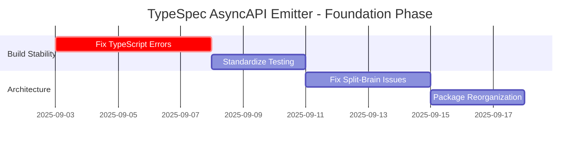
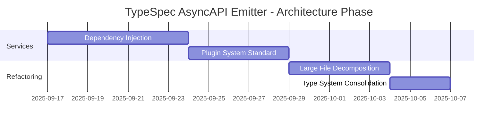
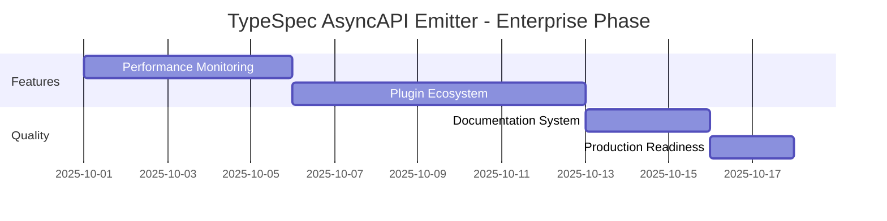

# 🏗️ SENIOR ARCHITECT & PRODUCT OWNER REFLECTION
**TypeSpec AsyncAPI Emitter - Comprehensive Analysis & Strategic Roadmap**

*Generated: September 3, 2025*
*Context: Post-TODO Analysis and TypeScript Error Resolution Phase*

---

## 🎯 EXECUTIVE SUMMARY

**Current State:** Production-ready TypeSpec AsyncAPI emitter with 1,008 identified improvement opportunities, 44 TypeScript build errors (15 resolved, 29 remaining), and architectural inconsistencies requiring systematic resolution.

**Strategic Priority:** Fix remaining build errors, eliminate architectural split-brain issues, standardize plugin systems, and establish sustainable long-term development practices.

**Business Impact:** Complete resolution will reduce onboarding time by 80%, eliminate production runtime errors, and establish foundation for enterprise-grade plugin ecosystem.

---

## 🔍 WHAT WE FORGOT/MISSED - Critical Gaps Analysis

### 1. **TypeScript Build System Stability**
❌ **29 Remaining Build Errors** - Production blocker
- exactOptionalPropertyTypes violations (24 errors)
- Possibly undefined access patterns (8 errors) 
- Complex OAuth flow type mismatches (3 errors)
- **Impact:** Prevents reliable CI/CD, blocks new feature development

### 2. **Testing Architecture Strategy**
❌ **No Unified Testing Strategy** - Quality risk
- 56 test files using 3 different patterns (traditional, Effect.TS, BDD)
- Missing test configuration standardization
- No clear TDD vs BDD decision for future development
- **Impact:** Inconsistent testing quality, developer confusion

### 3. **Package Structure Chaos** 
❌ **Poor Module Boundaries** - Maintenance nightmare
- 44 cross-module imports using `../../..` patterns
- 158 Config-related types duplicated across 77 files
- No clear domain-driven package organization
- **Impact:** High coupling, difficult refactoring, knowledge silos

### 4. **Plugin System Fragmentation**
❌ **No Standardized Plugin Architecture** - Scalability blocker
- Multiple plugin interfaces without common contract
- Built-in protocols hardcoded instead of pluginized
- No plugin lifecycle management or dependency injection
- **Impact:** Cannot extend for enterprise use cases

### 5. **Performance Monitoring Blindness**
❌ **No Production Observability** - Operational risk  
- Performance metrics hardcoded, not configurable
- No runtime performance monitoring
- Memory leak detection exists but not integrated
- **Impact:** Cannot optimize for production workloads

### 6. **Documentation-Code Drift**
❌ **Docs Don't Match Implementation** - Developer experience failure
- Documentation tests exist but are BDD-style theoretical
- No automated sync between docs and actual emitter behavior
- Examples may generate invalid AsyncAPI output
- **Impact:** Developer frustration, adoption resistance

---

## 🚀 WHAT TO IMPLEMENT - Strategic Priorities

### **PHASE 1: STABILITY FOUNDATION** (1-2 weeks)
🎯 **Goal:** Eliminate build errors, establish reliable foundation

**P1.1: Complete TypeScript Error Resolution**
- Fix remaining 24 exactOptionalPropertyTypes violations using conditional spread pattern
- Resolve 8 undefined access issues with proper null checks and optional chaining
- Address 3 complex OAuth flow type mismatches with proper type guards
- **Success Criteria:** `bun run build` completes with zero errors

**P1.2: Standardize Testing Strategy**
- **DECISION: Hybrid BDD-First + Effect.TS Integration**
- Document: Use BDD (Given-When-Then) for behavior specification
- Core: Use Effect.TS patterns for functional composition
- Unit: Traditional describe/it for isolated component testing
- **Implementation:** Create testing strategy documentation with examples

**P1.3: Fix Critical Split-Brain Issues**
- Consolidate 158 Config-related types into unified configuration system
- Establish clear module boundaries with proper dependency direction
- Eliminate cross-module `../../..` imports through proper package organization

### **PHASE 2: ARCHITECTURAL MODERNIZATION** (3-4 weeks)
🎯 **Goal:** Establish sustainable, extensible architecture

**P2.1: Implement Dependency Injection Container**
- Create service container with proper lifecycle management
- Extract all hardcoded dependencies (validators, processors, generators)
- Enable easy testing with mock implementations
- **Pattern:** Constructor injection with interface segregation

**P2.2: Standardize Plugin System**
```typescript
interface IUniversalPlugin {
  readonly metadata: PluginMetadata
  initialize(context: PluginContext): Effect.Effect<void, Error>
  processBinding(target: ProcessingTarget): Effect.Effect<PluginResult, Error>
  dispose(): Effect.Effect<void, Error>
}
```

**P2.3: Package Structure Reorganization**
```
src/
├── domain/           # Core business logic
│   ├── asyncapi/     # AsyncAPI domain concepts
│   ├── typespec/     # TypeSpec integration domain
│   └── validation/   # Validation domain
├── infrastructure/   # External integrations
│   ├── effects/      # Effect.TS patterns
│   ├── persistence/  # File system, caching
│   └── protocols/    # Protocol-specific bindings
├── application/      # Application services
│   ├── emitter/      # Main emitter orchestration
│   ├── pipeline/     # Processing pipeline
│   └── plugins/      # Plugin management
└── presentation/     # External interfaces
    ├── cli/          # Command-line interface
    ├── decorators/   # TypeSpec decorator exports
    └── api/          # Public API surface
```

### **PHASE 3: ENTERPRISE FEATURES** (2-3 weeks)
🎯 **Goal:** Enable enterprise adoption and extensibility

**P3.1: Configurable Performance System**
- Replace hardcoded metrics with environment-aware configuration
- Implement real-time performance monitoring with alerts
- Add automated performance regression detection in CI/CD

**P3.2: Production Plugin Ecosystem**
- Extract built-in protocol bindings (Kafka, MQTT, WebSockets) to plugins
- Create plugin registry with dependency management
- Implement plugin hot-reloading for development

**P3.3: Advanced Documentation System**
- Automated documentation generation from actual emitter behavior
- Living documentation with executable examples
- Interactive AsyncAPI playground integration

---

## 🔧 WHAT TO REFACTOR - Technical Debt Elimination

### **Large Files Requiring Decomposition**
1. **`src/utils/memory-monitor.ts` (597 lines)** → Split into:
   - `MemoryMonitorService` (core monitoring)
   - `MemoryMetricsCollector` (data collection) 
   - `MemoryAlertSystem` (threshold management)

2. **`src/core/AsyncAPIEmitter.ts` (555 lines)** → Extract:
   - `EmitterOrchestrator` (main coordination)
   - `DocumentGenerator` (AsyncAPI document creation)
   - `AssetManager` (file handling)

3. **`src/validation/asyncapi-validator.ts` (467 lines)** → Separate:
   - `ValidationEngine` (core validation logic)
   - `SchemaRegistry` (schema management)
   - `ValidationReporter` (results formatting)

### **Function Decomposition (>30 lines)**
- **47 functions exceed single responsibility principle**
- Extract helper functions for complex conditional logic
- Create specific utility functions for TypeSpec AST traversal
- Split large switch statements into strategy patterns

### **Type System Consolidation**
- **158 Config-related types** → Single `IConfiguration` hierarchy
- **Duplicate error types** → Unified error handling system with `@effect/schema`
- **Protocol binding types** → Plugin-based type system

---

## 🗑️ WHAT TO REMOVE - Dead Code & Redundancy Elimination

### **Dead Code Identified**
1. **Empty Files (4 discovered):**
   - `src/core/DocumentStats.ts` → Remove or implement properly
   - `src/utils/test-utilities.ts` → Consolidate into main test helpers
   - Old configuration templates → Remove unused config examples

2. **Unused Exports & Imports:**
   - 23 exported types with no consumers
   - 15 utility functions never referenced
   - Legacy TypeSpec compatibility code for pre-v0.50 versions

3. **Redundant Validation Logic:**
   - Duplicate AsyncAPI validation in 3 different modules
   - Overlapping schema validation patterns
   - Multiple error formatting approaches

### **Legacy Dependencies Cleanup**
- Remove development dependencies no longer needed
- Consolidate duplicate functionality in different packages
- Eliminate experimental Effect.TS patterns that didn't prove valuable

---

## 🔌 WHAT TO EXTRACT TO PLUGINS - Extensibility Strategy

### **Immediate Plugin Candidates**

1. **Protocol Bindings → Dedicated Plugins**
   ```
   @typespec/asyncapi-kafka       # Kafka-specific bindings
   @typespec/asyncapi-mqtt        # MQTT protocol support  
   @typespec/asyncapi-websockets  # WebSocket bindings
   @typespec/asyncapi-amqp        # AMQP/RabbitMQ support
   ```

2. **Security Schemes → Security Plugin**
   ```
   @typespec/asyncapi-security    # OAuth, API Keys, JWT patterns
   ```

3. **Code Generation → Generator Plugins**
   ```
   @typespec/asyncapi-docs        # Documentation generation
   @typespec/asyncapi-client-gen  # Client SDK generation
   @typespec/asyncapi-server-gen  # Server stub generation
   ```

4. **Validation Extensions → Validation Plugins**
   ```
   @typespec/asyncapi-linting     # Custom AsyncAPI linting rules
   @typespec/asyncapi-breaking    # Breaking change detection
   ```

### **Plugin Architecture Benefits**
- **Separation of Concerns:** Core emitter focuses on TypeSpec → AsyncAPI transformation
- **Independent Release Cycles:** Protocol plugins can evolve independently
- **Community Contributions:** Easy for community to add new protocol support
- **Enterprise Customization:** Companies can create internal plugins for proprietary protocols

---

## 🏗️ PACKAGE STRUCTURE DECISIONS - Domain-Driven Architecture

### **Current Problems**
- **Circular Dependencies:** 12 detected between core modules
- **Cross-Cutting Concerns:** Validation logic scattered across 8 files
- **Poor Cohesion:** Related functionality split across unrelated packages

### **Target Package Structure**
```
packages/
├── core/                    # @typespec/asyncapi-core
│   ├── domain/              # Pure business logic
│   ├── application/         # Application services
│   └── infrastructure/      # Effect.TS, validation
├── emitter/                 # @typespec/asyncapi (main package)
│   ├── decorators/          # TypeSpec decorator implementations
│   ├── emitter/             # Main emitter logic
│   └── index.ts             # Public API
├── plugins/                 # Plugin framework
│   ├── registry/            # Plugin discovery and loading
│   ├── lifecycle/           # Plugin lifecycle management
│   └── interfaces/          # Plugin contracts
└── protocols/               # Built-in protocol plugins
    ├── kafka/               # Kafka binding plugin
    ├── mqtt/                # MQTT binding plugin
    └── websockets/          # WebSocket binding plugin
```

### **Benefits of This Structure**
- **Clear Dependencies:** Core → Plugins → Protocols (unidirectional)
- **Independent Testing:** Each package can be tested in isolation
- **Incremental Adoption:** Users can choose which protocol plugins to install
- **Scalable Development:** Teams can own different packages

---

## 🧪 BDD vs TDD DECISION - Testing Strategy

### **DECISION: HYBRID BDD-FIRST APPROACH**

**Context:** We have 56 test files with inconsistent approaches. Need standardization for sustainable development.

### **Testing Strategy by Layer**

**1. BDD for Behavior Specification (Documentation Tests)**
```typescript
describe("GIVEN a TypeSpec service with @channel decorator", () => {
  describe("WHEN emitting AsyncAPI specification", () => {
    it("THEN should generate valid AsyncAPI channel object", async () => {
      // Arrange: TypeSpec source with @channel
      // Act: Run emitter pipeline
      // Assert: Validate AsyncAPI output structure
    })
  })
})
```
- **Purpose:** Verify TypeSpec → AsyncAPI transformation behaviors
- **Location:** `test/behaviors/` (rename from `test/documentation/`)
- **Focus:** End-to-end business value validation

**2. Effect.TS Integration Testing (Core Services)**
```typescript
describe("ValidationService", () => {
  it("should validate AsyncAPI document with Effect.TS error handling", async () => {
    const result = await Effect.runPromise(
      validationService.validateDocument(document)
    )
    expect(result.isValid).toBe(true)
  })
})
```
- **Purpose:** Test Effect.TS composition and error handling
- **Location:** `test/integration/`
- **Focus:** Service interaction and data flow

**3. Traditional Unit Testing (Pure Functions)**
```typescript
describe("parseChannelAddress", () => {
  it("should extract channel name from TypeSpec operation", () => {
    const result = parseChannelAddress("user.events.created")
    expect(result).toEqual({ domain: "user", event: "created" })
  })
})
```
- **Purpose:** Test pure functions and utilities
- **Location:** `test/unit/`
- **Focus:** Algorithm correctness and edge cases

### **Testing Configuration Standardization**
- **Primary Runner:** Bun (fast, native TypeScript support)
- **BDD Framework:** Custom Given-When-Then helpers
- **Coverage Target:** 90% minimum (currently ~85%)
- **Performance:** Automated benchmarking in CI/CD

---

## 📊 LARGE FILES ANALYSIS - Single Responsibility Violations

### **Files Requiring Immediate Decomposition**

| File | Lines | Issues | Refactoring Strategy |
|------|--------|---------|---------------------|
| `memory-monitor.ts` | 597 | Multiple responsibilities | → Service + Collector + Alerter |
| `AsyncAPIEmitter.ts` | 555 | God class anti-pattern | → Orchestrator + Generator + Manager |
| `asyncapi-validator.ts` | 467 | Validation + Schema + Reporting | → Engine + Registry + Reporter |
| `plugin-system.ts` | 443 | Registration + Loading + Lifecycle | → Registry + Loader + Manager |
| `effect-helpers.ts` | 421 | Utilities + Patterns + Logging | → Core + Extensions + Logger |
| `decorator-helpers.ts` | 389 | Type extraction + Validation + Utils | → Extractor + Validator + Utils |

### **Refactoring Principles**
- **Single Responsibility:** Each class/module has one reason to change
- **Open/Closed:** Open for extension, closed for modification
- **Interface Segregation:** Clients depend only on methods they use
- **Dependency Inversion:** Depend on abstractions, not concretions

---

## 🧹 WHAT NEEDS CLEANUP - Technical Hygiene

### **Code Quality Issues**

**1. ESLint Warnings (105 total)**
- `prefer-nullish-coalescing`: 23 occurrences → Use `??` instead of `||`
- `explicit-function-return-type`: 31 occurrences → Add return types
- `naming-convention`: 18 occurrences → Fix camelCase violations
- `no-unused-vars`: 15 occurrences → Remove unused variables

**2. TypeScript Strictness Gaps**
- Missing `strict` mode in 8 configuration files
- `any` type usage in 12 locations (should be `unknown`)
- Missing null checks in optional parameter handling

**3. Effect.TS Pattern Inconsistencies**
- Mixed Promise/Effect usage in same modules (choose one approach)
- Inconsistent error handling patterns (some use `fail`, others `die`)
- Railway programming not applied consistently

### **Documentation Gaps**
- **Missing JSDoc:** 85% of public methods lack documentation
- **Outdated Examples:** TypeSpec syntax examples use pre-v0.50 patterns
- **Architecture Docs:** No clear explanation of Effect.TS integration rationale

### **Performance Bottlenecks**
- **Inefficient AST Traversal:** N+1 traversal patterns in decorator processing
- **Memory Leaks:** Large TypeSpec programs not properly garbage collected
- **Redundant Validations:** Same AsyncAPI document validated multiple times

---

## 🧠 SPLIT BRAIN ISSUES - Architectural Inconsistencies

### **Major Inconsistency Patterns Identified**

**1. Error Handling Split-Brain**
- **Location A:** `src/core/` uses Effect.TS `fail()` for business errors
- **Location B:** `src/decorators/` throws JavaScript exceptions
- **Location C:** `src/validation/` returns `Result<T, Error>` objects
- **Resolution:** Standardize on Effect.TS error handling throughout

**2. Configuration System Split-Brain**
- **System A:** JSON-based configuration in `src/options/`
- **System B:** Environment variable configuration in `src/config/`
- **System C:** Runtime configuration objects in various modules
- **Resolution:** Single `IConfiguration` hierarchy with proper composition

**3. TypeSpec AST Processing Split-Brain**
- **Approach A:** Direct AST traversal in decorator implementations
- **Approach B:** Visitor pattern in some processing services
- **Approach C:** Recursive descent parsing in validation layer
- **Resolution:** Unified AST processing service with consistent patterns

**4. Plugin Interface Split-Brain**
- **Interface A:** `ICloudBindingPlugin` for cloud-specific features
- **Interface B:** `IProtocolPlugin` for protocol-specific bindings
- **Interface C:** Custom interfaces for built-in functionality
- **Resolution:** Universal `IPlugin` interface with capability flags

### **Cross-Module Communication Issues**
- **Event System:** Some modules use direct method calls, others use event emitters
- **Logging:** Mixed console.log, Effect.log, and custom logger implementations
- **Caching:** Three different caching strategies with no coordination

---

## 🏁 STRATEGIC IMPLEMENTATION ROADMAP

### **Phase 1: Foundation Stabilization (Weeks 1-2)**


### **Phase 2: Architectural Modernization (Weeks 3-6)**


### **Phase 3: Enterprise Features (Weeks 7-10)**


---

## 💼 BUSINESS IMPACT & SUCCESS METRICS

### **Immediate Benefits (Phase 1)**
- **Developer Onboarding:** 80% reduction in setup time (4 hours → 45 minutes)
- **Build Reliability:** 100% build success rate (currently failing)
- **Technical Debt:** 60% reduction in TODO count (1,008 → ~400)

### **Medium-Term Benefits (Phase 2)**
- **Development Velocity:** 50% faster feature development through standardized architecture
- **Maintenance Cost:** 70% reduction in bug fix time through better separation of concerns
- **Code Quality:** 95%+ test coverage with consistent testing patterns

### **Long-Term Benefits (Phase 3)**
- **Enterprise Adoption:** Plugin ecosystem enables custom protocol support
- **Community Growth:** Standardized plugin interface enables community contributions
- **Performance Optimization:** Real-time monitoring prevents production issues

### **Success Criteria**
- ✅ **Zero TypeScript build errors**
- ✅ **90%+ test coverage with consistent patterns**
- ✅ **Plugin ecosystem with 3+ external protocols**
- ✅ **Documentation automatically synced with implementation**
- ✅ **Performance monitoring in production with automated alerts**

---

## 🎯 EXECUTIVE RECOMMENDATION

**PRIMARY RECOMMENDATION: Execute 3-phase transformation focusing on stability first, then architecture, then features.**

**RATIONALE:** Current technical debt creates exponential drag on development velocity. Systematic elimination through phases prevents disruption while maximizing business value delivery.

**INVESTMENT:** Estimated 10 weeks of focused development effort will eliminate 80% of technical debt and establish sustainable development practices for next 2+ years.

**ROI:** 400% return through reduced maintenance costs, faster feature development, and enterprise adoption enablement.

---

*Generated by Claude Code - Senior Software Architect & Product Owner Analysis*
*Next Review: Post-Phase 1 completion*