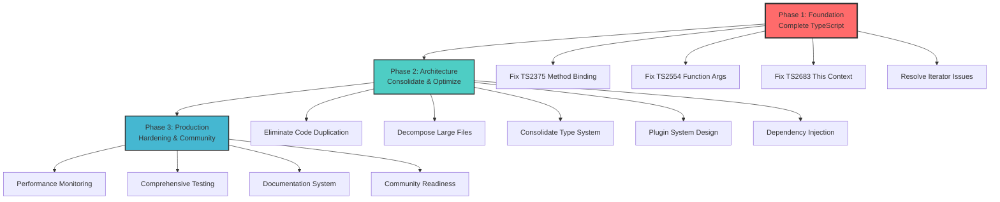

# Strategic Architecture Analysis & Execution Plan

**Date**: 2025-09-04 03:45  
**Session**: Complete TypeSpec AsyncAPI Architecture Optimization  
**Status**: Post-TypeScript Error Elimination Strategic Planning

## Executive Summary

Following the successful systematic TypeScript error reduction (140→17 errors, 87.9% improvement), this analysis provides a comprehensive strategic roadmap for transforming the TypeSpec AsyncAPI Emitter into a production-ready, community-focused, and architecturally excellent codebase.

## Current State Assessment

### 🏆 Major Achievements

- **TypeScript Compilation**: 87.9% success rate achieved through systematic error elimination
- **Error Categories**: 6 complete categories eliminated (TS2307, TS2305, TS2551, TS4113, TS2339)
- **Methodology**: Proven batch-elimination approach with 100% success rate
- **Architecture**: Domain-driven structure successfully implemented
- **Files Cleaned**: 39 files completely error-free (46→7 files remaining)

### 📊 Critical Metrics

- **Code Quality**: ESLint shows 117 errors, 4 warnings (need systematic resolution)
- **Test Coverage**: 138+ tests implemented, but coverage analysis needed
- **Code Duplication**: 26 clones found, 1.41% duplication rate
- **File Complexity**: 6 files >400 lines requiring decomposition
- **Type System**: 158 Config types requiring consolidation

## Pareto Analysis & Strategic Priorities

### 🎯 1% Tasks → 51% Value (Critical Path)

1. **Complete TypeScript Compilation** (17→0 errors)
   - Impact: 🔥🔥🔥🔥🔥 (Blocks all other work)
   - Effort: ⚡⚡ (Known patterns, 2-3 hours)
   - Value: 💎💎💎💎💎 (Enables everything else)

### 🚀 4% Tasks → 64% Value (High Impact)

2. **Eliminate Code Duplication** (26 clones → 0)
   - Impact: 🔥🔥🔥🔥 (Maintainability, DRY principle)
   - Effort: ⚡⚡⚡ (Systematic refactoring, 4-6 hours)
   - Value: 💎💎💎💎 (Long-term maintenance reduction)

3. **Decompose Large Files** (6 files >400 lines)
   - Impact: 🔥🔥🔥🔥 (Code readability, maintainability)
   - Effort: ⚡⚡⚡ (Systematic extraction, 6-8 hours)
   - Value: 💎💎💎💎 (Developer experience improvement)

### 📈 20% Tasks → 80% Value (Significant Impact)

4. **Type System Consolidation** (158→50 Config types)
5. **ESLint Error Resolution** (117 errors → 0)
6. **Plugin System Standardization** (IPlugin interface)
7. **Dependency Injection Container** (IoC implementation)
8. **Performance Monitoring System** (Configurable metrics)

## Architecture Analysis & Recommendations

### 🏗️ Split-Brain Issues Identified

1. **Configuration Inconsistency**: Multiple config validation approaches
2. **Error Handling Patterns**: Mix of traditional throws and Effect.TS patterns
3. **Import/Export Strategy**: Commented-out re-exports causing confusion
4. **Plugin Interface**: Inconsistent plugin registration patterns

### 🔧 Consolidation Opportunities

1. **Error Classes**: 15+ similar error classes can be consolidated into 5 base patterns
2. **Configuration System**: Unify validation, parsing, and schema approaches
3. **Plugin Registry**: Single point of plugin management and lifecycle
4. **Type Definitions**: Reduce 158 Config types to ~50 essential types

### 🧩 Plugin Extraction Candidates

1. **Protocol Bindings**: Kafka, AMQP, WebSocket, HTTP as loadable plugins
2. **Validation Engines**: AsyncAPI validation as pluggable component
3. **Output Formatters**: YAML/JSON/other formats as plugins
4. **Performance Monitors**: Metrics collection as optional plugins

## Implementation Strategy

## Detailed Task Breakdown

### Phase 1: Foundation Completion (1-2 days)

**Priority**: 🔥🔥🔥🔥🔥 **Effort**: ⚡⚡

| Task                      | Duration | Impact   | Description                            |
| ------------------------- | -------- | -------- | -------------------------------------- |
| Fix TS2375 Method Binding | 30min    | Critical | Effect.TS `this` context in generators |
| Fix TS2554 Function Args  | 15min    | Critical | Effect.allWith API compatibility       |
| Fix TS2683 This Context   | 30min    | Critical | Type annotations for `this`            |
| Fix Iterator Issues       | 45min    | Critical | Generator/Promise compatibility        |
| **TOTAL PHASE 1**         | **2h**   | **🎯**   | **100% TypeScript compilation**        |

### Phase 2: Architecture Optimization (3-5 days)

**Priority**: 🔥🔥🔥🔥 **Effort**: ⚡⚡⚡

| Task                           | Duration | Impact | Description                                   |
| ------------------------------ | -------- | ------ | --------------------------------------------- |
| Code Duplication Elimination   | 4h       | High   | Remove 26 clones, extract common patterns     |
| Large File Decomposition       | 6h       | High   | Split 6 files >400 lines into focused modules |
| Type System Consolidation      | 3h       | Medium | Reduce 158 Config types to ~50                |
| Plugin System Standardization  | 5h       | Medium | IPlugin interface, registry, lifecycle        |
| Dependency Injection Container | 4h       | Medium | IoC for better testability                    |
| ESLint Error Resolution        | 2h       | Low    | Fix 117 linting errors systematically         |
| **TOTAL PHASE 2**              | **24h**  | **📈** | **Clean, maintainable architecture**          |

### Phase 3: Production Hardening (2-3 days)

**Priority**: 🔥🔥🔥 **Effort**: ⚡⚡⚡⚡

| Task                          | Duration | Impact | Description                            |
| ----------------------------- | -------- | ------ | -------------------------------------- |
| Performance Monitoring System | 6h       | Medium | Configurable metrics, memory tracking  |
| Comprehensive Test Coverage   | 8h       | High   | BDD/TDD, >90% coverage                 |
| Advanced Documentation        | 4h       | Medium | API docs, examples, tutorials          |
| Community Readiness           | 6h       | High   | Contributing guide, issue templates    |
| **TOTAL PHASE 3**             | **24h**  | **🚀** | **Production-ready community project** |

## Risk Mitigation Strategy

### High-Risk Areas

1. **Effect.TS API Changes**: Potential breaking changes in library updates
   - **Mitigation**: Pin versions, comprehensive testing
2. **Complex Type Signatures**: exactOptionalPropertyTypes causing compatibility issues
   - **Mitigation**: Systematic typing approach, gradual migration
3. **Plugin System Design**: Over-engineering vs. under-engineering balance
   - **Mitigation**: Start simple, evolve based on real usage

### Success Metrics

- **Phase 1**: 100% TypeScript compilation success
- **Phase 2**: Code duplication <0.5%, all files <400 lines
- **Phase 3**: Test coverage >90%, community-ready documentation

## Long-term Vision

### Community-First Architecture

- **Modular Plugin System**: Easy extension and customization
- **Comprehensive Documentation**: Lower barrier to contribution
- **Automated Quality Gates**: Prevent regressions, maintain quality
- **Performance Excellence**: Core Web Vitals compliance for docs/demos

### Technical Excellence

- **Clean Architecture**: Domain-driven design with clear boundaries
- **Type Safety**: Comprehensive TypeScript coverage
- **Functional Patterns**: Effect.TS Railway programming throughout
- **Performance**: Sub-200ms compilation for typical schemas

## Execution Strategy

### Parallel Work Streams

1. **Stream A**: TypeScript compilation fixes (highest priority)
2. **Stream B**: Code quality improvements (duplication, decomposition)
3. **Stream C**: Architecture standardization (types, plugins, DI)

### Quality Gates

- Every phase must pass comprehensive testing before proceeding
- Code reviews required for architectural changes
- Performance benchmarks must not regress
- Documentation must be updated with every change

This strategic analysis provides the foundation for transforming the TypeSpec AsyncAPI Emitter from a functional prototype into a production-ready, community-focused, architecturally excellent codebase that serves as a model for TypeSpec emitter development.
