```mermaid
gantt
    title Effect.TS Systematic Completion - Parallel Execution Plan
    dateFormat HH:mm
    axisFormat %H:%M

    section Critical Path (51% Value)
    Core Emitter Conversion    :crit, core, 09:00, 45m
    
    section High Impact (64% Value)  
    Throw Statements           :active, throws, after core, 30m
    Critical Any Types         :active, any1, 09:00, 30m
    Pipeline Architecture      :arch, after core, 45m
    
    section Production Ready (80% Value)
    Validation Conversion      :valid, 09:00, 35m
    Infrastructure Conversion  :infra, 09:30, 50m
    Remaining Any Types        :any2, after any1, 60m
    Unsafe Violations         :unsafe, after any2, 40m
    
    section Architecture & Testing
    Domain Optimization       :domain, after arch, 60m
    Error Boundaries          :boundaries, after throws, 50m
    Railway Programming       :railway, after boundaries, 70m
    Test Coverage            :tests, after railway, 45m
    
    section Final Polish
    ESLint Cleanup           :lint, after tests, 90m
    Performance Testing      :perf, after railway, 50m
    AsyncAPI Validation      :asyncapi, after boundaries, 55m
```

# 🚀 EFFECT.TS SYSTEMATIC COMPLETION - COMPREHENSIVE EXECUTION PLAN

**Session Date:** September 4, 2025 08:57 CEST  
**Objective:** Complete systematic Effect.TS adoption for production-ready TypeSpec AsyncAPI emitter  
**Current State:** TypeScript 100% complete (140→0 errors), ESLint ~64 problems, 29 try/catch remaining

---

## 🎯 PARETO ANALYSIS - MAXIMUM IMPACT FRAMEWORK

### 1% EFFORT → 51% RESULT (CRITICAL PATH) 
**Single Action**: Convert core emitter try/catch blocks to Effect.TS patterns (45min)
- **AsyncAPIEmitter.ts**: Main emission pipeline error handling
- **Impact**: Unlocks functional programming benefits throughout entire system
- **Customer Value**: Production-ready error handling, composable operations
- **Dependencies**: None - can start immediately

### 4% EFFORT → 64% RESULT (HIGH IMPACT CLUSTER)
**Critical Few**: Core conversion + critical fixes (2.5 hours total)
1. Convert core emitter try/catch blocks (45min)
2. Replace throw statements in AsyncAPIEmitter.ts (30min)  
3. Fix critical ESLint no-explicit-any errors (30min)
4. Optimize EmissionPipeline architecture (45min)

### 20% EFFORT → 80% RESULT (PRODUCTION READINESS)
**Complete Foundation**: Above + systematic conversion + testing + architecture (12.8 hours total)

---

## 📊 TIER 1: HIGH-LEVEL EXECUTION MATRIX (30-100min tasks)

| Priority | Task | Impact | Effort | Customer Value | Duration | Dependencies |
|----------|------|--------|--------|----------------|----------|--------------|
| **CRITICAL PATH (51% VALUE)** |
| 1 | Convert core emitter try/catch to Effect.TS | 10 | 4 | 10 | 45min | None |
| **HIGH IMPACT CLUSTER (64% VALUE)** |  
| 2 | Replace throw statements with Effect.fail/die | 9 | 3 | 10 | 30min | Task 1 |
| 3 | Fix critical ESLint no-explicit-any errors | 9 | 3 | 9 | 30min | None |
| 4 | Optimize EmissionPipeline architecture | 9 | 4 | 9 | 45min | Task 1 |
| **PRODUCTION READINESS (80% VALUE)** |
| 5 | Convert validation try/catch blocks | 8 | 3 | 9 | 35min | None |
| 6 | Replace remaining any types with proper types | 8 | 4 | 8 | 60min | Task 3 |
| 7 | Convert infrastructure try/catch blocks | 8 | 4 | 8 | 50min | None |
| 8 | Fix ESLint no-unsafe-* violations | 7 | 3 | 8 | 40min | Task 6 |
| 9 | Optimize domain model architecture | 7 | 5 | 7 | 60min | Task 4 |
| 10 | Convert decorator try/catch blocks | 7 | 3 | 7 | 35min | None |
| 11 | Add comprehensive Effect.TS error boundaries | 7 | 4 | 8 | 50min | Task 1 |
| 12 | Implement railway programming patterns | 8 | 5 | 7 | 70min | Task 11 |
| 13 | Enhance test coverage for Effect.TS patterns | 6 | 3 | 9 | 45min | Task 1 |
| **OPTIMIZATION & POLISH (100% VALUE)** |
| 14 | Fix remaining ESLint warnings (105 total) | 5 | 6 | 6 | 90min | All above |
| 15 | Optimize plugin architecture | 6 | 4 | 7 | 55min | Task 9 |
| 16 | Add performance regression testing | 6 | 4 | 8 | 50min | Task 12 |
| 17 | Implement comprehensive AsyncAPI validation | 7 | 4 | 8 | 55min | Task 11 |
| 18 | Add monitoring and observability | 6 | 5 | 6 | 65min | Task 16 |

---

## 🔬 TIER 2: DETAILED MICRO-TASK BREAKDOWN (12-15min tasks)

### GROUP A: CORE CONVERSION (Parallel Execution Ready)
| Task | Micro-Task | Duration | Impact | Dependencies |
|------|------------|----------|--------|--------------|
| T1 | Convert AsyncAPIEmitter main try/catch | 15min | 10 | None |
| T1 | Convert DocumentBuilder try/catch | 15min | 9 | T1.1 |
| T1 | Convert EmissionPipeline try/catch | 15min | 9 | T1.1 |
| T2 | Replace AsyncAPIEmitter throw statements | 10min | 10 | T1 complete |
| T2 | Replace DocumentBuilder throw statements | 10min | 8 | T1 complete |
| T2 | Replace ValidationService throw statements | 10min | 8 | T1 complete |
| T3 | Fix schema-conversion any types | 15min | 9 | None |
| T3 | Fix ValidationService any types | 15min | 8 | None |

### GROUP B: INFRASTRUCTURE CONVERSION (Sequential Dependencies)
| Task | Micro-Task | Duration | Impact | Dependencies |
|------|------------|----------|--------|--------------|
| T4 | Refactor EmissionPipeline class structure | 15min | 8 | T1 complete |
| T4 | Optimize ProcessingService architecture | 15min | 7 | T4.1 |
| T4 | Implement proper dependency injection | 15min | 7 | T4.2 |
| T5 | Convert asyncapi-validator try/catch | 15min | 8 | None |
| T5 | Convert ValidationService try/catch | 12min | 7 | T5.1 |
| T7 | Convert PerformanceMonitor try/catch | 15min | 7 | None |
| T7 | Convert memory-monitor try/catch | 12min | 6 | T7.1 |

### GROUP C: QUALITY & VALIDATION (Independent Execution)
| Task | Micro-Task | Duration | Impact | Dependencies |
|------|------------|----------|--------|--------------|
| T6 | Replace utils/schema-conversion any types | 15min | 8 | None |
| T6 | Replace performance config any types | 15min | 6 | None |
| T8 | Fix unsafe assignment violations | 15min | 7 | None |
| T8 | Fix unsafe call violations | 12min | 6 | None |
| T13 | Add Effect.TS pattern test coverage | 15min | 7 | T1 complete |
| T13 | Add error handling test scenarios | 15min | 6 | T13.1 |

---

## 📈 EXECUTION TIMELINE & PARALLEL STRATEGY



---

## 🚀 PARALLEL EXECUTION GROUPS

### GROUP A: CORE CONVERSION AGENTS (3 parallel agents)
**Duration**: 45 minutes  
**Impact**: 51% of total project value  
**Tasks**: 1-3 (Core emitter, throw statements, critical any types)
- Agent 1: AsyncAPIEmitter.ts conversion
- Agent 2: DocumentBuilder.ts conversion  
- Agent 3: Critical ESLint any types

### GROUP B: INFRASTRUCTURE AGENTS (2 parallel agents)
**Duration**: 85 minutes  
**Impact**: 13% additional value (64% total)
**Tasks**: 4-7 (Architecture, validation, infrastructure)
- Agent 1: Pipeline architecture optimization
- Agent 2: Validation & infrastructure conversion

### GROUP C: QUALITY AGENTS (2 parallel agents)  
**Duration**: 100 minutes
**Impact**: 16% additional value (80% total)
**Tasks**: 8-13 (Quality, testing, error boundaries)
- Agent 1: ESLint fixes & type safety
- Agent 2: Testing & error handling patterns

---

## 🎯 SUCCESS CRITERIA & VERIFICATION

### FUNCTIONAL REQUIREMENTS ✅
- [ ] **Zero try/catch blocks** in production code (29→0)
- [ ] **Zero throw statements** in production code (~15→0)  
- [ ] **Zero 'any' types** in core functionality (~10→0)
- [ ] **All ESLint critical errors resolved** (64→<10)
- [ ] **100% Effect.TS pattern adoption** in core paths

### QUALITY REQUIREMENTS ✅
- [ ] **All existing tests passing** (138+ tests maintained)
- [ ] **Performance benchmarks maintained** (<2.5s LCP, <200ms INP)
- [ ] **AsyncAPI 3.0 compliance validated** (specification conformance)
- [ ] **Code coverage >90%** for new Effect.TS patterns

### PRODUCTION READINESS ✅
- [ ] **Comprehensive error handling** with standardized patterns
- [ ] **Railway programming** throughout core data flows
- [ ] **Performance regression testing** with automated thresholds
- [ ] **Community contribution ready** with clear patterns

---

## 📝 EXECUTION COMMANDS

### Phase 1: Initialize Parallel Execution (IMMEDIATE)
```bash
# Verify build status
just build && just lint

# Spawn 3 parallel agents for maximum throughput
# Agent 1: Core emitter conversion  
# Agent 2: Throw statement replacement
# Agent 3: Critical type fixes
```

### Phase 2: Infrastructure & Architecture (SEQUENTIAL)
```bash  
# After Phase 1 completion - architecture depends on core patterns
# Pipeline optimization + validation conversion
```

### Phase 3: Quality & Testing (PARALLEL)
```bash
# Independent quality improvements - can run parallel to Phase 2
# ESLint fixes + comprehensive testing
```

### Verification After Each Phase
```bash
just build        # Ensure TypeScript compilation
just lint         # Verify ESLint improvements  
just test         # Maintain test suite integrity
just typecheck    # Confirm type safety
```

---

## 💡 RISK MITIGATION

### Build Safety 🛡️
- **TypeScript First**: Every change verified with `just build` 
- **Test Integrity**: Comprehensive test suite runs after each phase
- **Git Checkpoints**: Detailed commits after each major milestone
- **Rollback Ready**: All changes atomic and reversible

### Pattern Consistency 🔄
- **Established Templates**: Proven Effect.TS conversion patterns from previous work
- **Quality Gates**: ESLint enforcement prevents regression  
- **Code Review**: Systematic validation of all conversions
- **Documentation**: Comprehensive pattern documentation for maintainability

---

## 📊 SUCCESS METRICS

### Quantitative Targets 🎯
- **TypeScript Errors**: Maintain 0 (current: 0/140 ✅)
- **ESLint Problems**: 64→<10 (85% reduction)  
- **try/catch Blocks**: 29→0 (100% elimination)
- **Effect.TS Adoption**: 0%→100% in core paths
- **Test Coverage**: Maintain >95% with new patterns

### Qualitative Outcomes 🌟
- **Railway Programming**: Complete functional error handling
- **Maintainability**: Clear, composable Effect.TS patterns  
- **Production Ready**: Enterprise-grade error handling and monitoring
- **Community Ready**: Clear contribution patterns and documentation
- **Performance**: Maintained or improved with functional patterns

---

**🔥 EXECUTION STATUS: READY FOR IMMEDIATE PARALLEL DEPLOYMENT** 

Total estimated completion time: **12.8 hours** with parallel execution optimization delivering **80% value in first 6 hours**.
