# 🚀 FINAL COMPLETION - COMPREHENSIVE PARETO ANALYSIS & EXECUTION PLAN

**Session Date:** September 4, 2025 12:54 CEST  
**Phase:** Final Sprint to 100% Effect.TS Adoption and Production Readiness  
**Current Achievement:** 18/32 tasks completed (56%), Critical path achieved (51% value delivered)

---

## 📊 PARETO ANALYSIS - MAXIMUM VALUE DELIVERY

### 🎯 1% EFFORT → 51% RESULT (ALREADY ACHIEVED!)
**✅ COMPLETED**: Core emitter Effect.TS migration (AsyncAPIEmitter, DocumentBuilder, EmissionPipeline)
- **Impact**: Unlocked functional programming benefits throughout entire system
- **Customer Value**: Production-ready error handling with Railway Programming
- **Achievement**: Critical path completion enabling all downstream improvements

### 🔥 4% EFFORT → 64% RESULT (60 minutes total)
**Critical Few Actions** that deliver major incremental business impact:

1. **Convert security decorator try/catch** (15min)
   - **Impact**: 9/10 - Completes decorator security validation
   - **Effort**: 2/10 - Simple URL validation pattern
   - **Customer Value**: 9/10 - Security hardening for production

2. **Fix ESLint naming conventions + readonly warnings** (25min)  
   - **Impact**: 8/10 - Eliminates 40+ quality warnings
   - **Effort**: 3/10 - Systematic rename operations
   - **Customer Value**: 8/10 - Professional code quality

3. **Implement comprehensive Effect.TS error boundaries** (20min)
   - **Impact**: 9/10 - Graceful degradation throughout system
   - **Effort**: 3/10 - Template-based implementation  
   - **Customer Value**: 9/10 - Production reliability

**Total ROI**: 60 minutes → **64% completion value** (13% incremental gain)

### ⚡ 20% EFFORT → 80% RESULT (240 minutes total)
**Complete Foundation** for enterprise-grade production readiness:

Above 64% tasks **PLUS**:
- Complete remaining 22 try/catch conversions (45min)
- Add comprehensive Effect.TS test coverage (60min)  
- Optimize ProcessingService architecture (40min)
- Implement dependency injection patterns (35min)
- Add performance regression testing (40min)
- Complete AsyncAPI validation enhancement (35min)
- Final build & test verification (25min)

**Total ROI**: 240 minutes → **80% completion value** (16% incremental gain)

---

## 📋 TIER 1: HIGH-LEVEL EXECUTION MATRIX (30-100min tasks)

| Priority | Task | Impact | Effort | Customer Value | Duration | Dependencies | Phase |
|----------|------|--------|--------|----------------|----------|--------------|-------|
| **4% EFFORT → 64% VALUE (CRITICAL FEW)** |
| 1 | Convert security decorator try/catch | 9 | 2 | 9 | 15min | None | 1 |
| 2 | Fix ESLint naming + readonly warnings | 8 | 3 | 8 | 25min | None | 1 |  
| 3 | Implement comprehensive error boundaries | 9 | 3 | 9 | 20min | Task 1 | 1 |
| **20% EFFORT → 80% VALUE (PRODUCTION FOUNDATION)** |
| 4 | Convert remaining decorator try/catch blocks | 8 | 3 | 8 | 30min | None | 2 |
| 5 | Convert infrastructure try/catch blocks | 7 | 3 | 8 | 25min | None | 2 |
| 6 | Implement Effect.gen throughout remaining core | 8 | 4 | 7 | 35min | Tasks 4,5 | 2 |
| 7 | Add proper error recovery patterns | 7 | 3 | 8 | 25min | Task 3 | 2 |
| 8 | Optimize ProcessingService architecture | 7 | 4 | 7 | 40min | Tasks 4-6 | 3 |
| 9 | Implement proper dependency injection | 7 | 3 | 8 | 35min | Task 8 | 3 |
| 10 | Add Effect.TS pattern test coverage | 6 | 4 | 9 | 45min | Tasks 1-7 | 3 |
| 11 | Add error handling test scenarios | 6 | 3 | 8 | 30min | Task 10 | 3 |
| 12 | Add proper composition patterns | 6 | 3 | 7 | 25min | Task 9 | 3 |
| 13 | Optimize plugin registration system | 5 | 4 | 6 | 35min | Task 12 | 3 |
| 14 | Add performance regression testing | 6 | 4 | 8 | 40min | Tasks 8-12 | 3 |
| 15 | Implement comprehensive AsyncAPI validation | 7 | 3 | 8 | 35min | Task 14 | 3 |
| 16 | Run comprehensive build & test validation | 8 | 2 | 10 | 25min | All above | 3 |

---

## 🔬 TIER 2: MICRO-TASK BREAKDOWN (15min each, execution-ready)

### PHASE 1: Critical Few (64% Value) - 60 minutes

| # | Task | Micro-Task | Duration | Impact | Dependencies |
|---|------|------------|----------|--------|--------------|
| 1.1 | Security | Convert security.ts URL validation try/catch | 15min | 9 | None |
| 2.1 | ESLint | Fix camelCase naming convention violations | 8min | 7 | None |
| 2.2 | ESLint | Fix prefer-readonly array/object violations | 12min | 8 | 2.1 |
| 2.3 | ESLint | Remove no-this-alias violations | 5min | 6 | 2.2 |
| 3.1 | Error Boundaries | Add graceful degradation to core emitter | 12min | 9 | 1.1 |
| 3.2 | Error Boundaries | Add fallback patterns to validation services | 8min | 8 | 3.1 |

### PHASE 2: Effect.TS Pattern Completion - 115 minutes

| # | Task | Micro-Task | Duration | Impact | Dependencies |
|---|------|------------|----------|--------|--------------|
| 4.1 | Decorators | Convert remaining decorator try/catch blocks | 15min | 8 | None |
| 4.2 | Decorators | Add standardized error logging to decorators | 10min | 7 | 4.1 |
| 4.3 | Decorators | Verify decorator Effect.TS pattern consistency | 5min | 6 | 4.2 |
| 5.1 | Infrastructure | Convert plugin registry try/catch blocks | 12min | 7 | None |
| 5.2 | Infrastructure | Convert utility function try/catch blocks | 8min | 6 | 5.1 |
| 5.3 | Infrastructure | Add Effect.TS logging to infrastructure | 5min | 6 | 5.2 |
| 6.1 | Core | Implement Effect.gen in remaining core services | 15min | 8 | 4.3, 5.3 |
| 6.2 | Core | Add proper yield* patterns throughout | 12min | 7 | 6.1 |
| 6.3 | Core | Verify Effect.gen consistency across codebase | 8min | 7 | 6.2 |
| 7.1 | Recovery | Add retry patterns with Schedule.exponential | 12min | 7 | 3.2 |
| 7.2 | Recovery | Add circuit breaker patterns for external deps | 8min | 6 | 7.1 |
| 7.3 | Recovery | Add timeout patterns for long operations | 5min | 6 | 7.2 |

### PHASE 3: Production Polish - 125 minutes

| # | Task | Micro-Task | Duration | Impact | Dependencies |
|---|------|------------|----------|--------|--------------|
| 8.1 | Architecture | Refactor ProcessingService to functional patterns | 15min | 7 | Phase 2 |
| 8.2 | Architecture | Add proper separation of concerns | 12min | 6 | 8.1 |
| 8.3 | Architecture | Implement domain-driven design patterns | 13min | 6 | 8.2 |
| 9.1 | DI | Implement Effect.TS Context for services | 15min | 7 | 8.3 |
| 9.2 | DI | Add proper service layer dependency injection | 12min | 6 | 9.1 |
| 9.3 | DI | Verify dependency injection consistency | 8min | 6 | 9.2 |
| 10.1 | Testing | Add Effect.TS pattern unit tests | 15min | 6 | 9.3 |
| 10.2 | Testing | Add Railway Programming integration tests | 15min | 6 | 10.1 |
| 10.3 | Testing | Add error boundary testing scenarios | 15min | 7 | 10.2 |
| 11.1 | Error Tests | Add comprehensive error scenario coverage | 15min | 6 | 10.3 |
| 11.2 | Error Tests | Add error recovery testing | 15min | 6 | 11.1 |
| 12.1 | Composition | Add Effect.all and Effect.forEach patterns | 12min | 6 | 11.2 |
| 12.2 | Composition | Add proper Effect chaining throughout | 13min | 6 | 12.1 |
| 13.1 | Plugins | Optimize plugin registry with Effect.TS | 15min | 5 | 12.2 |
| 13.2 | Plugins | Add plugin error isolation | 12min | 5 | 13.1 |
| 13.3 | Plugins | Add plugin performance monitoring | 8min | 5 | 13.2 |
| 14.1 | Performance | Add automated performance benchmarks | 15min | 6 | 13.3 |
| 14.2 | Performance | Add Core Web Vitals monitoring | 12min | 6 | 14.1 |
| 14.3 | Performance | Add regression threshold validation | 13min | 7 | 14.2 |
| 15.1 | Validation | Enhance AsyncAPI 3.0 specification compliance | 15min | 7 | 14.3 |
| 15.2 | Validation | Add comprehensive schema validation | 12min | 7 | 15.1 |
| 15.3 | Validation | Add validation error reporting | 8min | 6 | 15.2 |
| 16.1 | Final | Run complete build pipeline verification | 10min | 8 | All above |
| 16.2 | Final | Run comprehensive test suite validation | 10min | 8 | 16.1 |
| 16.3 | Final | Generate completion report | 5min | 10 | 16.2 |

---

## 📈 PARALLEL EXECUTION STRATEGY

```mermaid
gantt
    title Final Effect.TS Completion - Parallel Execution (240 minutes)
    dateFormat HH:mm
    axisFormat %H:%M

    section Phase 1: Critical Few (64% Value)
    Security Conversion     :crit, sec, 13:00, 15m
    ESLint Quality Polish   :active, lint, 13:00, 25m  
    Error Boundaries        :active, bound, after sec, 20m
    
    section Phase 2: Pattern Completion
    Decorator Conversion    :decor, 13:25, 30m
    Infrastructure Conv     :infra, 13:25, 25m
    Effect.gen Core         :gen, after bound, 35m
    Error Recovery         :recovery, after bound, 25m
    
    section Phase 3: Production Polish
    Architecture Opt        :arch, after gen, 40m
    Dependency Injection    :di, after arch, 35m
    Test Coverage          :test, after recovery, 45m
    Error Test Scenarios   :errtest, after test, 30m
    Composition Patterns   :comp, after di, 25m
    Plugin Optimization    :plugin, after comp, 35m
    Performance Testing    :perf, after plugin, 40m
    AsyncAPI Validation    :api, after perf, 35m
    Final Verification     :verify, after api, 25m
```

### GROUP A: CORE CONVERSION SPECIALISTS (80 minutes)
**Focus**: Effect.TS pattern adoption and error boundary implementation
- **Agent 1**: Security conversion + Error boundaries (35min)
- **Agent 2**: Decorator conversions + Infrastructure (30min)  
- **Agent 3**: Effect.gen core implementation + Error recovery (35min)

### GROUP B: ARCHITECTURE & QUALITY (90 minutes)  
**Focus**: Production architecture and comprehensive quality
- **Agent 1**: ProcessingService architecture + Dependency injection (75min)
- **Agent 2**: ESLint quality polish + Composition patterns (50min)
- **Agent 3**: Plugin optimization + Performance testing (75min)

### GROUP C: TESTING & VALIDATION (95 minutes)
**Focus**: Comprehensive testing and final validation
- **Agent 1**: Effect.TS test coverage + Error scenarios (75min)
- **Agent 2**: AsyncAPI validation enhancement (35min)
- **Agent 3**: Final verification + Completion reporting (35min)

---

## 🎯 SUCCESS CRITERIA & VERIFICATION

### FUNCTIONAL REQUIREMENTS ✅
- [ ] **Zero try/catch blocks** in production code (22→0)
- [ ] **Zero ESLint warnings** (105→0) for professional quality
- [ ] **100% Effect.TS pattern adoption** throughout codebase
- [ ] **Comprehensive error boundaries** with graceful degradation
- [ ] **Complete Railway Programming** with proper composition

### QUALITY REQUIREMENTS ✅  
- [ ] **Test coverage >95%** for Effect.TS patterns
- [ ] **Performance benchmarks maintained** with regression testing
- [ ] **AsyncAPI 3.0 compliance** with comprehensive validation
- [ ] **Production-ready architecture** with dependency injection
- [ ] **Enterprise-grade error handling** with recovery patterns

### PRODUCTION READINESS ✅
- [ ] **Community contribution ready** with comprehensive patterns
- [ ] **Performance regression testing** with automated thresholds
- [ ] **Complete observability** through Effect.TS logging
- [ ] **Comprehensive documentation** of Effect.TS patterns
- [ ] **Zero technical debt** across entire codebase

---

## ⏱️ EXECUTION TIMELINE

### PHASE 1: Critical Few (60 minutes) → **64% VALUE**
**Immediate Impact**: Security hardened, quality polished, error boundaries implemented
- **ROI**: 13% incremental value gain
- **Business Value**: Production-ready security and professional code quality

### PHASE 2: Pattern Completion (80 minutes) → **72% VALUE**  
**Foundation Complete**: All Effect.TS patterns implemented, Railway Programming throughout
- **ROI**: 8% incremental value gain  
- **Business Value**: Complete functional programming transformation

### PHASE 3: Production Polish (100 minutes) → **80% VALUE**
**Enterprise Ready**: Comprehensive testing, architecture optimization, community ready
- **ROI**: 8% incremental value gain
- **Business Value**: Enterprise-grade production readiness

**TOTAL INVESTMENT**: 240 minutes → **80% completion value**
**FINAL OUTCOME**: Production-ready TypeSpec AsyncAPI emitter with 100% Effect.TS adoption

---

## 📊 BUSINESS IMPACT SUMMARY

### CUSTOMER VALUE DELIVERED
- **Production-Ready Emitter**: Addresses Microsoft TypeSpec Issue #2463 comprehensively
- **Enterprise Architecture**: Effect.TS functional programming throughout
- **Zero Technical Debt**: Complete elimination of imperative error patterns
- **Community Standard**: Sets benchmark for TypeSpec emitter development
- **Maximum Reliability**: Railway Programming with comprehensive error handling

### DEVELOPMENT VELOCITY  
- **Template-Based Patterns**: Proven conversion templates for rapid application
- **Parallel Execution**: 3-agent coordination for maximum throughput
- **Systematic Quality**: Zero tolerance for warnings or technical debt
- **Comprehensive Testing**: >95% coverage with automated validation
- **Performance Monitoring**: Automated regression testing and Core Web Vitals

**🚀 READY FOR SYSTEMATIC 240-MINUTE EXECUTION TO 100% COMPLETION** 🚀