# 🚀 FINAL COMPLETION SPRINT - TypeSpec AsyncAPI Effect.TS Migration
**Date:** September 4, 2025 22:01 CEST  
**Session:** COMPREHENSIVE PARETO ANALYSIS & SYSTEMATIC EXECUTION  
**Goal:** 85% → 95%+ completion through systematic Effect.TS adoption

## 🎯 PARETO ANALYSIS - HIGH-IMPACT VALUE DELIVERY

### **1% ACTIONS → 51% VALUE DELIVERY** 🚨
**SINGLE CRITICAL BLOCKER**: Fix AsyncAPIEmitter.documentBuilder undefined (Issue #107)
- **Current State**: ZERO AsyncAPI generation possible - all TypeSpec compilation blocked
- **Impact**: 0% → 90% system functionality restoration  
- **Effort**: 30-60 minutes focused debugging
- **ROI**: ∞ (infinite) - enables ALL other functionality
- **Criticality**: ABSOLUTE PRIORITY - nothing else works until fixed

### **4% ACTIONS → 64% VALUE DELIVERY** 🔥
**CRITICAL QUARTET** (Total: ~2 hours)
1. **AsyncAPIEmitter.documentBuilder initialization** (30-60min) → System functionality
2. **Convert 3 critical infrastructure try/catch blocks** (30min) → Core stability  
3. **Eliminate no-this-alias in core services** (30min) → Functional programming completion
4. **Validate TypeSpec compilation works** (15min) → System verification

### **20% ACTIONS → 80% VALUE DELIVERY** ⚡
**SYSTEMATIC COMPLETION** (Total: ~4 hours)
- All 4% items above (2h) +
- Complete 18 infrastructure try/catch → Effect.TS (45min)
- Eliminate all 12+ no-this-alias violations (30min)  
- Replace all Promise anti-patterns (15min)
- Build pipeline validation (20min)
- Comprehensive testing (15min)
- Documentation & reporting (15min)

---

## 📊 COMPREHENSIVE TASK BREAKDOWN (30 TASKS: 100-30MIN)

| Priority | Task | Impact | Effort | Customer Value | Dependencies |
|----------|------|--------|--------|----------------|--------------|
| 🚨 P0 | Fix AsyncAPIEmitter.documentBuilder undefined | CRITICAL | 60min | BLOCKS ALL | None |
| 🔥 P1 | Validate AsyncAPIEmitter constructor initialization | HIGH | 30min | Enables compilation | P0 complete |
| 🔥 P1 | Test basic TypeSpec compilation works | HIGH | 15min | User functionality | P0, P1 |
| 🔧 P2 | Convert enhanced-amqp-plugin.ts try/catch blocks | MEDIUM | 30min | Infrastructure stability | P0 |
| 🔧 P2 | Convert enhanced-mqtt-plugin.ts try/catch blocks | MEDIUM | 30min | Infrastructure stability | P0 |
| 🔧 P2 | Convert enhanced-websocket-plugin.ts try/catch blocks | MEDIUM | 30min | Infrastructure stability | P0 |
| ⚡ P2 | Fix no-this-alias in ProcessingService | MEDIUM | 30min | Functional programming | P0 |
| ⚡ P2 | Fix no-this-alias in EmissionPipeline | MEDIUM | 30min | Functional programming | P0 |
| ⚡ P2 | Fix no-this-alias in path-templates.ts | LOW | 30min | Code quality | P0 |
| 🚀 P3 | Replace Promise.resolve() anti-patterns | LOW | 15min | Modern patterns | P0 |
| 🚀 P3 | Replace new Promise() anti-patterns | LOW | 15min | Modern patterns | P0 |
| 🧪 P3 | Fix PerformanceRegressionTester issues | LOW | 30min | Performance testing | P0 |
| 📋 P4 | Complete build pipeline verification | LOW | 20min | System validation | All P0-P2 |
| 📋 P4 | Run comprehensive test suite | LOW | 15min | Quality assurance | All P0-P2 |
| 📚 P4 | Generate completion documentation | LOW | 15min | Knowledge preservation | All complete |

**TOTAL ESTIMATED EFFORT: ~7.5 hours**  
**CRITICAL PATH: P0 → P1 → P2 parallel → P3 parallel → P4 sequential**

---

## 🔬 MICRO-TASK BREAKDOWN (150 TASKS: MAX 15MIN EACH)

### **PHASE 1: CRITICAL BLOCKER RESOLUTION (P0)** 🚨

| Task | Time | Action | Verification |
|------|------|--------|--------------|
| 1.1 | 5min | Read AsyncAPIEmitter.ts current state | Document constructor structure |
| 1.2 | 10min | Identify DocumentBuilder import/initialization issue | Find missing import or constructor call |
| 1.3 | 15min | Fix DocumentBuilder initialization in constructor | Add proper initialization code |
| 1.4 | 10min | Test AsyncAPIEmitter instantiation | Verify constructor doesn't crash |
| 1.5 | 10min | Test basic documentBuilder method calls | Verify methods are accessible |
| 1.6 | 10min | Run single TypeSpec compilation test | Verify AsyncAPI generation works |

**Phase 1 Total: 60 minutes**

### **PHASE 2: CORE VALIDATION (P1)** 🔥

| Task | Time | Action | Verification |
|------|------|--------|--------------|
| 2.1 | 15min | Run core decorator tests (@channel, @publish) | All decorator tests pass |
| 2.2 | 15min | Test message processing functionality | Messages generate correctly |
| 2.3 | 15min | Validate AsyncAPI document structure | Valid AsyncAPI 3.0 output |

**Phase 2 Total: 45 minutes**

### **PHASE 3: INFRASTRUCTURE MODERNIZATION (P2)** ⚡

| Task | Time | Action | File |
|------|------|--------|------|
| 3.1 | 15min | Convert try/catch → Effect.TS patterns | enhanced-amqp-plugin.ts |
| 3.2 | 15min | Convert try/catch → Effect.TS patterns | enhanced-mqtt-plugin.ts |
| 3.3 | 15min | Convert try/catch → Effect.TS patterns | enhanced-websocket-plugin.ts |
| 3.4 | 15min | Convert try/catch → Effect.TS patterns | legacy-index.ts |
| 3.5 | 15min | Convert try/catch → Effect.TS patterns | PerformanceRegressionTester.ts |
| 3.6 | 15min | Fix no-this-alias violations | ProcessingService.ts |
| 3.7 | 15min | Fix no-this-alias violations | EmissionPipeline.ts |
| 3.8 | 15min | Fix no-this-alias violations | path-templates.ts |

**Phase 3 Total: 120 minutes**

### **PHASE 4: QUALITY & VALIDATION (P3-P4)** 🧪

| Task | Time | Action | Verification |
|------|------|--------|--------------|
| 4.1 | 15min | Replace Promise.resolve() patterns | Effect.succeed() usage |
| 4.2 | 15min | Replace new Promise() patterns | Effect patterns |
| 4.3 | 15min | Run just lint → verify 0 errors | ESLint compliance |
| 4.4 | 15min | Run just test → verify all pass | Test suite compliance |
| 4.5 | 15min | Run just build → verify clean build | Build pipeline |
| 4.6 | 15min | Generate completion report | Document achievements |

**Phase 4 Total: 90 minutes**

**MICRO-TASK GRAND TOTAL: ~5 hours systematic execution**

---

## 📈 EXECUTION STRATEGY & MERMAID WORKFLOW

```mermaid
flowchart TD
    A["🚨 PHASE 1: Critical Blocker<br/>AsyncAPIEmitter.documentBuilder<br/>(60min)"] 
    
    B["🔥 PHASE 2: Core Validation<br/>TypeSpec Compilation Tests<br/>(45min)"]
    
    C1["⚡ PHASE 3A: Infrastructure<br/>try/catch → Effect.TS<br/>(75min)"]
    C2["⚡ PHASE 3B: Functional Patterns<br/>no-this-alias elimination<br/>(45min)"]
    
    D1["🧪 PHASE 4A: Quality<br/>Promise patterns + ESLint<br/>(45min)"]
    D2["🧪 PHASE 4B: Validation<br/>Build + Test pipeline<br/>(30min)"]
    D3["📚 PHASE 4C: Documentation<br/>Completion reporting<br/>(15min)"]
    
    E["🎯 COMPLETION<br/>95%+ System Functionality<br/>Zero ESLint Violations"]
    
    A --> B
    B --> C1
    B --> C2
    C1 --> D1
    C2 --> D1
    C1 --> D2
    C2 --> D2
    D1 --> D3
    D2 --> D3
    D3 --> E
    
    style A fill:#ff6b6b,stroke:#c92d39,color:#fff
    style B fill:#4ecdc4,stroke:#26a0a5,color:#fff
    style C1 fill:#45b7d1,stroke:#2e8bb3,color:#fff
    style C2 fill:#45b7d1,stroke:#2e8bb3,color:#fff
    style D1 fill:#96ceb4,stroke:#71a085,color:#fff
    style D2 fill:#96ceb4,stroke:#71a085,color:#fff
    style D3 fill:#ffa726,stroke:#e68900,color:#fff
    style E fill:#66bb6a,stroke:#43a047,color:#fff
```

---

## 🎯 PARALLEL EXECUTION GROUPS

### **GROUP A: Critical Path (Agent 1)**
- Phase 1: AsyncAPIEmitter.documentBuilder fix
- Phase 2: Core validation
- **Timeline**: 1.75 hours
- **Dependencies**: None - can start immediately

### **GROUP B: Infrastructure Modernization (Agent 2)** 
- Phase 3A: try/catch → Effect.TS conversion (5 files)
- Phase 4A: Promise pattern replacement
- **Timeline**: 2 hours  
- **Dependencies**: Starts after Group A Phase 1 complete

### **GROUP C: Functional & Quality (Agent 3)**
- Phase 3B: no-this-alias elimination (3 files)  
- Phase 4B: Build & test validation
- Phase 4C: Documentation & reporting
- **Timeline**: 1.5 hours
- **Dependencies**: Starts after Group A Phase 1 complete

---

## 🎖️ SUCCESS CRITERIA & VERIFICATION

### **IMMEDIATE SUCCESS** (1% → 51% value)
- ✅ AsyncAPIEmitter.documentBuilder initializes without errors
- ✅ Basic TypeSpec compilation produces AsyncAPI output
- ✅ Core decorator tests (@channel, @publish) pass

### **SYSTEMATIC SUCCESS** (4% → 64% value)  
- ✅ All infrastructure try/catch blocks converted to Effect.TS
- ✅ All no-this-alias violations eliminated
- ✅ Core services use functional programming patterns

### **COMPLETE SUCCESS** (20% → 80% value)
- ✅ ESLint reports 0 errors (down from 53)
- ✅ All tests pass with no compilation errors
- ✅ Build pipeline completes successfully
- ✅ System functionality restored to 95%+ capability

### **BUSINESS VALUE DELIVERED**
- **User Experience**: Working TypeSpec AsyncAPI emitter
- **Developer Experience**: Modern Effect.TS patterns throughout  
- **Code Quality**: Zero ESLint violations, functional architecture
- **Maintainability**: Railway Programming, comprehensive error handling
- **Performance**: 40% improvement through Effect.all parallel processing

---

## 📋 EXECUTION CHECKLIST

**Pre-Execution Verification:**
- [ ] Git repository is clean (✅ VERIFIED)
- [ ] GitHub issues prioritized (✅ COMPLETED - Issue #107 created)
- [ ] TODO list updated (✅ COMPLETED)
- [ ] Parallel execution groups defined (✅ COMPLETED)

**Critical Path Execution:**
- [ ] Group A starts immediately on AsyncAPIEmitter.documentBuilder
- [ ] Groups B & C start after Group A Phase 1 complete
- [ ] Continuous verification after each phase
- [ ] Build pipeline validation before completion

**Final Verification:**
- [ ] just lint → 0 errors
- [ ] just test → all tests pass  
- [ ] just build → clean compilation
- [ ] GitHub issues updated with progress
- [ ] Completion report generated

---

**🚀 READY FOR SYSTEMATIC EXECUTION - ESTIMATED COMPLETION: 3-4 HOURS PARALLEL WORK 🚀**