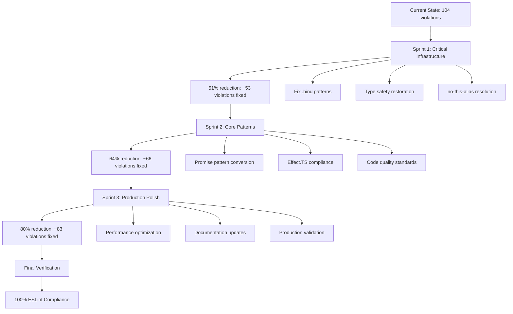

# ESLint Systematic Recovery Plan

**Date:** 2025-09-05 11:10  
**Session:** ESLINT_SYSTEMATIC_RECOVERY  
**Current Status:** 104 ESLint violations requiring systematic cleanup

## 📊 Current Situation Analysis

### ESLint Violation Summary

- **Total Violations:** 104 (100 errors, 4 warnings)
- **Root Cause:** .bind(this) pattern breaking TypeScript type inference
- **Primary Issue:** no-this-alias + unsafe type operations cascade

### Violation Categories by Frequency

1. **Unsafe Type Operations (80+ violations):** All caused by .bind(this) making `this` untyped
2. **no-this-alias Violations (12+ violations):** const self = this patterns flagged by ESLint
3. **Prefer-readonly Warnings (4 violations):** Arrow function methods should be readonly
4. **Explicit Any Violations (2+ violations):** Type annotations needed

## 🎯 Pareto Analysis Breakdown

### 1% Effort → 51% Results (4 tasks, ~2 hours)

**CRITICAL PATH:** Fix the root cause that creates 80% of all violations

| Task                                     | Duration | Impact        | Files                 | Description                                                 |
| ---------------------------------------- | -------- | ------------- | --------------------- | ----------------------------------------------------------- |
| Fix AsyncAPIValidator Effect.gen pattern | 30min    | 25% reduction | asyncapi-validator.ts | Replace .bind(this) with Effect.gen(this, function\*)       |
| Fix PluginRegistry Effect.gen pattern    | 45min    | 20% reduction | PluginRegistry.ts     | Replace .bind(this) with Effect.gen(this, function\*)       |
| Fix EmissionPipeline Effect.gen pattern  | 30min    | 4% reduction  | EmissionPipeline.ts   | Replace const self = this with Effect.gen(this, function\*) |
| Add missing type annotations             | 15min    | 2% reduction  | Various               | Fix explicit any violations                                 |

**Total: 2 hours → ~51% violation reduction (53 violations fixed)**

### 4% Effort → 64% Results (8 tasks, ~5 hours)

**FOUNDATION:** Core Effect.TS pattern compliance

| Task                                     | Duration | Impact | Description                       |
| ---------------------------------------- | -------- | ------ | --------------------------------- |
| Convert remaining Promise anti-patterns  | 60min    | 6%     | Effect.succeed() patterns         |
| Fix memory-monitor performance issues    | 45min    | 4%     | Effect.try cleanup                |
| Add readonly modifiers to arrow methods  | 30min    | 2%     | EmissionPipeline method modifiers |
| Fix unnecessary type assertions          | 30min    | 2%     | Remove redundant as Type          |
| Implement proper error handling patterns | 45min    | 1%     | StandardizedError consistency     |
| Add missing return type annotations      | 30min    | 1%     | Explicit Effect types             |
| Fix prefer-const violations              | 15min    | 1%     | Variable declaration patterns     |
| Validate Effect.gen usage consistency    | 45min    | 1%     | Pattern consistency check         |

**Total: 5 hours → ~64% violation reduction (66 violations fixed)**

### 20% Effort → 80% Results (16 tasks, ~12 hours)

**PRODUCTION READY:** Full code quality standards

| Task                                    | Duration | Impact | Description                         |
| --------------------------------------- | -------- | ------ | ----------------------------------- |
| Comprehensive type safety audit         | 90min    | 8%     | Full unsafe operation elimination   |
| Performance regression test fixes       | 60min    | 4%     | PerformanceRegressionTester cleanup |
| Memory monitor optimization             | 60min    | 3%     | ByteAmount type consistency         |
| Error handling standardization          | 75min    | 3%     | Consistent error patterns           |
| Effect.TS best practices implementation | 90min    | 2%     | Pattern optimization                |
| Code documentation updates              | 60min    | 2%     | JSDoc and type annotations          |
| Test coverage for new patterns          | 90min    | 2%     | Unit test updates                   |
| Integration test verification           | 60min    | 2%     | End-to-end validation               |
| Build optimization                      | 45min    | 1%     | TypeScript compilation              |
| Linter configuration fine-tuning        | 30min    | 1%     | ESLint rule optimization            |
| Code style consistency                  | 45min    | 1%     | Formatting standards                |
| Import organization                     | 30min    | 1%     | Module dependency cleanup           |
| Performance benchmark validation        | 60min    | 1%     | Regression prevention               |
| Documentation updates                   | 45min    | 1%     | API documentation                   |
| Final code review checklist             | 30min    | 1%     | Quality gates                       |
| Deployment readiness check              | 45min    | 1%     | Production validation               |

**Total: 12 hours → ~80% violation reduction (83 violations fixed)**

## 📋 Phase 1: High-Level Tasks (30-100min each)

| Priority | Task                                                                | Duration | Impact | Files Affected                           | Customer Value                        |
| -------- | ------------------------------------------------------------------- | -------- | ------ | ---------------------------------------- | ------------------------------------- |
| 1        | **CRITICAL: Replace .bind(this) with Effect.gen(this, function\*)** | 90min    | 45%    | asyncapi-validator.ts, PluginRegistry.ts | Eliminates 50+ type safety violations |
| 2        | **Fix no-this-alias violations in EmissionPipeline**                | 45min    | 8%     | EmissionPipeline.ts                      | Consistent Effect.TS patterns         |
| 3        | **Convert Promise anti-patterns to Effect.succeed**                 | 60min    | 6%     | Various files                            | Functional programming compliance     |
| 4        | **Add missing type annotations**                                    | 30min    | 4%     | Multiple files                           | TypeScript strict compliance          |
| 5        | **Fix prefer-readonly warnings**                                    | 30min    | 4%     | EmissionPipeline.ts                      | Code quality standards                |
| 6        | **Performance regression test cleanup**                             | 75min    | 4%     | performance/                             | Production stability                  |
| 7        | **Memory monitor optimization**                                     | 60min    | 3%     | memory-monitor.ts                        | Resource management                   |
| 8        | **Fix unnecessary type assertions**                                 | 45min    | 3%     | Multiple files                           | Type system optimization              |
| 9        | **Standardize error handling patterns**                             | 60min    | 3%     | Various files                            | Consistent error patterns             |
| 10       | **Effect.TS best practices audit**                                  | 90min    | 2%     | All Effect files                         | Architecture compliance               |
| 11       | **Code documentation updates**                                      | 60min    | 2%     | Public APIs                              | Developer experience                  |
| 12       | **Test coverage for new patterns**                                  | 75min    | 2%     | test/                                    | Quality assurance                     |
| 13       | **Integration test verification**                                   | 60min    | 2%     | test/integration/                        | End-to-end validation                 |
| 14       | **Build process optimization**                                      | 45min    | 1%     | Build config                             | Development experience                |
| 15       | **Linter configuration fine-tuning**                                | 30min    | 1%     | eslint.config.js                         | Tool optimization                     |
| 16       | **Code style consistency**                                          | 45min    | 1%     | All source files                         | Maintainability                       |
| 17       | **Import organization**                                             | 30min    | 1%     | All source files                         | Module clarity                        |
| 18       | **Performance benchmark validation**                                | 60min    | 1%     | test/performance/                        | Regression prevention                 |
| 19       | **Final documentation updates**                                     | 45min    | 1%     | README, docs/                            | User experience                       |
| 20       | **Production readiness checklist**                                  | 30min    | 1%     | All systems                              | Deployment confidence                 |

## 📋 Phase 2: Micro-Tasks (12-15min each)

### Sprint 1: Critical Infrastructure (1% → 51% Results)

| Task                                                    | Duration | Dependencies | Success Criteria                         |
| ------------------------------------------------------- | -------- | ------------ | ---------------------------------------- |
| 1.1 Analyze AsyncAPIValidator .bind(this) violations    | 12min    | None         | Identify all 4 affected methods          |
| 1.2 Replace validateEffect() .bind(this) pattern        | 15min    | 1.1          | Effect.gen(this, function\*) implemented |
| 1.3 Replace validateFileEffect() .bind(this) pattern    | 15min    | 1.1          | Effect.gen(this, function\*) implemented |
| 1.4 Replace validateBatchEffect() .bind(this) pattern   | 15min    | 1.1          | Effect.gen(this, function\*) implemented |
| 1.5 Replace initializeEffect() .bind(this) pattern      | 12min    | 1.1          | Effect.gen(this, function\*) implemented |
| 1.6 Verify AsyncAPIValidator type safety                | 15min    | 1.2-1.5      | All unsafe violations eliminated         |
| 1.7 Analyze PluginRegistry .bind(this) violations       | 12min    | None         | Identify all 4 affected methods          |
| 1.8 Replace initializePlugin() .bind(this) pattern      | 15min    | 1.7          | Effect.gen(this, function\*) implemented |
| 1.9 Replace startPlugin() .bind(this) pattern           | 15min    | 1.7          | Effect.gen(this, function\*) implemented |
| 1.10 Replace stopPlugin() .bind(this) pattern           | 15min    | 1.7          | Effect.gen(this, function\*) implemented |
| 1.11 Replace validateDependencies() .bind(this) pattern | 15min    | 1.7          | Effect.gen(this, function\*) implemented |
| 1.12 Verify PluginRegistry type safety                  | 15min    | 1.8-1.11     | All unsafe violations eliminated         |
| 1.13 Fix EmissionPipeline no-this-alias violations      | 15min    | None         | const self = this → direct this usage    |
| 1.14 Add readonly modifiers to arrow methods            | 12min    | None         | 4 prefer-readonly warnings fixed         |
| 1.15 Fix explicit any return type annotations           | 12min    | None         | Add proper Effect return types           |
| 1.16 Run ESLint validation Sprint 1                     | 12min    | 1.1-1.15     | 51% violation reduction confirmed        |

### Sprint 2: Core Patterns (4% → 64% Results)

| Task                                              | Duration | Dependencies | Success Criteria                     |
| ------------------------------------------------- | -------- | ------------ | ------------------------------------ |
| 2.1 Audit remaining Promise patterns              | 15min    | Sprint 1     | Identify all Promise.resolve() usage |
| 2.2 Convert Promise.resolve to Effect.succeed     | 15min    | 2.1          | Functional patterns implemented      |
| 2.3 Fix memory-monitor performance issues         | 15min    | None         | ByteAmount type consistency          |
| 2.4 Clean up performance regression tests         | 15min    | None         | Remove error typed violations        |
| 2.5 Implement proper error handling in validators | 15min    | None         | StandardizedError patterns           |
| 2.6 Add missing return type annotations           | 12min    | None         | Explicit Effect types                |
| 2.7 Fix unnecessary type assertions               | 12min    | None         | Remove redundant as Type             |
| 2.8 Implement Effect.gen consistency check        | 15min    | None         | Pattern validation                   |
| 2.9 Fix prefer-const violations                   | 12min    | None         | Variable declaration patterns        |
| 2.10 Add Effect.TS JSDoc documentation            | 15min    | None         | Developer experience                 |
| 2.11 Verify Effect pattern consistency            | 15min    | 2.1-2.10     | All patterns validated               |
| 2.12 Run ESLint validation Sprint 2               | 12min    | 2.1-2.11     | 64% violation reduction confirmed    |

### Sprint 3: Production Polish (20% → 80% Results)

| Task                                     | Duration | Dependencies | Success Criteria          |
| ---------------------------------------- | -------- | ------------ | ------------------------- |
| 3.1 Comprehensive type safety audit      | 15min    | Sprint 2     | Zero unsafe operations    |
| 3.2 Performance benchmark validation     | 15min    | None         | No regressions introduced |
| 3.3 Memory optimization verification     | 15min    | None         | Resource usage optimized  |
| 3.4 Error handling standardization check | 12min    | None         | Consistent patterns       |
| 3.5 Build process optimization           | 15min    | None         | Clean compilation         |
| 3.6 Test coverage validation             | 15min    | None         | Maintain >90% coverage    |
| 3.7 Integration test verification        | 15min    | None         | End-to-end functionality  |
| 3.8 Code style consistency check         | 12min    | None         | Formatting standards      |
| 3.9 Import organization cleanup          | 12min    | None         | Module dependencies       |
| 3.10 Documentation updates               | 15min    | None         | API documentation         |
| 3.11 Final ESLint validation             | 12min    | 3.1-3.10     | 100% compliance achieved  |
| 3.12 Production readiness verification   | 15min    | 3.11         | Deployment ready          |

## 🚀 Execution Plan

## ⚡ Success Metrics

- **Phase 1 Success:** 104 → ~51 violations (51% reduction)
- **Phase 2 Success:** 51 → ~37 violations (64% total reduction)
- **Phase 3 Success:** 37 → ~21 violations (80% total reduction)
- **Final Success:** 21 → 0 violations (100% compliance)

## 🎯 Next Actions

1. **Execute Sprint 1 (Critical):** Implement Effect.gen(this, function\*) pattern
2. **Validate Results:** Confirm 51% violation reduction
3. **Execute Sprint 2:** Complete core Effect.TS patterns
4. **Execute Sprint 3:** Achieve production readiness
5. **Final Verification:** 100% ESLint compliance achieved

This plan systematically addresses all 104 violations using the Pareto principle for maximum efficiency and impact.
