# Comprehensive TypeSpec AsyncAPI Execution Plan
**Session Date:** 2025-09-08 06:33 CEST  
**Target:** Complete Alpha functionality and achieve stable test suite  
**Current Status:** Build ✅, Tests ❓, AssetEmitter ❌, Alpha Features ✅

## 🎯 PARETO ANALYSIS - MAXIMUM IMPACT BREAKDOWN

### **1% → 51% IMPACT: Test Suite Functionality Recovery**
**THE CRITICAL PATH:** Get the test suite running so we can validate everything works
- **Root Cause:** Unknown test infrastructure status post-compilation fixes
- **Impact:** Without working tests, we cannot validate any functionality
- **Customer Value:** Enables confidence in Alpha release quality

### **4% → 64% IMPACT: AssetEmitter File Output Integration** 
**THE CORE FEATURE:** Complete the primary functionality - TypeSpec → AsyncAPI file generation
- **Root Cause:** AssetEmitter integration incomplete - processes in memory but doesn't write files
- **Impact:** Core product functionality - TypeSpec compilation must produce AsyncAPI files
- **Customer Value:** Primary user workflow - TypeSpec → AsyncAPI file generation

### **20% → 80% IMPACT: Complete Alpha Stability**
**THE POLISH:** Ensure everything works reliably for Alpha release
- **Root Cause:** Various quality and usability issues preventing production readiness
- **Impact:** Professional Alpha release with comprehensive validation
- **Customer Value:** Reliable, documented, production-ready tool

## 📊 COMPREHENSIVE EXECUTION PLAN (30 High-Level Tasks)

| Priority | Task | Impact | Effort | Customer Value | Duration |
|----------|------|--------|--------|----------------|----------|
| 1 | **Test Suite Status Assessment** | CRITICAL | LOW | HIGH | 30min |
| 2 | **Critical Test Infrastructure Fixes** | CRITICAL | MEDIUM | HIGH | 60min |
| 3 | **AssetEmitter File Output Integration** | CRITICAL | HIGH | HIGH | 90min |
| 4 | **TypeSpec → AsyncAPI Validation** | CRITICAL | MEDIUM | HIGH | 45min |
| 5 | **Real-World Schema Testing** | HIGH | MEDIUM | HIGH | 60min |
| 6 | **Debug Logging Cleanup** | MEDIUM | LOW | MEDIUM | 30min |
| 7 | **Test Expectation Alpha Alignment** | HIGH | HIGH | MEDIUM | 75min |
| 8 | **Effect.TS Architecture Validation** | MEDIUM | MEDIUM | MEDIUM | 45min |
| 9 | **Performance Monitoring Integration** | MEDIUM | MEDIUM | LOW | 60min |
| 10 | **Memory Management Validation** | LOW | MEDIUM | LOW | 45min |
| 11 | **Plugin System Hot-Reload** | LOW | HIGH | LOW | 90min |
| 12 | **Error Handling Standardization** | MEDIUM | MEDIUM | MEDIUM | 60min |
| 13 | **Documentation Generation** | LOW | MEDIUM | LOW | 75min |
| 14 | **CI/CD Pipeline Validation** | MEDIUM | LOW | MEDIUM | 30min |
| 15 | **Security Validation** | LOW | MEDIUM | MEDIUM | 45min |

## 🔬 MICRO-TASK BREAKDOWN (150 Tasks - 15min Max Each)

### **Phase 1: Critical Path (1% → 51% Impact)**

| Priority | Micro-Task | Impact | Effort | Value | Duration |
|----------|------------|--------|--------|-------|----------|
| 1 | Run `just test` and capture full output | CRITICAL | LOW | HIGH | 3min |
| 2 | Categorize tests: passing/failing/errors | CRITICAL | LOW | HIGH | 5min |
| 3 | Identify import path errors in test files | CRITICAL | LOW | HIGH | 8min |
| 4 | Fix missing Effect module imports | CRITICAL | LOW | HIGH | 10min |
| 5 | Fix missing TypeSpec module imports | CRITICAL | LOW | HIGH | 10min |
| 6 | Fix missing test utility imports | CRITICAL | LOW | HIGH | 12min |
| 7 | Check test helper file compatibility | CRITICAL | MEDIUM | HIGH | 15min |
| 8 | Fix test timeout configurations | HIGH | LOW | HIGH | 8min |
| 9 | Update test runner configurations | HIGH | LOW | MEDIUM | 10min |
| 10 | Verify core emitter tests pass | CRITICAL | MEDIUM | HIGH | 15min |

### **Phase 2: Core Feature (4% → 64% Impact)**

| Priority | Micro-Task | Impact | Effort | Value | Duration |
|----------|------------|--------|--------|-------|----------|
| 11 | Check current AssetEmitter integration status | CRITICAL | LOW | HIGH | 5min |
| 12 | Identify missing sourceFile() triggers | CRITICAL | MEDIUM | HIGH | 15min |
| 13 | Implement proper AssetEmitter file writing | CRITICAL | HIGH | HIGH | 15min |
| 14 | Test AsyncAPI YAML file output | CRITICAL | LOW | HIGH | 8min |
| 15 | Test AsyncAPI JSON file output | CRITICAL | LOW | HIGH | 8min |
| 16 | Validate file paths and naming | HIGH | LOW | HIGH | 10min |
| 17 | Test with complex TypeSpec schemas | HIGH | MEDIUM | HIGH | 15min |
| 18 | Verify file permissions and access | MEDIUM | LOW | MEDIUM | 5min |
| 19 | Test overwrite behavior | MEDIUM | LOW | MEDIUM | 8min |
| 20 | Validate against AsyncAPI official schemas | HIGH | MEDIUM | HIGH | 15min |

### **Phase 3: Alpha Stability (20% → 80% Impact)**

| Priority | Micro-Task | Impact | Effort | Value | Duration |
|----------|------------|--------|--------|-------|----------|
| 21 | Remove excessive Effect.log calls | MEDIUM | LOW | MEDIUM | 8min |
| 22 | Remove debug console.log statements | LOW | LOW | LOW | 5min |
| 23 | Clean up TODO comments | LOW | LOW | LOW | 10min |
| 24 | Update test expectations for Alpha features only | HIGH | MEDIUM | MEDIUM | 12min |
| 25 | Fix assertions expecting Beta/future features | MEDIUM | LOW | MEDIUM | 10min |
| 26 | Verify Effect.TS patterns in emitter core | MEDIUM | LOW | MEDIUM | 8min |
| 27 | Test plugin system integration | MEDIUM | MEDIUM | MEDIUM | 15min |
| 28 | Validate error handling consistency | MEDIUM | MEDIUM | MEDIUM | 12min |
| 29 | Test performance under load | LOW | MEDIUM | LOW | 15min |
| 30 | Memory leak detection testing | LOW | MEDIUM | LOW | 15min |

### **Phase 4: Production Readiness**

| Priority | Micro-Task | Impact | Effort | Value | Duration |
|----------|------------|--------|--------|-------|----------|
| 31-45 | Documentation updates and examples | LOW | LOW | LOW | 5-10min each |
| 46-60 | Additional edge case testing | MEDIUM | LOW | MEDIUM | 8-12min each |
| 61-75 | Performance optimization | LOW | MEDIUM | LOW | 10-15min each |

## 🧠 EXECUTION STRATEGY - MERMAID GRAPH

```mermaid
graph TB
    START[Build Working ✅] --> ASSESS[1min: Test Status Assessment]
    ASSESS --> PHASE1{Phase 1: Test Recovery}
    
    PHASE1 --> |CRITICAL PATH| TEST_INFRA[30min: Fix Test Infrastructure]
    TEST_INFRA --> TEST_PASS{Tests Passing?}
    TEST_PASS --> |YES| PHASE2[Phase 2: AssetEmitter]
    TEST_PASS --> |NO| TEST_DEBUG[15min: Debug Test Failures]
    TEST_DEBUG --> TEST_PASS
    
    PHASE2 --> ASSET_CHECK[5min: Check AssetEmitter Status]
    ASSET_CHECK --> ASSET_IMPL[90min: Complete File Output]
    ASSET_IMPL --> ASSET_TEST[20min: Test File Generation]
    ASSET_TEST --> ASSET_VALID{Files Generated?}
    ASSET_VALID --> |YES| PHASE3[Phase 3: Alpha Polish]
    ASSET_VALID --> |NO| ASSET_DEBUG[30min: Debug AssetEmitter]
    ASSET_DEBUG --> ASSET_VALID
    
    PHASE3 --> CLEANUP[30min: Debug Log Cleanup]
    CLEANUP --> EXPECTATIONS[75min: Test Expectation Alignment]
    EXPECTATIONS --> VALIDATION[45min: Final Validation]
    VALIDATION --> SUCCESS[✅ Alpha Ready]
    
    %% Parallel Execution Groups
    subgraph "Group 1: Test Infrastructure"
        TEST_INFRA
        TEST_DEBUG
    end
    
    subgraph "Group 2: AssetEmitter Core"
        ASSET_IMPL
        ASSET_DEBUG
    end
    
    subgraph "Group 3: Validation & Testing"
        ASSET_TEST
        VALIDATION
    end
    
    subgraph "Group 4: Polish & Cleanup"
        CLEANUP
        EXPECTATIONS
    end
    
    style START fill:#51cf66
    style SUCCESS fill:#51cf66
    style PHASE1 fill:#ff6b6b
    style PHASE2 fill:#74c0fc
    style PHASE3 fill:#ffd43b
```

## 🎯 SUCCESS CRITERIA

### **Phase 1 Success (51% Complete)**
- [ ] Test suite runs without infrastructure errors
- [ ] Core emitter tests passing
- [ ] Import/module issues resolved
- [ ] Test status clearly identified

### **Phase 2 Success (64% Complete)** 
- [ ] AssetEmitter writes AsyncAPI files to disk
- [ ] YAML and JSON formats supported
- [ ] Files validate against AsyncAPI 3.0 schema
- [ ] TypeSpec compilation produces correct output

### **Phase 3 Success (80% Complete)**
- [ ] Clean, production-ready codebase
- [ ] Tests aligned with Alpha feature set
- [ ] Effect.TS patterns consistent
- [ ] Performance acceptable for Alpha

### **Final Success (100% Complete)**
- [ ] All tests passing
- [ ] Documentation complete
- [ ] Alpha release ready
- [ ] Customer value delivered

## 🚀 EXECUTION GROUPS - PARALLEL TASK ASSIGNMENT

**Group 1: Test Infrastructure Recovery** (testing-architecture-expert)
- Fix test infrastructure failures
- Resolve import/module issues
- Validate test runner configuration

**Group 2: AssetEmitter Implementation** (typespec-expert) 
- Complete file output integration
- Implement sourceFile() triggers
- Test TypeSpec compilation pipeline

**Group 3: Quality Assurance** (legacy-eliminator)
- Clean up debug logging
- Remove dead code
- Optimize performance

**Group 4: Alpha Validation** (comprehensive-planner)
- Test expectation alignment
- Real-world scenario validation
- Final integration testing

**Group 5: Documentation & Polish** (documentation-extractor)
- Update documentation
- Create examples
- Prepare Alpha release notes

---

**EXECUTION COMMAND:** Ready to launch all 5 groups simultaneously for maximum efficiency!