# Alpha Completion Execution Plan - TypeSpec AsyncAPI

**Session Date:** 2025-09-09 12:02 CEST  
**Target:** Complete Alpha release with comprehensive test suite and production readiness  
**Current Status:** Core functionality ✅, Tests 242/347 passing, Build ✅ stable

## 🎯 PARETO ANALYSIS - MAXIMUM IMPACT BREAKDOWN

### **1% → 51% IMPACT: Test Suite Systematic Recovery**

**THE CRITICAL PATH:** Fix remaining 105 test failures and 28 errors to achieve comprehensive validation

**Root Analysis:**

- **Current State:** 242 pass, 105 fail, 28 errors (70% pass rate)
- **Target State:** 330+ pass, <20 fail, <5 errors (95%+ pass rate)
- **Impact Reasoning:** Without reliable test suite, cannot ship Alpha with confidence
- **Customer Value:** Enables reliable development workflow and deployment confidence
- **Risk Mitigation:** Test failures may indicate production bugs waiting to surface

**Key Problem Areas:**

1. Import path and module resolution errors
2. Effect.TS service dependency injection issues
3. JSON schema annotation and validation errors
4. Test configuration and timeout issues
5. Async/await pattern mismatches

### **4% → 64% IMPACT: Code Quality & User Experience Polish**

**THE PROFESSIONAL FINISH:** Transform from "working prototype" to "professional product"

**Root Analysis:**

- **Current State:** Functional but rough edges, excessive debug output
- **Target State:** Clean, production-ready code with excellent UX
- **Impact Reasoning:** Professional polish is what separates Alpha from prototype
- **Customer Value:** Smooth user experience with clear error guidance and performance
- **Competitive Advantage:** Professional-grade tool attracts serious adoption

**Key Quality Areas:**

1. Clean up excessive debug logging (Effect.log removal)
2. Implement user-friendly error messages with guidance
3. Remove unused imports and dead code
4. Add comprehensive input validation
5. Performance optimization and memory management

### **20% → 80% IMPACT: Alpha Release Preparation & Documentation**

**THE COMPLETE PACKAGE:** Enable community adoption and real-world usage

**Root Analysis:**

- **Current State:** Working tool without comprehensive documentation
- **Target State:** Fully documented, example-rich, deployment-ready Alpha
- **Impact Reasoning:** Documentation and examples enable user adoption
- **Customer Value:** Users can successfully adopt and integrate the tool
- **Business Value:** Complete Alpha release ready for community feedback

**Key Documentation Areas:**

1. Comprehensive usage documentation and examples
2. API reference and TypeScript interfaces
3. Real-world schema transformation examples
4. Migration guides and troubleshooting
5. Performance tuning and best practices

## 📊 COMPREHENSIVE EXECUTION PLAN (30 High-Level Tasks)

### **Phase 1: Critical Test Recovery (Tasks 1-8)**

| Task | Impact   | Effort | Duration | Description                                          |
| ---- | -------- | ------ | -------- | ---------------------------------------------------- |
| 1    | CRITICAL | MEDIUM | 60min    | Systematic test failure analysis and categorization  |
| 2    | CRITICAL | HIGH   | 90min    | Fix import path and module resolution errors         |
| 3    | CRITICAL | HIGH   | 75min    | Fix Effect.TS service dependency injection issues    |
| 4    | HIGH     | MEDIUM | 60min    | Resolve JSON schema annotation and validation errors |
| 5    | HIGH     | MEDIUM | 45min    | Fix test configuration and timeout issues            |
| 6    | HIGH     | MEDIUM | 60min    | Update test expectations for Alpha behavior          |
| 7    | MEDIUM   | MEDIUM | 45min    | Fix async/await patterns in test assertions          |
| 8    | MEDIUM   | HIGH   | 75min    | Resolve circular dependency issues                   |

### **Phase 2: Quality & UX Polish (Tasks 9-16)**

| Task | Impact | Effort | Duration | Description                                           |
| ---- | ------ | ------ | -------- | ----------------------------------------------------- |
| 9    | HIGH   | LOW    | 30min    | Clean up excessive debug logging (Effect.log removal) |
| 10   | MEDIUM | LOW    | 30min    | Remove unused imports and dead code                   |
| 11   | HIGH   | MEDIUM | 75min    | Implement user-friendly error messages                |
| 12   | HIGH   | MEDIUM | 60min    | Add comprehensive input validation                    |
| 13   | MEDIUM | MEDIUM | 60min    | Performance optimization and memory management        |
| 14   | HIGH   | LOW    | 45min    | Test with complex real-world TypeSpec schemas         |
| 15   | HIGH   | LOW    | 30min    | Validate AsyncAPI specification compliance            |
| 16   | MEDIUM | LOW    | 30min    | Add pre-commit hooks and quality gates                |

### **Phase 3: Documentation & Examples (Tasks 17-24)**

| Task | Impact | Effort | Duration | Description                                    |
| ---- | ------ | ------ | -------- | ---------------------------------------------- |
| 17   | HIGH   | MEDIUM | 90min    | Create comprehensive Alpha usage documentation |
| 18   | HIGH   | MEDIUM | 75min    | Add working examples for all Alpha features    |
| 19   | MEDIUM | MEDIUM | 60min    | Complete API reference documentation           |
| 20   | HIGH   | LOW    | 45min    | Create troubleshooting and migration guides    |
| 21   | MEDIUM | LOW    | 30min    | Document performance tuning best practices     |
| 22   | LOW    | LOW    | 30min    | Add community feedback integration guidelines  |
| 23   | HIGH   | LOW    | 45min    | Alpha release preparation and versioning       |
| 24   | HIGH   | LOW    | 30min    | Final integration testing and sign-off         |

### **Phase 4: Production Readiness (Tasks 25-30)**

| Task | Impact | Effort | Duration | Description                           |
| ---- | ------ | ------ | -------- | ------------------------------------- |
| 25   | MEDIUM | MEDIUM | 45min    | TypeScript strict mode optimization   |
| 26   | LOW    | MEDIUM | 60min    | CI/CD pipeline enhancement            |
| 27   | MEDIUM | MEDIUM | 60min    | Memory leak detection and prevention  |
| 28   | LOW    | MEDIUM | 45min    | Build time optimization               |
| 29   | LOW    | LOW    | 30min    | Dependency audit and security updates |
| 30   | MEDIUM | MEDIUM | 60min    | Production deployment validation      |

## 🔬 MICRO-TASK BREAKDOWN (150 Tasks - 15min Max Each)

### **Phase 1: Critical Test Recovery (Tasks 1-50)**

#### **Test Analysis & Infrastructure (1-15)**

| Task | Micro-Task                                                | Impact   | Duration |
| ---- | --------------------------------------------------------- | -------- | -------- |
| 1    | Run full test suite and capture detailed failure analysis | CRITICAL | 5min     |
| 2    | Categorize test failures by type (import, config, logic)  | CRITICAL | 10min    |
| 3    | Identify top 5 most common failure patterns               | CRITICAL | 8min     |
| 4    | Create failure pattern priority matrix                    | HIGH     | 10min    |
| 5    | Generate test failure report for systematic fixing        | HIGH     | 8min     |
| 6    | Audit test helper import paths                            | HIGH     | 12min    |
| 7    | Check Effect.TS service dependencies in tests             | CRITICAL | 10min    |
| 8    | Validate JSON schema test configurations                  | HIGH     | 10min    |
| 9    | Review async test patterns for Effect.TS compatibility    | HIGH     | 12min    |
| 10   | Check test timeout configurations across all suites       | MEDIUM   | 8min     |
| 11   | Audit test mock setup and teardown procedures             | MEDIUM   | 10min    |
| 12   | Validate test data fixtures and examples                  | MEDIUM   | 8min     |
| 13   | Check test environment variable configurations            | LOW      | 5min     |
| 14   | Review test runner configuration files                    | MEDIUM   | 10min    |
| 15   | Create test infrastructure health checklist               | LOW      | 8min     |

#### **Import & Module Resolution Fixes (16-30)**

| Task | Micro-Task                                               | Impact   | Duration |
| ---- | -------------------------------------------------------- | -------- | -------- |
| 16   | Fix Effect import errors in core test files              | CRITICAL | 15min    |
| 17   | Fix TypeSpec module import path issues                   | CRITICAL | 15min    |
| 18   | Fix missing test helper dependencies                     | CRITICAL | 12min    |
| 19   | Resolve circular import dependencies                     | HIGH     | 15min    |
| 20   | Update deprecated API usages in tests                    | HIGH     | 12min    |
| 21   | Fix relative path imports to absolute paths              | HIGH     | 10min    |
| 22   | Update barrel export files for test utilities            | MEDIUM   | 8min     |
| 23   | Fix TypeScript path mapping in test configurations       | MEDIUM   | 10min    |
| 24   | Resolve ESM vs CommonJS import conflicts                 | HIGH     | 12min    |
| 25   | Fix dynamic import issues in async tests                 | MEDIUM   | 15min    |
| 26   | Update test file extensions for proper module resolution | LOW      | 5min     |
| 27   | Fix import statement ordering and grouping               | LOW      | 8min     |
| 28   | Resolve node_modules vs local module conflicts           | MEDIUM   | 10min    |
| 29   | Update package.json test-related configurations          | LOW      | 8min     |
| 30   | Validate all import paths resolve correctly              | HIGH     | 10min    |

#### **Effect.TS & Service Integration Fixes (31-50)**

| Task | Micro-Task                                        | Impact   | Duration |
| ---- | ------------------------------------------------- | -------- | -------- |
| 31   | Fix service injection issues in test setup        | CRITICAL | 15min    |
| 32   | Update Effect.TS service layer dependencies       | CRITICAL | 15min    |
| 33   | Fix Effect.gen context binding in tests           | HIGH     | 12min    |
| 34   | Resolve Effect.provide layer configuration issues | HIGH     | 15min    |
| 35   | Fix Effect.runSync vs Effect.runPromise usage     | HIGH     | 10min    |
| 36   | Update test assertions for Effect types           | MEDIUM   | 12min    |
| 37   | Fix Effect.succeed/Effect.fail patterns in tests  | MEDIUM   | 10min    |
| 38   | Resolve Effect error handling in test scenarios   | HIGH     | 15min    |
| 39   | Fix Effect logging in test environments           | LOW      | 8min     |
| 40   | Update Effect composition patterns                | MEDIUM   | 12min    |
| 41   | Fix Effect context propagation in nested tests    | HIGH     | 15min    |
| 42   | Resolve Effect performance in test suites         | LOW      | 10min    |
| 43   | Fix Effect cleanup and resource management        | MEDIUM   | 12min    |
| 44   | Update Effect type annotations for tests          | LOW      | 8min     |
| 45   | Fix Effect concurrent execution in tests          | MEDIUM   | 15min    |
| 46   | Resolve Effect interruption handling              | LOW      | 10min    |
| 47   | Fix Effect retry policies in test scenarios       | LOW      | 12min    |
| 48   | Update Effect telemetry configuration for tests   | LOW      | 8min     |
| 49   | Fix Effect structured logging in tests            | LOW      | 10min    |
| 50   | Validate all Effect patterns work correctly       | HIGH     | 15min    |

### **Phase 2: Code Quality & UX Polish (Tasks 51-100)**

#### **Debug Logging Cleanup (51-65)**

| Task | Micro-Task                                    | Impact | Duration |
| ---- | --------------------------------------------- | ------ | -------- |
| 51   | Audit all Effect.log statements for necessity | HIGH   | 10min    |
| 52   | Remove excessive debug logs from emitter core | HIGH   | 8min     |
| 53   | Remove debug logs from processing service     | MEDIUM | 8min     |
| 54   | Clean up console.log statements               | LOW    | 5min     |
| 55   | Remove commented debug code                   | LOW    | 8min     |
| 56   | Standardize remaining log levels              | MEDIUM | 10min    |
| 57   | Add structured logging for important events   | MEDIUM | 12min    |
| 58   | Remove temporary debugging variables          | LOW    | 5min     |
| 59   | Clean up debug timing measurements            | LOW    | 8min     |
| 60   | Remove development-only log statements        | LOW    | 5min     |
| 61   | Update logging configuration for production   | MEDIUM | 10min    |
| 62   | Add conditional logging based on environment  | LOW    | 10min    |
| 63   | Remove verbose operation logging              | LOW    | 8min     |
| 64   | Clean up plugin system debug outputs          | LOW    | 8min     |
| 65   | Validate minimal production logging           | MEDIUM | 8min     |

#### **Error Messages & User Experience (66-80)**

| Task | Micro-Task                                        | Impact | Duration |
| ---- | ------------------------------------------------- | ------ | -------- |
| 66   | Design structured error message format            | HIGH   | 15min    |
| 67   | Implement error codes and categories              | HIGH   | 15min    |
| 68   | Add user-friendly TypeSpec compilation errors     | HIGH   | 15min    |
| 69   | Create helpful AsyncAPI validation error messages | HIGH   | 15min    |
| 70   | Add input validation with clear guidance          | HIGH   | 15min    |
| 71   | Implement progress indicators for long operations | MEDIUM | 10min    |
| 72   | Add context-aware help messages                   | MEDIUM | 12min    |
| 73   | Create error recovery suggestions                 | HIGH   | 15min    |
| 74   | Add validation for common user mistakes           | HIGH   | 12min    |
| 75   | Implement graceful degradation for edge cases     | MEDIUM | 15min    |
| 76   | Add helpful debugging information to errors       | MEDIUM | 10min    |
| 77   | Create user-friendly file path error messages     | LOW    | 8min     |
| 78   | Add configuration validation with guidance        | MEDIUM | 12min    |
| 79   | Implement timeout handling with clear messages    | LOW    | 10min    |
| 80   | Add resource cleanup error handling               | LOW    | 8min     |

#### **Code Cleanup & Performance (81-100)**

| Task | Micro-Task                                    | Impact | Duration |
| ---- | --------------------------------------------- | ------ | -------- |
| 81   | Remove unused import statements               | MEDIUM | 10min    |
| 82   | Clean up commented-out code blocks            | LOW    | 8min     |
| 83   | Remove unused variables and functions         | LOW    | 10min    |
| 84   | Fix circular dependency issues                | HIGH   | 15min    |
| 85   | Optimize memory usage in schema processing    | MEDIUM | 15min    |
| 86   | Add caching for repeated operations           | LOW    | 15min    |
| 87   | Optimize TypeScript compilation performance   | LOW    | 15min    |
| 88   | Remove dead code paths                        | LOW    | 10min    |
| 89   | Consolidate duplicate logic                   | MEDIUM | 12min    |
| 90   | Optimize import statement organization        | LOW    | 8min     |
| 91   | Add performance monitoring points             | LOW    | 15min    |
| 92   | Optimize large file processing                | MEDIUM | 15min    |
| 93   | Add memory usage monitoring                   | LOW    | 12min    |
| 94   | Optimize regex patterns and string operations | LOW    | 10min    |
| 95   | Add lazy loading for heavy operations         | LOW    | 15min    |
| 96   | Optimize Effect composition chains            | LOW    | 12min    |
| 97   | Add resource pooling for expensive operations | LOW    | 15min    |
| 98   | Optimize JSON serialization/deserialization   | LOW    | 10min    |
| 99   | Add performance benchmarks                    | LOW    | 12min    |
| 100  | Validate performance improvements             | MEDIUM | 10min    |

### **Phase 3: Documentation & Examples (Tasks 101-130)**

#### **Core Documentation (101-115)**

| Task | Micro-Task                                   | Impact | Duration |
| ---- | -------------------------------------------- | ------ | -------- |
| 101  | Write comprehensive README with installation | HIGH   | 12min    |
| 102  | Create quick start guide with examples       | HIGH   | 10min    |
| 103  | Add basic TypeSpec → AsyncAPI example        | HIGH   | 8min     |
| 104  | Create complex schema transformation example | HIGH   | 12min    |
| 105  | Add @channel decorator usage examples        | HIGH   | 8min     |
| 106  | Document @publish/@subscribe patterns        | HIGH   | 10min    |
| 107  | Create protocol binding examples             | MEDIUM | 12min    |
| 108  | Add security configuration examples          | MEDIUM | 10min    |
| 109  | Document error handling best practices       | HIGH   | 10min    |
| 110  | Create troubleshooting guide                 | HIGH   | 12min    |
| 111  | Add migration guide from other tools         | LOW    | 10min    |
| 112  | Document plugin development patterns         | LOW    | 15min    |
| 113  | Add performance tuning guidelines            | LOW    | 8min     |
| 114  | Create FAQ section                           | MEDIUM | 10min    |
| 115  | Add community contribution guidelines        | LOW    | 8min     |

#### **API Documentation & Examples (116-130)**

| Task | Micro-Task                                     | Impact | Duration |
| ---- | ---------------------------------------------- | ------ | -------- |
| 116  | Generate TypeScript interface documentation    | MEDIUM | 12min    |
| 117  | Document all public APIs with examples         | MEDIUM | 15min    |
| 118  | Add JSDoc comments to public interfaces        | MEDIUM | 10min    |
| 119  | Create configuration reference guide           | MEDIUM | 12min    |
| 120  | Document CLI options and usage                 | HIGH   | 10min    |
| 121  | Add programmatic API usage examples            | MEDIUM | 12min    |
| 122  | Document environment variable configurations   | LOW    | 8min     |
| 123  | Create integration examples with build tools   | LOW    | 12min    |
| 124  | Add TypeSpec project structure recommendations | MEDIUM | 10min    |
| 125  | Document best practices for large projects     | LOW    | 12min    |
| 126  | Create real-world use case examples            | HIGH   | 15min    |
| 127  | Add testing strategies documentation           | LOW    | 10min    |
| 128  | Document deployment patterns                   | LOW    | 10min    |
| 129  | Create version migration guides                | LOW    | 8min     |
| 130  | Add advanced configuration examples            | LOW    | 10min    |

### **Phase 4: Validation & Production Readiness (Tasks 131-150)**

#### **Testing & Validation (131-140)**

| Task | Micro-Task                                   | Impact | Duration |
| ---- | -------------------------------------------- | ------ | -------- |
| 131  | Test with real-world e-commerce schema       | HIGH   | 12min    |
| 132  | Test with microservices communication schema | HIGH   | 10min    |
| 133  | Test with IoT device messaging schema        | MEDIUM | 10min    |
| 134  | Test with financial trading system schema    | HIGH   | 12min    |
| 135  | Test with content management system schema   | MEDIUM | 10min    |
| 136  | Test with social media platform schema       | MEDIUM | 8min     |
| 137  | Test with healthcare system schema           | HIGH   | 10min    |
| 138  | Test with gaming platform schema             | LOW    | 8min     |
| 139  | Test with logistics tracking schema          | MEDIUM | 10min    |
| 140  | Test with education platform schema          | LOW    | 8min     |

#### **Production Readiness (141-150)**

| Task | Micro-Task                              | Impact | Duration |
| ---- | --------------------------------------- | ------ | -------- |
| 141  | Add pre-commit hooks for code quality   | MEDIUM | 10min    |
| 142  | Configure automated testing pipeline    | LOW    | 15min    |
| 143  | Add dependency vulnerability scanning   | LOW    | 8min     |
| 144  | Configure automatic security updates    | LOW    | 5min     |
| 145  | Add build performance monitoring        | LOW    | 10min    |
| 146  | Configure release automation            | LOW    | 12min    |
| 147  | Add package publishing validation       | HIGH   | 10min    |
| 148  | Create deployment health checks         | MEDIUM | 12min    |
| 149  | Add monitoring and alerting             | LOW    | 15min    |
| 150  | Final end-to-end integration validation | HIGH   | 15min    |

## 🧠 EXECUTION STRATEGY - MERMAID GRAPH

```mermaid
graph TB
    START[Current State: Core Working] --> ANALYSIS[5min: Comprehensive Test Analysis]
    ANALYSIS --> PHASE1{Phase 1: Test Recovery}

    PHASE1 --> |CRITICAL PATH| TEST_INFRA[60min: Fix Import/Module Issues]
    TEST_INFRA --> EFFECT_FIXES[75min: Effect.TS Service Integration]
    EFFECT_FIXES --> JSON_SCHEMA[60min: JSON Schema Validation Fixes]
    JSON_SCHEMA --> TEST_VALIDATION{95% Tests Passing?}

    TEST_VALIDATION --> |YES| PHASE2[Phase 2: Quality Polish]
    TEST_VALIDATION --> |NO| TEST_DEBUG[30min: Debug Remaining Failures]
    TEST_DEBUG --> TEST_VALIDATION

    PHASE2 --> CLEANUP[30min: Debug Logging Cleanup]
    CLEANUP --> UX_POLISH[75min: User Experience Enhancement]
    UX_POLISH --> PERFORMANCE[60min: Performance Optimization]
    PERFORMANCE --> PHASE3[Phase 3: Documentation]

    PHASE3 --> DOCS_CORE[90min: Core Documentation]
    DOCS_CORE --> EXAMPLES[75min: Working Examples]
    EXAMPLES --> API_DOCS[60min: API Reference]
    API_DOCS --> VALIDATION[45min: Real-world Testing]
    VALIDATION --> SUCCESS[✅ Alpha Complete]

    %% Parallel Execution Groups
    subgraph "Group 1: Test Infrastructure"
        TEST_INFRA
        EFFECT_FIXES
        TEST_DEBUG
    end

    subgraph "Group 2: Quality & Performance"
        CLEANUP
        UX_POLISH
        PERFORMANCE
    end

    subgraph "Group 3: Documentation"
        DOCS_CORE
        EXAMPLES
        API_DOCS
    end

    subgraph "Group 4: Validation & Release"
        VALIDATION
        SUCCESS
    end

    style START fill:#51cf66
    style SUCCESS fill:#51cf66
    style PHASE1 fill:#ff6b6b
    style PHASE2 fill:#74c0fc
    style PHASE3 fill:#ffd43b
```

## 🎯 SUCCESS CRITERIA

### **Phase 1 Success (51% Complete)**

- [ ] 330+ tests passing (95%+ pass rate)
- [ ] <20 failing tests remaining
- [ ] <5 error conditions
- [ ] All Effect.TS service integrations working
- [ ] Import/module issues resolved

### **Phase 2 Success (64% Complete)**

- [ ] Clean, production-ready codebase
- [ ] User-friendly error messages with guidance
- [ ] Optimized performance for large schemas
- [ ] Minimal debug output in production
- [ ] Comprehensive input validation

### **Phase 3 Success (80% Complete)**

- [ ] Complete usage documentation
- [ ] Working examples for all Alpha features
- [ ] API reference documentation
- [ ] Real-world schema validation
- [ ] Migration and troubleshooting guides

### **Final Success (100% Complete)**

- [ ] Alpha release package ready
- [ ] Community adoption materials complete
- [ ] Production deployment validated
- [ ] Performance benchmarks established

## 🚀 EXECUTION GROUPS - PARALLEL TASK ASSIGNMENT

**Group 1: Test Infrastructure Recovery** (testing-architecture-expert)

- Systematic test failure analysis and resolution
- Effect.TS service integration fixes
- Import path and module resolution

**Group 2: Code Quality Enhancement** (legacy-eliminator)

- Debug logging cleanup and optimization
- User experience and error message improvement
- Performance optimization and memory management

**Group 3: Documentation Excellence** (documentation-extractor)

- Comprehensive usage guides and examples
- API reference and troubleshooting documentation
- Real-world integration examples

**Group 4: Production Validation** (comprehensive-planner)

- Real-world schema testing and validation
- Quality gates and CI/CD enhancement
- Final Alpha release preparation

---

**EXECUTION COMMAND:** Ready to launch all 4 groups simultaneously for maximum efficiency and complete Alpha delivery!
