# Comprehensive Execution Plan - TypeSpec AsyncAPI Emitter
**Session Date:** 2025-09-20 19:15 CEST  
**Target:** Complete systematic fix of all issues using Pareto principle
**Current Status:** 13 TypeScript errors blocking tests, 15 ESLint issues, architectural inconsistencies

## 🎯 PARETO ANALYSIS - MAXIMUM IMPACT BREAKDOWN

### **1% → 51% IMPACT: Test Infrastructure Systematic Recovery**
**THE CRITICAL PATH:** Fix all 13 TypeScript errors that are completely blocking test execution

**Root Analysis:**
- **Current State:** 13 critical TypeScript errors in test utilities preventing any test execution
- **Target State:** All TypeScript compilation errors resolved, tests can run properly
- **Impact Reasoning:** Without working tests, we cannot verify any changes or ensure quality
- **Customer Value:** Enables development workflow and quality validation
- **Risk Mitigation:** These errors indicate fundamental type safety issues

### **4% → 64% IMPACT: Code Quality & Type Safety Standardization**
**THE PROFESSIONAL FINISH:** Fix all ESLint errors and standardize type definitions

**Root Analysis:**
- **Current State:** 15 ESLint problems (13 errors, 2 warnings) blocking clean code
- **Target State:** Zero ESLint errors, consistent type definitions throughout
- **Impact Reasoning:** Professional code quality enables maintainability and collaboration
- **Customer Value:** Clean, maintainable codebase that follows best practices
- **Competitive Advantage:** Type-safe code prevents runtime errors

### **20% → 80% IMPACT: Production Readiness & Architecture**
**THE COMPLETE PACKAGE:** Transform from working prototype to production-ready system

**Root Analysis:**
- **Current State:** Working but rough edges, not ready for real-world usage
- **Target State:** Production-ready with comprehensive testing and documentation
- **Impact Reasoning:** Professional polish separates prototype from production software
- **Customer Value:** Users can reliably adopt and integrate the tool
- **Business Value:** Ready for community adoption and real-world usage

## 📊 COMPREHENSIVE EXECUTION PLAN (50 High-Level Tasks)

### **Phase 1: Critical Test Recovery (Tasks 1-8)**

| Task | Impact | Effort | Duration | Description |
|------|--------|--------|----------|-------------|
| 1 | CRITICAL | HIGH | 90min | Fix all 13 TypeScript errors in test-helpers.ts |
| 2 | CRITICAL | HIGH | 60min | Resolve bun/test import issues in all test files |
| 3 | CRITICAL | MEDIUM | 45min | Fix vitest configuration module not found |
| 4 | HIGH | HIGH | 75min | Fix SchemaObject properties access errors |
| 5 | HIGH | MEDIUM | 30min | Fix TestWrapperOptions missing emitters property |
| 6 | HIGH | MEDIUM | 45min | Resolve Type to Program assignment errors |
| 7 | HIGH | LOW | 20min | Fix undefined component access errors |
| 8 | MEDIUM | LOW | 15min | Clean up unused variables in test files |

### **Phase 2: Code Quality & Type Safety (Tasks 9-16)**

| Task | Impact | Effort | Duration | Description |
|------|--------|--------|----------|-------------|
| 9 | HIGH | LOW | 30min | Convert interfaces to types in enhanced-amqp-plugin |
| 10 | HIGH | LOW | 30min | Convert interfaces to types in enhanced-protocol-plugin-base |
| 11 | HIGH | MEDIUM | 60min | Replace throw statements with Effect.fail()/Effect.die() |
| 12 | MEDIUM | LOW | 20min | Add readonly properties to class members |
| 13 | MEDIUM | LOW | 15min | Remove unnecessary type assertions |
| 14 | MEDIUM | MEDIUM | 45min | Standardize import organization across all files |
| 15 | MEDIUM | LOW | 20min | Fix ESLint configuration disabled rules |
| 16 | MEDIUM | MEDIUM | 60min | Implement comprehensive input validation |

### **Phase 3: Production Readiness (Tasks 17-25)**

| Task | Impact | Effort | Duration | Description |
|------|--------|--------|----------|-------------|
| 17 | HIGH | HIGH | 90min | Refactor test-helpers.ts into focused modules |
| 18 | HIGH | MEDIUM | 60min | Implement advanced AsyncAPI features (correlationId, headers) |
| 19 | HIGH | MEDIUM | 75min | Create comprehensive real-world examples |
| 20 | MEDIUM | HIGH | 80min | Build CLI tooling for development workflow |
| 21 | MEDIUM | MEDIUM | 60min | Add pre-commit hooks and quality gates |
| 22 | MEDIUM | LOW | 30min | Create API documentation and usage guides |
| 23 | MEDIUM | LOW | 25min | Add security hardening and input sanitization |
| 24 | LOW | MEDIUM | 40min | Implement performance optimization (caching, lazy loading) |
| 25 | LOW | LOW | 20min | Add community contribution guidelines |

## 🔬 MICRO-TASK BREAKDOWN (250 Tasks - 15min Max Each)

### **Phase 1: Critical Test Recovery (Tasks 1-50)**

#### **Test-Helpers TypeScript Errors (1-15)**
| Task | Micro-Task | Impact | Duration |
|------|------------|--------|----------|
| 1 | Fix SchemaObject properties access errors in test-helpers.ts line 1081 | CRITICAL | 15min |
| 2 | Fix SchemaObject properties access errors in test-helpers.ts line 1082 | CRITICAL | 15min |
| 3 | Fix TestWrapperOptions missing emitters property in test-helpers.ts line 117 | CRITICAL | 12min |
| 4 | Fix Type.fs property access errors in test-helpers.ts line 140 | CRITICAL | 12min |
| 5 | Fix Type to Program assignment errors in test-helpers.ts line 162 | CRITICAL | 15min |
| 6 | Fix alphaFallbackDoc.components possibly undefined errors in test-helpers.ts line 316 | CRITICAL | 10min |
| 7 | Fix Object.keys() overload errors in test-helpers.ts line 316 | CRITICAL | 10min |
| 8 | Fix SchemaObject type definition issues in test-helpers.ts | CRITICAL | 15min |
| 9 | Fix TestWrapperOptions interface definition | CRITICAL | 10min |
| 10 | Fix Program type compatibility issues | CRITICAL | 12min |
| 11 | Fix AsyncAPI schema type mismatches | CRITICAL | 15min |
| 12 | Fix type annotations for test helper functions | HIGH | 10min |
| 13 | Fix generic type parameters in test helpers | HIGH | 12min |
| 14 | Fix return type annotations in test helpers | HIGH | 10min |
| 15 | Fix parameter type annotations in test helpers | HIGH | 10min |

#### **Import Path Resolution (16-30)**
| Task | Micro-Task | Impact | Duration |
|------|------------|--------|----------|
| 16 | Fix bun:test import errors in debug-server-decorator.test.ts | CRITICAL | 8min |
| 17 | Fix bun:test import errors in all test files | CRITICAL | 20min |
| 18 | Fix vitest/config module not found in vitest.config.ts | CRITICAL | 10min |
| 19 | Fix relative import paths in unit tests | HIGH | 15min |
| 20 | Fix relative import paths in integration tests | HIGH | 15min |
| 21 | Fix relative import paths in validation tests | HIGH | 15min |
| 22 | Fix relative import paths in documentation tests | HIGH | 12min |
| 23 | Fix relative import paths in e2e tests | HIGH | 12min |
| 24 | Fix relative import paths in utils tests | HIGH | 10min |
| 25 | Fix relative import paths in acceptance tests | HIGH | 10min |
| 26 | Fix relative import paths in breakthrough tests | HIGH | 10min |
| 27 | Fix relative import paths in performance tests | HIGH | 10min |
| 28 | Fix relative import paths in plugins tests | HIGH | 10min |
| 29 | Fix relative import paths in decorators tests | HIGH | 10min |
| 30 | Validate all import paths resolve correctly | HIGH | 15min |

#### **Type Safety Improvements (31-50)**
| Task | Micro-Task | Impact | Duration |
|------|------------|--------|----------|
| 31 | Add proper type definitions for test helper functions | HIGH | 12min |
| 32 | Fix any type usage in test helpers | HIGH | 15min |
| 33 | Fix unknown type usage in test helpers | HIGH | 15min |
| 34 | Add proper interface definitions for test types | HIGH | 12min |
| 35 | Fix type compatibility issues with AsyncAPI schemas | HIGH | 15min |
| 36 | Add proper type annotations for mock objects | MEDIUM | 10min |
| 37 | Fix type mismatches in test assertions | MEDIUM | 10min |
| 38 | Add proper type definitions for test fixtures | MEDIUM | 10min |
| 39 | Fix type compatibility issues with TypeSpec compiler | MEDIUM | 12min |
| 40 | Add proper type definitions for test utilities | MEDIUM | 10min |
| 41 | Fix type compatibility issues with Effect.TS | MEDIUM | 12min |
| 42 | Add proper type definitions for test wrappers | MEDIUM | 10min |
| 43 | Fix type compatibility issues with Bun test | MEDIUM | 10min |
| 44 | Add proper type definitions for test contexts | MEDIUM | 10min |
| 45 | Fix type compatibility issues with AsyncAPI parser | MEDIUM | 12min |
| 46 | Add proper type definitions for test data | MEDIUM | 10min |
| 47 | Fix type compatibility issues with ESLint | MEDIUM | 10min |
| 48 | Add proper type definitions for test configurations | MEDIUM | 10min |
| 49 | Fix type compatibility issues with TypeScript | MEDIUM | 12min |
| 50 | Validate all type definitions are correct | HIGH | 15min |

### **Phase 2: Code Quality & Type Safety (Tasks 51-100)**

#### **ESLint Error Fixes (51-65)**
| Task | Micro-Task | Impact | Duration |
|------|------------|--------|----------|
| 51 | Convert interface to type in enhanced-amqp-plugin.ts line 78 | HIGH | 8min |
| 52 | Convert interface to type in enhanced-amqp-plugin.ts line 89 | HIGH | 8min |
| 53 | Convert interface to type in enhanced-amqp-plugin.ts line 105 | HIGH | 8min |
| 54 | Convert interface to type in enhanced-amqp-plugin.ts line 126 | HIGH | 8min |
| 55 | Convert interface to type in enhanced-amqp-plugin.ts line 140 | HIGH | 8min |
| 56 | Convert interface to type in enhanced-protocol-plugin-base.ts line 22 | HIGH | 8min |
| 57 | Convert interface to type in enhanced-protocol-plugin-base.ts line 29 | HIGH | 8min |
| 58 | Convert interface to type in enhanced-protocol-plugin-base.ts line 49 | HIGH | 8min |
| 59 | Convert interface to type in enhanced-protocol-plugin-base.ts line 58 | HIGH | 8min |
| 60 | Convert interface to type in enhanced-protocol-plugin-base.ts line 310 | HIGH | 8min |
| 61 | Add readonly property to errors member in enhanced-protocol-plugin-base.ts | MEDIUM | 5min |
| 62 | Add readonly property to warnings member in enhanced-protocol-plugin-base.ts | MEDIUM | 5min |
| 63 | Remove unnecessary type assertion in effect-helpers.ts line 627 | MEDIUM | 5min |
| 64 | Replace throw statement with Effect.fail() in effect-helpers.ts line 633 | HIGH | 10min |
| 65 | Replace throw statement with Effect.die() in effect-helpers.ts line 676 | HIGH | 10min |

#### **Effect.TS Pattern Standardization (66-80)**
| Task | Micro-Task | Impact | Duration |
|------|------------|--------|----------|
| 66 | Audit all throw statements in codebase | HIGH | 15min |
| 67 | Replace throw statements with Effect.fail() in core modules | HIGH | 12min |
| 68 | Replace throw statements with Effect.fail() in domain modules | HIGH | 12min |
| 69 | Replace throw statements with Effect.fail() in infrastructure modules | HIGH | 12min |
| 70 | Replace throw statements with Effect.fail() in utils modules | HIGH | 12min |
| 71 | Replace throw statements with Effect.fail() in application modules | HIGH | 12min |
| 72 | Replace throw statements with Effect.die() for unrecoverable errors | HIGH | 10min |
| 73 | Standardize Effect error handling patterns | HIGH | 15min |
| 74 | Add proper error type definitions | HIGH | 12min |
| 75 | Implement branded error types consistently | HIGH | 10min |
| 76 | Add proper error context in Effect.fail() calls | MEDIUM | 10min |
| 77 | Implement proper error recovery patterns | MEDIUM | 12min |
| 78 | Add proper error logging in Effect.fail() calls | MEDIUM | 10min |
| 79 | Validate all Effect patterns are consistent | HIGH | 15min |
| 80 | Test all error handling scenarios | HIGH | 12min |

#### **Import Organization & Code Cleanup (81-100)**
| Task | Micro-Task | Impact | Duration |
|------|------------|--------|----------|
| 81 | Standardize import statement ordering in all files | MEDIUM | 20min |
| 82 | Remove unused imports in all files | MEDIUM | 15min |
| 83 | Add proper import aliases for commonly used modules | MEDIUM | 10min |
| 84 | Fix import path inconsistencies across files | MEDIUM | 15min |
| 85 | Add proper barrel exports for modules | MEDIUM | 12min |
| 86 | Remove commented-out code blocks | LOW | 10min |
| 87 | Remove unused variables in all files | MEDIUM | 10min |
| 88 | Remove unused functions in all files | MEDIUM | 12min |
| 89 | Remove unused types in all files | MEDIUM | 10min |
| 90 | Fix ESLint configuration disabled rules | MEDIUM | 15min |
| 91 | Add proper TypeScript configuration optimizations | MEDIUM | 12min |
| 92 | Add proper ESLint rule configurations | MEDIUM | 12min |
| 93 | Add proper Prettier configuration if needed | LOW | 10min |
| 94 | Add proper editor configuration files | LOW | 10min |
| 95 | Add proper development environment setup | LOW | 15min |
| 96 | Add proper testing environment setup | LOW | 15min |
| 97 | Add proper build environment setup | LOW | 15min |
| 98 | Add proper deployment environment setup | LOW | 15min |
| 99 | Validate all configuration files are correct | MEDIUM | 10min |
| 100 | Validate all code quality standards are met | HIGH | 15min |

### **Phase 3: Production Readiness (Tasks 101-150)**

#### **Test Infrastructure Refactoring (101-115)**
| Task | Micro-Task | Impact | Duration |
|------|------------|--------|----------|
| 101 | Split test-helpers.ts into focused modules | HIGH | 30min |
| 102 | Create test-utils/compilation.ts module | HIGH | 15min |
| 103 | Create test-utils/assertions.ts module | HIGH | 15min |
| 104 | Create test-utils/factories.ts module | HIGH | 15min |
| 105 | Create test-utils/mocks.ts module | HIGH | 15min |
| 106 | Create test-utils/types.ts module | HIGH | 12min |
| 107 | Refactor test helper functions into appropriate modules | HIGH | 30min |
| 108 | Update all test imports to use new modules | HIGH | 20min |
| 109 | Validate all tests still work with new modules | HIGH | 15min |
| 110 | Remove old test-helpers.ts file | HIGH | 5min |
| 111 | Add proper documentation for new test modules | MEDIUM | 15min |
| 112 | Add proper type definitions for new test modules | MEDIUM | 12min |
| 113 | Add proper error handling in new test modules | MEDIUM | 10min |
| 114 | Add proper validation in new test modules | MEDIUM | 10min |
| 115 | Validate all test modules are working correctly | HIGH | 15min |

#### **Advanced AsyncAPI Features (116-130)**
| Task | Micro-Task | Impact | Duration |
|------|------------|--------|----------|
| 116 | Implement @correlationId decorator | HIGH | 20min |
| 117 | Implement @header decorator | HIGH | 20min |
| 118 | Implement @tags decorator | HIGH | 20min |
| 119 | Add proper type definitions for new decorators | HIGH | 12min |
| 120 | Add proper documentation for new decorators | HIGH | 15min |
| 121 | Add proper tests for new decorators | HIGH | 20min |
| 122 | Validate new decorators work with existing code | HIGH | 15min |
| 123 | Add proper error handling for new decorators | MEDIUM | 10min |
| 124 | Add proper validation for new decorators | MEDIUM | 10min |
| 125 | Add proper integration with AsyncAPI specification | HIGH | 15min |
| 126 | Add proper examples for new decorators | MEDIUM | 15min |
| 127 | Add proper migration guide for new decorators | LOW | 10min |
| 128 | Add proper troubleshooting guide for new decorators | LOW | 10min |
| 129 | Validate all new decorators are production-ready | HIGH | 15min |
| 130 | Test all new decorators with real-world schemas | HIGH | 20min |

#### **Documentation & Examples (131-150)**
| Task | Micro-Task | Impact | Duration |
|------|------------|--------|----------|
| 131 | Create comprehensive README with installation | HIGH | 12min |
| 132 | Create quick start guide with examples | HIGH | 10min |
| 133 | Add basic TypeSpec → AsyncAPI example | HIGH | 8min |
| 134 | Create complex schema transformation example | HIGH | 12min |
| 135 | Add @channel decorator usage examples | HIGH | 8min |
| 136 | Document @publish/@subscribe patterns | HIGH | 10min |
| 137 | Create protocol binding examples | MEDIUM | 12min |
| 138 | Add security configuration examples | MEDIUM | 10min |
| 139 | Document error handling best practices | HIGH | 10min |
| 140 | Create troubleshooting guide | HIGH | 12min |
| 141 | Add migration guide from other tools | LOW | 10min |
| 142 | Document plugin development patterns | LOW | 15min |
| 143 | Add performance tuning guidelines | LOW | 8min |
| 144 | Create FAQ section | MEDIUM | 10min |
| 145 | Add community contribution guidelines | LOW | 8min |
| 146 | Generate TypeScript interface documentation | MEDIUM | 12min |
| 147 | Document all public APIs with examples | MEDIUM | 15min |
| 148 | Add JSDoc comments to public interfaces | MEDIUM | 10min |
| 149 | Create configuration reference guide | MEDIUM | 12min |
| 150 | Validate all documentation is complete | HIGH | 15min |

## 🧠 EXECUTION STRATEGY - MERMAID GRAPH

```mermaid
graph TB
    START[Current State: Critical TypeScript Errors] --> ANALYSIS[5min: Comprehensive Error Analysis]
    ANALYSIS --> PHASE1{Phase 1: Critical Test Recovery}
    
    PHASE1 --> |CRITICAL PATH| TYPE_ERRORS[90min: Fix 13 TypeScript Errors]
    TYPE_ERRORS --> IMPORT_FIXES[60min: Import Path Resolution]
    IMPORT_FIXES --> VITEST_FIX[45min: Vitest Configuration]
    VITEST_FIX --> TYPE_SAFETY[75min: Type Safety Improvements]
    TYPE_SAFETY --> TEST_VALIDATION{Tests Working?}
    
    TEST_VALIDATION --> |YES| PHASE2[Phase 2: Code Quality]
    TEST_VALIDATION --> |NO| DEBUG_ERRORS[30min: Debug Remaining Issues]
    DEBUG_ERRORS --> TEST_VALIDATION
    
    PHASE2 --> ESLINT_FIXES[30min: ESLint Error Resolution]
    ESLINT_FIXES --> EFFECT_PATTERNS[60min: Effect.TS Standardization]
    EFFECT_PATTERNS --> CODE_CLEANUP[45min: Code Organization]
    CODE_CLEANUP --> QUALITY_VALIDATION{Code Quality Excellent?}
    
    QUALITY_VALIDATION --> |YES| PHASE3[Phase 3: Production Readiness]
    QUALITY_VALIDATION --> |NO| ADDITIONAL_FIXES[45min: Additional Quality Improvements]
    ADDITIONAL_FIXES --> QUALITY_VALIDATION
    
    PHASE3 --> REFACTOR[90min: Test Infrastructure Refactor]
    REFACTOR --> ADVANCED_FEATURES[60min: Advanced AsyncAPI Features]
    ADVANCED_FEATURES --> DOCUMENTATION[75min: Documentation & Examples]
    DOCUMENTATION --> PRODUCTION_READY{Production Ready?}
    
    PRODUCTION_READY --> |YES| SUCCESS[✅ Complete Success]
    PRODUCTION_READY --> |NO| FINAL_FIXES[60min: Final Production Fixes]
    FINAL_FIXES --> PRODUCTION_READY
    
    %% Parallel Execution Groups
    subgraph "Group 1: Critical Test Recovery"
        TYPE_ERRORS
        IMPORT_FIXES
        VITEST_FIX
        DEBUG_ERRORS
    end
    
    subgraph "Group 2: Code Quality Enhancement"
        ESLINT_FIXES
        EFFECT_PATTERNS
        CODE_CLEANUP
        ADDITIONAL_FIXES
    end
    
    subgraph "Group 3: Production Readiness"
        REFACTOR
        ADVANCED_FEATURES
        DOCUMENTATION
        FINAL_FIXES
    end
    
    subgraph "Group 4: Success Validation"
        SUCCESS
    end
    
    style START fill:#ff6b6b
    style SUCCESS fill:#51cf66
    style PHASE1 fill:#ff6b6b
    style PHASE2 fill:#74c0fc
    style PHASE3 fill:#ffd43b
```

## 🎯 SUCCESS CRITERIA

### **Phase 1 Success (51% Complete)**
- [ ] All 13 TypeScript errors in test-helpers.ts resolved
- [ ] All import path issues resolved
- [ ] Vitest configuration working
- [ ] All type safety improvements implemented
- [ ] Tests can run without TypeScript errors

### **Phase 2 Success (64% Complete)** 
- [ ] All ESLint errors resolved (zero issues)
- [ ] All Effect.TS patterns standardized
- [ ] Code organization and cleanup completed
- [ ] Import organization consistent across files
- [ ] Code quality standards met

### **Phase 3 Success (80% Complete)**
- [ ] Test infrastructure refactored into focused modules
- [ ] Advanced AsyncAPI features implemented
- [ ] Comprehensive documentation and examples created
- [ ] Production readiness validation completed
- [ ] All quality gates passed

### **Final Success (100% Complete)**
- [ ] All 250 micro-tasks completed
- [ ] System is production-ready
- [ ] All documentation complete
- [ ] Performance benchmarks established
- [ ] Community adoption materials ready

## 🚀 EXECUTION GROUPS - PARALLEL TASK ASSIGNMENT

**Group 1: Critical Test Recovery** (testing-architecture-expert)
- Systematic TypeScript error resolution
- Import path and module resolution
- Type safety improvements

**Group 2: Code Quality Enhancement** (legacy-eliminator) 
- ESLint error resolution and code cleanup
- Effect.TS pattern standardization
- Import organization and consistency

**Group 3: Production Readiness** (comprehensive-planner)
- Test infrastructure refactoring
- Advanced AsyncAPI features implementation
- Documentation and examples creation

**Group 4: Success Validation** (quality-assurance)
- Final validation and testing
- Production readiness verification
- Success criteria validation

---

**EXECUTION COMMAND:** Ready to launch all 4 groups simultaneously for maximum efficiency and complete project delivery!