# 🚀 COMPREHENSIVE EXECUTION PLAN

## Date: 2025-10-02T10:22:45 CEST

## Scope: v1.0.0 Production Readiness

## Priority: 80/20 Rule Implementation

---

## 📊 IMPACT-FOCUSED TASK MAPPING

### 🔥 1% DELIVERS 51% (1 Critical Task)

| Priority | Issue | Task                                     | Time   | Impact | Status   |
| -------- | ----- | ---------------------------------------- | ------ | ------ | -------- |
| 1        | #110  | ESLINT Maximum Strictness Implementation | 120min | 51%    | 🟡 READY |

### 🚀 4% DELIVERS 64% (4 High-Impact Tasks)

| Priority | Issue | Task                                         | Time   | Impact | Status   |
| -------- | ----- | -------------------------------------------- | ------ | ------ | -------- |
| 2        | #112  | Effect.TS Binding Crisis Resolution          | 480min | 13%    | 🔴 NEW   |
| 3        | #111  | Apply DocumentBuilder Patterns to Easy Tests | 120min | 7%     | 🟡 READY |
| 4        | #104  | Type Safety Import Optimization              | 60min  | 3%     | 🟡 READY |
| 5        | #111  | Apply Patterns to Decorator Tests            | 120min | 6%     | 🟡 READY |

### ⚡ 20% DELIVERS 80% (16 Strategic Tasks)

| Priority | Issue | Task                                | Time   | Impact | Status   |
| -------- | ----- | ----------------------------------- | ------ | ------ | -------- |
| 6        | #104  | Type Safety Implementation (Part 1) | 180min | 10%    | 🟡 READY |
| 7        | #36   | CI/CD Pipeline Setup                | 120min | 8%     | 🟡 READY |
| 8        | #82   | Extract DocumentBuilder Interface   | 120min | 7%     | 🟡 READY |
| 9        | #54   | Error Type Hierarchy Implementation | 120min | 6%     | 🟡 READY |
| 10       | #81   | JSDoc Documentation (Part 1)        | 180min | 6%     | 🟡 READY |
| 11       | #94   | Real Code Quality Metrics           | 120min | 5%     | 🟡 READY |
| 12       | #34   | Test Coverage Achievement (Part 1)  | 180min | 5%     | 🟡 READY |
| 13       | #44   | AWS SNS Protocol Support            | 180min | 4%     | 🟡 READY |
| 14       | #43   | Google Cloud Pub/Sub Support        | 180min | 4%     | 🟡 READY |
| 15       | #42   | Redis Protocol Support              | 180min | 4%     | 🟡 READY |
| 16       | #103  | Session Insights Documentation      | 120min | 4%     | 🟡 READY |

### 📋 REMAINING TASKS (14 Foundation Tasks)

| Priority | Issue | Task                                    | Time   | Impact | Status   |
| -------- | ----- | --------------------------------------- | ------ | ------ | -------- |
| 17       | #104  | Type Safety Implementation (Part 2)     | 120min | 5%     | 🟡 READY |
| 18       | #59   | Enhanced Emitter Logging                | 120min | 4%     | 🟡 READY |
| 19       | #58   | File System Verification Implementation | 60min  | 3%     | 🟡 READY |
| 20       | #57   | AssetEmitter Documentation              | 120min | 3%     | 🟡 READY |
| 21       | #53   | Magic Numbers Replacement               | 60min  | 3%     | 🟡 READY |
| 22       | #99   | Effect.TS Architecture Review           | 120min | 3%     | 🟡 READY |
| 23       | #79   | Cache TypeSpec AST Implementation       | 210min | 3%     | 🟡 READY |
| 24       | #78   | Multiple Output Files Generation        | 90min  | 2%     | 🟡 READY |
| 25       | #12   | Production Ready v1.0.0 Completion      | 180min | 30%    | 🟡 READY |
| 26       | #1    | TypeSpec.Versioning Support             | 270min | 10%    | 🟡 READY |
| 27       | #34   | Test Coverage Completion                | 120min | 2%     | 🟡 READY |
| 28       | #103  | Documentation Completion                | 120min | 2%     | 🟡 READY |
| 29       | #57   | Documentation Completion                | 120min | 2%     | 🟡 READY |
| 30       | #53   | Constants Implementation Completion     | 60min  | 1%     | 🟡 READY |

---

## 🎯 STRATEGIC EXECUTION APPROACH

### Phase 1: Critical Foundation (Week 1)

- **Tasks 1-5**: Establish maximum code quality and test recovery patterns
- **Impact**: 64% of results with only 5 focused tasks
- **Focus**: Critical blockers and high-impact quick wins

### Phase 2: Core Architecture (Week 2)

- **Tasks 6-16**: Implement core production-ready features
- **Impact**: 80% of results with 11 strategic tasks
- **Focus**: Professional standards and automation

### Phase 3: Production Excellence (Week 3-4)

- **Tasks 17-30**: Complete v1.0.0 production requirements
- **Impact**: Full production readiness with remaining tasks
- **Focus**: Comprehensive feature set and documentation

---

## 📈 EXPECTED OUTCOMES

### Immediate (Week 1)

- **Zero ESLint violations** with maximum strictness
- **Test failure reduction**: 91 → ~70 failures (23% improvement)
- **Type safety foundations**: Import optimization and return types
- **Professional standards**: Enterprise-grade code quality

### Mid-Term (Week 2)

- **CI/CD automation**: GitHub Actions pipeline
- **Architecture clarity**: Extracted interfaces and clean codebase
- **Debugging capability**: Branded error types and logging
- **Documentation**: Comprehensive JSDoc coverage

### Production Ready (Weeks 3-4)

- **80%+ test coverage**: Quality assurance foundation
- **Protocol support**: AWS, Google Cloud, Redis bindings
- **Performance**: Caching and multiple output formats
- **Documentation**: Complete API and architectural docs

---

## 🚨 RISK MITIGATION

### High-Risk Items

1. **Effect.TS Binding Crisis** (#112) - Core architecture blocker
2. **Test Recovery Patterns** - Must establish systematic approach
3. **Type Safety Complexity** - Advanced TypeScript requirements

### Medium-Risk Items

1. **CI/CD Integration** - Infrastructure setup complexity
2. **Protocol Binding Integration** - External service dependencies
3. **Documentation Completeness** - Time-intensive but critical

### Low-Risk Items

1. **Logging Enhancement** - New functionality, existing patterns
2. **Metrics Implementation** - New monitoring, working patterns
3. **Constants Replacement** - Straightforward refactoring

---

## 📊 SUCCESS METRICS

### Quantitative Targets

- **ESLint Violations**: 0 → 0 with maximum strictness
- **Test Failures**: 91 → ≤45 (50% improvement)
- **Type Safety Score**: Current → 90%+ improvement
- **Documentation Coverage**: Current → 90%+ coverage
- **Test Coverage**: Current → 80%+ achievement

### Qualitative Targets

- **Production Readiness**: v1.0.0 with comprehensive testing
- **Code Quality**: Enterprise-grade with zero violations
- **Architecture**: Clean, maintainable, well-documented
- **Team Efficiency**: Clear patterns and automated workflows

---

## ⏰ EXECUTION TIMELINE

### Week 1: Critical Foundation

- **Days 1-2**: ESLint maximum strictness, Effect.TS binding resolution
- **Day 3**: Test recovery patterns application, type safety foundations
- **Day 4-5**: Decorator tests, import optimization
- **Week 1 Target**: 64% of total results achieved

### Week 2: Core Architecture

- **Days 6-7**: Type safety implementation, CI/CD pipeline
- **Day 8-9**: DocumentBuilder interface, error hierarchy
- **Day 10-12**: JSDoc documentation, code quality metrics
- **Week 2 Target**: 80% of total results achieved

### Weeks 3-4: Production Excellence

- **Days 13-16**: Test coverage, protocol bindings, enhanced features
- \*\*Days 17-20: Performance, documentation, final integration
- **Days 21-28**: Production validation, completion criteria
- **Production Target**: 100% of total results achieved

---

## 🎯 EXECUTION PRINCIPLES

### Multi-Task Parallelism

- **Simultaneous Execution**: Multiple related tasks when possible
- **Build Leveraging**: Use build time for code quality and documentation
- **Test Parallelism**: Run test categories simultaneously
- **Documentation**: Create docs during code development, not after

### Quality-First Approach

- **Zero Violation Policy**: Maintain zero ESLint violations throughout
- **Type Safety First**: All changes must improve type safety
- **Test-Driven**: Ensure all functionality has comprehensive testing
- **Documentation**: Code must be self-documenting and maintainable

### Incremental Validation

- **Task Completion**: Each task must be verifiably complete
- **Integration Testing**: Changes must work with existing codebase
- **Regression Prevention**: Zero regressions in existing functionality
- **Quality Gates**: All changes pass automated quality checks

---

## 🔧 EXECUTION STRATEGY

### Rapid Iteration

- **Small, focused tasks**: Maximum 2 hours per task
- **Immediate validation**: Test and validate after each task
- **Continuous Integration**: Commit and push after each task completion
- **Progress Tracking**: Daily status updates and metric validation

### Systematic Approach

- **Pattern Establishment**: Create reusable patterns for common tasks
- **Knowledge Transfer**: Document all solutions and decisions
- **Process Improvement**: Refine approach based on results and learning
- **Quality Assurance**: Maintain high standards throughout execution

### Customer Value Focus

- **Production Readiness**: Every task must advance v1.0.0 readiness
- **User Experience**: Improve developer experience and productivity
- **Maintainability**: Create sustainable, maintainable codebase
- **Professional Standards**: Enterprise-grade quality and reliability

---

## 🚀 IMMEDIATE EXECUTION PLAN

### RIGHT NOW - Task 1: ESLINT Maximum Strictness

**Time**: 120 minutes (2 hours)
**Impact**: 51% of total results
**Priority**: Critical
**Status**: Ready to execute

This comprehensive plan ensures maximum impact with focused execution, delivering 80% of results with the most important tasks while maintaining the highest quality standards.

---

## 📊 EXECUTION FLOW DIAGRAM

```mermaid
graph TD
    A[Start: Clean Git Repository] --> B{80/20 Analysis}
    B --> C[🔥 1%: 51% Results]
    B --> D[🚀 4%: 64% Results]
    B --> E[⚡ 20%: 80% Results]

    C --> C1[Task 1: ESLINT Max Strictness]
    C1 --> C2[Task 2: Enable Rule 1]
    C2 --> C3[Task 3: Enable Rule 2]
    C3 --> C4[Task 4: Enable Rule 3]
    C4 --> C5[Task 5: Fix Violations]
    C5 --> F[✅ Week 1: 64% Complete]

    D --> D1[Task 6: Effect.TS Binding Research]
    D1 --> D2[Task 7: Test 3 Approaches]
    D2 --> D3[Task 8: Apply Solution]
    D3 --> D4[Task 9: Validate 4 Tests]
    D4 --> D5[Task 10: Document Patterns]
    D5 --> D6[Task 11: Apply DocBuilder Patterns]
    D6 --> D7[Task 12: Fix Decorator Tests]
    D7 --> D8[Task 13: Fix TypeSpec Issues]
    D8 --> D9[Task 14: Optimize Imports]
    D9 --> D10[Task 15: Return Types]
    D10 --> D11[Task 16: Constants]
    D11 --> D12[Task 17: Error Types]
    D12 --> D13[Task 18: Type Guards]
    D13 --> G[✅ Week 2: 80% Complete]

    E --> E1[Task 19: CI/CD Pipeline]
    E1 --> E2[Task 20: Build Validation]
    E2 --> E3[Task 21: Test Execution]
    E3 --> E4[Task 22: Security Scanning]
    E4 --> E5[Task 23: Interface Extraction]
    E5 --> E6[Task 26: Refactoring]
    E6 --> E7[Task 27: Usage Updates]
    E7 --> E8[Task 28: Interface Tests]
    E8 --> E9[Task 29: JSDoc Core]
    E9 --> E10[Task 30: JSDoc Utils]
    E10 --> E11[Task 31: JSDoc Validation]
    E11 --> E12[Task 32: JSDoc Examples]
    E12 --> E13[Task 33: Architecture Docs]
    E13 --> E14[Task 34: Lessons Docs]
    E14 --> E15[Task 35: Metrics Collection]
    E15 --> E16[Task 36: Baseline]
    E16 --> E17[Task 37: Dashboard]
    E17 --> E18[Task 38: Reporting]
    E18 --> H[✅ Production Ready]

    F --> I{Continue to Phase 2}
    G --> I

    I --> J[🚀 v1.0.0 PRODUCTION RELEASE]
    H --> J

    style C fill:#ff4444,stroke:#333,color:#fff
    style D fill:#ff8800,stroke:#333,color:#fff
    style E fill:#00cc00,stroke:#333,color:#fff
    style F fill:#ffcccc,stroke:#333,color:#333
    style G fill:#ffcccc,stroke:#333,color:#333
    style H fill:#ffcccc,stroke:#333,color:#333
    style I fill:#ffcccc,stroke:#333,color:#333
    style J fill:#0066cc,stroke:#333,color:#fff
```



---

## 🎯 IMPACT VS EFFORT MATRIX

```mermaid
graph XY
    title Impact vs Effort Analysis
    x-axis Effort [Time in Minutes]
    y-axis Impact [Percentage Results]

    dot {
        [1: ESLINT Max Strictness] 120 51
        [2: Effect.TS Binding] 480 13
        [3: DocBuilder Patterns] 120 7
        [4: Type Safety Imports] 60 3
        [5: Decorator Tests] 120 6
        [6: Import Optimization] 75 2
        [7: Return Types] 75 2
        [8: Constants] 45 2
        [9: Error Types] 45 2
        [10: Type Guards] 45 2
    }

    quadrant-1 [Low Impact, High Effort]
    quadrant-2 [High Impact, High Effort]
    quadrant-3 [High Impact, Low Effort]
    quadrant-4 [Low Impact, Low Effort]

    1-5 --> quadrant-3
    6-10 --> quadrant-4
    [1] --> quadrant-3
```

---

## ⚡ TIMELINE EXECUTION PLAN


