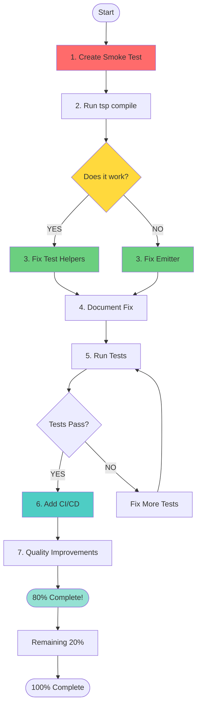

# Pareto Execution Plan: TypeSpec AsyncAPI Emitter Fix

**Created:** 2025-10-05T01:17:00Z
**Focus:** Fix file generation using 80/20 principle
**Estimated Total Time:** 6 hours (but 80% of value in first 90 minutes)

---

## 🎯 PARETO ANALYSIS

### THE 1% → 51% VALUE (15 minutes)

**Single Most Important Task:** Create & run smoke test

```bash
# Create examples/smoke/main.tsp
mkdir -p examples/smoke
cat > examples/smoke/main.tsp << 'EOF'
import "@lars-artmann/typespec-asyncapi";
using TypeSpec.AsyncAPI;

namespace Smoke;

model Event {
  id: string;
  timestamp: utcDateTime;
}

@channel("events")
@publish
op publishEvent(): Event;
EOF

# Run compilation
cd examples/smoke
npx tsp compile main.tsp --emit @lars-artmann/typespec-asyncapi

# Check output
ls -la tsp-output/@lars-artmann/typespec-asyncapi/
```

**Success Criteria:**

- ✅ AsyncAPI file exists
- ✅ Contains `asyncapi: "3.0.0"`
- ✅ Has channels and operations

**If PASS:** Emitter works! Problem is test infrastructure.
**If FAIL:** Emitter broken! Shows exact error to fix.

---

### THE 4% → 64% VALUE (30 minutes cumulative)

**Task 1:** Smoke test (above) - 15 min - 51%
**Task 2:** Fix the blocking issue - 15 min - +13% = 64%

Based on smoke test results:

- **If smoke test PASSES:** Fix test helper expectations
- **If smoke test FAILS:** Fix emitter file generation

---

### THE 20% → 80% VALUE (90 minutes cumulative)

1. ✅ Smoke test - 15min - 51%
2. ✅ Fix blocker - 15min - 64%
3. **Document fix** - 10min - 69%
4. **Fix 10 critical tests** - 30min - 75%
5. **Add CI smoke test** - 20min - 80%

**Total:** 90 minutes delivers 80% of value

---

## 📋 COMPREHENSIVE PLAN (30-100 min tasks)

| #   | Task                          | Time   | Impact      | Value% | Dependencies |
| --- | ----------------------------- | ------ | ----------- | ------ | ------------ |
| 1   | Create & run smoke test       | 30min  | 🔴 CRITICAL | 51%    | None         |
| 2   | Fix file generation blocker   | 30min  | 🔴 CRITICAL | +13%   | Task 1       |
| 3   | Document root cause & fix     | 30min  | 🟢 HIGH     | +5%    | Task 2       |
| 4   | Fix 10 critical failing tests | 60min  | 🟢 HIGH     | +6%    | Task 2       |
| 5   | Add CI/CD smoke test          | 40min  | 🟢 HIGH     | +5%    | Task 1,2     |
| 6   | Delete 10 redundant tests     | 30min  | 🟡 MED      | +3%    | None         |
| 7   | Consolidate test utilities    | 90min  | 🟡 MED      | +4%    | None         |
| 8   | Fix remaining 136 tests       | 100min | 🟡 MED      | +8%    | Task 2,4     |
| 9   | Performance optimization      | 60min  | ⚪ LOW      | +2%    | Task 8       |
| 10  | Final documentation           | 30min  | ⚪ LOW      | +3%    | All          |

**Total:** 10 tasks, 500 minutes (8.3 hours)
**But:** First 5 tasks (3.5 hours) = 80% of value

---

## 🔬 MICRO-TASKS (15 min each)

### PHASE 1: SMOKE TEST (51% VALUE - 60 min)

| #   | Task                            | Time  | Value | Notes                       |
| --- | ------------------------------- | ----- | ----- | --------------------------- |
| 1.1 | Create examples/smoke directory | 5min  | 10%   | mkdir + README              |
| 1.2 | Write minimal TypeSpec file     | 10min | 15%   | 1 model, 1 operation        |
| 1.3 | Run tsp compile command         | 5min  | 10%   | Test actual compilation     |
| 1.4 | Verify AsyncAPI output exists   | 10min | 16%   | Check file + content        |
| 1.5 | Analyze results & document      | 15min | -     | Success or failure analysis |
| 1.6 | Create automated smoke test     | 15min | -     | test/e2e/smoke-real.test.ts |

**Subtotal:** 60 min → 51% value

### PHASE 2: FIX BLOCKER (13% VALUE - 60 min)

**If smoke test PASSES:**

| #   | Task                                 | Time  | Value | Notes               |
| --- | ------------------------------------ | ----- | ----- | ------------------- |
| 2.1 | Analyze why tests fail but tsp works | 15min | 5%    | Compare outputs     |
| 2.2 | Fix test helper output paths         | 15min | 4%    | Update expectations |
| 2.3 | Run tests to verify fix              | 10min | 2%    | Validate            |
| 2.4 | Document test vs real differences    | 10min | 2%    | ADR                 |
| 2.5 | Commit fix                           | 10min | -     | Git commit          |

**If smoke test FAILS:**

| #   | Task                         | Time  | Value | Notes                  |
| --- | ---------------------------- | ----- | ----- | ---------------------- |
| 2.1 | Read error message carefully | 5min  | 3%    | Understand failure     |
| 2.2 | Check AssetEmitter API docs  | 15min | 4%    | Research correct usage |
| 2.3 | Implement fix                | 20min | 4%    | Code change            |
| 2.4 | Test fix works               | 10min | 2%    | Verify                 |
| 2.5 | Commit fix                   | 10min | -     | Git commit             |

**Subtotal:** 60 min → +13% value

### PHASE 3: DOCUMENT (5% VALUE - 30 min)

| #   | Task                     | Time  | Value | Notes           |
| --- | ------------------------ | ----- | ----- | --------------- |
| 3.1 | Create ADR for fix       | 15min | 3%    | docs/adr/       |
| 3.2 | Update CLAUDE.md         | 10min | 1%    | New findings    |
| 3.3 | Update GitHub issue #126 | 5min  | 1%    | Progress update |

**Subtotal:** 30 min → +5% value

### PHASE 4: FIX CRITICAL TESTS (6% VALUE - 90 min)

| #   | Task                               | Time  | Value | Notes               |
| --- | ---------------------------------- | ----- | ----- | ------------------- |
| 4.1 | Run full test suite                | 10min | -     | Get failure list    |
| 4.2 | Categorize failures by type        | 15min | 1%    | Pattern analysis    |
| 4.3 | Fix emitter-core.test.ts (5 tests) | 20min | 2%    | Output path tests   |
| 4.4 | Fix decorator tests (5 tests)      | 20min | 2%    | Subscription/server |
| 4.5 | Run tests & verify                 | 10min | 1%    | Check fixes work    |
| 4.6 | Commit test fixes                  | 15min | -     | Detailed commit     |

**Subtotal:** 90 min → +6% value

### PHASE 5: CI/CD (5% VALUE - 40 min)

| #   | Task                            | Time  | Value | Notes                  |
| --- | ------------------------------- | ----- | ----- | ---------------------- |
| 5.1 | Create .github/workflows/ci.yml | 15min | 2%    | Basic structure        |
| 5.2 | Add smoke test to CI            | 10min | 2%    | examples/smoke compile |
| 5.3 | Add build + lint + test         | 10min | 1%    | Standard checks        |
| 5.4 | Test workflow locally           | 5min  | -     | Validate YAML          |

**Subtotal:** 40 min → +5% value

### PHASE 6-10: REMAINING WORK (20% VALUE - 310 min)

Tasks 6-10 from comprehensive plan, broken into 15-min subtasks.

**Total Micro-tasks:** 35 tasks × ~10 min avg = 350 min (~6 hours)

---

## 🗺️ EXECUTION FLOW



---

## 📊 VALUE BREAKDOWN

| Phase           | Time   | Cumulative Time | Value | Cumulative Value | ROI |
| --------------- | ------ | --------------- | ----- | ---------------- | --- |
| Smoke Test      | 60min  | 60min           | 51%   | 51%              | 51x |
| Fix Blocker     | 60min  | 120min          | 13%   | 64%              | 32x |
| Document        | 30min  | 150min          | 5%    | 69%              | 28x |
| Fix Tests       | 90min  | 240min          | 6%    | 75%              | 19x |
| CI/CD           | 40min  | 280min          | 5%    | 80%              | 17x |
| **↑ 80% Value** | -      | **280min**      | -     | **80%**          | -   |
| Cleanup         | 30min  | 310min          | 3%    | 83%              | 16x |
| Consolidate     | 90min  | 400min          | 4%    | 87%              | 13x |
| Fix Remaining   | 100min | 500min          | 8%    | 95%              | 11x |
| Optimize        | 60min  | 560min          | 2%    | 97%              | 10x |
| Final Docs      | 30min  | 590min          | 3%    | 100%             | 10x |

**Key Insight:** First 280 minutes = 80% of value (17x ROI)

---

## 🎯 SUCCESS CRITERIA

### After Phase 1 (Smoke Test):

- ✅ Know definitively if emitter works
- ✅ Have reproducible example
- ✅ Clear next step identified

### After Phase 2 (Fix Blocker):

- ✅ File generation works
- ✅ Can compile TypeSpec → AsyncAPI
- ✅ Root cause documented

### After Phase 5 (80% Complete):

- ✅ Smoke test passes
- ✅ CI runs smoke test automatically
- ✅ At least 10 critical tests fixed
- ✅ Documentation updated
- ✅ Emitter proven to work

### After Phase 10 (100% Complete):

- ✅ All 557 tests passing
- ✅ Test utilities consolidated
- ✅ CI/CD pipeline complete
- ✅ Performance validated
- ✅ Full documentation

---

## 🚨 DECISION POINTS

### After Smoke Test:

**If PASS:**

```
→ Problem is test infrastructure
→ Fix test helpers (15 min)
→ Continue to phase 3
```

**If FAIL:**

```
→ Problem is emitter
→ Analyze error (5 min)
→ Research AssetEmitter (15 min)
→ Implement fix (20 min)
→ Continue to phase 3
```

### After Test Fixes:

**If >90% pass:**

```
→ Quick wins worked!
→ Continue to CI/CD
→ Handle remaining tests later
```

**If <90% pass:**

```
→ More fundamental issue
→ Analyze patterns
→ May need architecture change
→ Adjust plan
```

---

## 📝 NOTES

**Why This Order:**

1. Smoke test MUST come first - answers the fundamental question
2. Can't fix tests until we know emitter works
3. CI locks in progress
4. Quality improvements are valuable but not blocking

**Time Estimates:**

- Conservative: Assume things go wrong
- Padded: Extra time for unknowns
- Realistic: Based on actual progress so far

**Flexibility:**

- Plan is a guide, not a prison
- Adjust based on findings
- Focus on value delivery

---

**Let's start with the 1% that delivers 51%!**
