# Complete Execution Plan - TypeSpec AsyncAPI Production Readiness

**Date:** 2025-10-05 05:07  
**Status:** Emitter works perfectly, test infrastructure needs fixes  
**Goal:** Make emitter production-ready and fix all tests

---

## 🎯 PARETO BREAKDOWN

### THE 1% → 51% VALUE (20 minutes)
**Task:** Update README.md + Create Quick Start Guide

**Why this matters most:**
- Announces to users that emitter is production-ready
- Provides immediate value to anyone wanting to use it
- Unblocks all potential users
- Shows the work is done

**What to do:**
- Update README with "Production Ready" badge
- Add quick start section with installation
- Show basic usage example
- Link to smoke test as proof

**Deliverable:** Users can start using the emitter immediately

---

### THE 4% → 64% VALUE (80 minutes cumulative)

1. **✅ README Update (20min)** → 51% value
2. **Remove Alpha Fallback Logic (15min)** → 58% value (+7%)
   - Delete fake data generation in test-helpers.ts (lines 227-693)
   - Tests will fail honestly instead of passing with fake data
   - Cleans up 466 lines of misleading code
   
3. **Fix Options Passing (45min)** → 64% value (+6%)
   - Research TypeSpec createTestWrapper API
   - Make emitter options flow through to program
   - Tests can verify different output formats

---

### THE 20% → 80% VALUE (255 minutes cumulative = 4.25 hours)

1. **✅ README (20min)** → 51%
2. **✅ Remove Alpha Fallback (15min)** → 58%
3. **✅ Fix Options Passing (45min)** → 64%
4. **Fix 10 Critical Unit Tests (60min)** → 70% (+6%)
   - Update path expectations for real FS
   - Fix output format tests
   - Fix schema generation tests
5. **Add CI Integration (30min)** → 75% (+5%)
   - Add integration test to GitHub Actions
   - Ensure smoke test runs in CI
6. **Split test-helpers.ts (45min)** → 80% (+5%)
   - Create TestCompilation.ts
   - Create TestValidation.ts
   - Create TestSources.ts
   - Create TestFixtures.ts
   - Improves maintainability

---

## 📋 COMPREHENSIVE TASK LIST (30-100min tasks)

| # | Task | Time | Impact | Value% | Priority |
|---|------|------|--------|--------|----------|
| 1 | ✅ Git push commits | 2min | Critical | 0% | P0 |
| 2 | **Update README.md** | 20min | HIGHEST | 51% | **P0** |
| 3 | **Remove Alpha fallback logic** | 15min | High | 58% | **P0** |
| 4 | **Fix options passing in tests** | 45min | High | 64% | **P0** |
| 5 | Fix 10 critical unit tests | 60min | High | 70% | P1 |
| 6 | Add integration test to CI | 30min | High | 75% | P1 |
| 7 | Split test-helpers.ts into 4 files | 45min | Medium | 80% | P1 |
| 8 | Fix ESLint warnings: no-explicit-any | 60min | Medium | 83% | P2 |
| 9 | Fix ESLint warnings: prefer-nullish-coalescing | 45min | Medium | 85% | P2 |
| 10 | Fix ESLint warnings: explicit-function-return-type | 60min | Medium | 87% | P2 |
| 11 | Add branded types (FilePath, DocumentId) | 45min | Medium | 89% | P2 |
| 12 | Improve error messages | 30min | Medium | 90% | P2 |
| 13 | Add JSDoc to public APIs | 60min | Low | 91% | P3 |
| 14 | Optimize test performance (cache test host) | 45min | Low | 92% | P3 |
| 15 | Create migration guide | 60min | Low | 93% | P3 |
| 16 | Implement @correlationId decorator | 90min | Low | 94% | P3 |
| 17 | Implement @header decorator | 60min | Low | 95% | P3 |
| 18 | Implement @tags decorator | 45min | Low | 96% | P3 |
| 19 | Add message examples support | 60min | Low | 97% | P3 |
| 20 | Create advanced examples | 90min | Low | 98% | P3 |
| 21 | Performance profiling | 60min | Low | 99% | P3 |
| 22 | Security audit | 45min | Low | 99.5% | P3 |
| 23 | Accessibility review | 30min | Low | 100% | P3 |

**Total estimated time:** ~17 hours  
**Time to 80% value:** ~4.25 hours

---

## 🔬 MICRO-TASK BREAKDOWN (15min tasks)

### **Phase 1: THE 1% (51% Value) - 20 minutes**

| # | Task | Time | Details |
|---|------|------|---------|
| 1.1 | Read current README.md | 3min | Understand current state |
| 1.2 | Draft README updates | 7min | Production ready badge, status, quick start |
| 1.3 | Add installation instructions | 3min | bun add command |
| 1.4 | Add basic usage example | 5min | Copy from smoke test |
| 1.5 | Commit README changes | 2min | git commit with message |

### **Phase 2: THE 4% (58% Value) - 15 minutes**

| # | Task | Time | Details |
|---|------|------|---------|
| 2.1 | Identify Alpha fallback code | 3min | Lines 227-693, 514-520, 575-693 |
| 2.2 | Delete createAlphaFallbackDocument function | 5min | Remove 118 lines |
| 2.3 | Delete extractSchemaNameFromTest function | 2min | Remove 11 lines |
| 2.4 | Remove fallback calls in parseAsyncAPIOutput | 3min | 3 locations |
| 2.5 | Run tests to verify honest failures | 2min | bun test --bail 3 |

### **Phase 3: THE 4% (64% Value) - 45 minutes**

| # | Task | Time | Details |
|---|------|------|---------|
| 3.1 | Research createTestWrapper API | 10min | Check TypeSpec docs/source |
| 3.2 | Try Program.compilerOptions override | 8min | Direct injection |
| 3.3 | Try emitterContext approach | 8min | Alternative API |
| 3.4 | Try passing via compile options | 8min | compileAndDiagnose params |
| 3.5 | Test solution with 3 test cases | 8min | Verify options flow through |
| 3.6 | Commit working solution | 3min | git commit |

### **Phase 4: THE 20% (70% Value) - 60 minutes**

| # | Task | Time | Details |
|---|------|------|---------|
| 4.1 | Fix output format test (JSON) | 8min | test/unit/emitter-core.test.ts:105 |
| 4.2 | Fix output format test (YAML) | 8min | test/unit/emitter-core.test.ts:118 |
| 4.3 | Fix default format test | 7min | test/unit/emitter-core.test.ts:134 |
| 4.4 | Fix default filename test | 7min | test/unit/emitter-core.test.ts:146 |
| 4.5 | Fix required fields test | 10min | test/unit/emitter-core.test.ts:208 |
| 4.6 | Fix union types test | 8min | test/unit/emitter-core.test.ts:245 |
| 4.7 | Fix datetime test | 8min | test/unit/emitter-core.test.ts:271 |
| 4.8 | Run full test suite | 2min | bun test |
| 4.9 | Verify test count improved | 2min | Check pass/fail ratio |

### **Phase 5: THE 20% (75% Value) - 30 minutes**

| # | Task | Time | Details |
|---|------|------|---------|
| 5.1 | Read .github/workflows/ structure | 5min | Understand CI setup |
| 5.2 | Add integration test to workflow | 10min | Add test command |
| 5.3 | Add smoke test to workflow | 8min | Compile smoke example |
| 5.4 | Test locally with act (if available) | 5min | Verify workflow |
| 5.5 | Commit CI changes | 2min | git commit |

### **Phase 6: THE 20% (80% Value) - 45 minutes**

| # | Task | Time | Details |
|---|------|------|---------|
| 6.1 | Create test/utils/TestCompilation.ts | 12min | Move compilation helpers |
| 6.2 | Create test/utils/TestValidation.ts | 10min | Move assertion utilities |
| 6.3 | Create test/utils/TestSources.ts | 8min | Move test TypeSpec sources |
| 6.4 | Create test/utils/TestFixtures.ts | 8min | Move mock data |
| 6.5 | Update imports in test files | 5min | Fix all import statements |
| 6.6 | Verify tests still run | 2min | bun test |

### **Phase 7: Code Quality (83% Value) - 60 minutes**

| # | Task | Time | Details |
|---|------|------|---------|
| 7.1 | Fix no-explicit-any (batch 1: 10 files) | 15min | Replace any with proper types |
| 7.2 | Fix no-explicit-any (batch 2: 10 files) | 15min | Replace any with proper types |
| 7.3 | Fix no-explicit-any (batch 3: 5 files) | 15min | Replace any with proper types |
| 7.4 | Run eslint to verify | 5min | Check warning count |
| 7.5 | Commit ESLint fixes | 5min | git commit |
| 7.6 | Run tests to ensure no breaks | 5min | bun test |

### **Phase 8: More Code Quality (85% Value) - 45 minutes**

| # | Task | Time | Details |
|---|------|------|---------|
| 8.1 | Fix prefer-nullish-coalescing (batch 1) | 15min | Replace || with ?? |
| 8.2 | Fix prefer-nullish-coalescing (batch 2) | 15min | Replace || with ?? |
| 8.3 | Fix prefer-nullish-coalescing (batch 3) | 10min | Replace || with ?? |
| 8.4 | Verify with eslint | 3min | Check warnings |
| 8.5 | Commit changes | 2min | git commit |

### **Phase 9: Type Safety (87% Value) - 60 minutes**

| # | Task | Time | Details |
|---|------|------|---------|
| 9.1 | Add explicit return types (batch 1: 15 functions) | 20min | Add : ReturnType |
| 9.2 | Add explicit return types (batch 2: 15 functions) | 20min | Add : ReturnType |
| 9.3 | Verify with eslint | 5min | Check warnings |
| 9.4 | Run tests | 10min | Ensure no breaks |
| 9.5 | Commit changes | 5min | git commit |

### **Phase 10: Architecture Improvements (89% Value) - 45 minutes**

| # | Task | Time | Details |
|---|------|------|---------|
| 10.1 | Create branded type: FilePath | 10min | Brand string type |
| 10.2 | Create branded type: DocumentId | 10min | Brand string type |
| 10.3 | Create branded type: ChannelName | 8min | Brand string type |
| 10.4 | Create branded type: OperationId | 8min | Brand string type |
| 10.5 | Update usages | 7min | Replace string with branded |
| 10.6 | Commit changes | 2min | git commit |

**Total micro-tasks:** 65 tasks  
**Total estimated time:** ~9.5 hours  
**Time to 80% value:** ~4.25 hours

---

## 📊 EXECUTION GRAPH

```mermaid
graph TD
    Start([START]) --> Push[1. Git Push<br/>2min]
    Push --> Phase1[PHASE 1: README<br/>20min - 51% value]
    
    Phase1 --> P1_1[1.1 Read README<br/>3min]
    P1_1 --> P1_2[1.2 Draft updates<br/>7min]
    P1_2 --> P1_3[1.3 Add install<br/>3min]
    P1_3 --> P1_4[1.4 Add usage<br/>5min]
    P1_4 --> P1_5[1.5 Commit<br/>2min]
    
    P1_5 --> Phase2[PHASE 2: Remove Alpha Fallback<br/>15min - 58% value]
    
    Phase2 --> P2_1[2.1 Identify code<br/>3min]
    P2_1 --> P2_2[2.2 Delete fallback fn<br/>5min]
    P2_2 --> P2_3[2.3 Delete extract fn<br/>2min]
    P2_3 --> P2_4[2.4 Remove calls<br/>3min]
    P2_4 --> P2_5[2.5 Test<br/>2min]
    
    P2_5 --> Phase3[PHASE 3: Fix Options<br/>45min - 64% value]
    
    Phase3 --> P3_1[3.1 Research API<br/>10min]
    P3_1 --> P3_2[3.2 Try override<br/>8min]
    P3_2 --> P3_3[3.3 Try context<br/>8min]
    P3_3 --> P3_4[3.4 Try compile opts<br/>8min]
    P3_4 --> P3_5[3.5 Test solution<br/>8min]
    P3_5 --> P3_6[3.6 Commit<br/>3min]
    
    P3_6 --> Checkpoint1{64% Value<br/>Achieved}
    
    Checkpoint1 --> Phase4[PHASE 4: Fix 10 Tests<br/>60min - 70% value]
    Phase4 --> Phase5[PHASE 5: CI Integration<br/>30min - 75% value]
    Phase5 --> Phase6[PHASE 6: Split Helpers<br/>45min - 80% value]
    
    Phase6 --> Checkpoint2{80% Value<br/>Achieved}
    
    Checkpoint2 --> Phase7[PHASE 7: ESLint any<br/>60min - 83%]
    Phase7 --> Phase8[PHASE 8: ESLint nullish<br/>45min - 85%]
    Phase8 --> Phase9[PHASE 9: Return types<br/>60min - 87%]
    Phase9 --> Phase10[PHASE 10: Branded types<br/>45min - 89%]
    
    Phase10 --> Complete([COMPLETE<br/>~9.5 hours total<br/>80% in 4.25 hours])
    
    style Phase1 fill:#90EE90
    style Phase2 fill:#90EE90
    style Phase3 fill:#90EE90
    style Phase4 fill:#FFD700
    style Phase5 fill:#FFD700
    style Phase6 fill:#FFD700
    style Checkpoint1 fill:#FF6B6B,stroke:#333,stroke-width:4px
    style Checkpoint2 fill:#4ECDC4,stroke:#333,stroke-width:4px
    style Complete fill:#95E1D3,stroke:#333,stroke-width:4px
```

---

## 🎯 SUCCESS CRITERIA

### Phase 1-3 (1% → 4% → First 64%)
- ✅ README shows "Production Ready"
- ✅ Quick start guide exists
- ✅ No Alpha fallback code remains
- ✅ Test options pass through correctly
- ✅ Tests can verify different output formats

### Phase 4-6 (Reach 80%)
- ✅ At least 90% tests passing (currently 74%)
- ✅ Integration test runs in CI
- ✅ Smoke test runs in CI
- ✅ test-helpers.ts split into 4 organized files

### Phase 7-10 (Quality & Architecture)
- ✅ ESLint warnings < 50 (currently 105)
- ✅ All public functions have return types
- ✅ Branded types for IDs and paths
- ✅ Code maintainability improved

---

## 📝 NOTES

**Critical Path:** Phases 1-3 are MUST DO (1% → 4% value)  
**High Value:** Phases 4-6 complete the 20% → 80%  
**Nice to Have:** Phases 7-10 are quality improvements

**Risk Mitigation:**
- Each phase is independently committable
- Can stop at any checkpoint with value delivered
- Tests verify each change doesn't break build

**Verification Strategy:**
- Run `bun run build` after each phase
- Run `bun test` to verify no regressions
- Git commit after each completed phase

---

**Created:** 2025-10-05 05:07  
**Author:** Claude Code  
**Status:** Ready for execution
