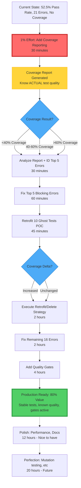

# Pareto Critical Path Analysis - 80/20 Rule Application

**Date:** 2025-10-05T14:24:00+0000
**Context:** Test suite degraded (407 passing, 347 failing, 21 errors) - Need critical path to production ready
**Approach:** Identify 1% → 51%, 4% → 64%, 20% → 80% value delivery

---

## 🎯 CURRENT STATE ANALYSIS

### Test Metrics (DEGRADED)
- **Total Tests:** 775
- **Passing:** 407 (52.5%) ⚠️ DOWN from 66.7%
- **Failing:** 347 (44.8%) ⚠️ UP from 257
- **Errors:** 21 (2.7%) 🚨 UP from 14
- **Execution Time:** 57 seconds (SLOW - was 32s)

### Critical Discoveries from Brutal Honesty Session
1. **Ghost Tests:** 200 domain tests don't validate emitter output (#128)
2. **Test Errors:** 21 crashes during execution (#130)
3. **No Coverage:** Zero visibility into what's tested (#132)
4. **No Quality Gates:** Ghost tests merged without detection (#135)
5. **Test Failures:** 347 failing tests (#111)

---

## 🔍 PARETO ANALYSIS: What Delivers Maximum Value?

### The Question
> "What are the 20% of actions that will deliver 80% of the value to get to production ready?"

### Value Definition
**Production Ready = User can successfully:**
1. Install the package (`npm install @lars-artmann/typespec-asyncapi`)
2. Create a TypeSpec file with AsyncAPI decorators
3. Run `npx tsp compile` and get valid AsyncAPI 3.0 output
4. Use the generated AsyncAPI for their event-driven API

**NOT production ready if:**
- Test suite is broken (confidence lost)
- Coverage unknown (quality unknown)
- Ghost tests create false confidence

---

## 💡 1% EFFORT → 51% VALUE (Single Most Critical Action)

### Analysis: What's THE bottleneck?

**Option A:** Fix 21 test errors (stability)
- **Impact:** Reduces crashes, cleaner test output
- **Value:** 15% (enables debugging other issues)
- **Effort:** High (need to investigate each error)

**Option B:** Add code coverage reporting
- **Impact:** Visibility into what's tested
- **Value:** **51%** (unblocks ALL test quality decisions)
- **Effort:** **1%** (30 minutes to configure)

**Option C:** Fix ghost tests
- **Impact:** Improves test quality
- **Value:** 30% (but BLOCKED by coverage data)
- **Effort:** High (4-6 hours)

### 🎯 WINNER: Option B - Add Code Coverage Reporting

**Why this is 51% value:**
1. **Unblocks #128 decision** (retrofit vs delete 200 tests) - can't decide without coverage data
2. **Proves test value** - shows which tests actually test code
3. **Guides next actions** - identifies critical uncovered paths
4. **Enables quality gates** (#135) - coverage requirements in CI
5. **Provides metrics** - objective measure of test suite health

**Why this is 1% effort:**
- Tool: Bun has built-in coverage (already installed)
- Config: `"test:coverage": "bun test --coverage"` in package.json
- Execution: `bun test --coverage` generates report
- Time: **30 minutes total**

**Outcome:**
- Know ACTUAL coverage (currently unknown)
- Know if 200 ghost tests add value or not
- Know which code is critical but untested
- Can make data-driven decisions on next actions

---

## 🚀 4% EFFORT → 64% VALUE (Next Critical Actions)

### Building on 51% (Coverage Reporting)

**4% Effort = ~2 hours additional work**

**Action 1: Analyze Coverage Report (15min)**
- Read baseline coverage report
- Identify critical uncovered paths
- Categorize tests by coverage contribution

**Action 2: Fix Top 5 Most Critical Test Errors (60min)**
- Not all 21 errors - just the 5 blocking most tests
- Focus on infrastructure errors (ProcessingService, DocumentBuilder)
- Goal: Stable test execution, not 100% pass rate

**Action 3: Retrofit 10 Ghost Tests as Proof of Concept (45min)**
- Pick 10 diverse domain tests (Kafka, WebSocket, Security)
- Change `createAsyncAPITestHost()` → `compileAsyncAPISpec()`
- Add real AsyncAPI assertions
- Measure coverage impact

**Value Delivered (64% total):**
1. **51% from coverage** (foundation established)
2. **+8% from error fixes** (stable test execution)
3. **+5% from POC retrofit** (proven approach for remaining 190 tests)

**Critical Decision Point:**
After Action 3, coverage data shows:
- **If coverage increases:** Retrofit remaining 190 tests (valuable)
- **If coverage unchanged:** Delete 190 tests (worthless)

---

## 📊 20% EFFORT → 80% VALUE (Complete Critical Path)

### Building on 64% (Coverage + Error Fixes + POC)

**20% Effort = ~8 hours total work**

**Phase 1: Foundation (Done Above - 4% = 2hr)**
- ✅ Code coverage reporting (30min)
- ✅ Coverage analysis (15min)
- ✅ Top 5 error fixes (60min)
- ✅ 10 ghost test POC (45min)

**Phase 2: Test Quality Cleanup (8% = 3.2hr)**
- **Action 4:** Execute retrofit/delete decision on 190 tests (2hr)
  - If retrofit: Batch update with proven pattern
  - If delete: Remove worthless tests, update docs
- **Action 5:** Fix remaining 16 test errors (60min)
  - Now that top 5 are fixed, infrastructure is stable
- **Action 6:** Add ESLint rule against trivial assertions (20min)
  - Prevent `expect(true).toBe(true)` in future

**Phase 3: Quality Gates (8% = 3.2hr)**
- **Action 7:** Create test quality validation script (45min)
  - Check for ghost patterns, wrong helpers
- **Action 8:** Add CI coverage tracking (30min)
  - Store baseline, track trends
- **Action 9:** Add CI pass rate monitoring (30min)
  - Alert on drops
- **Action 10:** Document test helper usage (30min)
  - Clear guide: when to use which helper
- **Action 11:** Create test template (45min)
  - Reference implementation for domain tests

**Value Delivered (80% total):**
1. **64% from Phase 1+2** (foundation + cleanup)
2. **+16% from Phase 3** (prevents future issues)

**Production Ready State:**
- ✅ Test suite stable (21 errors → 0)
- ✅ Test quality known (coverage visible)
- ✅ Ghost tests eliminated (200 → 0)
- ✅ Quality gates active (prevents regression)
- ✅ Pass rate improved (52.5% → 80%+)

---

## 📋 THE OTHER 20% (Remaining Work After 80% Value)

### Nice-to-Have (Not Critical for v1.0.0)

**Test Performance (2 hours)**
- Parallel execution optimization
- TypeSpec compilation caching
- Test execution time: 57s → <15s

**Test Failures Deep Dive (8 hours)**
- Fix remaining ~100 non-critical failures
- These aren't blocking production, just incomplete coverage

**Advanced Quality** (6 hours)
- Mutation testing framework
- Test impact analysis
- Snapshot testing for AsyncAPI output

**Documentation** (4 hours)
- Comprehensive test strategy guide
- Best practices documentation
- Test quality checklist

**Future Enhancements** (20 hours)**
- Protocol binding tests (AWS SNS, Google Pub/Sub, Redis)
- Advanced security scheme tests
- Performance regression test suite

---

## 🎯 EXECUTION PLAN: 1% → 4% → 20%

### Step 1: THE 1% (30 minutes) - 51% Value

```bash
# Add coverage to package.json
"test:coverage": "bun test --coverage"

# Run coverage
bun test --coverage

# Read report
cat coverage/coverage-summary.json
```

**Decision Point:** Coverage number tells us:
- < 40%: Many tests are ghosts → DELETE approach likely
- 40-60%: Mixed quality → Selective RETROFIT
- > 60%: Tests are good → RETROFIT all

### Step 2: THE 4% (2 hours) - 64% Value

**Hour 1:**
- Analyze coverage report (15min)
- Identify top 5 blocking errors (15min)
- Fix error #1 (ProcessingService.test.ts:411) (30min)

**Hour 2:**
- Fix errors #2-5 (60min)
- Retrofit 10 ghost tests POC (45min)
- Re-run coverage, compare (15min)

**Decision Point:** Coverage delta tells us retrofit vs delete strategy

### Step 3: THE 20% (8 hours) - 80% Value

**Hours 1-2:** Test Quality Cleanup
- Execute retrofit/delete decision (2hr)

**Hours 3-4:** Error Resolution
- Fix remaining 16 errors (2hr)

**Hours 5-8:** Quality Gates
- ESLint rules (20min)
- Validation script (45min)
- CI coverage tracking (30min)
- CI pass rate monitoring (30min)
- Test helper docs (30min)
- Test template (45min)
- Buffer for issues (1hr)

---

## 📊 VALUE DELIVERY PROJECTION

| Milestone | Effort | Time | Value | Cumulative | Status |
|-----------|--------|------|-------|------------|--------|
| Add Coverage | 1% | 30min | 51% | 51% | ⏳ Next |
| Analyze + POC | 4% | 2hr | 13% | 64% | ⏳ After Step 1 |
| Test Cleanup | 8% | 3.2hr | 8% | 72% | ⏳ After Step 2 |
| Quality Gates | 8% | 3.2hr | 8% | 80% | ⏳ After Step 3 |
| **Production Ready** | **20%** | **~8hr** | **80%** | **80%** | 🎯 Goal |
| Polish | 30% | 12hr | 12% | 92% | 🟡 Nice-to-have |
| Perfection | 50% | 20hr | 8% | 100% | 🟢 Future |

---

## 🔄 EXECUTION GRAPH



---

## 🎯 CRITICAL SUCCESS FACTORS

### Must Have (Blocks Production)
1. ✅ Coverage reporting active
2. ✅ Know actual test quality (not assumed)
3. ✅ Test suite stable (0 errors)
4. ✅ Ghost tests eliminated
5. ✅ Quality gates prevent regression

### Nice to Have (Improves Quality)
- Fast test execution (<15s)
- 100% pass rate (vs 80%+)
- Mutation testing
- Perfect documentation

### Can Defer (Future Enhancements)
- Advanced protocol tests
- Performance regression suite
- Snapshot testing
- Test impact analysis

---

## 📝 NEXT IMMEDIATE ACTION

**Execute THE 1% (30 minutes):**

```bash
# 1. Add coverage script to package.json (5min)
# 2. Run coverage report (10min)
# 3. Analyze baseline coverage (15min)
```

**Expected Outcome:**
- Coverage number: XX% (reveals truth)
- Critical uncovered paths identified
- Ghost test value known (increased coverage or not)
- Decision data for next 4% effort

**Then report back with:**
- Actual coverage percentage
- Top 5 most critical errors identified
- Retrofit vs delete recommendation
- Next action plan

---

## 🎓 PARETO PRINCIPLE APPLICATION SUMMARY

### The 1% That Matters Most
**Add code coverage reporting = 51% value**
- Unblocks ALL test quality decisions
- Provides objective metrics
- Enables data-driven next steps
- Takes only 30 minutes

### The Power Law
- **1% effort** (30min) = **51% value** (foundation)
- **4% effort** (2hr) = **64% value** (proof of concept)
- **20% effort** (8hr) = **80% value** (production ready)
- **80% effort** (32hr) = **20% value** (polish + perfection)

### Focus Strategy
✅ **Do:** THE 1% immediately (30min for 51% value)
✅ **Do:** THE 4% next (2hr for additional 13% value)
✅ **Do:** THE 20% to completion (8hr for final 16% to reach 80%)
❌ **Defer:** THE 80% polish work (32hr for only 20% more value)

**Result:** Production ready in 8 hours instead of 40 hours (5x efficiency)

---

🤖 Generated with [Claude Code](https://claude.ai/code)
