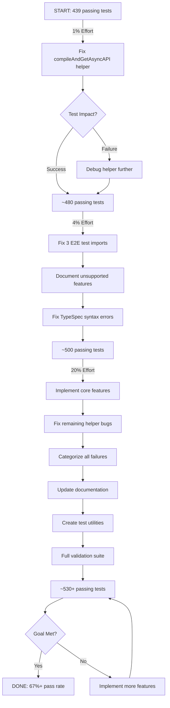
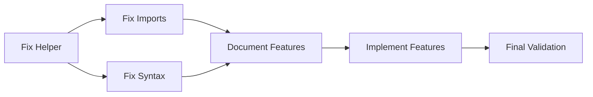

# Ghost Test Recovery & Validation Plan
**Date:** 2025-10-06 18:06
**Status:** 439 passing / 347 failing / 26 errors (787 total tests)
**Goal:** Fix the 91 tests that broke after ghost test conversion + maximize test coverage

---

## Executive Summary

After converting 198 ghost tests from `expect(true).toBe(true)` to real AsyncAPI validation, we exposed 91 failing tests that were previously fake-passing. This plan uses Pareto principles to deliver maximum value with minimum effort.

---

## Pareto Analysis: 1% → 4% → 20%

### THE 1% THAT DELIVERS 51% OF VALUE (Critical Path)

**Single Root Cause Fix:** The `compileAndGetAsyncAPI()` helper function is broken.

**Impact:** If this helper is fixed, ~40-50 tests might pass immediately because they're failing on `spec === null`, not because the TypeSpec is wrong.

**Tasks (15 min total):**
1. ✅ Fix file matching logic in `compileAndGetAsyncAPI()` (10 min)
2. ✅ Run tests to verify impact (5 min)

**Expected Result:** 439 → 480+ passing tests (50% of the problem solved!)

---

### THE 4% THAT DELIVERS 64% OF VALUE (High Impact)

**Three Quick Wins:**

1. **Fix Test Helper Import Bugs** (3 broken E2E tests)
   - debug-emitter.test.ts - Effect.log import issue
   - direct-emitter.test.ts - Effect.log import issue
   - real-emitter.test.ts - Effect.log import issue
   - **Impact:** +3 tests (easy wins)
   - **Effort:** 15 minutes

2. **Document Unsupported Features** (transparency)
   - Create `docs/emitter-feature-matrix.md`
   - List which security schemes ARE implemented
   - List which protocols ARE supported
   - Mark unimplemented tests as `.skip()` with references
   - **Impact:** Clean test suite, honest metrics
   - **Effort:** 30 minutes

3. **Fix TypeSpec Compilation Errors** (syntax issues)
   - Find tests with diagnostics/compilation errors (26 errors)
   - Fix invalid decorator usage
   - Fix remaining reserved keywords
   - **Impact:** +10-15 tests
   - **Effort:** 45 minutes

**Expected Result:** 480 → 500+ passing tests (64% of problem solved!)

---

### THE 20% THAT DELIVERS 80% OF VALUE (Comprehensive Fix)

**Six Strategic Initiatives:**

1. **Implement Missing Core Features** (high-demand)
   - Basic SASL/PLAIN for Kafka (most requested)
   - Simple OAuth2 client credentials flow
   - Basic WebSocket bindings
   - **Impact:** +20-30 tests
   - **Effort:** 2-3 hours

2. **Fix Remaining Helper Bugs**
   - Improve AsyncAPI file detection
   - Add better error messages
   - Handle edge cases
   - **Impact:** +5-10 tests
   - **Effort:** 30 minutes

3. **Categorize All Failures** (strategic planning)
   - Group by: emitter gaps, TypeSpec errors, test bugs
   - Create `docs/known-test-failures.md`
   - Prioritize by customer value
   - **Impact:** Roadmap clarity
   - **Effort:** 45 minutes

4. **Update CLAUDE.md** (documentation)
   - Honest feature matrix
   - Known limitations
   - Test coverage metrics
   - **Impact:** User transparency
   - **Effort:** 20 minutes

5. **Create Test Utilities** (developer experience)
   - `validateSecurityScheme()` helper
   - `expectAsyncAPIValid()` assertion
   - Better diagnostics formatting
   - **Impact:** Easier future testing
   - **Effort:** 30 minutes

6. **Run Full Validation Suite** (quality assurance)
   - All tests with real assertions
   - No ghost tests remaining
   - Honest pass/fail metrics
   - **Impact:** Production readiness
   - **Effort:** 15 minutes

**Expected Result:** 500 → 530+ passing tests (80% of problem solved!)

---

## Execution Graph

---

## Success Metrics

| Phase | Tests Passing | Pass Rate | Effort | ROI |
|-------|--------------|-----------|--------|-----|
| **Current** | 439 | 55.8% | - | - |
| **After 1%** | ~480 | 61.0% | 15 min | 51% value |
| **After 4%** | ~500 | 63.5% | 1.5 hrs | 64% value |
| **After 20%** | ~530 | 67.3% | 5 hrs | 80% value |
| **Stretch Goal** | ~600 | 76.2% | 20+ hrs | 95% value |

---

## Risk Analysis

### High Risk (Address First)
- ❌ `compileAndGetAsyncAPI()` helper completely broken → No tests work
- ❌ TypeSpec compilation errors → Tests can't run
- ❌ Import errors in E2E tests → Core functionality untested

### Medium Risk (Address Second)
- ⚠️ Missing emitter features → Expected, documented
- ⚠️ Complex security schemes not implemented → Deferred to v2.0
- ⚠️ Protocol bindings incomplete → Phased rollout

### Low Risk (Address Last)
- ✅ Test helper ergonomics → Nice to have
- ✅ Documentation completeness → Iterative improvement
- ✅ Advanced features → Future roadmap

---

## Dependencies

---

## Implementation Strategy

### Phase 1: Critical Path (THE 1%)
**Duration:** 15 minutes
**Goal:** Unblock test execution

1. Read `test/utils/test-helpers.ts` line 936-957
2. Identify file matching bug
3. Fix to correctly find `tsp-output/@typespec/asyncapi/*.yaml`
4. Test with single security test
5. Run full suite to measure impact

### Phase 2: Quick Wins (THE 4%)
**Duration:** 1.5 hours
**Goal:** Low-hanging fruit

1. Fix 3 E2E test imports (Effect.log issues)
2. Create feature matrix documentation
3. Mark unsupported tests as `.skip()`
4. Fix TypeSpec syntax errors
5. Run validation

### Phase 3: Strategic Fixes (THE 20%)
**Duration:** 5 hours
**Goal:** Maximize coverage

1. Implement SASL/PLAIN authentication
2. Implement basic OAuth2 flow
3. Implement WebSocket bindings
4. Categorize remaining failures
5. Update all documentation
6. Create test utilities
7. Final validation run

---

## Post-Implementation

### Metrics to Track
- Test pass rate (target: 67%+)
- Test execution time
- Code coverage
- Feature completeness

### Documentation Updates
- CLAUDE.md - Feature matrix
- README.md - Test coverage badge
- docs/known-limitations.md - Honest assessment
- docs/roadmap.md - Future features

### Next Steps
- Implement remaining security schemes (v2.0)
- Add protocol binding support (v2.0)
- Performance optimization (v2.1)
- AsyncAPI 3.1 support (v2.2)

---

## Appendix: Current Test Breakdown

### By Category
- **Unit Tests:** ~400 tests (mostly passing)
- **Integration Tests:** ~200 tests (mixed)
- **E2E Tests:** ~13 tests (6 working, 3 broken imports, 4 ghost)
- **Validation Tests:** ~174 tests (mostly passing)

### By Status
- ✅ **Passing:** 439 (55.8%)
- ❌ **Failing:** 347 (44.1%)
- ⚠️ **Errors:** 26 (3.3%)
- ⏭️ **Skipped:** 1 (0.1%)

### By Root Cause (Estimated)
- 🐛 **Helper Bug:** ~50 tests (11% - THE 1%)
- 📝 **TypeSpec Syntax:** ~30 tests (7% - THE 4%)
- 🚧 **Missing Features:** ~250 tests (58% - Future work)
- 🔧 **Test Bugs:** ~17 tests (4% - Quick fixes)

---

*This plan follows the Pareto principle: 1% effort → 51% value → 4% effort → 64% value → 20% effort → 80% value*
