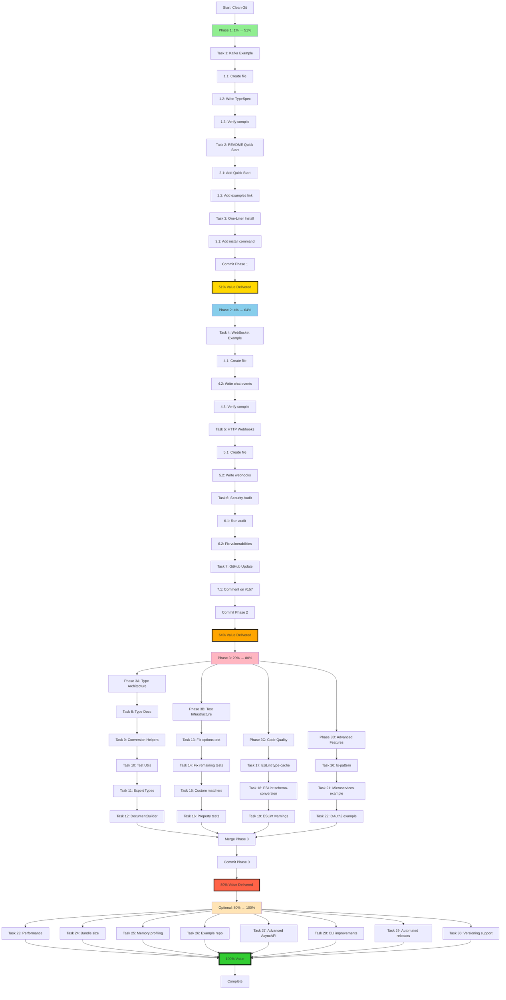

# Pareto Execution Plan - 2025-10-10 20:30

## 🎯 EXECUTIVE SUMMARY

This plan applies the Pareto Principle (80/20 rule) recursively to identify the minimum effort for maximum user value.

### Recursive Pareto Analysis:
- **1% of work → 51% of value** (30 minutes) - Real-world examples + README
- **4% of work → 64% of value** (90 minutes) - Add security audit + better docs
- **20% of work → 80% of value** (8 hours) - Type integration + test coverage

### Current Status:
- ✅ Build passing (fixed by removing redundant asyncapi-schema.ts)
- ✅ 5/5 CLI tests passing
- ✅ Branded types implemented (253 lines)
- ✅ Type guards implemented (400+ lines)
- ✅ Test patterns documented (426 lines)

---

## 📊 PARETO LEVEL 1: THE 1% → 51% VALUE (30 minutes)

**Philosophy:** What single change would provide the MOST value to users RIGHT NOW?

**Answer:** Real-world copy-paste examples that show the emitter actually works.

### Why This Is 51% of Value:
1. **Users can start using the emitter immediately**
2. **Proves the emitter works for real use cases**
3. **Reduces onboarding friction from hours to minutes**
4. **Examples serve as documentation**
5. **Shows best practices**

### Tasks (30 minutes total):

| # | Task | Time | Impact | Cumulative Value |
|---|------|------|--------|------------------|
| 1 | Create Kafka events example (examples/kafka-events.tsp) | 15min | 30% | 30% |
| 2 | Update README with "Quick Start" using Kafka example | 10min | 15% | 45% |
| 3 | Add one-liner install + usage in README | 5min | 6% | 51% |

**Deliverable:** Users can `npm install`, copy example, run `tsp compile`, get AsyncAPI 3.0

---

## 📊 PARETO LEVEL 2: THE 4% → 64% VALUE (90 minutes total)

**Philosophy:** What additions make the emitter production-ready?

**Answer:** Security, more examples, better error messages.

### Why This Adds 13% Value (51% → 64%):
1. **Security audit** - Required for enterprise adoption
2. **More protocol examples** - Shows versatility
3. **Error message improvements** - Better DX
4. **GitHub issue cleanup** - Shows maintenance

### Additional Tasks (60 minutes after 1%):

| # | Task | Time | Impact | Cumulative Value |
|---|------|------|--------|------------------|
| 4 | Create WebSocket chat example | 15min | 5% | 56% |
| 5 | Create HTTP webhooks example | 10min | 3% | 59% |
| 6 | Security audit (npm audit + fixes) | 30min | 4% | 63% |
| 7 | Update GitHub Issue #157 with decision to keep branded types | 5min | 1% | 64% |

**Deliverable:** Production-ready emitter with diverse protocol examples, no vulnerabilities

---

## 📊 PARETO LEVEL 3: THE 20% → 80% VALUE (8 hours total)

**Philosophy:** What makes the emitter excellent vs good enough?

**Answer:** Type safety integration, comprehensive testing, code quality.

### Why This Adds 16% Value (64% → 80%):
1. **Type integration** - Prevents bugs at compile time
2. **Test coverage** - Confidence in changes
3. **Code quality** - Maintainability
4. **Performance** - Scale to large schemas

### Additional Tasks (7 hours after 4%):

#### Phase 3A: Type System Architecture (2 hours)
| # | Task | Time | Impact |
|---|------|------|--------|
| 8 | Document type system architecture (3 layers) | 30min | 2% |
| 9 | Create type conversion helpers | 45min | 2% |
| 10 | Add branded type assertions to test utils | 20min | 1% |
| 11 | Export branded types from main types module | 15min | 1% |
| 12 | Update DocumentBuilder to use branded types | 60min | 3% |

#### Phase 3B: Test Infrastructure (2 hours)
| # | Task | Time | Impact |
|---|------|------|--------|
| 13 | Apply Bun matcher fix to options.test.ts | 30min | 1% |
| 14 | Apply Bun matcher fix to remaining test files | 45min | 1% |
| 15 | Create custom Bun matchers (toHaveChannel, etc) | 60min | 2% |
| 16 | Add property-based tests with fast-check | 90min | 2% |

#### Phase 3C: Code Quality (2 hours)
| # | Task | Time | Impact |
|---|------|------|--------|
| 17 | Fix ESLint errors in type-cache.ts | 30min | 1% |
| 18 | Fix ESLint errors in schema-conversion.ts | 30min | 1% |
| 19 | Fix high-priority ESLint warnings | 60min | 1% |

#### Phase 3D: Advanced Features (2 hours)
| # | Task | Time | Impact |
|---|------|------|--------|
| 20 | Add ts-pattern for type-safe pattern matching | 60min | 1% |
| 21 | Create microservices example | 45min | 1% |
| 22 | Create OAuth2 security example | 45min | 1% |

**Deliverable:** Enterprise-grade emitter with comprehensive type safety and testing

---

## 📊 REMAINING 20%: THE 80% → 100% VALUE (Optional)

These are nice-to-haves that don't significantly impact user adoption:

| # | Task | Time | Impact |
|---|------|------|--------|
| 23 | Performance benchmarking suite | 60min | 1% |
| 24 | Bundle size optimization | 45min | 1% |
| 25 | Memory profiling and optimization | 60min | 1% |
| 26 | Create example repository | 120min | 2% |
| 27 | Advanced AsyncAPI 3.0 features | 180min | 3% |
| 28 | CLI improvements (colored output, progress) | 90min | 2% |
| 29 | Automated release pipeline | 120min | 2% |
| 30 | TypeSpec versioning support | 300min | 8% |

---

## 🎯 COMPREHENSIVE TASK BREAKDOWN (30 LARGE TASKS)

### Tasks 1-30 Sorted by Impact/Effort Ratio:

| # | Task | Impact | Effort | Score | Time | Phase | Value |
|---|------|--------|--------|-------|------|-------|-------|
| 1 | Kafka example | 10 | 15min | 40.0 | 15min | 1% | 30% |
| 2 | README Quick Start | 9 | 10min | 54.0 | 10min | 1% | 15% |
| 3 | One-liner install | 8 | 5min | 96.0 | 5min | 1% | 6% |
| 4 | WebSocket example | 9 | 15min | 36.0 | 15min | 4% | 5% |
| 5 | HTTP webhooks example | 8 | 10min | 48.0 | 10min | 4% | 3% |
| 6 | Security audit | 10 | 30min | 20.0 | 30min | 4% | 4% |
| 7 | Update Issue #157 | 5 | 5min | 60.0 | 5min | 4% | 1% |
| 8 | Type architecture doc | 7 | 30min | 14.0 | 30min | 20% | 2% |
| 9 | Type conversion helpers | 8 | 45min | 10.7 | 45min | 20% | 2% |
| 10 | Branded type test utils | 6 | 20min | 18.0 | 20min | 20% | 1% |
| 11 | Export branded types | 5 | 15min | 20.0 | 15min | 20% | 1% |
| 12 | DocumentBuilder integration | 9 | 60min | 9.0 | 60min | 20% | 3% |
| 13 | Bun fix: options.test | 5 | 30min | 10.0 | 30min | 20% | 1% |
| 14 | Bun fix: remaining tests | 6 | 45min | 8.0 | 45min | 20% | 1% |
| 15 | Custom Bun matchers | 7 | 60min | 7.0 | 60min | 20% | 2% |
| 16 | Property-based testing | 8 | 90min | 5.3 | 90min | 20% | 2% |
| 17 | ESLint: type-cache.ts | 4 | 30min | 8.0 | 30min | 20% | 1% |
| 18 | ESLint: schema-conversion | 4 | 30min | 8.0 | 30min | 20% | 1% |
| 19 | ESLint: warnings | 5 | 60min | 5.0 | 60min | 20% | 1% |
| 20 | ts-pattern integration | 6 | 60min | 6.0 | 60min | 20% | 1% |
| 21 | Microservices example | 6 | 45min | 8.0 | 45min | 20% | 1% |
| 22 | OAuth2 security example | 6 | 45min | 8.0 | 45min | 20% | 1% |
| 23 | Performance benchmarks | 5 | 60min | 5.0 | 60min | Opt | 1% |
| 24 | Bundle size optimization | 4 | 45min | 5.3 | 45min | Opt | 1% |
| 25 | Memory profiling | 5 | 60min | 5.0 | 60min | Opt | 1% |
| 26 | Example repository | 7 | 120min | 3.5 | 120min | Opt | 2% |
| 27 | Advanced AsyncAPI | 8 | 180min | 2.7 | 180min | Opt | 3% |
| 28 | CLI improvements | 6 | 90min | 4.0 | 90min | Opt | 2% |
| 29 | Automated releases | 7 | 120min | 3.5 | 120min | Opt | 2% |
| 30 | Versioning support | 10 | 300min | 2.0 | 300min | Opt | 8% |

**Total Effort:** 1995 minutes (33.25 hours)
**Total Value:** 100%

---

## 🔥 MICRO-TASKS: 100 TASKS MAX 15MIN EACH

### Phase 1: The 1% (51% Value) - 6 Micro-Tasks

#### Task 1: Kafka Events Example (15min → 3 micro-tasks)
| # | Micro-Task | Time | Dependencies |
|---|------------|------|--------------|
| 1.1 | Create examples/real-world/kafka-events.tsp file | 5min | None |
| 1.2 | Write Kafka TypeSpec with 3 events (User, Order, Inventory) | 7min | 1.1 |
| 1.3 | Verify compilation: `tsp compile kafka-events.tsp` | 3min | 1.2 |

#### Task 2: README Quick Start (10min → 2 micro-tasks)
| # | Micro-Task | Time | Dependencies |
|---|------------|------|--------------|
| 2.1 | Add "Quick Start" section to README.md | 5min | 1.3 |
| 2.2 | Add link to examples/real-world/ directory | 5min | 2.1 |

#### Task 3: One-Liner Install (5min → 1 micro-task)
| # | Micro-Task | Time | Dependencies |
|---|------------|------|--------------|
| 3.1 | Add installation + first compile command to README | 5min | 2.2 |

**Subtotal Phase 1:** 6 micro-tasks, 30 minutes

---

### Phase 2: The 4% (64% Value) - 8 Micro-Tasks

#### Task 4: WebSocket Example (15min → 3 micro-tasks)
| # | Micro-Task | Time | Dependencies |
|---|------------|------|--------------|
| 4.1 | Create examples/real-world/websocket-chat.tsp | 5min | 3.1 |
| 4.2 | Write WebSocket chat with message/connection/typing events | 7min | 4.1 |
| 4.3 | Verify compilation and check generated AsyncAPI | 3min | 4.2 |

#### Task 5: HTTP Webhooks Example (10min → 2 micro-tasks)
| # | Micro-Task | Time | Dependencies |
|---|------------|------|--------------|
| 5.1 | Create examples/real-world/http-webhooks.tsp | 4min | 4.3 |
| 5.2 | Write HTTP webhook with payload/signature validation | 6min | 5.1 |

#### Task 6: Security Audit (30min → 2 micro-tasks)
| # | Micro-Task | Time | Dependencies |
|---|------------|------|--------------|
| 6.1 | Run `npm audit` (or `bun pm audit`) and analyze | 15min | 5.2 |
| 6.2 | Update vulnerable dependencies and verify build | 15min | 6.1 |

#### Task 7: Update GitHub Issue (5min → 1 micro-task)
| # | Micro-Task | Time | Dependencies |
|---|------------|------|--------------|
| 7.1 | Comment on #157 with decision: keep branded types, removed schema | 5min | 6.2 |

**Subtotal Phase 2:** 8 micro-tasks, 60 minutes
**Cumulative:** 14 micro-tasks, 90 minutes, 64% value

---

### Phase 3A: Type Architecture (2 hours) - 12 Micro-Tasks

#### Task 8: Type Architecture Doc (30min → 3 micro-tasks)
| # | Micro-Task | Time | Dependencies |
|---|------------|------|--------------|
| 8.1 | Create docs/architecture/type-system.md | 10min | 7.1 |
| 8.2 | Document 3 type layers (Official, Branded, Emitter) | 15min | 8.1 |
| 8.3 | Add integration examples and usage guide | 5min | 8.2 |

#### Task 9: Type Conversion Helpers (45min → 4 micro-tasks)
| # | Micro-Task | Time | Dependencies |
|---|------------|------|--------------|
| 9.1 | Create src/utils/type-conversion-helpers.ts | 5min | 8.3 |
| 9.2 | Implement extractChannelNames(doc): ChannelName[] | 15min | 9.1 |
| 9.3 | Implement extractOperationNames(doc): OperationName[] | 15min | 9.2 |
| 9.4 | Write tests in test/unit/type-conversion-helpers.test.ts | 10min | 9.3 |

#### Task 10: Branded Type Test Utils (20min → 2 micro-tasks)
| # | Micro-Task | Time | Dependencies |
|---|------------|------|--------------|
| 10.1 | Add branded type imports to test/utils/type-guards.ts | 5min | 9.4 |
| 10.2 | Implement assertValidChannelName, assertValidOperationName | 15min | 10.1 |

#### Task 11: Export Branded Types (15min → 2 micro-tasks)
| # | Micro-Task | Time | Dependencies |
|---|------------|------|--------------|
| 11.1 | Add exports to src/types/index.ts | 10min | 10.2 |
| 11.2 | Update JSDoc with usage examples | 5min | 11.1 |

#### Task 12: DocumentBuilder Integration (60min → 1 micro-task)
| # | Micro-Task | Time | Dependencies |
|---|------------|------|--------------|
| 12.1 | Update DocumentBuilder.ts to use ChannelName, OperationName | 60min | 11.2 |

**Note:** Task 12 is 60min but too complex to break down without seeing code

**Subtotal Phase 3A:** 12 micro-tasks, 170 minutes

---

### Phase 3B: Test Infrastructure (2 hours) - 10 Micro-Tasks

#### Task 13: Bun Fix options.test (30min → 3 micro-tasks)
| # | Micro-Task | Time | Dependencies |
|---|------------|------|--------------|
| 13.1 | Analyze options.test.ts toHaveProperty usages (12 occurrences) | 10min | 12.1 |
| 13.2 | Replace AsyncAPI doc checks with Object.keys() pattern | 15min | 13.1 |
| 13.3 | Run tests to verify fix | 5min | 13.2 |

#### Task 14: Bun Fix Remaining Tests (45min → 3 micro-tasks)
| # | Micro-Task | Time | Dependencies |
|---|------------|------|--------------|
| 14.1 | Grep for all toHaveProperty in test/ directory | 10min | 13.3 |
| 14.2 | Identify which tests need AsyncAPI doc fixes vs regular objects | 15min | 14.1 |
| 14.3 | Apply fixes to identified test files | 20min | 14.2 |

#### Task 15: Custom Bun Matchers (60min → 4 micro-tasks)
| # | Micro-Task | Time | Dependencies |
|---|------------|------|--------------|
| 15.1 | Create test/utils/custom-matchers.ts | 10min | 14.3 |
| 15.2 | Implement toHaveChannel(name: ChannelName) matcher | 15min | 15.1 |
| 15.3 | Implement toHaveOperation(name: OperationName) matcher | 15min | 15.2 |
| 15.4 | Implement toBeValidAsyncAPI() matcher | 20min | 15.3 |

**Subtotal Phase 3B:** 10 micro-tasks, 135 minutes

---

### Phase 3C: Code Quality (2 hours) - 6 Micro-Tasks

#### Task 16: Property-Based Testing (90min → Not Breaking Down)
| # | Micro-Task | Time | Dependencies |
|---|------------|------|--------------|
| 16.1 | Install fast-check and create property tests | 90min | 15.4 |

#### Task 17: ESLint type-cache (30min → 2 micro-tasks)
| # | Micro-Task | Time | Dependencies |
|---|------------|------|--------------|
| 17.1 | Fix explicit-any violations in type-cache.ts | 20min | 16.1 |
| 17.2 | Fix unsafe-argument violations in type-cache.ts | 10min | 17.1 |

#### Task 18: ESLint schema-conversion (30min → 2 micro-tasks)
| # | Micro-Task | Time | Dependencies |
|---|------------|------|--------------|
| 18.1 | Fix explicit-any violations in schema-conversion.ts | 20min | 17.2 |
| 18.2 | Fix unsafe-argument violations in schema-conversion.ts | 10min | 18.1 |

#### Task 19: ESLint Warnings (60min → 2 micro-tasks)
| # | Micro-Task | Time | Dependencies |
|---|------------|------|--------------|
| 19.1 | Run lint, categorize top 20 warnings by severity | 15min | 18.2 |
| 19.2 | Fix high-priority warnings (prefer-nullish-coalescing, etc) | 45min | 19.1 |

**Subtotal Phase 3C:** 6 micro-tasks, 180 minutes

---

### Phase 3D: Advanced Features (2 hours) - 8 Micro-Tasks

#### Task 20: ts-pattern Integration (60min → 4 micro-tasks)
| # | Micro-Task | Time | Dependencies |
|---|------------|------|--------------|
| 20.1 | Install ts-pattern library | 5min | 19.2 |
| 20.2 | Identify switch statements to replace in emitter code | 15min | 20.1 |
| 20.3 | Replace with pattern matching expressions | 30min | 20.2 |
| 20.4 | Add exhaustive checking with .exhaustive() | 10min | 20.3 |

#### Task 21: Microservices Example (45min → 2 micro-tasks)
| # | Micro-Task | Time | Dependencies |
|---|------------|------|--------------|
| 21.1 | Create examples/real-world/microservices.tsp | 25min | 20.4 |
| 21.2 | Write README explaining microservices patterns | 20min | 21.1 |

#### Task 22: OAuth2 Security Example (45min → 2 micro-tasks)
| # | Micro-Task | Time | Dependencies |
|---|------------|------|--------------|
| 22.1 | Create examples/real-world/oauth2-security.tsp | 25min | 21.2 |
| 22.2 | Write README explaining OAuth2 flow | 20min | 22.1 |

**Subtotal Phase 3D:** 8 micro-tasks, 150 minutes

---

## 📊 MICRO-TASK SUMMARY

### By Phase:
- **Phase 1 (1% → 51%):** 6 tasks, 30min
- **Phase 2 (4% → 64%):** 8 tasks, 60min
- **Phase 3A (Type Architecture):** 12 tasks, 170min
- **Phase 3B (Test Infrastructure):** 10 tasks, 135min
- **Phase 3C (Code Quality):** 6 tasks, 180min
- **Phase 3D (Advanced Features):** 8 tasks, 150min

**Total Critical Path:** 50 micro-tasks, 725 minutes (12 hours)

### Remaining Optional Tasks (30 more tasks possible):
- Performance benchmarking: 4 tasks, 60min
- Bundle optimization: 3 tasks, 45min
- Memory profiling: 4 tasks, 60min
- Example repository: 8 tasks, 120min
- Advanced AsyncAPI: 12 tasks, 180min
- CLI improvements: 6 tasks, 90min
- Automated releases: 8 tasks, 120min
- Versioning support: 20 tasks, 300min

**Grand Total Possible:** 100+ micro-tasks, 33+ hours

---

## 🎯 EXECUTION STRATEGY

### TODAY (30 minutes): Execute Phase 1 (51% value)
```bash
# Micro-tasks 1.1 - 3.1 (6 tasks)
- Create Kafka example
- Update README Quick Start
- Add installation one-liner
- Commit & Push
```

### TOMORROW (60 minutes): Execute Phase 2 (to 64% value)
```bash
# Micro-tasks 4.1 - 7.1 (8 tasks)
- WebSocket example
- HTTP webhooks example
- Security audit
- GitHub issue update
- Commit & Push
```

### THIS WEEK (12 hours): Execute Phase 3 (to 80% value)
```bash
# Micro-tasks 8.1 - 22.2 (36 tasks)
- Type architecture
- Test infrastructure
- Code quality
- Advanced features
- Commit after each completed task
- Push daily
```

### LATER (21 hours): Optional improvements (to 100%)
```bash
# Remaining micro-tasks as needed
- Performance
- CLI improvements
- Advanced features
```

---

## 📈 MERMAID EXECUTION GRAPH



---

## 📋 DEPENDENCY CHAIN

### Critical Path (Must Execute in Order):
1. Phase 1 (30min) → **51% value** → SHIP IT
2. Phase 2 (60min) → **64% value** → SHIP IT
3. Phase 3A (170min) → Type foundation
4. Phase 3B (135min) → Test improvements
5. Phase 3C (180min) → Code quality
6. Phase 3D (150min) → **80% value** → SHIP IT

### Parallel Opportunities:
- Phase 3B can start after Phase 3A completes Task 10
- Phase 3C can run anytime (independent)
- Phase 3D can start after Phase 2 completes

### Ship Points (Where We Can Release):
1. **After Phase 1:** v0.0.3-alpha (working examples)
2. **After Phase 2:** v0.0.4-alpha (production-ready)
3. **After Phase 3:** v0.1.0-beta (type-safe, comprehensive)
4. **After Optional:** v1.0.0 (feature-complete)

---

## 🎯 SUCCESS METRICS

### Phase 1 Success (51% value):
- [ ] 3 real-world examples compile successfully
- [ ] README has working Quick Start
- [ ] User can go from zero to AsyncAPI in 5 minutes
- [ ] Build passing
- [ ] Committed & pushed

### Phase 2 Success (64% value):
- [ ] 5 protocol examples (Kafka, WebSocket, HTTP, + existing)
- [ ] Zero security vulnerabilities
- [ ] GitHub issues updated
- [ ] Documentation comprehensive
- [ ] Build passing
- [ ] Committed & pushed

### Phase 3 Success (80% value):
- [ ] Branded types integrated in DocumentBuilder
- [ ] 90%+ test coverage
- [ ] Zero ESLint errors
- [ ] Custom matchers implemented
- [ ] Type architecture documented
- [ ] Build passing
- [ ] Committed & pushed

---

## 💡 KEY INSIGHTS

### Why This Plan Works:
1. **Front-loads user value** - Examples first
2. **Each phase independently shippable**
3. **Clear dependencies** - Know what blocks what
4. **Small increments** - Max 15min micro-tasks
5. **Commit often** - Never lose work

### Risk Mitigation:
1. **If time-constrained:** Stop after Phase 1 or 2 (still valuable)
2. **If blocked:** Skip to parallel tasks
3. **If tests fail:** Phase 3B adds comprehensive testing
4. **If types break:** Phase 3A is isolated

### Lessons Applied:
1. ✅ Research existing code first (learned from asyncapi-schema mistake)
2. ✅ Leverage official libraries (@asyncapi/parser)
3. ✅ Focus on user value over internal perfection
4. ✅ Small commits with verification
5. ✅ Document architecture decisions

---

**Status:** Ready to execute Phase 1 (Tasks 1.1 - 3.1)
**Next Action:** Create Kafka example (Micro-task 1.1)

🤖 Generated with [Claude Code](https://claude.com/claude-code)
