# 🎯 COMPREHENSIVE ENHANCEMENT PLAN - EXECUTION GRAPH

```mermaid
graph TD
    %% Phase 1: Critical Infrastructure (1% Impact - 1 hour)
    A[Start Phase 1] --> B[T1.1: Fix TypeScript Errors]
    B --> C[T1.2: Create Strong Type Foundation]
    C --> D[T1.3: State Management System]
    D --> E[T1.4: Runtime Validation System]
    E --> F[Phase 1 Complete - 51% Impact]

    %% Phase 2: Core Architecture (4% Impact - 1.67 hours)
    F --> G[Start Phase 2]
    G --> H[T5.1: Fix @server Decorator]
    H --> I[T5.2: Runtime Validation Integration]
    I --> J[T5.3: Modular Architecture]
    J --> K[T5.4: Plugin System Foundation]
    K --> L[Phase 2 Complete - 25% Impact]

    %% Phase 3: Production Excellence (20% Impact - 5 hours)
    L --> M[Start Phase 3]
    M --> N[T9.1: Test Quality Excellence]
    N --> O[T10.1: Advanced Examples]
    O --> P[T11.1: Documentation Excellence]
    P --> Q[T12.1: Performance Optimization]
    Q --> R[Phase 3 Complete - 15% Impact]

    %% Phase 4: Enhancement & Polish (60% Impact - 16.67 hours)
    R --> S[Start Phase 4]
    S --> T[T13.1: BDD/TDD Implementation]
    T --> U[T14.1: Error Handling Excellence]
    U --> V[T15.1: Code Generation Optimization]
    V --> W[T16.1: Plugin Architecture]
    W --> X[T17.1: Dynamic Code Generation]
    X --> Y[T18.1: Real-Time Monitoring]
    Y --> Z[T19.1: Quality Gates Automation]
    Z --> AA[T20.1: Deployment Automation]
    AA --> BB[Phase 4 Complete - 9% Impact]

    %% Final State
    BB --> CC[100% Execution Complete - Production Excellence]

    %% Dependencies
    B --> C
    C --> D
    D --> E
    G --> H
    H --> I
    I --> J
    J --> K
    M --> N
    O --> P
    P --> Q
    S --> T
    T --> U
    U --> V
    V --> W
    W --> X
    X --> Y
    Y --> Z
    Z --> AA

    %% Time Estimates
    subgraph "Phase 1 (1 hour)"
        B --> C(15min)
        C --> D(20min)
        D --> E(15min)
    end

    subgraph "Phase 2 (1.67 hours)"
        H --> I(25min)
        I --> J(20min)
        J --> K(25min)
    end

    subgraph "Phase 3 (5 hours)"
        N --> O(30min)
        O --> P(20min)
        P --> Q(25min)
    end

    subgraph "Phase 4 (16.67 hours)"
        T --> U(10min)
        U --> V(20min)
        V --> W(20min)
        W --> X(15min)
        X --> Y(25min)
        Y --> Z(15min)
        Z --> AA(15min)
        AA --> BB(20min)
    end
```

## 🎯 EXECUTION STRATEGY SUMMARY

### **PHASE 1: CRITICAL INFRASTRUCTURE (51% Impact)**

- **Tasks**: 4 critical tasks
- **Time**: 1 hour total
- **Focus**: TypeScript errors, strong types, state management, runtime validation
- **Risk**: High (blocks all progress)
- **Dependencies**: Sequential

### **PHASE 2: CORE ARCHITECTURE (25% Impact)**

- **Tasks**: 4 core tasks
- **Time**: 1.67 hours total
- **Focus**: @server decorator, runtime validation, modular architecture, plugins
- **Risk**: Medium (feature completeness)
- **Dependencies**: Sequential after Phase 1

### **PHASE 3: PRODUCTION EXCELLENCE (15% Impact)**

- **Tasks**: 12 quality tasks
- **Time**: 5 hours total
- **Focus**: Test quality, examples, documentation, performance
- **Risk**: Low (polish and optimization)
- **Dependencies**: Sequential after Phase 2

### **PHASE 4: ENHANCEMENT & POLISH (9% Impact)**

- **Tasks**: 24 enhancement tasks
- **Time**: 16.67 hours total
- **Focus**: BDD/TDD, error handling, code generation, monitoring, automation
- **Risk**: Low (nice-to-have)
- **Dependencies**: Parallel after Phase 2

## 🎯 PRIORITY EXECUTION ORDER

1. **Start with Phase 1** (Critical Infrastructure)
2. **Continue with Phase 2** (Core Architecture)
3. **Finish with Phase 3** (Production Excellence)
4. **Complete Phase 4** (Enhancement & Polish)

## 🎯 SUCCESS METRICS

- **Phase 1**: TypeScript compilation fixed, strong types established
- **Phase 2**: 100% decorator coverage, modular architecture complete
- **Phase 3**: 95%+ test pass rate, production-ready examples
- **Phase 4**: Professional-grade system with full automation

## 🎯 RISK MITIGATION

- **High Risk**: Immediate execution of Phase 1 (TypeScript compilation)
- **Medium Risk**: Careful debugging for @server decorator (Phase 2)
- **Low Risk**: Parallel execution for Phase 4 after Phase 2

## 🎯 EXPECTED OUTCOMES

- **51%**: Critical system stability and type safety
- **25%**: Complete feature coverage and maintainability
- **15%**: Professional quality and production readiness
- **9%**: Enterprise-grade automation and monitoring

**TOTAL: 100% PRODUCTION EXCELLENCE** 🚀

---

_Generated with comprehensive execution planning_  
_All phases clearly defined with dependencies and time estimates_  
_Risk assessments and success metrics properly calculated_  
_Ready for systematic execution with clear prioritization_ 🚀
