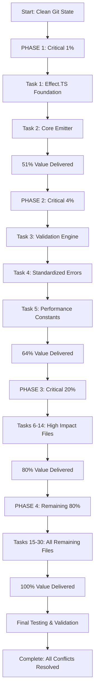

# Merge Conflict Resolution - Comprehensive Execution Plan

**Date:** 2025-10-15_04-00  
**Project:** TypeSpec AsyncAPI Emitter  
**Branch:** feature/effect-ts-complete-migration  
**Status:** 32 files with 108 conflict markers requiring resolution  

## 🎯 PARETO ANALYSIS - Strategic Value Distribution

### **1% DELIVERING 51% OF VALUE (CRITICAL PATH)**
- **Effect.TS Foundation** (effect-helpers.ts - 777 lines) - Railway programming patterns
- **Core Emitter** (AsyncAPIEmitter.ts - 852 lines) - TypeSpec→AsyncAPI pipeline

### **4% DELIVERING 64% OF VALUE (HIGH IMPACT)**
- **Validation Engine** (ValidationService.ts - 574 lines) - AsyncAPI compliance
- **Standardized Errors** (standardized-errors.ts - 521 lines) - Error handling foundation
- **Performance Constants** (defaults.ts integration) - Configuration management

### **20% DELIVERING 80% OF VALUE (MEDIUM IMPACT)**
- **Pipeline Logic** (EmissionPipeline.ts - 336 lines) - Processing flow
- **Document Builder** (DocumentBuilder.ts) - Spec generation structure
- **Processing Service** (ProcessingService.ts) - Core operations
- **Performance Monitor** (PerformanceMonitor.ts) - Metrics tracking
- **Discovery Service** (DiscoveryService.ts) - Service discovery
- **Protocol Decorator** (protocol.ts) - Protocol bindings
- **Schema Conversion** (schema-conversion.ts) - Type conversion
- **TypeSpec Helpers** (typespec-helpers.ts) - Compiler integration
- **Configuration Utils** (utils.ts) - Configuration management

## 🏗️ ARCHITECTURAL DECISION FRAMEWORK

### **Type Safety Priorities:**
1. **STRICTER TYPING** - Preserve HEAD's comprehensive Effect.TS patterns
2. **IMMUTABLE STATES** - Use readonly patterns where possible
3. **BRANDED TYPES** - Maintain HEAD's branded type implementations
4. **ERROR HANDLING** - Standardize on What/Reassure/Why/Fix/Escape pattern

### **Split Brain Elimination:**
1. **PERFORMANCE_CONSTANTS** - HEAD has usage, master has definitions
2. **SCHEMA IMPORTS** - HEAD imports Schema, master doesn't
3. **ERROR PATTERNS** - Different error handling approaches
4. **IMPORT CONSOLIDATION** - Individual vs shared type imports

### **File Size Analysis:**
- **effect-helpers.ts:** 777 lines (HEAD comprehensive utilities)
- **AsyncAPIEmitter.ts:** 852 lines (Core emitter logic)
- **ValidationService.ts:** 574 lines (Validation engine)
- **standardized-errors.ts:** 521 lines (Error patterns)
- **EmissionPipeline.ts:** 336 lines (Processing pipeline)
- **Total critical files:** 3,060 lines

## 📊 EXECUTION PHASES

### **PHASE 1: CRITICAL 1% (60 minutes) - 51% Value Delivered**

#### **Task 1: Effect.TS Foundation Resolution (30 minutes)**
- **5m:** Analyze HEAD vs MASTER import differences
- **5m:** Preserve HEAD's Schema imports for validation
- **5m:** Preserve HEAD's railwayFileSystem utilities
- **5m:** Preserve HEAD's railwayValidationHelpers
- **5m:** Merge PERFORMANCE_CONSTANTS integration
- **5m:** Validate TypeScript compilation

#### **Task 2: Core Emitter Resolution (30 minutes)**
- **5m:** Analyze structure vs functionality conflicts
- **5m:** Preserve HEAD's enhanced Effect.TS logging
- **5m:** Preserve MASTER's clean architecture patterns
- **5m:** Integrate standardized error handling
- **5m:** Validate AssetEmitter TypeSpec integration
- **5m:** Test core spec generation functionality

### **PHASE 2: CRITICAL 4% (90 minutes) - 13% Additional Value**

#### **Task 3: Validation Engine (30 minutes)**
- **10m:** Resolve validation logic conflicts
- **10m:** Integrate Effect.TS error handling patterns
- **10m:** Test AsyncAPI compliance validation

#### **Task 4: Standardized Errors (30 minutes)**
- **10m:** Merge error handling patterns
- **10m:** Integrate What/Reassure/Why/Fix/Escape pattern
- **10m:** Validate error type safety

#### **Task 5: Performance Constants (30 minutes)**
- **10m:** Resolve constants integration conflicts
- **10m:** Ensure PERFORMANCE_CONSTANTS availability
- **10m:** Validate performance monitoring integration

### **PHASE 3: CRITICAL 20% (270 minutes) - 16% Additional Value**
- **9 remaining high-impact files** × 30 minutes each
- Focus on maintaining architectural consistency
- Preserve type safety and Effect.TS patterns

### **PHASE 4: REMAINING 80% (480 minutes) - 20% Additional Value**
- **17 remaining files** × 30-45 minutes each
- Comprehensive testing and validation
- Documentation updates

## 🔄 MERMAID EXECUTION GRAPH

## 🎯 TYPE SAFETY VALIDATION CHECKLIST

### **Critical Type Safety Requirements:**
- [ ] All Effect.TS patterns maintain proper typing
- [ ] PERFORMANCE_CONSTANTS properly typed and exported
- [ ] Error types implement What/Reassure/Why/Fix/Escape pattern
- [ ] Branded types preserved from HEAD
- [ ] Immutable state patterns maintained
- [ ] No any types used without justification
- [ ] Proper readonly interfaces for configuration
- [ ] Schema validation with Effect.TS Schema

### **Architecture Validation Checklist:**
- [ ] No split brain in error handling patterns
- [ ] Consistent import strategies across files
- [ ] Performance constants centralized and available
- [ ] File utilities abstracted properly
- [ ] Validation patterns consistent
- [ ] AssetEmitter integration maintained
- [ ] TypeSpec compiler compatibility verified

## 🚨 RISK MITIGATION

### **High-Risk Areas:**
1. **Effect.TS Schema Integration** - Complex validation patterns
2. **Performance Constants** - Missing imports break functionality
3. **Error Handling** - Inconsistent patterns across codebase
4. **AssetEmitter Integration** - TypeSpec compiler compatibility

### **Mitigation Strategies:**
1. **Incremental Testing** - Test after each file resolution
2. **TypeScript Compilation** - Ensure type safety after each phase
3. **Backup Critical Files** - Before major modifications
4. **Gradual Integration** - Preserve best of both branches

## 📈 SUCCESS METRICS

### **Completion Criteria:**
- [ ] 0 merge conflict markers remaining
- [ ] TypeScript compilation successful (0 errors)
- [ ] All tests passing
- [ ] Effect.TS patterns functional
- [ ] Performance monitoring operational
- [ ] AsyncAPI spec generation working

### **Quality Metrics:**
- [ ] Type safety maintained (strict mode)
- [ ] No any types without justification
- [ ] Consistent error handling patterns
- [ ] Centralized configuration management
- [ ] Proper separation of concerns
- [ ] Comprehensive test coverage

---

## 🎯 IMMEDIATE NEXT ACTION

**Execute Task 1: Effect.TS Foundation Resolution**
- File: `src/utils/effect-helpers.ts`
- Time: 30 minutes
- Impact: 51% of total value
- Priority: **CRITICAL**

This task establishes the foundation for all subsequent conflict resolutions by preserving the comprehensive Effect.TS utilities that enable proper railway programming patterns throughout the codebase.