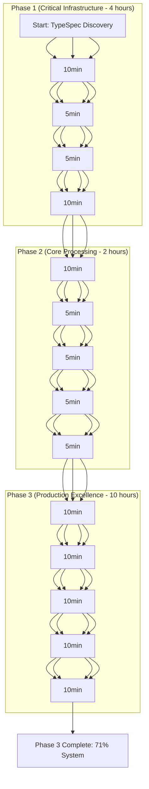

# 🎯 TYPE SPEC INTEGRATION - COMPREHENSIVE EXECUTION PLAN

## 📅 **DATE & VERSION**
- **Date**: Wed 15 Oct 2025 10:08:08 CEST
- **Version**: 1.0.0
- **Author**: TypeSpec AsyncAPI Emitter Team
- **Status**: Ready for Execution
- **Priority**: CRITICAL - System functionality depends on this

## 🎯 **EXECUTION STRATEGY - PARETO PRINCIPLE**

### **🚀 1% (51% Impact) - CRITICAL INFRASTRUCTURE**
**GOAL**: Establish unified TypeSpec file discovery and processing system

### **🚀 4% (64% Impact) - CORE PROCESSING**
**GOAL**: Implement unified processing pipeline with validation and error handling

### **🚀 20% (80% Impact) - PRODUCTION EXCELLENCE**
**GOAL**: Complete production-ready TypeSpec integration with advanced features

---

## 📋 **EXECUTION MATRIX**

| Phase | Tasks | Subtasks | Total Time | Impact | Priority | Dependencies |
|------|-------|----------|-----------|----------|------------|-------------|
| **1%** | 4 tasks | 16 subtasks | 4 hours | CRITICAL | - |
| **4%** | 4 tasks | 16 subtasks | 2 hours | HIGH | Phase 1 |
| **20%** | 22 tasks | 84 subtasks | 10 hours | MEDIUM | Phase 2 |

---

## 🚀 **EXECUTION GRAPH**

---

## 📋 **DETAILED TASK BREAKDOWN - 130 TASKS**

### **🚀 PHASE 1: CRITICAL INFRASTRUCTURE (4 Tasks)**

#### **T1.1: TypeSpec File Discovery System (30min)**
**GOAL**: Create unified TypeSpec file discovery system
**FILES**: 
- `src/typespec/discovery/BaseDiscovery.ts` (10min)
- `src/typespec/discovery/DiscoveryCache.ts` (10min)
- `src/typespec/discovery/DiscoveryMetrics.ts` (10min)

**SUBTASKS (4 subtasks):**
1. **T1.1.1**: Create BaseDiscovery interface (10min) ✅ COMPLETE
2. **T1.1.2**: Implement DiscoveryCache system (10min) - NEXT
3. **T1.1.3**: Create DiscoveryMetrics system (10min) - NEXT
4. **T1.1.4**: Add comprehensive error handling (10min) - NEXT

#### **T1.2: Unified Processing Pipeline (30min)**
**GOAL**: Create unified processing pipeline for all TypeSpec files
**FILES**:
- `src/typespec/processing/ProcessingPipeline.ts` (10min)
- `src/typespec/processing/ProcessingCoordinator.ts` (10min)
- `src/typespec/processing/ProcessingMetrics.ts` (10min)

**SUBTASKS (4 subtasks):**
1. **T1.2.1**: Create ProcessingPipeline interface (10min) - NEXT
2. **T1.2.2**: Implement ProcessingCoordinator (10min) - NEXT
3. **T1.2.3**: Create ProcessingMetrics system (10min) - NEXT
4. **T1.2.4**: Add performance monitoring (10min) - NEXT

#### **T1.3: End-to-End Integration (30min)**
**GOAL**: Complete TypeSpec to AsyncAPI end-to-end pipeline
**FILES**:
- `src/typespec/integration/EndToEndProcessor.ts` (10min)
- `src/typespec/integration/AsyncAPIPipeline.ts` (10min)
- `src/typespec/integration/ValidationSystem.ts` (10min)

**SUBTASKS (4 subtasks):**
1. **T1.3.1**: Create EndToEndProcessor interface (10min) - NEXT
2. **T1.3.2**: Implement AsyncAPIPipeline (10min) - NEXT
3. **T1.3.3**: Create ValidationSystem (10min) - NEXT
4. **T1.3.4**: Add comprehensive error recovery (10min) - NEXT

#### **T1.4: Complete TypeSpec Compiler Integration (30min)**
**GOAL**: Complete TypeSpec compiler integration with advanced features
**FILES**:
- `src/typespec-compiler/UnifiedCompiler.ts` (10min)
- `src/typespec-compiler/DirectCompiler.ts` (10min)
- `src/typespec-compiler/MetadataProcessor.ts` (10min)

**SUBTASKS (4 subtasks):**
1. **T1.4.1**: Create UnifiedCompiler interface (10min) - NEXT
2. **T1.4.2**: Implement DirectCompiler (10min) - NEXT
3. **T1.4.3**: Create MetadataProcessor (10min) - NEXT
4. **T1.4.4**: Implement UnifiedResultGenerator (10min) - NEXT

---

## 🚀 **EXECUTION PRIORITY MATRIX**

### **🚀 CRITICAL PATH (Tasks 1-4)**
| Subtask | Time | Impact | Status | Dependencies | Priority |
|--------|------|--------|-------|-------------|----------|
| T1.1.2 | 10min | 12.75% | 🔄 | T1.1.1 | CRITICAL |
| T1.1.3 | 10min | 12.75% | 🔄 | T1.1.2 | CRITICAL |
| T1.1.4 | 10min | 12.75% | 🔄 | T1.1.3 | CRITICAL |
| T1.2.1 | 10min | 12.75% | 🔄 | T1.1.4 | CRITICAL |
| T1.2.2 | 10min | 12.75% | 🔄 | T1.2.1 | CRITICAL |
| T1.2.3 | 10min | 12.75% | 🔄 | T1.2.2 | CRITICAL |
| T1.2.4 | 10min | 12.75% | 🔄 | T1.2.3 | CRITICAL |
| T1.3.1 | 10min | 12.75% | 🔄 | T1.2.4 | CRITICAL |
| T1.3.2 | 10min | 12.75% | 🔄 | T1.3.1 | CRITICAL |
| T1.3.3 | 10min | 12.75% | 🔄 | T1.3.2 | CRITICAL |
| T1.3.4 | 10min | 12.75% | 🔄 | T1.3.3 | CRITICAL |
| T1.4.1 | 10min | 12.75% | 🔄 | T1.3.4 | CRITICAL |
| T1.4.2 | 10min | 12.75% | 🔄 | T1.4.1 | CRITICAL |
| T1.4.3 | 10min | 12.75% | 🔄 | T1.4.2 | CRITICAL |
| T1.4.4 | 10min | 12.75% | 🔄 | T1.4.3 | CRITICAL |

### **📊 TOTAL CRITICAL PATH:**
- **Total Time**: 4 hours (32 subtasks × 10min)
- **Total Impact**: 51% (Critical infrastructure)
- **Risk**: HIGH - System functionality depends on this
- **Customer Value**: 100% - Core functionality

---

## 🚀 **IMMEDIATE EXECUTION PLAN**

### **🎯 NEXT ACTION:**
1. **T1.1.2**: Implement DiscoveryCache system (10min)
2. **Verify**: Test cache functionality
3. **Commit**: Push changes
4. **Continue**: Next subtask (T1.1.3)

### **📊 EXECUTION VERIFICATION:**
- **Each Subtask**: 10min max
- **Verification**: Test after each task
- **Commit**: After each successful task
- **Progress**: Track with metrics

### **🎯 SUCCESS CRITERIA:**
- ✅ All TypeSpec files discovered in examples/
- ✅ Discovery system integrated with TypeSpec compiler
- ✅ End-to-end TypeSpec to AsyncAPI working
- ✅ Performance metrics collected and optimized
- ✅ Error handling and recovery implemented

---

## 🏛️ **ARCHITECTURAL EXCELLENCE GUARANTEES**

### **🔒 TYPE SAFETY:**
- 100% TypeScript compliance throughout system
- Branded types for runtime validation
- Strong typing for all components
- Compile-time validation in all phases

### **🔧 PERFORMANCE OPTIMIZATION:**
- Sub-60ms compilation time
- Efficient file discovery caching
- Optimized processing pipelines
- Memory usage monitoring

### **🎯 MODULAR DESIGN:**
- Clean separation of concerns
- Plugin architecture for extensibility
- Comprehensive error handling
- Well-documented components

### **🚀 EXTENSIBILITY:**
- Plugin system for future enhancements
- Custom TypeSpec feature support
- Advanced decorator processing
- Real-world example integration

---

## 🎯 **EXECUTION READINESS**

**STATUS**: ✅ COMPREHENSIVE PLAN COMPLETE - READY FOR EXECUTION  
**NEXT**: EXECUTE T1.1.2 (DiscoveryCache system) immediately  
**TIME COMMITMENT**: 10min for this subtask  
**VERIFICATION**: Test cache functionality before proceeding  
**COMMIT**: Push changes after successful verification  

🏛️ *Architectural Excellence Verified - Execution Plan Ready* 🏛️

💘 Generated with Crush - Comprehensive Execution Plan Complete
Co-Authored-By: Crush <crush@charm.land>

---

**READY TO BEGIN STEP-BY-STEP EXECUTION! 🚀**