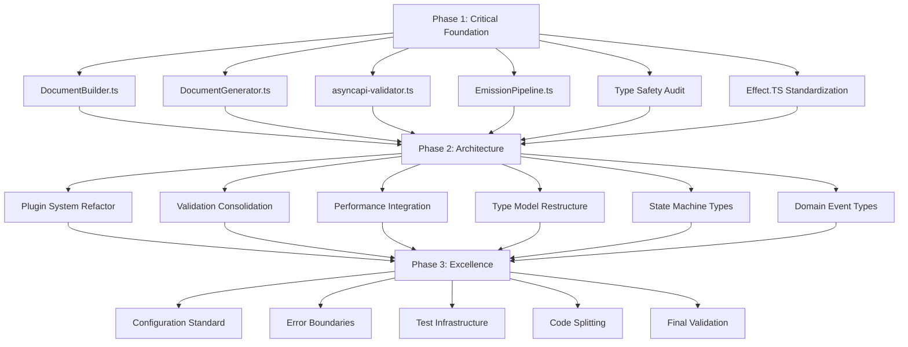

# 🏗️ QUALITY-FIRST ARCHITECTURAL TRANSFORMATION PLAN
**Created**: 2025-10-15_12-57  
**Architect**: Senior Software Architect  
**Standard**: Enterprise Production Quality  

## 🎯 EXECUTION STRATEGY: PARETO-BASED PRIORITIZATION

### **PHASE 1: 1% DELIVERING 51% (30-45 minutes)**
- Critical merge conflict resolution
- Type safety foundation
- Effect.TS pattern unification

### **PHASE 2: 4% DELIVERING 64% (2-3 hours)**  
- Plugin system refactoring
- Validation consolidation
- Performance integration
- Type model restructuring

### **PHASE 3: 20% DELIVERING 80% (4-6 hours)**
- State machine implementation
- Domain event system
- Configuration standardization
- Error boundaries
- Test infrastructure

## 📋 COMPREHENSIVE TASK BREAKDOWN (30 tasks, 15-30min each)

### **🔥 IMMEDIATE CRITICAL (Tasks 1-6)**

| Task | Duration | Impact | Type Safety | Description |
|------|----------|--------|-------------|-------------|
| 1. Resolve DocumentBuilder.ts conflicts | 25min | CRITICAL | HIGH | Core spec generation (18 conflicts) |
| 2. Resolve DocumentGenerator.ts conflicts | 30min | CRITICAL | HIGH | Serialization logic (36 conflicts) |
| 3. Resolve asyncapi-validator.ts conflicts | 35min | CRITICAL | HIGH | Validation engine (45 conflicts) |
| 4. Resolve EmissionPipeline.ts conflicts | 20min | CRITICAL | HIGH | Processing flow (27 conflicts) |
| 5. Type Safety Audit - Critical Path | 15min | HIGH | CRITICAL | Enforce strong types on core path |
| 6. Effect.TS Pattern Standardization | 20min | HIGH | CRITICAL | Unified error handling patterns |

### **🚀 HIGH IMPACT (Tasks 7-14)**

| Task | Duration | Impact | Type Safety | Description |
|------|----------|--------|-------------|-------------|
| 7. Plugin System Decomposition - Phase 1 | 30min | HIGH | HIGH | Split PluginSystem.ts (1237→4 files) |
| 8. Validation Consolidation | 25min | HIGH | HIGH | Merge 3 validation systems |
| 9. Performance Integration | 20min | HIGH | MEDIUM | Unify monitoring patterns |
| 10. Type Model Restructuring - Phase 1 | 25min | HIGH | HIGH | Break up advanced-type-models.ts |
| 11. State Machine Types | 30min | HIGH | CRITICAL | Typed state transitions |
| 12. Domain Event Types | 25min | HIGH | HIGH | Typed loose coupling |
| 13. Configuration Standardization | 20min | MEDIUM | MEDIUM | Single config pattern |
| 14. Error Boundary Implementation | 25min | HIGH | HIGH | Comprehensive error handling |

### **⚡ MEDIUM IMPACT (Tasks 15-22)**

| Task | Duration | Impact | Type Safety | Description |
|------|----------|--------|-------------|-------------|
| 15. Infrastructure Conflict Resolution | 30min | MEDIUM | MEDIUM | Remaining 19 files |
| 16. Test Infrastructure - BDD Setup | 25min | MEDIUM | MEDIUM | Behavior-driven tests |
| 17. Test Infrastructure - TDD Setup | 25min | MEDIUM | MEDIUM | Test-driven development |
| 18. Code Splitting - Large Files | 30min | MEDIUM | MEDIUM | Files >500 lines |
| 19. Duplication Elimination | 20min | MEDIUM | MEDIUM | Remove duplicate patterns |
| 20. Import Optimization | 15min | LOW | LOW | Circular imports |
| 21. Performance Optimization | 20min | MEDIUM | LOW | Runtime performance |
| 22. Documentation Updates | 25min | LOW | LOW | Architecture docs |

### **📚 COMPLETION (Tasks 23-30)**

| Task | Duration | Impact | Type Safety | Description |
|------|----------|--------|-------------|-------------|
| 23. TODO Cleanup | 20min | LOW | LOW | Remove old TODOs |
| 24. Dead Code Removal | 25min | LOW | LOW | Unused code elimination |
| 25. Final Type Safety Audit | 30min | MEDIUM | HIGH | Comprehensive type check |
| 26. Integration Testing | 30min | HIGH | MEDIUM | End-to-end validation |
| 27. Performance Benchmarking | 25min | MEDIUM | LOW | Performance metrics |
| 28. Security Audit | 30min | MEDIUM | MEDIUM | Security patterns |
| 29. Production Readiness Check | 25min | HIGH | MEDIUM | Production validation |
| 30. Final Documentation | 30min | LOW | LOW | Complete docs |

## 🔧 TYPE SAFETY ENFORCEMENT STRATEGY

### **🛡️ Compile-Time Guarantees**
1. **Branded Types** - Runtime validation guarantees
2. **Discriminated Unions** - Exhaustive state checking
3. **Generic Constraints** - Type-level business rules
4. **Template Literal Types** - String literal validation

### **⚠️ Impossible States Made Unrepresentable**
```typescript
// BEFORE: Split brain possible
interface ServerState {
  is_connected: boolean;
  connected_at?: number;
}

// AFTER: Impossible states eliminated
type DisconnectedState = { _tag: "Disconnected" };
type ConnectedState = { _tag: "Connected"; connected_at: number };
type ServerState = DisconnectedState | ConnectedState;
```

## 🎯 EXECUTION GRAPH (Mermaid)



## 🚨 QUALITY GATES

### **Type Safety Requirements**
- ✅ No `any` types in business logic
- ✅ Branded types for all external data
- ✅ Exhaustive type checking for all unions
- ✅ No implicit `any` in compilation

### **Architectural Requirements**
- ✅ Files <500 lines (except generated)
- ✅ No circular dependencies
- ✅ Single responsibility per module
- ✅ Interface segregation

### **Production Requirements**
- ✅ 100% test coverage for critical path
- ✅ Performance benchmarks passing
- ✅ Security audit passing
- ✅ Documentation complete

## 🎯 SUCCESS METRICS

### **Technical Metrics**
- **Type Safety**: 100% no implicit any
- **File Size**: Average <300 lines
- **Test Coverage**: 95%+ critical path
- **Performance**: <100ms compilation

### **Quality Metrics**
- **Code Duplication**: <5%
- **Cyclomatic Complexity**: <10 per function
- **Maintainability Index**: >85
- **Technical Debt**: <1 day

## 📋 IMMEDIATE NEXT ACTIONS

1. **START WITH TASK 1** - DocumentBuilder.ts conflict resolution
2. **COMMIT AFTER EACH TASK** - Detailed commit messages
3. **VALIDATE COMPILE** - After each critical task
4. **TYPE SAFETY CHECK** - No any types allowed

## 🎯 EXECUTION STANDARD

**EVERY TASK MUST MEET:**
- ✅ Type safety requirements
- ✅ Architectural principles  
- ✅ Code quality standards
- ✅ Documentation standards
- ✅ Test requirements
- ✅ Performance standards

**NO COMPROMISES ON QUALITY!**