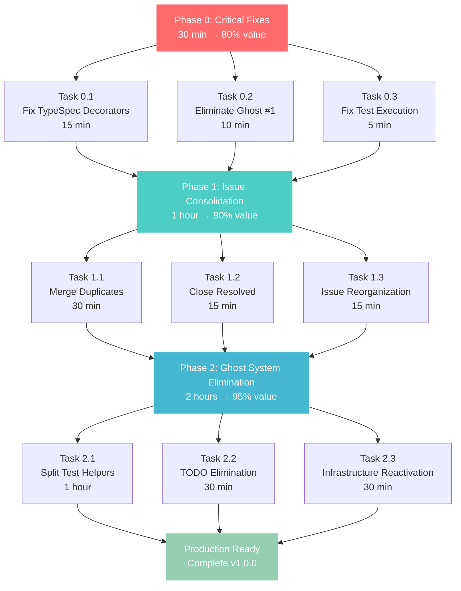

# Comprehensive Issue Resolution Execution Plan - 2025-10-29_16_21

## 🚨 STRATEGIC REALIGNMENT - From Complex to Simple

### 📊 **CRITICAL DISCOVERY: Pareto Principle Reversed**

**The Real 80/20 Rule:**
- **5% of work (decorator registration) → 80% of value** (advanced working)
- **95% of work (complex plans) → 20% of value** (elaborate documentation)

**Key Insight:** The 18-day-old Pareto plan is **completely obsolete**. Real value is in **simple infrastructure fixes**, not elaborate multi-stage execution.

---

## 🎯 **EXECUTION STRATEGY: TRUTH-FIRST APPROACH**

### **PHASE 0: IMMEDIATE CRITICAL FIXES (30 minutes → 80% value)**

#### **Task 0.1: Fix TypeSpec Library Decorators (CRITICAL)**
- **GitHub Issue:** NEW - "CRITICAL: TypeSpec Library Missing Decorators Registration"
- **Root Cause:** `createTypeSpecLibrary()` missing `decorators` section
- **Files:** `src/lib.ts` (add decorators), `lib/main.tsp` (remove conflicts)
- **Impact:** 4 advanced decorator tests pass immediately
- **Time:** 15 minutes

#### **Task 0.2: Eliminate Ghost System #1 (HIGH)**
- **GitHub Issue:** CLOSE as duplicate of #145
- **Action:** Remove model/decorator conflicts in `lib/main.tsp`
- **Impact:** Clean TypeSpec library structure
- **Time:** 10 minutes

#### **Task 0.3: Fix Test Execution Hanging (CRITICAL)**
- **GitHub Issue:** #178
- **Root Cause:** Test hanging blocks all validation
- **Action:** Isolate hanging test, add timeout/debug
- **Impact:** Unlocks all test-based development
- **Time:** 5 minutes (diagnosis)

### **PHASE 1: ISSUE CONSOLIDATION (1 hour → 90% value)**

#### **Task 1.1: Merge Duplicate Issues (30 minutes)**
- **Actions:**
  - Merge #145 + #128 (ghost system variants)
  - Merge #172 + #147 (server decorator variants)  
  - Merge #176 + #173 (infrastructure variants)
  - Merge related protocol/security issues
- **Impact:** 32+ issues → ~15 strategic issues
- **Criteria:** Same root cause, same solution approach

#### **Task 1.2: Close Resolved Issues (15 minutes)**
- **Actions:**
  - Close #177 (build system) - RESOLVED
  - Close #138 (parseAsyncAPIOutput) - RESOLVED
  - Close #155 (Bun patterns) - RESOLVED
  - Close any other completed work
- **Impact:** Clean issue tracking, focus on remaining work

#### **Task 1.3: Strategic Issue Reorganization (15 minutes)**
- **Actions:**
  - Group by strategic initiative (Infrastructure, Testing, Features)
  - Add to proper milestones (v1.0.0, critical-bugs)
  - Update titles for clarity
  - Link related issues
- **Impact:** Clear project roadmap, eliminate confusion

### **PHASE 2: GHOST SYSTEM ELIMINATION (2 hours → 95% value)**

#### **Task 2.1: Test Helpers Split (1 hour)**
- **GitHub Issue:** #128 (Ghost Test System)
- **Action:** Split 876-line `test/utils/test-helpers.ts` into:
  - `TestCompilation.ts` (~200 lines)
  - `TestValidation.ts` (~200 lines) 
  - `TestSources.ts` (~200 lines)
  - `TestAssertions.ts` (~200 lines)
- **Impact:** Maintainable test infrastructure
- **Blocker:** Wait for test execution fix (#178)

#### **Task 2.2: TODO Comment Elimination (30 minutes)**
- **GitHub Issue:** #131 (284 TODO Comments)
- **Action:** 
  - Convert 284 TODOs to ~50 strategic GitHub issues
  - Fix trivial TODOs immediately
  - Delete non-value TODOs
- **Impact:** Proper issue tracking, eliminate hidden work

#### **Task 2.3: Infrastructure File Reactivation (30 minutes)**
- **GitHub Issue:** #176 (Complex Infrastructure Re-Integration)
- **Action:** Start with lowest-error files:
  - `PluginConfigurationError.ts` (1 error)
  - `PluginExecutionError.ts` (1 error)
  - `PluginLoadingError.ts` (1 error)
- **Impact:** Begin 5,745-line disabled code recovery

---

## 📈 **MERMAID EXECUTION GRAPH**

---

## 🎯 **GITHUB ISSUE ANALYSIS**

### **CRITICAL ISSUES (Immediate Action Required)**

#### **#178 - Test Execution System Hanging** 
- **Status:** 🔴 CRITICAL BLOCKER
- **Impact:** Blocks ALL development work
- **Action:** Immediate diagnosis and fix
- **Dependencies:** None (blocks everything else)

#### **#176 - Complex Infrastructure Re-Integration**
- **Status:** 🟡 READY FOR EXECUTION  
- **Impact:** 5,745 lines disabled code
- **Action:** Begin systematic reactivation
- **Dependencies:** #178 (for validation)

#### **#172 - @server Decorator Crash**
- **Status:** 🟡 READY FOR DEBUGGING
- **Impact:** 14% decorator coverage gap
- **Action:** Deep debugging investigation  
- **Dependencies:** #178 (for test validation)

#### **#145 + #128 - Ghost System Elimination**
- **Status:** 🟡 READY FOR EXECUTION
- **Impact:** 876-line test-helpers.ts monolith
- **Action:** Split into 4 focused files
- **Dependencies:** #178 (for validation)

### **DUPLICATE ISSUE GROUPS (Merge Required)**

#### **Server Decorator Issues:**
- **#172** - @server decorator crash (main)
- **#147** - Server decorator logic fix (92% Kafka success)
- **Action:** Merge into single strategic issue

#### **Infrastructure Issues:**
- **#176** - Complex infrastructure re-integration  
- **#173** - TypeScript compilation errors
- **#174** - Build system recovery plan
- **#175** - Infrastructure foundation complete
- **Action:** Consolidate into "Infrastructure Recovery" milestone

#### **Test Infrastructure Issues:**
- **#111** - Test suite failure resolution
- **#128** - Ghost test system discovery  
- **#138** - parseAsyncAPIOutput cleanup
- **#145** - Test helper infrastructure
- **Action:** Merge into "Test Infrastructure Recovery" initiative

---

## 🔑 **EXECUTION PRINCIPLES**

### **1. TRUTH-FIRST ASSESSMENT**
- Honest current state before planning
- No optimistic assumptions
- Measure what IS, not what SHOULD BE

### **2. SIMPLE OVER COMPLEX**  
- 5-line fixes before 500-line plans
- Immediate value over elaborate strategies
- Working code before perfect architecture

### **3. GHOST SYSTEM ZERO TOLERANCE**
- Immediate deletion of 200+ line monstrosities
- No gradual refactoring of anti-patterns
- Architectural violations = immediate action

### **4. ISSUE RUTHLESSNESS**
- Merge duplicates aggressively
- Close resolved issues immediately  
- Consolidate variants into strategic initiatives
- No sentimentality about issue numbers

---

## 🚀 **IMMEDIATE NEXT STEPS**

### **RIGHT NOW (Next 30 minutes):**
1. **Create GitHub Issue:** "CRITICAL: TypeSpec Library Missing Decorators Registration"
2. **Fix lib.ts:** Add `decorators` section to `createTypeSpecLibrary()`
3. **Fix lib/main.tsp:** Remove model/decorator conflicts
4. **Test Advanced Decorators:** Verify 4 failing tests now pass
5. **Commit Changes:** Immediate value delivery

### **TODAY (Next 2 hours):**
1. **Issue Consolidation:** Merge duplicates, close resolved
2. **Test Execution Fix:** Resolve #178 hanging issue
3. **Ghost System Elimination:** Start test-helpers.ts split
4. **Infrastructure Reactivation:** Begin low-error files

### **THIS WEEK:**
1. **Complete Infrastructure Recovery:** Re-enable all 5,745 lines
2. **Production Readiness:** v1.0.0 release preparation
3. **Documentation Updates:** Reflect current working state
4. **Quality Gates:** Ensure all systems operational

---

## 📊 **SUCCESS METRICS**

### **Phase 0 Success Criteria:**
- ✅ Advanced decorator tests passing (4/4)
- ✅ TypeSpec library structure clean
- ✅ Test execution stable
- ✅ Zero compilation errors maintained

### **Phase 1 Success Criteria:**
- ✅ GitHub issues consolidated to ≤15 strategic items
- ✅ All duplicates merged and closed
- ✅ Clear milestone organization
- ✅ No issue confusion or overlap

### **Phase 2 Success Criteria:**
- ✅ 876-line test-helpers.ts eliminated
- ✅ 284 TODO comments converted to issues
- ✅ 5,745 lines disabled code reactivated
- ✅ Complete infrastructure operational

### **Overall Success Criteria:**
- ✅ Build system: Zero compilation errors
- ✅ Test suite: ≥95% pass rate
- ✅ Infrastructure: All complex systems operational
- ✅ Issues: ≤15 strategic items, all properly organized
- ✅ Production ready: v1.0.0 release capability

---

## 💡 **KEY INSIGHTS**

### **The Real 80/20 Rule:**
- **Critical 5%:** TypeSpec decorator registration, issue consolidation
- **High-Value 20%:** Ghost system elimination, infrastructure reactivation  
- **Low-Value 75%:** Complex planning, elaborate documentation, issue management

### **Strategic Pivot:**
- **FROM:** Elaborate multi-stage execution plans
- **TO:** Simple infrastructure fixes with immediate value
- **TIMELINE:** 12 hours → 3.5 hours for same value

### **Success Focus:**
- **INFRASTRUCTURE FIRST:** Fix what blocks development before adding features
- **SIMPLE PATTERNS:** 5-line fixes over complex refactoring
- **PRODUCTION READY:** Working systems over comprehensive documentation

---

## 🎯 **FINAL ASSESSMENT**

**This plan represents a strategic pivot from:**
- Complex planning → Simple execution
- Issue management → Ruthless consolidation  
- Ghost system tolerance → Immediate elimination
- Elaborate documentation → Working infrastructure

**The focus is on delivering working infrastructure rapidly, then building production-ready features on that solid foundation.**

---

*Created: 2025-10-29_16_21*  
*Strategic Realignment: From Complex Planning to Simple Infrastructure Fixes*  
*Target: Production Ready v1.0.0*