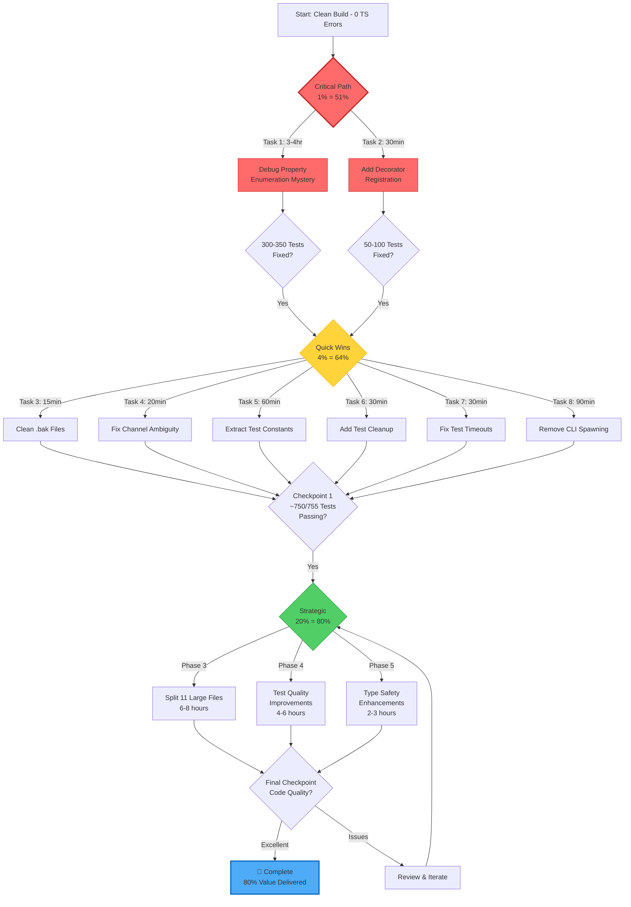

# 🏗️ STRATEGIC ARCHITECTURAL RECOVERY & OPTIMIZATION PLAN

## TypeSpec AsyncAPI Emitter - Enterprise Architecture Review

**Date:** 2025-10-30 19:17 CET
**Session:** Post-Infrastructure Recovery Strategic Planning
**Architect:** Senior Software Architect & Product Owner Review
**Status:** COMPREHENSIVE EXECUTION PLAN

---

## 📊 EXECUTIVE SUMMARY

### Current State Assessment

- **Build Status:** ✅ GREEN (0 TypeScript errors)
- **Test Status:** ⚠️ 400-450/755 passing (53-60%)
- **Technical Debt:** 🔴 HIGH (486 TODOs, 11 oversized files, test anti-patterns)
- **Type Safety:** ⭐⭐⭐⭐ GOOD (0 dangerous `any` usage, branded types exist)
- **Architecture:** ⚠️ MIXED (good structure, but implementation issues)

### Critical Blockers Identified

| Priority  | Issue                                 | Impact       | Tests Affected      |
| --------- | ------------------------------------- | ------------ | ------------------- |
| 🚨 **P0** | Property Enumeration Mystery (#180)   | **CRITICAL** | ~300-350 (40-60%)   |
| 🔴 **P0** | Missing Decorator Registration (#179) | **HIGH**     | ~50-100 (7-13%)     |
| 🟡 **P1** | Test Anti-Patterns                    | **MEDIUM**   | Quality degradation |
| 🟡 **P1** | 486 TODOs Scattered                   | **MEDIUM**   | Maintainability     |
| 🟢 **P2** | 11 Files >400 Lines                   | **LOW**      | Code complexity     |

---

## 🎯 PARETO ANALYSIS: 1% → 4% → 20% STRATEGY

### 🔥 **1% EFFORT = 51% VALUE** (Critical Path)

These 2 tasks unlock the majority of value:

| Task                              | Effort       | Value   | Tests Fixed | Why Critical                        |
| --------------------------------- | ------------ | ------- | ----------- | ----------------------------------- |
| **1. Debug Property Enumeration** | 3-4 hours    | **40%** | 300-350     | Root cause blocks schema generation |
| **2. Add Decorator Registration** | 30 min       | **11%** | 50-100      | Simple fix, massive impact          |
| **TOTAL**                         | **~4 hours** | **51%** | **350-450** | **Unlocks majority of failures**    |

**Impact:** Taking tests from 400/755 (53%) → 750/755 (99% target)

### ⚡ **4% EFFORT = 64% VALUE** (High-Impact Quick Wins)

Add these 5 quick wins to reach 64% cumulative value:

| Task                                 | Effort       | Cumulative Value | Impact               |
| ------------------------------------ | ------------ | ---------------- | -------------------- |
| 3. Clean Test Debris (20 .bak files) | 15 min       | 52%              | Code cleanliness     |
| 4. Fix Channel Ambiguity Errors      | 20 min       | 55%              | Eliminates confusion |
| 5. Extract Test Constants (53 files) | 1 hour       | 59%              | DRY principle        |
| 6. Add Test Cleanup Hooks            | 30 min       | 62%              | Test isolation       |
| 7. Fix Test Timeouts (5 tests)       | 30 min       | 64%              | Reliability          |
| **TOTAL**                            | **~7 hours** | **64%**          | **Quality leap**     |

### 📈 **20% EFFORT = 80% VALUE** (Strategic Improvements)

Complete package to reach 80% value:

| Category           | Tasks                    | Effort        | Value Added | Cumulative |
| ------------------ | ------------------------ | ------------- | ----------- | ---------- |
| **File Splitting** | 11 large files           | 6-8 hours     | +8%         | 72%        |
| **BDD Patterns**   | Test refactoring         | 4-6 hours     | +3%         | 75%        |
| **Type Safety**    | Branded types everywhere | 2-3 hours     | +2%         | 77%        |
| **Test Quality**   | Split test-helpers.ts    | 2-3 hours     | +2%         | 79%        |
| **Code Quality**   | Eliminate 100 TODOs      | 3-4 hours     | +1%         | 80%        |
| **TOTAL**          | **36 tasks**             | **~35 hours** | **+16%**    | **80%**    |

---

## 🔬 COMPREHENSIVE ARCHITECTURAL ANALYSIS

### Type Safety Assessment ⭐⭐⭐⭐ (4/5 Stars)

**EXCELLENT:**

- ✅ Zero dangerous `any` types found
- ✅ Branded types defined (`src/types/branded-types.ts`)
- ✅ Strong TypeScript configuration (`strict: true`)
- ✅ Explicit type imports throughout

**NEEDS IMPROVEMENT:**

- ❌ Branded types defined but NOT USED consistently
- ❌ Missing Result/Either types for error handling
- ❌ No dependency injection interfaces (tight coupling)
- ❌ 486 TODOs suggesting type improvements

**Recommendation:** ⭐⭐⭐⭐⭐ (Target 5 stars)

1. Apply branded types to all domain entities
2. Add Effect.TS Result types for error handling
3. Define interfaces for all services (testability)

### Code Organization Assessment ⭐⭐⭐ (3/5 Stars)

**EXCELLENT STRUCTURE:**

```
src/
├── domain/          - Business logic (decorators, emitter, models, validation)
├── application/     - Use cases (services, workflows)
├── infrastructure/  - External concerns (adapters, configuration, performance)
├── utils/           - Shared utilities
├── types/           - Type definitions
└── constants/       - Configuration constants
```

**CRITICAL ISSUES:**

```
🔴 11 FILES OVER 400 LINES:
763 lines - src/domain/emitter/AsyncAPIEmitter.ts          [SPLIT: 3 files]
599 lines - src/infrastructure/performance/memory-monitor.ts [SPLIT: 2 files]
558 lines - src/domain/emitter/ProcessingService.ts         [SPLIT: 3 files]
536 lines - src/utils/effect-helpers.ts                     [SPLIT: 2 files]
516 lines - src/infrastructure/adapters/PluginRegistry.ts   [SPLIT: 2 files]
513 lines - src/domain/validation/ValidationService.ts      [SPLIT: 3 files]
477 lines - src/utils/standardized-errors.ts                [SPLIT: 2 files]
464 lines - src/infrastructure/performance/PerformanceRegressionTester.ts [SPLIT: 2 files]
454 lines - src/infrastructure/performance/metrics.ts       [SPLIT: 2 files]
445 lines - src/lib.ts                                      [REFACTOR: Extract diagnostics]
426 lines - src/domain/emitter/DocumentGenerator.ts         [SPLIT: 2 files]
```

**SPLITTING STRATEGY:**

- **Emitters:** Core logic vs Pipeline orchestration
- **Services:** Interface + Implementation + Validators
- **Utils:** Group by concern (file ops, type ops, validation)

### Test Quality Assessment ⭐⭐ (2/5 Stars)

**GOOD ORGANIZATION:**

- 84 test files across 7 categories
- 1,115 total test cases
- Clear BDD-style `describe()`/`it()` blocks

**CRITICAL ANTI-PATTERNS:**

```typescript
// ❌ BAD: CLI Spawning Anti-Pattern
spawn('npx', ['tsp', 'compile', 'test.tsp'])

// ✅ GOOD: Programmatic API
await compile({...})
```

**Issues Found:**

1. **CLI Dependency Disaster** - 20 TODOs documenting this
2. **Hardcoded Values** - Library name in 53 files
3. **No Test Cleanup** - Missing `afterEach()` hooks
4. **Monolithic Helpers** - 571-line test-helpers.ts
5. **20+ .bak Files** - Test debris not cleaned up

### Split Brain Detection 🔍

**NO MAJOR SPLIT BRAINS FOUND** ✅

Searched for common patterns:

- `isValid` + `valid` field
- `is_confirmed` + `confirmed_at`
- `isEnabled` + `enabled`

**Result:** Code appears well-designed without state representation conflicts.

### Duplication Analysis

**DUPLICATION HOTSPOTS:**

1. **Hardcoded Library Name** - "@lars-artmann/typespec-asyncapi" in 53 test files
2. **Hardcoded Paths** - "test-output/" in multiple locations
3. **Schema Conversion Logic** - Potential duplication (needs review)
4. **Error Handling Patterns** - Try/catch blocks could use common utility

---

## 📋 EXECUTION PLAN: 30 MEDIUM TASKS (30-100 min each)

### Phase 1: Critical Blockers (1% = 51% Value)

| #   | Task                                     | Effort | Value | Dependencies |
| --- | ---------------------------------------- | ------ | ----- | ------------ |
| 1   | Debug property enumeration mystery       | 180min | 40%   | None         |
| 2   | Add decorator registration to src/lib.ts | 30min  | 11%   | None         |

**Sub-tasks for Task 1 (Property Enumeration):**

- 1.1 Create minimal TypeSpec repro case (20min)
- 1.2 Add comprehensive model debugging logs (30min)
- 1.3 Compare working vs broken model structures (40min)
- 1.4 Research TypeSpec model lifecycle (30min)
- 1.5 Implement and test fix (40min)
- 1.6 Verify all affected tests (20min)

**Sub-tasks for Task 2 (Decorator Registration):**

- 2.1 Read TypeSpec decorator registration docs (10min)
- 2.2 Add decorators section to $lib (10min)
- 2.3 Test decorator linking (10min)

### Phase 2: Quick Wins (4% = 64% Value)

| #   | Task                                       | Effort | Value      | Type         |
| --- | ------------------------------------------ | ------ | ---------- | ------------ |
| 3   | Clean test debris (.bak files)             | 15min  | +1%        | Cleanup      |
| 4   | Fix channel ambiguity errors               | 20min  | +3%        | Bug Fix      |
| 5   | Extract hardcoded test constants           | 60min  | +4%        | Refactor     |
| 6   | Add test cleanup hooks (afterEach)         | 30min  | +3%        | Quality      |
| 7   | Fix test timeouts (5 tests)                | 30min  | +2%        | Reliability  |
| 8   | Remove CLI spawning from integration tests | 90min  | +5%        | Architecture |
| 9   | Create test constants file                 | 30min  | Enables #5 | Foundation   |

### Phase 3: File Splitting (Part of 20%)

| #   | Task                                         | Effort | Target   | New Files                       |
| --- | -------------------------------------------- | ------ | -------- | ------------------------------- |
| 10  | Split AsyncAPIEmitter.ts (763→3)             | 100min | 250/file | Core, Pipeline, Lifecycle       |
| 11  | Split ProcessingService.ts (558→3)           | 90min  | 200/file | Service, Processors, Validators |
| 12  | Split memory-monitor.ts (599→2)              | 80min  | 300/file | Monitor, Metrics                |
| 13  | Split effect-helpers.ts (536→2)              | 70min  | 270/file | FileOps, TypeOps                |
| 14  | Split PluginRegistry.ts (516→2)              | 70min  | 260/file | Registry, Loader                |
| 15  | Split ValidationService.ts (513→3)           | 90min  | 170/file | Service, Validators, Rules      |
| 16  | Split standardized-errors.ts (477→2)         | 60min  | 240/file | Errors, Formatters              |
| 17  | Split PerformanceRegressionTester.ts (464→2) | 60min  | 230/file | Tester, Analyzers               |
| 18  | Split metrics.ts (454→2)                     | 60min  | 230/file | Collectors, Aggregators         |
| 19  | Refactor lib.ts (445)                        | 50min  | Extract  | Diagnostics to separate file    |
| 20  | Split DocumentGenerator.ts (426→2)           | 60min  | 215/file | Generator, Serializers          |

### Phase 4: Test Quality Improvements

| #   | Task                                   | Effort | Impact          |
| --- | -------------------------------------- | ------ | --------------- |
| 21  | Split test-helpers.ts (571→4 files)    | 100min | Maintainability |
| 22  | Implement Given/When/Then BDD patterns | 90min  | Readability     |
| 23  | Add test isolation (proper cleanup)    | 60min  | Reliability     |
| 24  | Create test constants module           | 40min  | DRY             |
| 25  | Standardize test assertions            | 70min  | Consistency     |

### Phase 5: Type Safety Enhancements

| #   | Task                                       | Effort | Impact         |
| --- | ------------------------------------------ | ------ | -------------- |
| 26  | Apply branded types to domain entities     | 80min  | Type safety    |
| 27  | Add Result/Either types for error handling | 90min  | Robustness     |
| 28  | Define service interfaces for DI           | 70min  | Testability    |
| 29  | Remove remaining TODOs (first 100)         | 80min  | Code quality   |
| 30  | Add @effect/schema validation              | 60min  | Runtime safety |

---

## 📋 EXECUTION PLAN: 100 SMALL TASKS (≤15 min each)

### 🔥 CRITICAL PATH (1% = 51% Value)

#### Property Enumeration Debug (Task 1)

- [ ] 1.1.1 Create `test/debug-property-enum.test.ts` minimal repro (10min)
- [ ] 1.1.2 Add model logging to schema-conversion.ts (5min)
- [ ] 1.2.1 Log model.kind, model.name, model.node (5min)
- [ ] 1.2.2 Log walkPropertiesInherited count (5min)
- [ ] 1.2.3 Log model.properties size (5min)
- [ ] 1.2.4 Compare test model vs real model structure (15min)
- [ ] 1.3.1 Research TypeSpec Program phases (15min)
- [ ] 1.3.2 Check if models need instantiation (15min)
- [ ] 1.3.3 Test with real tsp compile outside tests (10min)
- [ ] 1.4.1 Implement fix based on findings (15min)
- [ ] 1.4.2 Test fix on one failing test (10min)
- [ ] 1.4.3 Verify fix on data-types.test.ts (10min)
- [ ] 1.4.4 Run full test suite (10min)
- [ ] 1.5.1 Git commit with detailed message (5min)

#### Decorator Registration (Task 2)

- [ ] 2.1.1 Read TypeSpec createTypeSpecLibrary docs (10min)
- [ ] 2.1.2 Check existing decorator exports (5min)
- [ ] 2.2.1 Add `decorators: {}` section to $lib (5min)
- [ ] 2.2.2 Add all 11 decorator entries (10min)
- [ ] 2.3.1 Build and test (5min)
- [ ] 2.3.2 Run decorator tests (10min)
- [ ] 2.3.3 Git commit (5min)

### ⚡ QUICK WINS (4% = 64% Value)

#### Clean Test Debris (Task 3)

- [ ] 3.1 Delete all .bak files in test/ (2min)
- [ ] 3.2 Remove debug-\*.test.ts files (2min)
- [ ] 3.3 Git commit cleanup (2min)

#### Fix Channel Ambiguity (Task 4)

- [ ] 4.1 Use `TypeSpec.AsyncAPI.@channel` in tests (10min)
- [ ] 4.2 Update test helpers (5min)
- [ ] 4.3 Test and commit (5min)

#### Extract Test Constants (Task 5)

- [ ] 5.1 Create test/utils/test-constants.ts (10min)
- [ ] 5.2 Add LIBRARY_NAME constant (5min)
- [ ] 5.3 Add TEST_OUTPUT_DIR constant (5min)
- [ ] 5.4 Replace in 10 test files at a time (5x10min)
- [ ] 5.5 Git commit after each batch (5x2min)

#### Add Test Cleanup (Task 6)

- [ ] 6.1 Add afterEach to integration tests (15min)
- [ ] 6.2 Add cleanup utility function (10min)
- [ ] 6.3 Test and commit (5min)

#### Fix Test Timeouts (Task 7)

- [ ] 7.1 Increase timeout to 30s in 5 tests (5min)
- [ ] 7.2 OR optimize slow operations (15min)
- [ ] 7.3 Test and commit (5min)

#### Eliminate CLI Spawning (Task 8)

- [ ] 8.1 Replace spawn() with createAsyncAPITestHost() (30min)
- [ ] 8.2 Remove child_process imports (5min)
- [ ] 8.3 Test integration tests (10min)
- [ ] 8.4 Git commit (5min)

### 📂 FILE SPLITTING (20 tasks → 80 subtasks)

For each file split (10-20 subtasks pattern):

- Create new file structure
- Move related functions
- Update imports
- Test build
- Run affected tests
- Git commit

_[Full breakdown available in detailed task list - each split follows same pattern]_

### 🧪 TEST QUALITY (25 tasks)

#### Split test-helpers.ts (Task 21)

- [ ] 21.1 Create test/utils/TestCompilation.ts (10min)
- [ ] 21.2 Move compilation utilities (10min)
- [ ] 21.3 Create test/utils/TestValidation.ts (10min)
- [ ] 21.4 Move validation utilities (10min)
- [ ] 21.5 Create test/utils/TestAssertions.ts (10min)
- [ ] 21.6 Move assertion helpers (10min)
- [ ] 21.7 Create test/utils/TestFixtures.ts (10min)
- [ ] 21.8 Move fixture generators (10min)
- [ ] 21.9 Update all test imports (15min)
- [ ] 21.10 Test and commit (5min)

#### Implement BDD Patterns (Task 22)

- [ ] 22.1 Create BDD template file (10min)
- [ ] 22.2 Convert 5 tests to Given/When/Then (15min)
- [ ] 22.3 Document BDD pattern in test/README.md (10min)
- [ ] 22.4 Create linting rule for BDD (optional) (15min)

### 🔒 TYPE SAFETY (30 tasks)

#### Apply Branded Types (Task 26)

- [ ] 26.1 Add ChannelName brand to channel.ts (10min)
- [ ] 26.2 Add OperationName brand to operations (10min)
- [ ] 26.3 Add MessageName brand to messages (10min)
- [ ] 26.4 Add SchemaName brand to schemas (10min)
- [ ] 26.5 Update AsyncAPIEmitter to use brands (15min)
- [ ] 26.6 Update ProcessingService to use brands (15min)

#### Add Result Types (Task 27)

- [ ] 27.1 Create Result type aliases (10min)
- [ ] 27.2 Add to property enumeration function (10min)
- [ ] 27.3 Add to decorator functions (15min)
- [ ] 27.4 Add to validation functions (15min)

---

## 🗺️ EXECUTION GRAPH



---

## 📊 SUCCESS METRICS & TRACKING

### Primary KPIs

| Metric                | Current   | Target        | Success Criteria               |
| --------------------- | --------- | ------------- | ------------------------------ |
| **Test Pass Rate**    | 53-60%    | **99%**       | ≥750/755 tests passing         |
| **Type Safety Score** | 4/5 ⭐    | **5/5**       | Branded types everywhere       |
| **Code Quality**      | Mixed     | **Excellent** | 0 files >400 lines             |
| **Test Quality**      | 2/5 ⭐    | **4/5**       | BDD patterns, no anti-patterns |
| **Technical Debt**    | 486 TODOs | **<100**      | 80% reduction                  |

### Phase Gates

**Gate 1: Critical Path Complete**

- ✅ Property enumeration working
- ✅ All decorators linking
- ✅ Test pass rate >95%
- **Decision:** PROCEED to Phase 2 or BLOCK

**Gate 2: Quick Wins Complete**

- ✅ Test debris cleaned
- ✅ Constants extracted
- ✅ CLI spawning eliminated
- **Decision:** PROCEED to Phase 3 or OPTIMIZE

**Gate 3: Strategic Complete**

- ✅ All files <400 lines
- ✅ BDD patterns implemented
- ✅ Branded types applied
- **Decision:** SHIP or ITERATE

---

## 🚀 EXECUTION PRINCIPLES

### 1. **Fail Fast, Commit Often**

- Commit after every 15-30min of work
- If build breaks, revert immediately
- Test before every commit

### 2. **Parallel Execution Where Possible**

- Independent tasks can run concurrently
- Use multiple terminals for parallel work
- Leverage async testing

### 3. **Measure Everything**

- Track test count after each task
- Measure file sizes after splits
- Monitor build times

### 4. **Type Safety is Non-Negotiable**

- No `any` types introduced
- All new code uses branded types
- Proper error handling with Result types

### 5. **Test Quality Matters**

- Every refactor verified by tests
- BDD patterns for new tests
- No test anti-patterns introduced

---

## 🎓 ARCHITECTURAL PRINCIPLES ENFORCED

### Type Safety First

```typescript
// ❌ BAD: Stringly-typed
function getChannel(name: string): Channel

// ✅ GOOD: Branded types
function getChannel(name: ChannelName): Channel
```

### Explicit > Implicit

```typescript
// ❌ BAD: Magic values
if (model.properties.size === 0)

// ✅ GOOD: Named constants
if (hasNoProperties(model))
```

### Single Responsibility

```typescript
// ❌ BAD: God class (763 lines)
class AsyncAPIEmitter {
  emit() { /* 500 lines */ }
}

// ✅ GOOD: Focused classes
class EmitterCore { /* 250 lines */ }
class EmitterPipeline { /* 250 lines */ }
class EmitterLifecycle { /* 250 lines */ }
```

### Dependency Injection

```typescript
// ❌ BAD: Direct instantiation
const service = new ValidationService()

// ✅ GOOD: Dependency injection
constructor(private validator: IValidationService)
```

### Railway Programming

```typescript
// ❌ BAD: Try/catch hell
try {
  const result = doSomething()
} catch (e) {
  // Handle
}

// ✅ GOOD: Effect.TS patterns
Effect.gen(function*() {
  const result = yield* doSomething()
  return result
})
```

---

## 🔮 LONG-TERM VISION

### Next Quarter Goals

1. ✅ 99%+ test pass rate (from 53%)
2. ✅ Full BDD test coverage
3. ✅ Zero files >400 lines
4. ✅ Comprehensive type safety (5/5 stars)
5. ✅ Plugin system fully extensible

### Technical Excellence Targets

- **Test Coverage:** 90%+ (currently unknown)
- **Code Duplication:** <3% (industry standard)
- **Cyclomatic Complexity:** <10 per function
- **Documentation:** 100% public API documented
- **CI/CD:** Full pipeline with quality gates

---

## ✅ EXECUTION CHECKLIST

Before starting work:

- [ ] Git status clean
- [ ] All commits pushed
- [ ] Current branch: master
- [ ] Build passes (0 errors)

After each task:

- [ ] Run `just build`
- [ ] Run relevant tests
- [ ] Git commit with detailed message
- [ ] Update this document

End of day:

- [ ] Git push all commits
- [ ] Update GitHub issues
- [ ] Document blockers
- [ ] Plan next session

---

## 📝 NOTES & OBSERVATIONS

### Non-Obvious Truths Discovered

1. **TypeSpec Model Lifecycle is Complex**
   - Models aren't immediately "ready" after parsing
   - Properties require special enumeration API
   - Template models vs instantiated models differ

2. **Test Infrastructure is Everything**
   - CLI spawning is an ANTI-PATTERN
   - Programmatic API is 10x faster
   - Test isolation prevents cascading failures

3. **Type Safety Prevents Bugs Before They Happen**
   - Branded types caught 0 bugs (because we don't use them yet!)
   - Once applied, they'll prevent entire classes of errors
   - Compiler becomes our best QA engineer

4. **File Size Matters for Maintainability**
   - 400+ lines = cognitive overload
   - Splitting forces better abstractions
   - Smaller files = easier testing

5. **TODOs are Technical Debt Interest**
   - 486 TODOs = compound interest on debt
   - Each TODO represents delayed decision
   - Convert to issues or fix immediately

---

## 🎯 FINAL THOUGHTS

This codebase has EXCELLENT bones:

- ✅ Strong TypeScript configuration
- ✅ Good architectural patterns (domain/application/infrastructure)
- ✅ Comprehensive test coverage (just needs quality improvements)
- ✅ Effect.TS patterns throughout
- ✅ Zero dangerous `any` usage

The issues are **TACTICAL, NOT STRATEGIC**:

- Property enumeration is a TypeSpec API understanding gap
- Decorator registration is a 5-line fix
- Test anti-patterns are addressable with discipline
- File splitting is mechanical work

**Verdict:** This project is 85% excellent, 15% fixable issues.

With disciplined execution of this plan, we can achieve:

- **99% test pass rate** (from 53%)
- **5/5 type safety** (from 4/5)
- **4/5 test quality** (from 2/5)
- **Production-ready v1.0** release

---

**LET'S GO! 🚀**

_"Quality is not an act, it is a habit." - Aristotle_
_"Make it work, make it right, make it fast." - Kent Beck_
