# 🚀 TypeSpec AsyncAPI Emitter - Comprehensive Recovery Plan

**Created:** 2025-11-01_07_51  
**Status:** CRITICAL INFRASTRUCTURE RECOVERY  
**Priority:** Issue #180 Resolution First  
**Total Duration:** ~3-4 hours  
**Architectural Standards:** HIGHEST POSSIBLE

---

## 🎯 **EXECUTIVE SUMMARY**

**Current State:**

- ✅ Build System: 100% operational (0 TS errors)
- ✅ Core Compilation: Working (454 files, 4.2M)
- ✅ Effect Patterns: Stable (12/13 tests passing)
- ❌ Channel Generation: CRITICAL FAILURE (Issue #180)
- ❌ Code Quality: Crisis mode (115 ESLint problems)
- ❌ Infrastructure: 5,745 lines disabled

**Primary Objective:**
**RESOLVE ISSUE #180 - Channel Generation Core Failure** (48% test failures)
**THEN** restore production readiness with code quality fixes

---

## 📊 **IMPACT PRIORITY MATRIX**

| Priority        | Impact | Effort | Tasks | Duration | Success Criteria                           |
| --------------- | ------ | ------ | ----- | -------- | ------------------------------------------ |
| **P0-CRITICAL** | 51%    | 60min  | 4     | 60min    | Issue #180 resolved, channels generating   |
| **P1-HIGH**     | 64%    | 90min  | 6     | 90min    | ESLint errors eliminated, production ready |
| **P2-MEDIUM**   | 80%    | 120min | 8     | 120min   | Infrastructure partially restored          |
| **P3-LOW**      | 100%   | 180min | 2     | 180min   | Full system operational                    |

---

## 🎯 **PHASE 1: 1% → 51% IMPACT (CRITICAL - 60min)**

### **TASK 1.1: Issue #180 Root Cause Analysis (15min)**

**Objective:** Identify exact failure point in TypeSpec operation → AsyncAPI channel mapping

**Investigation Areas:**

- `src/emitter/asyncapi-emitter.ts:100-200` - Channel creation logic
- `src/utils/schema-conversion.ts:28-65` - Model processing pipeline
- TypeSpec decorator execution validation
- Operation discovery mechanism verification

**Success Metrics:**

- ✅ Identified exact failure point
- ✅ Reproducible test case created
- ✅ Debug logs showing operation → channel transformation

### **TASK 1.2: Channel Generation Fix (30min)**

**Objective:** Implement robust TypeSpec operation → AsyncAPI channel mapping

**Implementation Strategy:**

- Fix operation discovery from TypeSpec decorators
- Ensure channel creation from @publish/@subscribe operations
- Validate bidirectional channel support
- Add comprehensive error handling

**Success Metrics:**

- ✅ Expected: 1 channel, Actual: 1 channel
- ✅ All channel-related tests passing
- ✅ Operation types correctly mapped (send/receive)

### **TASK 1.3: Channel Operation Integration (10min)**

**Objective:** Ensure operations properly link to created channels

**Integration Points:**

- Operation message references
- Channel parameter binding
- Server URL generation
- Security scheme integration

**Success Metrics:**

- ✅ Operations reference correct channels
- ✅ Message integrity validation passing
- ✅ Bidirectional channel tests passing

### **TASK 1.4: Critical Test Validation (5min)**

**Objective:** Validate core functionality before proceeding

**Test Execution:**

- Documentation tests (operations/channels)
- Basic AsyncAPI generation tests
- Integration validation tests

**Success Metrics:**

- ✅ All documentation tests passing
- ✅ Basic generation working
- ✅ No regressions in core features

---

## 🚀 **PHASE 2: 4% → 64% IMPACT (HIGH PRIORITY - 90min)**

### **TASK 2.1: ESLint Critical Errors Resolution (30min)**

**Objective:** Eliminate 101 critical ESLint errors preventing production readiness

**Target Areas:**

- Type safety violations (no-explicit-any, no-unsafe-\*)
- Error handling patterns (no-floating-promises)
- Import/require consistency
- Variable naming conventions

**Success Metrics:**

- ✅ ESLint errors: 101 → 0
- ✅ Code safety standards met
- ✅ Type safety preserved

### **TASK 2.2: Security & Input Validation (20min)**

**Objective:** Implement comprehensive input validation and security patterns

**Implementation:**

- Schema validation at boundaries
- Parameter sanitization
- Error message security (no data leakage)
- Rate limiting patterns for API endpoints

**Success Metrics:**

- ✅ All inputs validated with schemas
- ✅ Security scan passing
- ✅ Error handling consistent

### **TASK 2.3: Performance & Memory Optimization (15min)**

**Objective:** Optimize performance bottlenecks and memory usage patterns

**Optimization Areas:**

- Effect.TS pipeline efficiency
- Memory leak prevention
- Compilation speed improvements
- Concurrent processing patterns

**Success Metrics:**

- ✅ Compilation < 1s for typical files
- ✅ Memory usage stable under load
- ✅ Performance benchmarks passing

### **TASK 2.4: Test Coverage Expansion (15min)**

**Objective:** Expand test coverage for critical paths

**Test Areas:**

- Error boundary testing
- Edge case coverage
- Integration testing for operations
- Performance regression tests

**Success Metrics:**

- ✅ Critical paths 100% covered
- ✅ Edge cases handled
- ✅ No regressions

### **TASK 2.5: Code Quality & Standards (10min)**

**Objective:** Ensure code quality meets architectural standards

**Quality Areas:**

- Function length (< 30 lines preferred)
- Naming conventions
- Documentation completeness
- Type coverage (100%)

**Success Metrics:**

- ✅ All functions under 30 lines
- ✅ Descriptive naming
- ✅ Documentation complete

---

## 🏗️ **PHASE 3: 20% → 80% IMPACT (INFRASTRUCTURE - 120min)**

### **TASK 3.1: Plugin System Reactivation (30min)**

**Objective:** Reactivate PluginSystem.ts (1,254 lines) for extensible architecture

**Reactivation Strategy:**

- Fix import dependencies
- Resolve service injection failures
- Reactivate plugin registration
- Validate plugin functionality

**Success Metrics:**

- ✅ PluginSystem.ts functional
- ✅ Plugin registration working
- ✅ Extensibility patterns established

### **TASK 3.2: State Management Restoration (25min)**

**Objective:** Restore StateManager.ts + StateTransitions.ts (1,223 lines)

**Restoration Areas:**

- State transition logic
- Memory management
- Performance monitoring
- Debugging capabilities

**Success Metrics:**

- ✅ State management functional
- ✅ Memory monitoring working
- ✅ State transitions validated

### **TASK 3.3: Advanced Type Models Recovery (25min)**

**Objective:** Reactivate AdvancedTypeModels.ts (749 lines) for complex schemas

**Recovery Focus:**

- Complex type definitions
- Advanced schema patterns
- Type safety validation
- Performance optimization

**Success Metrics:**

- ✅ Advanced types working
- ✅ Schema validation passing
- ✅ Type safety preserved

### **TASK 3.4: TypeSpec Integration Enhancement (20min)**

**Objective:** Enhance TypeSpec compiler integration files

**Integration Areas:**

- Compiler service improvements
- Integration patterns optimization
- Discovery system enhancement
- Cache management

**Success Metrics:**

- ✅ Integration robust
- ✅ Discovery efficient
- ✅ Caching effective

### **TASK 3.5: Validation Service Recovery (10min)**

**Objective:** Restore ValidationService.ts (115 lines)

**Validation Focus:**

- Schema validation
- AsyncAPI compliance
- Error reporting
- Performance validation

**Success Metrics:**

- ✅ Validation service functional
- ✅ Compliance checking working
- ✅ Error reporting comprehensive

### **TASK 3.6: Documentation Updates (10min)**

**Objective:** Update documentation to reflect current capabilities

**Documentation Areas:**

- API documentation
- Usage examples
- Architecture overview
- Troubleshooting guide

**Success Metrics:**

- ✅ Documentation accurate
- ✅ Examples working
- ✅ Architecture clear

---

## 🎯 **PHASE 4: 80% → 100% IMPACT (PRODUCTION POLISH - 180min)**

### **TASK 4.1: Comprehensive Performance Testing (90min)**

**Objective:** Complete performance validation and optimization

**Testing Areas:**

- Load testing for large TypeSpec files
- Memory usage validation
- Concurrent processing performance
- Integration under stress

**Success Metrics:**

- ✅ Performance benchmarks met
- ✅ Load testing passing
- ✅ Memory usage optimized

### **TASK 4.2: Advanced Feature Implementation (90min)**

**Objective:** Implement missing advanced AsyncAPI 3.0 features

**Feature Areas:**

- Protocol bindings (Kafka, MQTT, HTTP)
- Advanced security schemes
- Correlation ID patterns
- Message headers and metadata

**Success Metrics:**

- ✅ Protocol bindings working
- ✅ Security schemes complete
- ✅ Correlation patterns implemented

---

## 📋 **DETAILED EXECUTION PLAN**

### **IMMEDIATE ACTIONS (Next 60min):**

1. **Start Issue #180 Investigation** (15min)
   - Debug TypeSpec operation discovery
   - Identify channel creation failure point
   - Create reproducible test case

2. **Implement Channel Generation Fix** (30min)
   - Fix operation → channel mapping
   - Validate bidirectional patterns
   - Ensure message integrity

3. **Critical Validation** (15min)
   - Run core test suite
   - Validate no regressions
   - Confirm channels generating

### **SUCCESS METRICS:**

**Phase 1 Completion (60min):**

- ✅ Issue #180 resolved
- ✅ Channel generation working
- ✅ Core test suite passing
- ✅ No regressions

**Phase 2 Completion (90min):**

- ✅ ESLint errors: 101 → 0
- ✅ Security validation passing
- ✅ Performance optimized
- ✅ Test coverage expanded

**Phase 3 Completion (120min):**

- ✅ 5,745 lines reactivated
- ✅ Plugin system functional
- ✅ State management restored
- ✅ Advanced features working

**Phase 4 Completion (180min):**

- ✅ Production ready
- ✅ Performance validated
- ✅ Features complete
- ✅ Documentation updated

---

## 🚨 **CRITICAL DECISION POINTS**

### **Go/No-Go Checkpoints:**

**After Phase 1 (60min):**

- **Go:** Issue #180 resolved, basic functionality working
- **No-Go:** Channel generation still broken, requires architectural redesign

**After Phase 2 (90min):**

- **Go:** Code quality standards met, production readiness achievable
- **No-Go:** Technical debt too high, requires restructuring

**After Phase 3 (120min):**

- **Go:** Infrastructure restored, advanced features operational
- **No-Go:** Complex dependencies causing instability

---

## 📊 **RISK ASSESSMENT**

### **High Risk Items:**

1. **Issue #180 Complexity:** May require architectural changes
2. **Infrastructure Dependencies:** Reactivation may cause cascading failures
3. **Performance Impact:** New features may affect performance

### **Mitigation Strategies:**

1. **Incremental Approach:** One component at a time
2. **Comprehensive Testing:** At each phase completion
3. **Rollback Planning:** Quick revert capability if issues arise

---

## 🏆 **FINAL SUCCESS CRITERIA**

### **Production Readiness Checklist:**

- ✅ **0 TypeScript compilation errors**
- ✅ **0 ESLint critical errors**
- ✅ **100% core functionality working**
- ✅ **95%+ test suite passing**
- ✅ **Production-ready performance**
- ✅ **Comprehensive documentation**
- ✅ **Security validation passing**
- ✅ **Advanced features operational**

---

---

## 📈 **EXECUTION GRAPH - MERMAID.JA VISUALIZATION**

```mermaid
graph TD
    %% CRITICAL PATH - ISSUE #180 RESOLUTION
    A[1.1: Analyze Operation Discovery] --> B[1.2: Fix Channel Creation]
    B --> C[1.3: Bidirectional Support]
    C --> D[1.4: Validate Channels]

    %% CODE QUALITY CRISIS RESOLUTION
    D --> E[2.1: Fix Type Safety Violations]
    E --> F[2.2: Resolve Unsafe Types]
    F --> G[2.3: Fix Async Patterns]
    G --> H[2.4: Import Consistency]
    H --> I[2.5: Code Style]
    I --> J[2.6: ESLint Validation]

    %% INFRASTRUCTURE RESTORATION
    J --> K[3.1: PluginSystem Reactivation]
    K --> L[3.2: Service Injection Fix]
    L --> M[3.3: StateManager Restore]
    M --> N[3.4: StateTransitions Restore]
    N --> O[3.5: Advanced Types]
    O --> P[3.6: CompilerService]
    P --> Q[3.7: Discovery System]
    Q --> R[3.8: ValidationService]

    %% SECURITY & PERFORMANCE
    R --> S[4.1: Input Validation]
    S --> T[4.2: Parameter Sanitization]
    T --> U[4.3: Effect.TS Performance]
    U --> V[4.4: Memory Leak Prevention]
    V --> W[4.5: Performance Monitoring]
    W --> X[4.6: Performance Validation]

    %% TESTING & QUALITY
    X --> Y[5.1: Channel Tests]
    Y --> Z[5.2: Operation Tests]
    Z --> AA[5.3: Error Boundary Tests]
    AA --> AB[5.4: Edge Case Tests]
    AB --> AC[5.5: Performance Tests]
    AC --> AD[5.6: Integration Tests]
    AD --> AE[5.7: Security Tests]
    AE --> AF[5.8: Full Suite Validation]

    %% DOCUMENTATION & POLISH
    AF --> AG[6.1: API Documentation]
    AG --> AH[6.2: Usage Examples]
    AH --> AI[6.3: Architecture Docs]
    AI --> AJ[6.4: Troubleshooting Guide]
    AJ --> AK[6.5: README Update]
    AK --> AL[6.6: Documentation Validation]

    %% ADVANCED FEATURES
    AL --> AM[7.1: Kafka Protocol]
    AM --> AN[7.2: MQTT Protocol]
    AN --> AO[7.3: Security Schemes]
    AO --> AP[7.4: Correlation Patterns]

    %% PHASE GATEWAYS
    classDef critical fill:#ff6b6b,stroke:#c92a2a,color:#fff
    classDef high fill:#f59f00,stroke:#e67700,color:#fff
    classDef medium fill:#1c7ed6,stroke:#1864ab,color:#fff
    classDef low fill:#37b24d,stroke:#2b8a3e,color:#fff
    classDef gateway fill:#868e96,stroke:#495057,color:#fff

    class A,B,C,D critical
    class E,F,G,H,I,J high
    class K,L,M,N,O,P,Q,R medium
    class S,T,U,V,W,X medium
    class Y,Z,AA,AB,AC,AD,AE,AF medium
    class AG,AH,AI,AJ,AK,AL low
    class AM,AN,AO,AP low

    %% CRITICAL DECISION POINTS
    D -.->|Phase 1 Complete| CP1{Critical Path Go/No-Go}
    CP1 -.->|Go| E

    J -.->|Phase 2 Complete| CP2{Quality Go/No-Go}
    CP2 -.->|Go| K

    R -.->|Phase 3 Complete| CP3{Infra Go/No-Go}
    CP3 -.->|Go| S

    X -.->|Phase 4 Complete| CP4{Perf Go/No-Go}
    CP4 -.->|Go| Y

    AF -.->|Phase 5 Complete| CP5{Test Go/No-Go}
    CP5 -.->|Go| AG

    AL -.->|Phase 6 Complete| CP6{Doc Go/No-Go}
    CP6 -.->|Go| AM

    AP -.->|Phase 7 Complete| SUCCESS{🏆 PRODUCTION READY}

    class CP1,CP2,CP3,CP4,CP5,CP6 gateway
    class SUCCESS fill:#51cf66,stroke:#2b8a3e,color:#fff
```

**Critical Path Visualization:**

- **RED PATH**: Issue #180 resolution (60min) - ABSOLUTELY CRITICAL
- **ORANGE PATH**: Code quality crisis resolution (90min) - HIGH PRIORITY
- **BLUE PATH**: Infrastructure restoration (120min) - MEDIUM PRIORITY
- **GREEN PATH**: Documentation and polish (90min) - LOW PRIORITY
- **DIAMOND DECISION POINTS**: Go/No-Go quality gates

**Execution Principle:**

1. **Complete RED path first** - Nothing else matters until Issue #180 is resolved
2. **Follow ORANGE path** - Production readiness is secondary only to core functionality
3. **Execute sequentially** - Each phase validates before proceeding to next
4. **Quality gates enforce** - No progression without meeting success criteria

---

**Architectural Commitment:** HIGHEST POSSIBLE STANDARDS - NO COMPROMISE ON QUALITY OR TYPE SAFETY

_This plan represents the fastest path to production readiness while maintaining architectural excellence and type safety standards._
