# 🎯 **EXECUTION GRAPH - COMPREHENSIVE RECOVERY PLAN**

**Interactive Task Flow Visualization**  
**Date**: 2025-11-01

```mermaid
graph TD
    %% CRISIS PHASE (Wave 1)
    A[Start: TypeScript Parse Error] --> B[M01: Fix EmissionPipeline semicolon]
    B --> C{Build OK?}
    C -->|Yes| D[M02-M04: Verify Compilation]
    C -->|No| B

    D --> E[M05-M10: Fix asyncapi-validator.ts]
    E --> F{Validator OK?}
    F -->|Yes| G[M11-M16: Fix PerformanceRegressionTester.ts]
    F -->|No| E

    G --> H{Performance OK?}
    H -->|Yes| I[M17-M21: Fix PluginRegistry.ts]
    H -->|No| G

    I --> J{PluginRegistry OK?}
    J -->|Yes| K[Wave 1 Complete: Crisis Resolved]
    J -->|No| I

    %% STABILIZATION PHASE (Wave 2)
    K --> L[M22-M25: Core Service Type Safety]
    L --> M{Services OK?}
    M -->|Yes| N[M26-M29: Split Security Tests]
    M -->|No| L

    N --> O{Security Tests OK?}
    O -->|Yes| P[M30: Split Protocol-Kafka Tests]
    O -->|No| N

    P --> Q{Kafka Tests OK?}
    Q -->|Yes| R[M31: Split WebSocket-MQTT Tests]
    Q -->|No| P

    R --> S{Protocol Tests OK?}
    S -->|Yes| T[Wave 2 Complete: Stabilized]
    S -->|No| R

    %% EXCELLENCE PHASE (Wave 3)
    T --> U[M32-M35: Split test-helpers.ts]
    U --> V{Test Helpers OK?}
    V -->|Yes| W[M36-M40: Refactor Production Script]
    V -->|No| U

    W --> X{Production Script OK?}
    X -->|Yes| Y[M41-M45: Add Branded Types]
    X -->|No| W

    Y --> Z{Branded Types OK?}
    Z -->|Yes| AA[M46: Update Import References]
    Z -->|No| Y

    AA --> BB[Final: M47 Lint Verification]
    BB --> CC{All Tasks Complete?}
    CC -->|Yes| DD[🎉 PRODUCTION EXCELLENCE ACHIEVED]
    CC -->|No| AA

    %% CRITICAL PATH HIGHLIGHTING
    classDef critical fill:#ff6b6b,stroke:#c92a2a,color:#fff
    classDef important fill:#f59f00,stroke:#e67700,color:#fff
    classDef normal fill:#51cf66,stroke:#2b8a3e,color:#fff

    class A,B,C,D,E,F,G,H,I,J,K critical
    class L,M,N,O,P,Q,R,S,T important
    class U,V,W,X,Y,Z,AA,BB,CC,DD normal

    %% MILESTONE MARKERS
    subgraph "Wave 1: Crisis Resolution (85min)"
        K
    end

    subgraph "Wave 2: Stabilization (125min)"
        T
    end

    subgraph "Wave 3: Excellence (140min)"
        DD
    end
```



---

## 📊 **EXECUTION METRICS TRACKING**

### **Real-time Progress Indicators**

| Wave   | Tasks    | Completed | Time   | Status         |
| ------ | -------- | --------- | ------ | -------------- |
| Wave 1 | 21 tasks | 0/21      | 85min  | 🔴 NOT STARTED |
| Wave 2 | 15 tasks | 0/15      | 125min | 🔴 NOT STARTED |
| Wave 3 | 11 tasks | 0/11      | 140min | 🔴 NOT STARTED |

### **Critical Path Dependencies**

```
CRITICAL PATH: A→B→C→D→E→F→G→H→I→J→K→L→M→N→O→P→Q→R→S→T→U→V→W→X→Y→Z→AA→BB→CC→DD

TOTAL DURATION: 350 minutes (5.8 hours)
CRITICAL PATH LENGTH: 47 tasks
PARALLEL OPPORTUNITIES: Limited by dependencies
```

---

## 🎯 **EXECUTION COMMAND CENTER**

### **WAVE 1: CRISIS RESOLUTION (IMMEDIATE)**

```bash
# PRE-EXECUTION CHECKLIST
git status          # Ensure clean working directory
just build          # Verify current build status
just lint           # Document starting lint count
bun test --timeout 30000 | head -20  # Quick test check

# EXECUTION COMMANDS (Execute Sequentially)
echo "🚀 Starting Wave 1: Crisis Resolution..."
date

# Task Group 1: Compilation Recovery (20min)
# M01-M04: Fix TypeScript compilation
echo "Phase 1: Fixing TypeScript compilation..."

# Task Group 2: Critical ESLint Fixes (55min)
# M05-M10: asyncapi-validator.ts fixes
# M11-M16: PerformanceRegressionTester.ts fixes

# Task Group 3: Plugin System (25min)
# M17-M21: PluginRegistry.ts no-this-alias fixes

echo "✅ Wave 1 Complete: Crisis Resolved"
date
```

### **WAVE 2: STABILIZATION (AFTER WAVE 1)**

```bash
echo "⚡ Starting Wave 2: Stabilization..."
date

# Task Group 1: Core Services (40min)
# M22-M25: Service type safety and naming

# Task Group 2: Test Splitting (60min)
# M26-M29: Security test file extraction

# Task Group 3: Protocol Tests (25min)
# M30-M31: Protocol test file splitting

echo "✅ Wave 2 Complete: Stabilized"
date
```

### **WAVE 3: EXCELLENCE (AFTER WAVE 2)**

```bash
echo "🏗️ Starting Wave 3: Excellence..."
date

# Task Group 1: Test Helper Refactoring (25min)
# M32-M35: test-helpers.ts extraction

# Task Group 2: Production Script (35min)
# M36-M40: production-readiness-check.ts refactoring

# Task Group 3: Architecture Enhancement (25min)
# M41-M45: Branded types and import organization

# Task Group 4: Final Polish (15min)
# M46-M47: Import updates and final verification

echo "✅ Wave 3 Complete: Excellence Achieved"
date
```

---

## 🔍 **QUALITY GATES & VERIFICATION**

### **After Each Task**

```bash
# Standard verification pattern
just build          # Must succeed
bun test --timeout 5000 | head -5  # Core tests passing
```

### **After Each Wave**

```bash
# Comprehensive wave verification
just build && just lint && bun test --timeout 30000
echo "Wave verification complete"
```

### **Final Verification**

```bash
# Production readiness assessment
just quality-check
echo "🎉 PRODUCTION EXCELLENCE VERIFICATION COMPLETE"
```

---

## 🚨 **RISK MITIGATION TRIGGERS**

### **AUTOMATIC ROLLBACK CONDITIONS**

- Build failure after task completion
- Test regression detected
- Import resolution failures
- TypeScript compilation errors

### **MANUAL INTERVENTION POINTS**

- Major file splitting operations (M26-M35)
- Production script refactoring (M36-M40)
- Import mass updates (M46)

---

## 📈 **SUCCESS METRICS DASHBOARD**

### **Target Metrics by Wave End**

#### **Wave 1 Complete (Crisis Resolved)**

- ✅ TypeScript errors: 0
- ✅ ESLint errors: ~30 (from 59)
- ✅ Build status: SUCCESS
- ✅ Core functionality: OPERATIONAL

#### **Wave 2 Complete (Stabilized)**

- ✅ ESLint errors: ~15 (from ~30)
- ✅ File size: 50% reduction
- ✅ Test organization: Focused modules
- ✅ Import cleanup: 80% complete

#### **Wave 3 Complete (Excellence)**

- ✅ ESLint errors: 0-2 (warnings only)
- ✅ File size: All ≤300 lines
- ✅ Type safety: Branded types implemented
- ✅ Architecture: Production-ready patterns

---

## 🎯 **EXECUTION READINESS CHECKLIST**

### **BEFORE STARTING**

- [ ] Clean git working directory
- [ ] Current build status documented
- [ ] Starting lint count recorded (59 errors)
- [ ] All planning documents reviewed
- [ ] Risk mitigation strategies understood

### **DURING EXECUTION**

- [ ] Tasks executed in sequence
- [ ] Quality gates passed after each task
- [ ] Progress metrics updated
- [ ] Rollback triggered if needed

### **AFTER COMPLETION**

- [ ] All 47 micro-tasks completed
- [ ] Full test suite passing
- [ ] Production metrics achieved
- [ ] Documentation updated
- [ ] Success metrics verified

---

## 🚀 **EXECUTION AUTHORIZATION**

**PREPARED BY**: Senior Software Architect & Product Owner  
**PLANNING STATUS**: ✅ COMPLETE  
**EXECUTION STATUS**: 🟢 READY  
**RISK LEVEL**: 🟡 MANAGED  
**EXPECTED OUTCOME**: 🎯 PRODUCTION EXCELLENCE

**AUTHORIZATION GRANTED**: Execute systematic task-by-task recovery plan beginning with Wave 1: Crisis Resolution.

_Execution sequence: Critical → Important → Normal. Quality gates mandatory. Rollback authorized on any failure._
