# 🏗️ ARCHITECTURAL EXCELLENCE EXECUTION PLAN

**Date:** 2025-11-04 12:38 CET  
**Objective:** Transform to production-ready, type-safe AsyncAPI emitter  
**Standard:** Highest Possible Software Architecture Standards  

---

## 🚨 **PHASE 1: CRITICAL PATH (100min tasks - 51% impact)**

### TASK 1.1: Type Safety Crisis Resolution (100min)
**Objective:** Eliminate all `any` types, strengthen type contracts
**Impact:** Foundation for all subsequent work

**Sub-tasks:**
- [ ] Fix security decorator type violations (15min)
- [ ] Resolve MQTT plugin interface mismatches (15min) 
- [ ] Eliminate all unsafe member access patterns (25min)
- [ ] Replace `any` with proper type guards (25min)
- [ ] Validate type contracts across service boundaries (20min)

### TASK 1.2: Service Architecture Restoration (100min)
**Objective:** Fix plugin system, restore service injection
**Impact:** Enables all protocol features

**Sub-tasks:**
- [ ] Restore ServiceInterfaces-FIXED.ts integration (20min)
- [ ] Fix plugin registry type contracts (15min)
- [ ] Resolve protocol plugin signatures (25min)
- [ ] Test all plugin endpoints (20min)
- [ ] Establish service dependency patterns (20min)

### TASK 1.3: BDD/TDD Foundation (100min)
**Objective:** Build behavior-driven development infrastructure
**Impact:** Quality assurance for all future work

**Sub-tasks:**
- [ ] Implement BDD test framework setup (30min)
- [ ] Create behavior specifications for core features (25min)
- [ ] Setup integration test patterns (25min)
- [ ] Establish TDD workflow patterns (20min)

---

## 🔥 **PHASE 2: HIGH IMPACT (30min tasks - 64% impact)**

### TASK 2.1: Performance Monitoring Architecture (30min)
**Objective:** Implement comprehensive metrics collection
**Impact:** Production observability

**Sub-tasks:**
- [ ] Setup performance monitoring service (15min)
- [ ] Implement metrics collection patterns (15min)

### TASK 2.2: Error Handling Centralization (30min)
**Objective:** Create unified error architecture
**Impact:** Consistent error patterns

**Sub-tasks:**
- [ ] Design error type hierarchy (15min)
- [ ] Implement centralized error service (15min)

### TASK 2.3: Document Mutation Safety (30min)
**Objective:** Implement immutable document patterns
**Impact:** Data consistency guarantees

**Sub-tasks:**
- [ ] Create immutable document interfaces (15min)
- [ ] Implement safe mutation patterns (15min)

---

## ⚡ **PHASE 3: FOUNDATIONAL EXCELLENCE (15min tasks - 80% impact)**

### TASK 3.1: Code Organization (15min)
**Objective:** File size limits, structure cleanup
**Impact:** Maintainability

**Sub-tasks:**
- [ ] Split files >300 lines (10min)
- [ ] Standardize import paths (5min)

### TASK 3.2: Logging Architecture (15min)
**Objective:** Structured logging system
**Impact:** Debugging capabilities

**Sub-tasks:**
- [ ] Replace console.log with structured logger (10min)
- [ ] Implement log levels (5min)

### TASK 3.3: Schema Validation (15min)
**Objective:** Runtime contract validation
**Impact:** Data safety

**Sub-tasks:**
- [ ] Implement validation schemas (10min)
- [ ] Add runtime validation hooks (5min)

---

## 📊 **SUCCESS METRICS**

### **Critical Success Indicators:**
- 0 TypeScript compilation errors
- 0 ESLint errors (warnings acceptable)
- 100% type safety (no `any` types)
- All plugin protocols functional
- BDD tests passing for core features

### **Quality Gates:**
- Build time <30s
- Code duplication <1.0%
- Test coverage >85%
- All files <300 lines
- Structured logging implemented

---

## 🔄 **EXECUTION GRAPH**

```mermaid
gantt
    title Architectural Excellence Execution Timeline
    dateFormat X
    axisFormat %s

    section Phase 1: Critical Path
    Type Safety Crisis     :crit, 2025-11-04, 100min
    Service Architecture    :crit, 2025-11-04, 100min  
    BDD/TDD Foundation     :crit, 2025-11-04, 100min

    section Phase 2: High Impact
    Performance Monitoring  :2025-11-04, 30min
    Error Handling        :2025-11-04, 30min
    Document Mutation     :2025-11-04, 30min

    section Phase 3: Foundation
    Code Organization     :2025-11-04, 15min
    Logging Architecture  :2025-11-04, 15min
    Schema Validation     :2025-11-04, 15min
```

---

## 🎯 **IMMEDIATE NEXT ACTIONS**

1. **Start with TASK 1.1** - Type safety is foundation for everything
2. **Execute in parallel** where dependencies allow
3. **Continuous validation** - run build + tests after each major change
4. **Quality first** - never compromise type safety for features

---

**🔑 Architectural Principle:** Make impossible states unrepresentable, enforce with strong types, validate all boundaries, centralize all error handling, structure all logging.

*Last Updated: 2025-11-04 12:38 CET*
