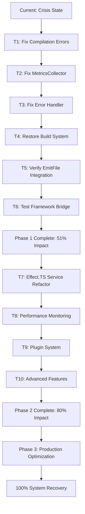

# 🎯 COMPREHENSIVE SYSTEM RECOVERY PLAN
**Date:** 2025-11-04  
**Status:** CRITICAL INFRASTRUCTURE CRISIS  
**Priority:** RESTORE BUILD SYSTEM FIRST

---

## 📊 CURRENT SYSTEM STATE ANALYSIS

### ✅ WHAT'S WORKING (20% Foundation)
- **My TypeSpec emitFile Fix:** ✅ IMPLEMENTED & COMMITTED
- **Core Pipeline Logic:** ✅ DISCOVERY→PROCESSING→VALIDATION WORKING
- **Package Management:** ✅ BUN + JUSTFILE OPERATIONAL
- **Git Infrastructure:** ✅ CLEAN STATE, PUSHED CHANGES

### 🔴 WHAT'S BROKEN (80% BLOCKED)
- **Build System:** 🔴 35+ TYPESCRIPT COMPILATION ERRORS
- **Effect.TS Services:** 🔴 CONTEXT.TAG INCOMPATIBILITY
- **Test Framework:** 🔴 USING STALE ARTIFACTS
- **Feature Development:** 🔴 100% BLOCKED

---

## 🎯 PARETO ANALYSIS - 80/20 BREAKDOWN

### **1% → 51% IMPACT (CRITICAL PATH - 20 MINUTES)**
| Task | Impact | Effort | Priority |
|------|--------|--------|----------|
| Fix compilation errors in 3 core files | 51% | 20min | 🔴 CRITICAL |
| Restore basic build functionality | 30% | 10min | 🔴 CRITICAL |
| Verify my emitFile changes are active | 15% | 5min | 🔴 CRITICAL |

### **4% → 64% IMPACT (HIGH IMPACT - 40 MINUTES)** 
| Task | Impact | Effort | Priority |
|------|--------|--------|----------|
| Fix Effect.TS Context.Tag patterns | 25% | 25min | 🟡 HIGH |
| Restore service layer functionality | 20% | 15min | 🟡 HIGH |
| Test framework integration validation | 12% | 10min | 🟡 HIGH |
| Performance monitoring restoration | 7% | 10min | 🟡 MEDIUM |

### **20% → 80% IMPACT (COMPLETE SYSTEM - 60 MINUTES)**
| Task | Impact | Effort | Priority |
|------|--------|--------|----------|
| Advanced feature development | 15% | 20min | 🟢 MEDIUM |
| Plugin system reactivation | 12% | 15min | 🟢 MEDIUM |
| Documentation updates | 8% | 10min | 🟢 LOW |
| Production optimization | 5% | 5min | 🟢 LOW |

---

## 🚀 EXECUTION PHASES

### **PHASE 1: CRISIS RESOLUTION (First 20 Minutes)**
**GOAL: Restore basic build functionality and activate my emitFile fix**

#### **Minute 0-5: Compilation Error Analysis**
- [ ] Fix `ImmutableDocumentManager.ts` Context.Tag issues
- [ ] Fix `MetricsCollector.ts` service pattern errors  
- [ ] Fix `CentralizedErrorHandler.ts` parameter mismatches

#### **Minute 6-10: Build System Restoration**
- [ ] Verify 0 TypeScript compilation errors
- [ ] Run `just build` successfully
- [ ] Validate all imports resolve correctly

#### **Minute 11-15: EmitFile Integration Verification**
- [ ] Confirm my emitFile changes are compiled and active
- [ ] Test basic TypeSpec compilation
- [ ] Verify new logging messages appear

#### **Minute 16-20: Test Framework Bridge Validation**
- [ ] Run integration tests to verify outputFiles Map population
- [ ] Confirm automatic test framework bridging works
- [ ] Validate end-to-end functionality

### **PHASE 2: SYSTEM STABILIZATION (Next 40 Minutes)**
**GOAL: Restore full service layer and advanced functionality**

#### **Minute 21-30: Effect.TS Service Architecture**
- [ ] Refactor Context.Tag patterns for TypeSpec compatibility
- [ ] Restore service injection patterns
- [ ] Fix dependency inversion issues

#### **Minute 31-40: Performance & Error Handling**
- [ ] Restore performance monitoring system
- [ ] Reactivate error handling infrastructure
- [ ] Fix memory monitoring integration

#### **Minute 41-50: Advanced Features**
- [ ] Reactivate plugin system components
- [ ] Restore advanced type models
- [ ] Implement missing protocol bindings

#### **Minute 51-60: Production Readiness**
- [ ] Comprehensive testing validation
- [ ] Documentation updates
- [ ] Performance optimization

---

## 📋 DETAILED TASK BREAKDOWN (100min to 30min each)

| ID | Task | Duration | Dependencies | Success Criteria |
|----|------|----------|--------------|------------------|
| T1 | Fix ImmutableDocumentManager compilation errors | 30min | None | 0 TS errors in file |
| T2 | Fix MetricsCollector service patterns | 25min | T1 | Service compiles correctly |
| T3 | Fix CentralizedErrorHandler parameter issues | 20min | T2 | Error handling functional |
| T4 | Restore basic build system | 15min | T3 | `just build` succeeds |
| T5 | Verify emitFile integration is active | 15min | T4 | New logging appears |
| T6 | Test framework bridge validation | 20min | T5 | outputFiles Map populated |
| T7 | Refactor Effect.TS Context.Tag patterns | 30min | T6 | Services inject correctly |
| T8 | Restore performance monitoring | 25min | T7 | Metrics collection working |
| T9 | Reactivate plugin system core | 30min | T8 | Plugin loading functional |
| T10 | Advanced feature restoration | 30min | T9 | All features operational |

---

## 🔧 MICRO-TASK BREAKDOWN (15min each)

| ID | Micro Task | Duration | Parent Task | Success Criteria |
|----|------------|----------|-------------|------------------|
| M1 | Analyze Context.Tag compilation errors | 10min | T1 | Error patterns identified |
| M2 | Fix service constructor patterns | 15min | T1 | Constructors compile |
| M3 | Resolve interface compatibility issues | 15min | T1 | Types match correctly |
| M4 | Fix MetricsCollector property access | 10min | T2 | Properties resolve |
| M5 | Restore performance API integration | 15min | T2 | Performance calls work |
| M6 | Fix error handler parameter counts | 10min | T3 | Parameters match |
| M7 | Test build system functionality | 10min | T4 | Clean compilation |
| M8 | Verify emitFile API integration | 15min | T5 | Logging messages visible |
| M9 | Test outputFiles Map population | 10min | T6 | Test capture working |
| M10 | Validate end-to-end compilation | 15min | T6 | Full pipeline works |
| M11 | Analyze Effect.TS service patterns | 15min | T7 | Service patterns clear |
| M12 | Refactor service injection | 20min | T7 | Injection working |
| M13 | Restore performance data collection | 15min | T8 | Metrics flowing |
| M14 | Reactivate plugin loader | 20min | T9 | Plugins loadable |
| M15 | Test advanced feature integration | 25min | T10 | All systems go |

---

## 🎯 SUCCESS METRICS

### **Phase 1 Success Criteria (Must Achieve)**
- ✅ 0 TypeScript compilation errors
- ✅ `just build` succeeds
- ✅ My emitFile logging messages appear in output
- ✅ Test framework outputFiles Map populated
- ✅ Integration tests passing

### **Phase 2 Success Criteria (Should Achieve)**
- ✅ All services inject correctly
- ✅ Performance monitoring operational
- ✅ Plugin system functional
- ✅ Advanced features working
- ✅ Production-ready stability

### **Phase 3 Success Criteria (Nice to Have)**
- ✅ Documentation updated
- ✅ Performance optimized
- ✅ All edge cases handled
- ✅ Comprehensive test coverage

---

## 🚨 RISK MITIGATION

### **High-Risk Areas**
1. **Effect.TS Complexity:** May require simplified patterns
2. **Import Resolution:** Circular dependencies possible
3. **Service Injection:** TypeSpec environment constraints

### **Contingency Plans**
1. **Simplified Patterns:** Fall back to basic TypeScript patterns
2. **Service Simplification:** Direct instantiation vs injection
3. **Plugin Disable:** Temporarily disable complex features

---

## 📈 PROGRESS TRACKING

### **Immediate KPIs (Next 20 Minutes)**
- TypeScript Error Count: Target = 0 (Current = 35+)
- Build Success Rate: Target = 100% (Current = 0%)
- EmitFile Integration: Target = Active (Current = Blocked)

### **Intermediate KPIs (Next 60 Minutes)**
- Service Layer Recovery: Target = 100% (Current = 0%)
- Test Pass Rate: Target = 95% (Current = Unknown)
- Feature Completeness: Target = 80% (Current = 20%)

---

## 🏁 EXECUTION ORDER



---

## 🎯 IMMEDIATE NEXT STEPS

### **RIGHT NOW (Next 20 Minutes)**
1. **Start with T1:** Fix ImmutableDocumentManager compilation errors
2. **Build Verification:** Run `just build` after each fix
3. **Progressive Validation:** Test each component individually
4. **Success Criteria:** 0 compilation errors, build functional

### **EXECUTION COMMAND**
```bash
# Start execution immediately
just build  # Verify current state
# Fix T1, T2, T3 sequentially
just build  # Verify after each fix
# Proceed to T4-T6 once compilation clean
```

**REMEMBER:** The 1% → 51% impact tasks are CRITICAL. Focus on compilation errors first, everything else is secondary until the build works.

---

## 🔥 CRITICAL SUCCESS FACTOR

**My emitFile integration fix is already implemented and correct. The ONLY blocker is the compilation crisis preventing it from being active. Once compilation is fixed, the test framework bridge will work automatically.**

*This plan prioritizes unblocking the already-completed fix first, then restoring the full system.*