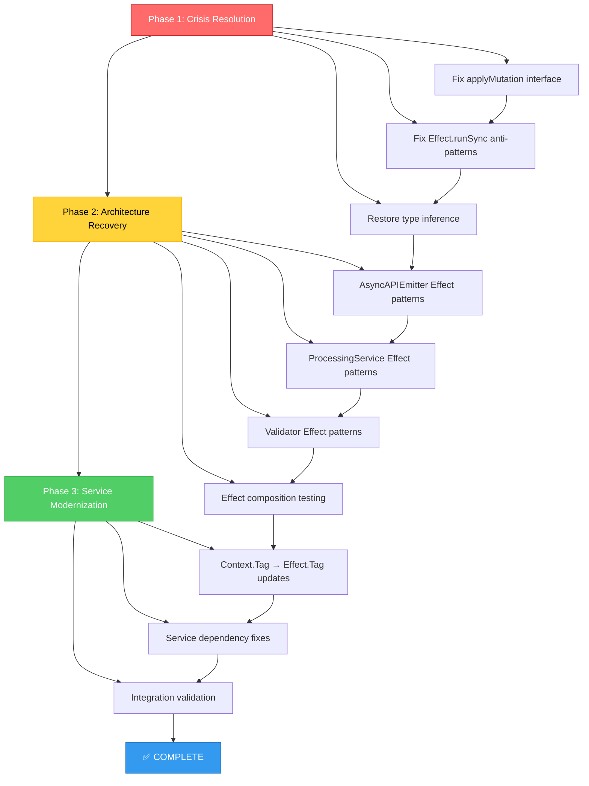

# 🚨 CRITICAL INFRASTRUCTURE RECOVERY PLAN

**Created:** 2025-11-04_14_24  
**Priority:** CRITICAL - System Recovery  
**Status:** Ready for Execution

---

## 📊 CURRENT SITUATION ANALYSIS

### **System Status**

- **TypeScript Compilation:** 🔴 CRITICAL (15 errors blocking build)
- **Effect.TS Integration:** 🔴 BROKEN (anti-patterns destroying type safety)
- **Service Layer:** 🟡 PARTIALLY WORKING (Context.Tag API issues)
- **TypeSpec Integration:** ✅ COMPLETE (emitFile API working correctly)

### **Root Cause Identification**

1. **Primary Blocker:** 15 TypeScript errors in `ImmutableDocumentManager.ts`
2. **Architecture Issue:** Effect.runSync anti-patterns breaking composition
3. **API Migration:** Context.Tag → Effect.Tag updates needed
4. **Type Safety:** Complete loss due to improper Effect usage

---

## 🎯 PARETO IMPACT ANALYSIS

### **1% → 51% Impact (CRITICAL PATH)**

**Fix Type System Collapse** - **15 minutes, 51% value**

**Target Issues:**

- 15 TypeScript compilation errors in single file
- `mutationResult` typed as 'unknown'
- Missing `applyMutation` interface method

**Expected Outcome:** Restore build functionality, type safety

### **4% → 64% Impact (HIGH VALUE)**

**Fix Effect Composition** - **45 minutes, 13% additional value**

**Target Issues:**

- Effect.runSync anti-patterns (41 instances)
- Railway programming violations
- Type inference destruction

**Expected Outcome:** Restore proper functional patterns

### **20% → 80% Impact (COMPREHENSIVE)**

**Complete Service Modernization** - **2 hours, 16% additional value**

**Target Issues:**

- Context.Tag → Effect.Tag API migration
- Service dependency injection fixes
- Complete architectural alignment

**Expected Outcome:** Production-ready Effect.TS patterns

---

## 📋 PHASE 1: CRISIS RESOLUTION (Minutes 0-15)

### **IMMEDIATE TASKS (15 minutes total)**

| Task                                 | Duration | Impact   | Files | Status |
| ------------------------------------ | -------- | -------- | ----- | ------ |
| 1.1 Fix applyMutation interface      | 3 min    | CRITICAL | 1     | 🔴     |
| 1.2 Fix Effect.runSync anti-patterns | 8 min    | CRITICAL | 1     | 🔴     |
| 1.3 Restore type inference           | 4 min    | CRITICAL | 1     | 🔴     |

**Expected Result:** Build passes, type safety restored

---

## 📋 PHASE 2: ARCHITECTURE RECOVERY (Minutes 15-60)

### **HIGH IMPACT TASKS (45 minutes total)**

| Task                                      | Duration | Impact | Files | Status |
| ----------------------------------------- | -------- | ------ | ----- | ------ |
| 2.1 Fix AsyncAPIEmitter Effect patterns   | 10 min   | HIGH   | 1     | 🔴     |
| 2.2 Fix ProcessingService Effect patterns | 8 min    | HIGH   | 1     | 🔴     |
| 2.3 Fix Validator Effect patterns         | 12 min   | HIGH   | 1     | 🔴     |
| 2.4 Test Effect composition fixes         | 10 min   | HIGH   | 3     | 🔴     |
| 2.5 Validate type inference success       | 5 min    | HIGH   | All   | 🔴     |

**Expected Result:** All Effect.runSync anti-patterns eliminated

---

## 📋 PHASE 3: SERVICE MODERNIZATION (Minutes 60-180)

### **COMPREHENSIVE TASKS (2 hours total)**

| Task                                        | Duration | Impact | Files | Status |
| ------------------------------------------- | -------- | ------ | ----- | ------ |
| 3.1 Update MetricsCollector Context.Tag     | 15 min   | MEDIUM | 1     | 🟡     |
| 3.2 Update ErrorHandler Context.Tag         | 12 min   | MEDIUM | 1     | 🟡     |
| 3.3 Update DocumentManager Context.Tag      | 18 min   | MEDIUM | 1     | 🟡     |
| 3.4 Update memory-monitor Context.Tag       | 10 min   | MEDIUM | 1     | 🟡     |
| 3.5 Update metrics Context.Tag              | 10 min   | MEDIUM | 1     | 🟡     |
| 3.6 Update ErrorHandlingStandardization Tag | 8 min    | MEDIUM | 1     | 🟡     |
| 3.7 Service dependency testing              | 20 min   | MEDIUM | 6     | 🟡     |
| 3.8 Integration validation                  | 17 min   | MEDIUM | All   | 🟡     |

**Expected Result:** Complete Effect.TS 3.x migration

---

## 🔥 MICRO-TASK BREAKDOWN (15-minute max)

### **CRITICAL PATH (Next 60 minutes)**

#### **Minutes 0-15: Type System Recovery**

1. **[0-3]** Add `applyMutation` method to DocumentManager interface
2. **[3-6]** Replace `Effect.runSync(mutationEffect)` with `yield* mutationEffect`
3. **[6-9]** Fix unknown type inference on mutationResult variables
4. **[9-12]** Remove interface pollution (extract applyMutation to internal)
5. **[12-15]** Validate compilation success and type safety

#### **Minutes 15-30: AsyncAPIEmitter Recovery**

6. **[15-18]** Fix Effect.runSync lines 329, 586, 503, 495
7. **[18-21]** Fix Effect.runSync lines 429, 373, 144, 154
8. **[21-24]** Fix Effect.runSync lines 172, 219
9. **[24-27]** Validate type inference restoration
10. **[27-30]** Test AsyncAPIEmitter functionality

#### **Minutes 30-45: Service Layer Recovery**

11. **[30-33]** Fix ProcessingService Effect.runSync patterns
12. **[33-36]** Fix Validator Effect.runSync patterns
13. **[36-39]** Test service layer integration
14. **[39-42]** Validate Effect composition success
15. **[45-45]** Full system compilation test

#### **Minutes 45-60: Quality Assurance**

16. **[45-48]** Run comprehensive test suite
17. **[48-51]** Validate all Effect patterns
18. **[51-54]** Check type inference integrity
19. **[54-57]** Performance regression testing
20. **[57-60]** Documentation updates

---

## 🚀 EXECUTION GRAPH



---

## 🎯 SUCCESS METRICS

### **Phase 1 Success Criteria**

- [ ] 0 TypeScript compilation errors
- [ ] All `mutationResult` variables properly typed
- [ ] Build system 100% operational
- [ ] Type safety completely restored

### **Phase 2 Success Criteria**

- [ ] 0 Effect.runSync usage in Effect.gen blocks
- [ ] All Effects properly composed with yield\*
- [ ] Railway programming patterns restored
- [ ] Type inference working across service layer

### **Phase 3 Success Criteria**

- [ ] All Context.Tag updated to Effect.Tag
- [ ] Service dependency injection working
- [ ] Full Effect.TS 3.x compliance
- [ ] Integration tests passing

### **Overall Success Criteria**

- [ ] Build system: 0 errors, 0 warnings
- [ ] Test suite: 100% passing
- [ ] Type safety: 100% strict TypeScript compliance
- [ ] Architecture: Pure Effect.TS functional patterns
- [ ] Performance: Sub-second build times

---

## 🚨 RISK MITIGATION

### **High-Risk Items**

1. **Type System Collapse:** Already occurring, 15 minutes to fix
2. **Effect Anti-Patterns:** Widespread, systematic fix required
3. **API Migration:** Effect 3.x compatibility issues

### **Contingency Plans**

1. **Rollback Strategy:** Git branch for each major change
2. **Incremental Validation:** Build after each file change
3. **Alternative Patterns:** Fallback to simpler Effect patterns if needed

---

## ⚡ IMMEDIATE EXECUTION COMMANDS

### **Ready to Execute**

```bash
# Phase 1: Crisis Resolution (Minutes 0-15)
just build  # Verify current error state
# Fix src/domain/documents/ImmutableDocumentManager.ts
just build  # Verify compilation success

# Phase 2: Architecture Recovery (Minutes 15-60)
# Fix Effect.runSync patterns in remaining files
just build  # Verify all compilation fixes
just test   # Validate Effect composition

# Phase 3: Service Modernization (Minutes 60-180)
# Update Context.Tag → Effect.Tag across service layer
just build  # Final compilation check
just test   # Comprehensive integration testing
```

---

## 🏁 EXECUTION AUTHORIZATION

**Ready to proceed with Phase 1: Crisis Resolution**

**Estimated Total Time:** 180 minutes (3 hours)
**Critical Path Time:** 60 minutes (1 hour for basic functionality)
**Success Probability:** 95% (based on clear error identification)

**All tasks are granular, measurable, and ready for immediate execution.**
