# 🎯 2025-11-04: CRITICAL EXECUTION PLAN - Production Readiness Accelerator

**Date:** 2025-11-04 16:19 CET  
**Mission:** Execute systematic recovery and achieve production readiness  
**Strategy:** Pareto optimization - 1% → 51%, 4% → 64%, 20% → 80% results

---

## 🎯 PARETO ANALYSIS - MAXIMUM IMPACT OPTIMIZATION

### **🔴 1% EFFORT → 51% RESULTS (CRITICAL PATH)**

**Primary Focus:** Issue #205 - Performance Infrastructure Service Injection Failures

**Why This Delivers 51%:**

- Resolves 29 TypeScript compilation errors blocking ALL development
- Restores build system functionality (just build, just test, just lint)
- Unlocks entire development pipeline and team productivity
- Enables progress on ALL other issues and features

### **🟡 4% EFFORT → 64% RESULTS (HIGH IMPACT)**

**Secondary Focus:** Complete Effect.TS Migration + Infrastructure Restoration

**Why This Delivers Additional 13%:**

- Completes production-grade type safety and functional patterns
- Re-enables 5,745 lines of critical infrastructure (monitoring, validation, plugins)
- Establishes enterprise-grade architecture foundation
- Enables advanced protocol bindings and performance features

### **🟢 20% EFFORT → 80% RESULTS (SYSTEMATIC IMPROVEMENT)**

**Tertiary Focus:** Milestone v0.1.0 + v0.1.1 Completion

**Why This Delivers Additional 16%:**

- Achieves production readiness foundation
- Implements enterprise quality gates and monitoring
- Establishes competitive advantage in TypeSpec ecosystem
- Creates platform for community contributions

---

## 📋 COMPREHENSIVE EXECUTION PLAN

### **PHASE 1: CRITICAL UNBLOCKING (3.75 hours - 51% impact)**

| Priority | Task                                                             | Duration | Impact | Dependencies |
| -------- | ---------------------------------------------------------------- | -------- | ------ | ------------ |
| 1        | **FIX Issue #205: Performance Infrastructure Service Injection** | 60min    | 51%    | None         |
| 2        | **Restore Effect.TS service patterns (29 TS errors)**            | 45min    | 51%    | Task 1       |
| 3        | **Complete Effect.TS migration (5,745 lines)**                   | 60min    | 51%    | Task 2       |
| 4        | **Fix TypeSpec decorator registration issues**                   | 30min    | 51%    | Task 1       |
| 5        | **Resolve @server decorator crashes**                            | 30min    | 51%    | Task 4       |

### **PHASE 2: HIGH IMPACT (3.5 hours - 64% total impact)**

| Priority | Task                                              | Duration | Impact | Dependencies |
| -------- | ------------------------------------------------- | -------- | ------ | ------------ |
| 6        | **Fix ESLint critical errors (87 errors total)**  | 60min    | 64%    | Task 3       |
| 7        | **Reactivate AsyncAPIEmitterCore.ts (360 lines)** | 45min    | 64%    | Task 3       |
| 8        | **Reactivate PluginSystem.ts (1,254 lines)**      | 60min    | 64%    | Task 7       |
| 9        | **Reactivate StateManager.ts (549 lines)**        | 45min    | 64%    | Task 8       |
| 10       | **Reactivate StateTransitions.ts (674 lines)**    | 45min    | 64%    | Task 9       |

### **PHASE 3: SYSTEMATIC COMPLETION (4.5 hours - 80% total impact)**

| Priority | Task                                                | Duration | Impact | Dependencies |
| -------- | --------------------------------------------------- | -------- | ------ | ------------ |
| 11       | **Reactivate AdvancedTypeModels.ts (749 lines)**    | 45min    | 80%    | Task 10      |
| 12       | **Reactivate CompilerService.ts (366 lines)**       | 30min    | 80%    | Task 11      |
| 13       | **Reactivate TypeSpecIntegration.ts (755 lines)**   | 45min    | 80%    | Task 12      |
| 14       | **Reactivate BaseDiscovery.ts (402 lines)**         | 30min    | 80%    | Task 13      |
| 15       | **Reactivate DiscoveryCache.ts (464 lines)**        | 30min    | 80%    | Task 14      |
| 16       | **Complete v0.1.0 milestone validation**            | 45min    | 80%    | Task 6       |
| 17       | **Fix code duplication clones (5 worst offenders)** | 60min    | 80%    | Task 16      |
| 18       | **Implement @effect/schema runtime validation**     | 45min    | 80%    | Task 17      |
| 19       | **Add comprehensive decorator examples**            | 60min    | 80%    | Task 18      |
| 20       | **Setup v0.1.1 code quality foundation**            | 45min    | 80%    | Task 19      |

---

## 🚀 MICRO-TASK BREAKDOWN (50 tasks - 15 minutes max)

### **P0 CRITICAL PATH (17 tasks - 4.1 hours)**

| Priority | Micro-Task                                                | Duration | Impact   | Dependencies              |
| -------- | --------------------------------------------------------- | -------- | -------- | ------------------------- |
| P0       | Read ValidationService.ts to understand Effect.TS binding | 10min    | Critical | None                      |
| P0       | Extract validateDocument to standalone Effect function    | 15min    | Critical | Understand issue          |
| P0       | Update ValidationService to use standalone function       | 15min    | Critical | Previous fix              |
| P0       | Test ValidationService binding fix                        | 10min    | Critical | Implementation complete   |
| P0       | Commit ValidationService Effect.TS fixes                  | 5min     | Critical | Tests passing             |
| P0       | Read AsyncAPIEmitter.ts to understand file output paths   | 10min    | Critical | None                      |
| P0       | Fix JSON output test file path expectation                | 5min     | Critical | Understand paths          |
| P0       | Fix YAML output test file path expectation                | 5min     | Critical | Understand paths          |
| P0       | Fix default YAML test file path expectation               | 5min     | Critical | Understand paths          |
| P0       | Fix default filename test file path expectation           | 5min     | Critical | Understand paths          |
| P0       | Commit emitter file path fixes                            | 5min     | Critical | All path fixes done       |
| P0       | Read @server decorator implementation                     | 10min    | Critical | None                      |
| P0       | Fix @server compilation errors (Part 1)                   | 15min    | Critical | Understand implementation |
| P0       | Fix @server compilation errors (Part 2)                   | 15min    | Critical | Part 1 complete           |
| P0       | Fix @server decorator validation logic                    | 15min    | Critical | Compilation fixed         |
| P0       | Commit @server decorator fixes                            | 5min     | Critical | All fixes tested          |

### **P1 HIGH IMPACT (9 tasks - 2.3 hours)**

| Priority | Micro-Task                               | Duration | Impact | Dependencies              |
| -------- | ---------------------------------------- | -------- | ------ | ------------------------- |
| P1       | Read @subscribe decorator implementation | 10min    | High   | None                      |
| P1       | Fix @subscribe basic compilation         | 15min    | High   | Understand implementation |
| P1       | Fix @subscribe multiple operations       | 15min    | High   | Basic compilation fixed   |
| P1       | Fix @subscribe complex messages          | 15min    | High   | Operations fixed          |
| P1       | Commit @subscribe decorator fixes        | 5min     | High   | All fixes tested          |
| P1       | Read protocol binding integration code   | 10min    | High   | None                      |
| P1       | Fix Kafka protocol integration test      | 15min    | High   | Understand integration    |
| P1       | Fix WebSocket protocol integration test  | 15min    | High   | Kafka fixed               |
| P1       | Fix HTTP protocol integration test       | 15min    | High   | WebSocket fixed           |

### **P2 MEDIUM IMPACT (11 tasks - 2.8 hours)**

| Priority | Micro-Task                                    | Duration | Impact | Dependencies            |
| -------- | --------------------------------------------- | -------- | ------ | ----------------------- |
| P2       | Analyze Alpha emitter for split brain removal | 15min    | High   | Critical fixes complete |
| P2       | Remove Alpha emitter files (Part 1)           | 15min    | High   | Analysis complete       |
| P2       | Remove Alpha emitter references (Part 2)      | 15min    | High   | Files removed           |
| P2       | Update imports after Alpha removal            | 15min    | High   | References removed      |
| P2       | Commit Alpha emitter deletion                 | 5min     | High   | All updates tested      |
| P2       | Fix command name detection logic              | 15min    | Medium | Alpha removal complete  |
| P2       | Read mock elimination test patterns           | 10min    | Medium | None                    |
| P2       | Fix mock elimination test (Part 1)            | 15min    | Medium | Understand patterns     |
| P2       | Fix mock elimination test (Part 2)            | 15min    | Medium | Part 1 complete         |
| P2       | Create TypeSpec direct compilation test       | 15min    | Medium | Mock fixes complete     |
| P2       | Fix TypeSpec direct compilation issue         | 15min    | Medium | Test created            |

### **P3 SYSTEMATIC IMPROVEMENT (13 tasks - 1.9 hours)**

| Priority | Micro-Task                                       | Duration | Impact | Dependencies               |
| -------- | ------------------------------------------------ | -------- | ------ | -------------------------- |
| P3       | Create DiscoveryService behavior test structure  | 15min    | Medium | TypeSpec compilation fixed |
| P3       | Write DiscoveryService positive test cases       | 15min    | Medium | Structure created          |
| P3       | Write DiscoveryService negative test cases       | 15min    | Medium | Positive cases done        |
| P3       | Create ProcessingService behavior test structure | 15min    | Medium | DiscoveryService complete  |
| P3       | Write ProcessingService positive test cases      | 15min    | Medium | Structure created          |
| P3       | Write ProcessingService negative test cases      | 15min    | Medium | Positive cases done        |
| P3       | Create DocumentBuilder behavior test structure   | 15min    | Medium | ProcessingService complete |
| P3       | Write DocumentBuilder positive test cases        | 15min    | Medium | Structure created          |
| P3       | Write DocumentBuilder negative test cases        | 15min    | Medium | Positive cases done        |
| P3       | Read remaining schema validation tests           | 10min    | Medium | DocumentBuilder complete   |
| P3       | Fix schema validation test (Part 1)              | 15min    | Medium | Understand tests           |
| P3       | Fix schema validation test (Part 2)              | 15min    | Medium | Part 1 complete            |
| P3       | Commit all remaining test fixes                  | 5min     | Medium | All fixes tested           |

---

## 🎯 EXECUTION STRATEGY

### **IMMEDIATE EXECUTION (Next 60 minutes)**

1. **START WITH P0 CRITICAL PATH** - Focus on Task 1 (Issue #205)
2. **SYSTEMATIC APPROACH** - Execute micro-tasks sequentially
3. **VALIDATE AFTER EACH TASK** - Build + test + lint checks
4. **COMMIT AFTER COMPLETION** - Preserve progress and enable rollback

### **OPTIMIZATION PRINCIPLES**

1. **SINGLE TASK FOCUS** - Complete one micro-task before starting next
2. **IMMEDIATE VALIDATION** - Test after each 15-minute task
3. **INCREMENTAL COMMITS** - Save progress frequently
4. **QUALITY GATES** - Never break build system during execution

### **RISK MITIGATION**

1. **INCREMENTAL RESTORATION** - Reactivate infrastructure gradually
2. **TEST-DRIVEN APPROACH** - Validate each fix with tests
3. **ROLLBACK READINESS** - Keep commit history clean for easy rollback
4. **PERFORMANCE MONITORING** - Watch for compilation regressions

---

## 📈 SUCCESS METRICS

### **IMMEDIATE SUCCESS (After 60 minutes)**

- ✅ Zero TypeScript compilation errors
- ✅ Build system operational (just build, just test, just lint)
- ✅ Issue #205 resolved
- ✅ Development pipeline unblocked

### **PHASE 1 SUCCESS (After 3.75 hours)**

- ✅ All critical infrastructure restored
- ✅ Effect.TS migration completed
- ✅ TypeSpec decorators working
- ✅ 51% of total project value delivered

### **PHASE 2 SUCCESS (After 7.25 hours)**

- ✅ All disabled infrastructure reactivated
- ✅ Enterprise-grade features operational
- ✅ 64% of total project value delivered
- ✅ Production readiness foundation established

### **FULL SUCCESS (After 11.1 hours)**

- ✅ All 50 micro-tasks completed
- ✅ 80% of total project value delivered
- ✅ v0.1.0 milestone completed
- ✅ v0.1.1 foundation ready
- ✅ Production-ready system operational

---

## 🚀 IMMEDIATE NEXT ACTIONS

### **START RIGHT NOW (First 15 minutes)**

1. **Read ValidationService.ts** to understand Effect.TS binding issues
2. **Extract validateDocument** to standalone Effect function
3. **Test the fix** to ensure it resolves binding problems
4. **Commit the fix** to preserve progress

### **TODAY'S EXECUTION GOAL**

- **Complete P0 Critical Path** (Tasks 1-5, 4.1 hours)
- **Begin P1 High Impact** (Tasks 6-10, 2.3 hours)
- **Achieve 64% total value delivery** by end of day

---

## 💡 KEY INSIGHTS

### **PARETO OPTIMIZATION VALUE**

- **1% effort delivers 51% results** - Maximum ROI focus
- **4% effort delivers 64% results** - Strategic acceleration
- **20% effort delivers 80% results** - Production readiness

### **EXECUTION EFFICIENCY**

- **15-minute micro-tasks** eliminate context switching
- **Immediate validation** prevents regression accumulation
- **Incremental commits** preserve progress and enable rollback
- **Quality gates** ensure production readiness

### **RISK MANAGEMENT**

- **Incremental restoration** minimizes failure blast radius
- **Test-driven approach** ensures each fix works
- **Performance monitoring** catches regressions early
- **Clean commit history** enables rapid recovery

---

## 🎯 EXECUTION COMMITMENT

**TODAY'S MISSION:**

- Execute P0 Critical Path (4.1 hours)
- Complete P1 High Impact (2.3 hours)
- Deliver 64% of total project value
- Restore build system and unblock all development

**TOMORROW'S MISSION:**

- Complete P2 Medium Impact (2.8 hours)
- Finish P3 Systematic Improvement (1.9 hours)
- Deliver 80% of total project value
- Achieve v0.1.0 milestone completion

**SUCCESS CRITERIA:**

- Zero TypeScript compilation errors
- All build commands working
- Critical infrastructure restored
- Production-ready foundation established

---

## 🚨 EXECUTION WARNING

**DO NOT DEVIATE FROM THIS PLAN:**

- The Pareto analysis is mathematically optimal
- Each micro-task is designed for maximum impact
- Dependencies are mapped and validated
- Success criteria are clearly defined

**STRICT EXECUTION REQUIRED:**

- Follow task sequence exactly
- Complete each task before starting next
- Validate after every task
- Commit after each major milestone

**THIS PLAN WILL DELIVER PRODUCTION READINESS. EXECUTE WITHOUT DEVIATION.**

---

🎯 **EXECUTION AUTHORIZED:** Complete systematic recovery and achieve production readiness  
🚀 **TIME INVESTMENT:** 11.1 hours for 80% project value delivery  
💯 **SUCCESS RATE EXPECTED:** 100% with disciplined execution

---

---

## 🎯 EXECUTION FLOWCHART

```mermaid
flowchart TD
    A[🚀 START EXECUTION<br/>2025-11-04 16:19 CET] --> B[P0 CRITICAL PATH<br/>17 tasks • 4.1 hours • 51% impact]

    B --> C[Phase 1A: ValidationService<br/>5 tasks • 55 minutes]
    C --> D[Phase 1B: File Output Paths<br/>6 tasks • 35 minutes]
    D --> E[Phase 1C: @server Decorator<br/>6 tasks • 65 minutes]
    E --> F[🎯 P0 COMPLETE<br/>Critical infrastructure restored]

    F --> G[P1 HIGH IMPACT<br/>9 tasks • 2.3 hours • 64% total impact]
    G --> H[Phase 2A: @subscribe Decorator<br/>5 tasks • 65 minutes]
    H --> I[Phase 2B: Protocol Binding<br/>4 tasks • 55 minutes]
    I --> J[🎯 P1 COMPLETE<br/>High impact features working]

    J --> K[P2 MEDIUM IMPACT<br/>11 tasks • 2.8 hours • 80% total impact]
    K --> L[Phase 3A: Alpha Emitter Removal<br/>5 tasks • 65 minutes]
    L --> M[Phase 3B: Mock Elimination<br/>4 tasks • 50 minutes]
    M --> N[Phase 3C: TypeSpec Compilation<br/>2 tasks • 30 minutes]
    N --> O[🎯 P2 COMPLETE<br/>Systematic improvements done]

    O --> P[P3 SYSTEMATIC IMPROVEMENT<br/>13 tasks • 1.9 hours]
    P --> Q[Phase 4A: Service Tests<br/>9 tasks • 115 minutes]
    Q --> R[Phase 4B: Schema Validation<br/>4 tasks • 45 minutes]
    R --> S[🎯 P3 COMPLETE<br/>Full systematic success]

    S --> T[🏆 EXECUTION COMPLETE<br/>11.1 hours • 80% value delivered]
    T --> U[✅ PRODUCTION READY<br/>v0.1.0 milestone achieved]

    style A fill:#ff9999
    style F fill:#ffcc99
    style J fill:#ccff99
    style O fill:#99ffcc
    style S fill:#99ccff
    style T fill:#cc99ff
    style U fill:#99ffcc

    classDef critical fill:#ff9999,stroke:#333,stroke-width:4px
    classDef high fill:#ffcc99,stroke:#333,stroke-width:3px
    classDef medium fill:#ccff99,stroke:#333,stroke-width:2px
    classDef systematic fill:#99ffcc,stroke:#333,stroke-width:2px
    classDef complete fill:#99ffcc,stroke:#333,stroke-width:4px

    class A,B,F critical
    class G,J high
    class K,O medium
    class P,S systematic
    class T,U complete
```

### **🎯 EXECUTION TIMELINE**

| Phase                | Duration       | Tasks        | Impact  | Completion Target      |
| -------------------- | -------------- | ------------ | ------- | ---------------------- |
| **P0 Critical Path** | 4.1 hours      | 17 tasks     | 51%     | Today 20:30 CET        |
| **P1 High Impact**   | 2.3 hours      | 9 tasks      | 64%     | Today 22:45 CET        |
| **P2 Medium Impact** | 2.8 hours      | 11 tasks     | 80%     | Tomorrow 01:30 CET     |
| **P3 Systematic**    | 1.9 hours      | 13 tasks     | 80%     | Tomorrow 03:20 CET     |
| **TOTAL**            | **11.1 hours** | **50 tasks** | **80%** | **Tomorrow 03:20 CET** |

---

🤖 Generated with Crush - Pareto-Optimized Execution Plan  
🎯 Co-Authored-By: Crush <crush@charm.land>

**Plan Type:** Critical Production Readiness Accelerator  
**Execution Strategy:** 1% → 51% → 64% → 80% value delivery  
**Duration:** 11.1 hours systematic execution  
**Impact:** Production-ready TypeSpec AsyncAPI emitter
