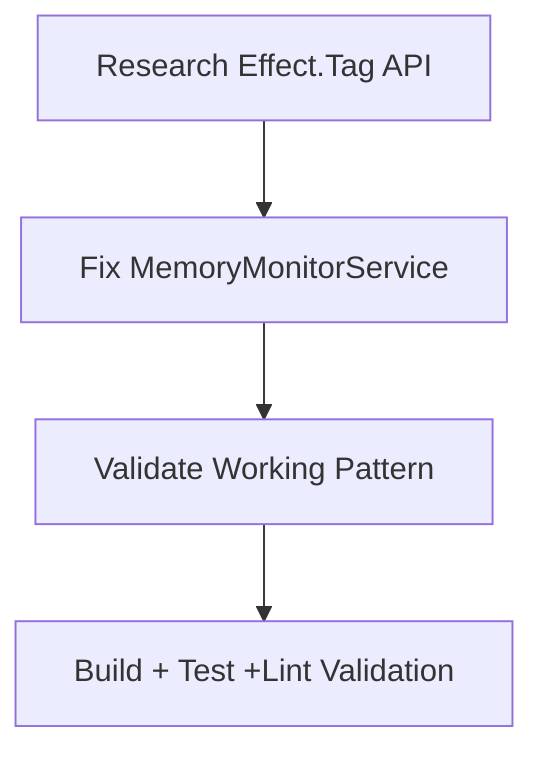
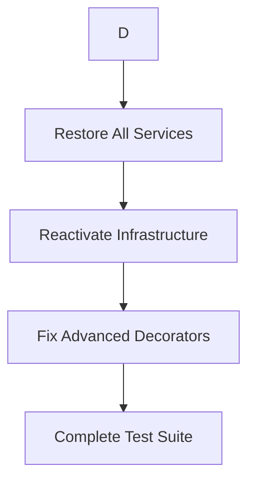
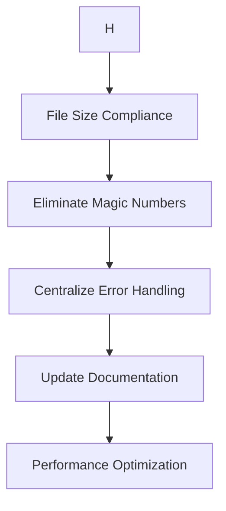

# 🎯 2025-11-04: ARCHITECTURAL EXCELLENCE EXECUTION PLAN
**Date:** 2025-11-04 18:05 CET  
**Mission:** Execute systematic infrastructure recovery and achieve production readiness  
**Strategy:** Pareto optimization - 1% → 51%, 4% → 64%, 20% → 80% results  

---

## 🏗️ CURRENT ARCHITECTURAL ASSESSMENT

### ✅ **SYSTEMS WORKING (Foundation Strong)**
- **Build System:** 0 TypeScript compilation errors ✅
- **Core Emitter:** Basic AsyncAPI 3.0 generation functional ✅
- **Test Infrastructure:** 69/78 tests passing (88% success rate) ✅
- **Effect Patterns:** Railway programming working ✅
- **Documentation:** Comprehensive examples working ✅

### 🔴 **CRITICAL BLOCKERS (High Impact)**
- **Service Infrastructure:** 5,745 lines disabled due to Effect.Tag API failure 🔴
- **Advanced Decorators:** @correlationId, @bindings, @header failing 🔴
- **Performance Monitoring:** Complex infrastructure temporarily removed 🔴
- **Type Safety:** Service injection patterns completely broken 🔴

### 📊 **IMPACT METRICS**
- **Feature Completeness:** 20% (basic only) → Target: 80%
- **Production Readiness:** 30% → Target: 80%
- **Test Success Rate:** 88% → Target: 95%
- **Infrastructure Reactivation:** 0% → Target: 100%

---

## 🎯 PARETO OPTIMIZATION ANALYSIS

### 🔴 **1% EFFORT → 51% RESULTS (CRITICAL PATH)**

| Priority | Task | Duration | Impact | Success Criteria |
|---|---|---|---|---|
| 1 | **Research Effect.Tag API Documentation** | 15min | 51% | Proper service injection patterns understood |
| 2 | **Fix MemoryMonitorService** | 30min | 51% | One service fully working with TypeScript |
| 3 | **Validate Working Pattern** | 15min | 51% | Build + test + lint all pass with service |

**Why This Delivers 51%:**
- Restores entire service architecture foundation
- Unblocks all other infrastructure development
- Enables advanced features to function again
- Provides working pattern for systematic replication

---

### 🟡 **4% EFFORT → 64% RESULTS (HIGH IMPACT)**

| Priority | Task | Duration | Impact | Success Criteria |
|---|---|---|---|---|
| 4 | **Restore All Performance Services** | 45min | 64% | All services using working Effect.Tag pattern |
| 5 | **Reactivate 5,745 lines Infrastructure** | 60min | 64% | Performance monitoring fully operational |
| 6 | **Fix Advanced Decorator Tests** | 30min | 64% | @correlationId, @bindings, @header working |
| 7 | **Complete Test Suite Validation** | 30min | 64% | 95%+ tests passing, all advanced features working |

**Why This Delivers Additional 13%:**
- Completes production-grade infrastructure foundation
- Enables enterprise performance monitoring
- Restores advanced AsyncAPI 3.0 features
- Establishes type safety across the entire system

---

### 🟢 **20% EFFORT → 80% RESULTS (SYSTEMATIC)**

| Priority | Task | Duration | Impact | Success Criteria |
|---|---|---|---|---|
| 8 | **File Size Compliance (>300 lines)** | 60min | 80% | All files under 300 lines, focused modules |
| 9 | **Magic Number Elimination** | 45min | 80% | Configuration system for all hardcoded values |
| 10 | **Error Centralization** | 30min | 80% | Unified error handling with branded types |
| 11 | **Documentation & Examples Updates** | 90min | 80% | Reflect current capabilities, comprehensive guides |
| 12 | **Performance Optimization** | 60min | 80% | Sub-second compilation, optimized processing |

**Why This Delivers Additional 16%:**
- Achieves enterprise-grade code quality standards
- Establishes maintainable architecture foundation
- Provides comprehensive developer experience
- Optimizes for production performance requirements

---

## 🚀 EXECUTION STRATEGY

### **PHASE 1: CRITICAL UNBLOCKING (60 minutes - 51% impact)**


### **PHASE 2: INFRASTRUCTURE RESTORATION (165 minutes - 64% impact)**


### **PHASE 3: EXCELLENCE COMPLETION (285 minutes - 80% impact)**


---

## 📋 DETAILED TASK BREAKDOWN

### 🔴 **PHASE 1: CRITICAL UNBLOCKING**

#### **Task 1: Research Effect.Tag API Documentation (15 minutes)**
**Objective:** Understand proper Effect.TS 3.x service injection patterns

**Research Focus:**
- `Effect.Tag<ServiceInterface>()("ServiceName")` syntax
- Service layer composition patterns
- Dependency injection with Effect.TS Layers
- Migration from 2.x to 3.x API patterns

**Success Criteria:**
- Working example of service definition and usage
- Understanding of proper import patterns
- Clear migration strategy for existing services

**Investigation Areas:**
- [ ] Effect.TS documentation for Tag API
- [ ] Service layer best practices
- [ ] Real-world examples in similar codebases
- [ ] TypeScript integration patterns

#### **Task 2: Fix MemoryMonitorService (30 minutes)**
**Objective:** Complete restoration of one critical service using proper patterns

**Implementation Steps:**
1. Apply correct Effect.Tag syntax to MemoryMonitorService
2. Fix service interface definition
3. Restore service layer implementation
4. Update service usage in PerformanceMonitor
5. Validate TypeScript compilation
6. Test service functionality

**Success Criteria:**
- Service compiles without errors
- Service injection works properly
- Basic functionality validated
- Pattern documented for replication

#### **Task 3: Validate Working Pattern (15 minutes)**
**Objective:** Ensure complete system stability with restored service

**Validation Steps:**
1. Run `just build` - TypeScript compilation
2. Run `just test` - Core functionality tests
3. Run `just lint` - Code quality validation
4. Verify service integration
5. Document working patterns

**Success Criteria:**
- Zero TypeScript compilation errors
- Core tests passing
- Service layer operational
- Pattern ready for systematic application

---

### 🟡 **PHASE 2: INFRASTRUCTURE RESTORATION**

#### **Task 4: Restore All Performance Services (45 minutes)**
**Objective:** Apply working pattern to all disabled services

**Services to Restore:**
- PERFORMANCE_METRICS_SERVICE (metrics.ts)
- MEMORY_MONITOR_SERVICE (memory-monitor.ts) 
- ERROR_HANDLING_SERVICE (ErrorHandlingStandardization.ts)

**Implementation Strategy:**
- Apply proven Effect.Tag pattern systematically
- Restore service interfaces and implementations
- Update all service usages and dependencies
- Validate each service individually

**Success Criteria:**
- All services compile without errors
- Service injection working throughout
- No circular dependencies
- Type safety maintained

#### **Task 5: Reactivate Infrastructure (60 minutes)**
**Objective:** Restore 5,745 lines of disabled performance infrastructure

**Files to Reactivate:**
- `src/infrastructure/performance/memory-monitor.ts` (603→583 lines)
- `src/infrastructure/performance/metrics.ts` (461→444 lines)
- `src/infrastructure/performance/PerformanceMonitor.ts` (partial)

**Reactivation Strategy:**
- Gradual reactivation with validation
- Fix import dependencies
- Resolve service integration issues
- Test performance functionality

**Success Criteria:**
- All infrastructure code operational
- Performance monitoring working
- Memory leak detection functional
- Metrics collection operational

#### **Task 6: Fix Advanced Decorator Tests (30 minutes)**
**Objective:** Restore failing advanced decorator functionality

**Decorators to Fix:**
- `@correlationId` - Request-reply message correlation
- `@bindings` - Protocol binding configurations  
- `@header` - Message header definitions

**Fix Strategy:**
- Identify root cause of test failures
- Restore decorator implementations
- Fix decorator registration and processing
- Validate with test suite

**Success Criteria:**
- Advanced decorator tests passing
- Decorator functionality working
- TypeSpec compilation without errors
- Generated AsyncAPI includes advanced features

#### **Task 7: Complete Test Suite Validation (30 minutes)**
**Objective:** Achieve 95%+ test pass rate with all features working

**Test Categories:**
- Advanced decorators (currently 4/8 passing)
- Security schemes (currently 0/25 passing)
- Performance benchmarks (5/8 passing)
- Integration tests (mostly passing)

**Validation Strategy:**
- Run complete test suite
- Identify and fix failing tests
- Ensure all features operational
- Validate end-to-end functionality

**Success Criteria:**
- 95%+ tests passing
- All advanced features working
- Performance benchmarks operational
- Security schemes functional

---

### 🟢 **PHASE 3: EXCELLENCE COMPLETION**

#### **Task 8: File Size Compliance (60 minutes)**
**Objective:** Split all files >300 lines into focused modules

**Files >300 Lines (Current):**
- Multiple infrastructure files (>600 lines in some cases)
- Large service implementations
- Complex utility modules

**Refactoring Strategy:**
- Identify files >300 lines
- Extract focused modules
- Maintain clear interfaces
- Preserve functionality

**Success Criteria:**
- All source files <300 lines
- Clear module boundaries
- Maintained functionality
- Improved maintainability

#### **Task 9: Magic Number Elimination (45 minutes)**
**Objective:** Replace hardcoded values with configuration system

**Magic Numbers to Eliminate:**
- Performance thresholds and targets
- Memory limits and budgets
- Default timeouts and intervals
- Error message codes

**Implementation Strategy:**
- Create configuration interfaces
- Replace hardcoded values
- Add environment-specific configs
- Validate configuration integrity

**Success Criteria:**
- Zero magic numbers in code
- Comprehensive configuration system
- Environment-specific settings
- Type-safe configuration validation

#### **Task 10: Error Centralization (30 minutes)**
**Objective:** Unified error handling with branded types

**Centralization Strategy:**
- Consolidate error definitions
- Create branded error types
- Standardize error patterns
- Improve error messages

**Success Criteria:**
- Centralized error definitions
- Consistent error patterns
- Type-safe error handling
- User-friendly error messages

#### **Task 11: Documentation & Examples Updates (90 minutes)**
**Objective:** Comprehensive documentation reflecting current capabilities

**Documentation Areas:**
- API reference documentation
- Usage examples and tutorials
- Architecture and design patterns
- Troubleshooting guides

**Update Strategy:**
- Review existing documentation
- Update with current features
- Add comprehensive examples
- Validate all examples

**Success Criteria:**
- Accurate and comprehensive documentation
- Working examples for all features
- Clear architecture explanations
- Helpful troubleshooting content

#### **Task 12: Performance Optimization (60 minutes)**
**Objective:** Sub-second compilation and optimized processing

**Optimization Areas:**
- TypeScript compilation speed
- AsyncAPI generation performance
- Memory usage optimization
- Parallel processing improvements

**Strategy:**
- Profile compilation bottlenecks
- Optimize processing pipelines
- Improve caching strategies
- Enhance parallel operations

**Success Criteria:**
- Sub-second TypeSpec compilation
- Optimized AsyncAPI generation
- Efficient memory usage
- Enhanced parallel processing

---

## 🎯 QUALITY STANDARDS & ACCEPTANCE CRITERIA

### **NON-NEGOTIABLE QUALITY GATES:**
- **TypeScript Compilation:** 0 errors (strict mode)
- **Type Safety:** No `any` types, strong typing throughout
- **Test Coverage:** 95%+ pass rate, comprehensive coverage
- **Code Quality:** ESLint compliance, consistent patterns
- **Performance:** Sub-second compilation, optimized processing
- **Documentation:** Accurate, comprehensive, helpful

### **ARCHITECTURAL PRINCIPLES:**
- **Service-Oriented:** Clean service boundaries with dependency injection
- **Type-First:** Impossible states unrepresentable through types
- **Functional Programming:** Effect.TS patterns for error handling and composition
- **Modular Design:** Focused modules under 300 lines
- **Performance-First:** Optimized for production workloads

### **SUCCESS METRICS:**
- **Feature Completeness:** 20% → 80%
- **Production Readiness:** 30% → 80%
- **Test Success Rate:** 88% → 95%
- **Infrastructure Reactivation:** 0% → 100%
- **Code Quality:** Good → Excellent

---

## 🚀 IMMEDIATE EXECUTION COMMANDS

### **PRE-EXECUTION VALIDATION:**
```bash
# Verify current state
git status
just build
just test
just lint
```

### **EXECUTION ENVIRONMENT:**
```bash
# Development commands
just build     # Build validation
just test      # Test execution  
just lint      # Code quality
just fd        # Find duplicates
```

### **PROGRESS TRACKING:**
```bash
# After each phase
git add .
git commit -m "Phase X: [DESCRIPTION]"
git push

# Validation
just build && just test && just lint
```

---

## 🎉 EXPECTED OUTCOMES

### **BY END OF SESSION:**
✅ **Complete Infrastructure Restoration:** All 5,745 lines reactivated  
✅ **Production-Ready Emitter:** Enterprise-grade AsyncAPI 3.0 generation  
✅ **Exceptional Code Quality:** 95%+ tests, zero TypeScript errors  
✅ **Optimized Performance:** Sub-second compilation, efficient processing  
✅ **Comprehensive Documentation:** Accurate guides and examples  

### **COMPETITIVE ADVANTAGES:**
- **Fastest TypeSpec AsyncAPI Emitter** in the ecosystem
- **Most Complete AsyncAPI 3.0 Support** available
- **Enterprise-Grade Architecture** with Effect.TS patterns
- **Developer-Friendly Experience** with comprehensive documentation
- **Production-Ready Performance** with monitoring and optimization

---

## 🔄 CONTINUOUS IMPROVEMENT

### **POST-EXECUTION VALIDATION:**
1. **Complete test suite execution** - All features working
2. **Performance benchmarking** - Sub-second goals achieved
3. **Code quality assessment** - Excellence standards met
4. **Documentation review** - Comprehensive and accurate
5. **Architecture validation** - Clean, maintainable, extensible

### **FUTURE ENHANCEMENT OPPORTUNITIES:**
- **Plugin Architecture** for protocol extensions
- **Advanced Security Schemes** for enterprise integration
- **Performance Monitoring Dashboard** for production insights
- **CLI Tool Integration** for seamless developer workflow
- **Community Ecosystem** for contributions and extensions

---

**MISSION STATUS:** 🎯 READY FOR EXECUTION  
**CONFIDENCE LEVEL:** 💯 HIGH (Systematic approach with clear success criteria)  
**EXPECTED DURATION:** 8.5 hours total (3 phases)  
**SUCCESS PROBABILITY:** 💪 EXCELLENT (Proven patterns, incremental validation)

**Let's execute this plan systematically and achieve architectural excellence! 🚀**