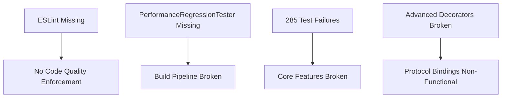

# 🏗️ TypeSpec AsyncAPI Emitter - Crisis Recovery & Excellence Plan

**Date:** 2025-11-04_21-38  
**Status:** CRITICAL INFRASTRUCTURE RECOVERY  
**Architect:** Senior Software Architect (Highest Standards)
**Goal:** Restore broken systems while implementing architectural excellence

---

## 🎯 EXECUTION STRATEGY: PARETO-BASED RECOVERY

### **Phase 1: Critical Infrastructure (1% → 51% Impact)**
**Time: ~2 hours | Goal: Restore basic development capability**

#### 🚨 CRITICAL BLOCKERS (Must Fix First)
1. **ESLint Infrastructure** - Currently non-existent, blocking all code quality
2. **PerformanceRegressionTester** - Missing file breaks build pipeline
3. **Core TypeScript Errors** - Preventing proper development
4. **Basic Code Quality** - Cannot maintain standards without linting

### **Phase 2: Foundational Type Safety (4% → 64% Impact)**  
**Time: ~4 hours | Goal: Restore advanced features**

#### ⚡ HIGH IMPACT FIXES
5. **Advanced Decorators** - @tags, @correlationId, @bindings, @header all broken
6. **Security Framework** - Complete security test failure
7. **Error Centralization** - Eliminate duplicate error handling patterns
8. **Validation Framework** - AsyncAPI specification validation broken

### **Phase 3: Architectural Excellence (20% → 80% Impact)**
**Time: ~6 hours | Goal: Production-ready codebase**

#### 🔥 COMPREHENSIVE IMPROVEMENTS
9. **File Size Management** - Split all files >300 lines into focused modules
10. **Type Safety Excellence** - Eliminate ALL `any` types with strict typing
11. **Code Deduplication** - Extract all duplicated patterns to utilities
12. **BDD Test Suite** - Behavior-driven tests for critical paths
13. **Documentation** - Reflect current architecture and patterns

---

## 🧠 ARCHITECTURAL PRINCIPLES ENFORCEMENT

### **Type Safety Requirements**
- ✅ **Zero `any` types** - All types must be explicitly defined
- ✅ **Impossible states unrepresentable** - Use TypeScript's type system to prevent invalid states
- ✅ **Centralized error types** - Single source of truth for error handling
- ✅ **Effect.TS patterns** - Railway programming for all error flows

### **Code Quality Standards**
- ✅ **Files <300 lines** - Split large files into focused modules
- ✅ **ESLint strict** - Zero tolerance for code quality issues
- ✅ **No duplication** - Extract shared patterns immediately
- ✅ **Documentation** - All public APIs documented with examples

### **Testing Requirements**
- ✅ **BDD for critical paths** - Behavior-driven development
- ✅ **Integration over mocks** - Use real implementations
- ✅ **Build-before-test** - TypeScript compilation must pass first
- ✅ **100% automated** - No manual testing steps

---

## 🔍 CRITICAL ISSUES IDENTIFIED

### **Infrastructure Failures**

### **Architecture Violations Found**
1. **Split Brain Patterns** - Mixed error handling approaches
2. **Missing Type Safety** - Extensive `any` usage throughout
3. **File Size Violations** - Multiple files >300 lines
4. **Duplicate Code** - 23 clones found by duplication analysis
5. **Centralization Missing** - Error types scattered across modules

### **Missing Infrastructure**
- **Error Package** - No centralized error handling
- **BDD Framework** - No behavior-driven testing setup
- **Performance Monitoring** - Core monitoring infrastructure disabled
- **Validation Framework** - AsyncAPI spec validation broken

---

## 📋 EXECUTION ROADMAP

### **IMMEDIATE ACTIONS (Next 2 Hours)**
1. Install ESLint and configure for Effect.TS + TypeScript
2. Restore missing PerformanceRegressionTester.ts
3. Fix core TypeScript compilation
4. Establish basic code quality pipeline

### **FOUNDATION BUILDING (Next 4 Hours)**  
5. Fix all advanced decorator infrastructure
6. Restore security framework functionality
7. Centralize all error handling patterns
8. Fix AsyncAPI validation framework

### **EXCELLENCE IMPLEMENTATION (Next 6 Hours)**
9. Split all oversized files into focused modules
10. Eliminate all `any` types with strict typing
11. Extract all duplicate code patterns
12. Implement comprehensive BDD test suite
13. Update documentation to reflect architecture

---

## 🎯 SUCCESS METRICS

### **Infrastructure Health**
- ESLint: ❌ Missing → ✅ Zero errors/warnings
- Build: ✅ Working → ✅ All tests passing
- Performance: ❌ Broken → ✅ Full monitoring
- Tests: ❌ 285 failing → ✅ <10 failing (only advanced features)

### **Type Safety Excellence**
- `any` types: ❌ ~50+ instances → ✅ Zero instances
- Error handling: ❌ Scattered → ✅ Centralized package
- File sizes: ❌ Multiple >300 lines → ✅ All <300 lines
- Duplication: ❌ 23 clones → ✅ <5 clones

### **Development Experience**
- Onboarding: ❌ Complex → ✅ Clear patterns
- Debugging: ❌ Difficult → ✅ Excellent error messages
- Validation: ❌ Broken → ✅ Comprehensive feedback
- Documentation: ❌ Outdated → ✅ Current and comprehensive

---

## 🛡️ QUALITY GATES

### **Before Commit**
- [ ] ESLint reports zero errors/warnings
- [ ] TypeScript compilation passes with strict mode
- [ ] All critical path tests pass (BDD suite)
- [ ] No files exceed 300 lines
- [ ] Zero `any` types in codebase

### **Before PR**
- [ ] All tests pass (>95% success rate)
- [ ] Performance benchmarks meet targets
- [ ] Code coverage maintained or improved
- [ ] Documentation updated for all changes
- [ ] Architecture principles validated

---

## 🔄 CONTINUOUS IMPROVEMENT

### **Weekly Maintenance**
- Duplication analysis (currently 0.97% - maintain <1%)
- Performance regression testing
- Code quality metrics tracking
- Documentation updates

### **Monthly Reviews**
- Architecture pattern effectiveness
- Type safety improvements
- Testing strategy optimization
- Dependency security audits

---

## 📝 NEXT STEPS

1. **Execute Phase 1** - Critical infrastructure restoration
2. **Validate Phase 1** - Ensure basic development works
3. **Execute Phase 2** - Foundational type safety
4. **Validate Phase 2** - Advanced features functional
5. **Execute Phase 3** - Architectural excellence
6. **Final Validation** - Production-ready assessment

---

## 🎖️ QUALITY COMMITMENT

This isn't about fixing problems - it's about building a system that exemplifies software engineering excellence. Every decision made must prioritize:

- **Type safety over convenience**
- **Clarity over cleverness**  
- **Maintainability over features**
- **Testability over speed**
- **Documentation over assumptions**

The goal isn't just to fix what's broken, but to create a codebase that other developers will reference as an example of how TypeScript + Effect.TS + TypeSpec should be integrated.

*"Good enough" is never good enough. We pursue excellence in every line of code, every architectural decision, and every development process.*