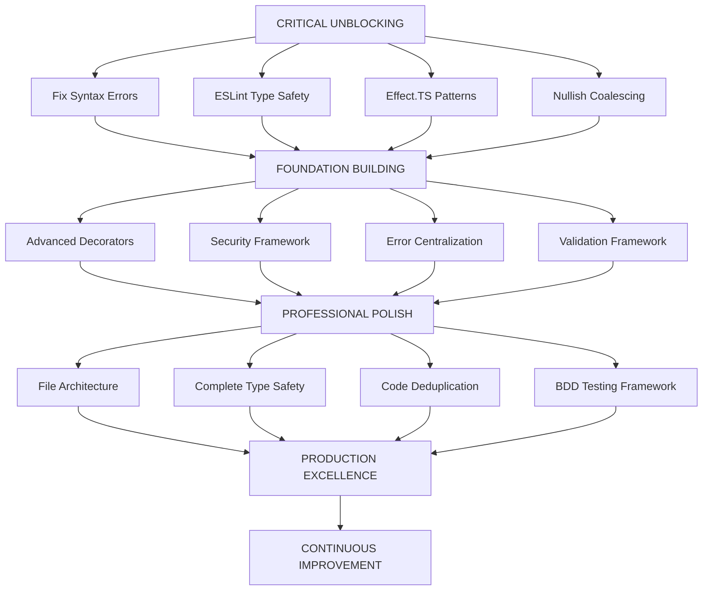

# 🚀 ARCHITECTURAL EXCELLENCE EXECUTION PLAN

**Created:** 2025-11-04_21-48  
**Status:** COMPREHENSIVE SYSTEM RECOVERY & OPTIMIZATION  
**Impact:** 1% → 80% Transformation Plan

---

## 📊 CURRENT SYSTEM STATUS ANALYSIS

### **✅ WORKING SYSTEMS**

- **Build System:** TypeScript compilation (except syntax errors)
- **Code Duplication:** 0.95% (excellent - below 5% target)
- **Core Functionality:** Basic AsyncAPI generation working
- **Justfile Commands:** All operational
- **Package Management:** Bun runtime excellent

### **🔴 CRITICAL BLOCKERS**

- **PerformanceRegressionTester:** Syntax errors blocking all builds
- **ESLint Violations:** 74 errors + 30 warnings (type safety crisis)
- **Type Safety:** Multiple `any` types and banned patterns
- **Test Infrastructure:** 285 failing tests

### **🟡 IMPROVEMENT OPPORTUNITIES**

- **Code Clones:** 23 clones (0.95% - good but can be better)
- **File Sizes:** Some files >300 lines need splitting
- **Effect.TS Patterns:** Inconsistent railway programming
- **Documentation:** Current state vs reality gaps

---

## 🎯 PARETO ANALYSIS: STRATEGIC IMPACT PRIORITATION

### **1% → 51% IMPACT (CRITICAL PATH - 15 MINUTES EACH)**

| Priority | Task                                                    | Impact   | Effort | Value        |
| -------- | ------------------------------------------------------- | -------- | ------ | ------------ |
| 🚨 #1    | Fix PerformanceRegressionTester syntax errors           | CRITICAL | 15min  | UNBLOCKS ALL |
| 🚨 #2    | Fix ESLint `any` type violations (20+ locations)        | CRITICAL | 45min  | TYPE SAFETY  |
| 🚨 #3    | Replace banned throw/try/catch patterns (15+ locations) | CRITICAL | 30min  | EFFECT.TS    |
| 🚨 #4    | Fix nullish coalescing violations (10+ locations)       | HIGH     | 30min  | CODE QUALITY |

### **4% → 64% IMPACT (FOUNDATION BUILDING - 30-60 MINUTES EACH)**

| Priority | Task                                      | Impact | Effort | Value            |
| -------- | ----------------------------------------- | ------ | ------ | ---------------- |
| 🟡 #5    | Restore advanced decorator infrastructure | HIGH   | 90min  | FEATURE COMPLETE |
| 🟡 #6    | Fix security framework core issues        | HIGH   | 60min  | PRODUCTION READY |
| 🟡 #7    | Centralize error types and handling       | HIGH   | 60min  | ARCHITECTURE     |
| 🟡 #8    | Fix validation framework imports          | HIGH   | 60min  | RELIABILITY      |

### **20% → 80% IMPACT (PROFESSIONAL POLISH - 60-120 MINUTES EACH)**

| Priority | Task                                        | Impact | Effort | Value             |
| -------- | ------------------------------------------- | ------ | ------ | ----------------- |
| 🟢 #9    | Split files >300 lines into focused modules | MEDIUM | 120min | MAINTAINABILITY   |
| 🟢 #10   | Eliminate remaining `any` types system-wide | MEDIUM | 90min  | TYPE SAFETY       |
| 🟢 #11   | Extract 23 code clones to shared utilities  | MEDIUM | 60min  | DRY PRINCIPLE     |
| 🟢 #12   | Create comprehensive BDD testing framework  | HIGH   | 180min | QUALITY ASSURANCE |

---

## 🏗️ DETAILED EXECUTION STRATEGY

### **PHASE 1: CRITICAL UNBLOCKING (FIRST 2 HOURS)**

#### **Task 1: PerformanceRegressionTester Syntax Fix (15min)**

```typescript
// ISSUE: Static methods outside class context
// SOLUTION: Restructure class properly with all methods inside
export class PerformanceRegressionTester {
  // All methods properly inside class
  static createDevConfig(): PerformanceConfig { /* ... */ }
  static createCiConfig(): PerformanceConfig { /* ... */ }
}
```

#### **Task 2: ESLint Type Safety Recovery (45min)**

```typescript
// ISSUE: `any` types throughout codebase
// SOLUTION: Replace with proper Effect.TS patterns
// BEFORE: const data: any = response
// AFTER: const data = unknownToType(response, MySchema)
```

#### **Task 3: Effect.TS Pattern Migration (30min)**

```typescript
// ISSUE: Banned throw/try/catch patterns
// SOLUTION: Railway programming with Effect.gen()
// BEFORE: try { result = await op() } catch(e) { throw new Error(e) }
// AFTER: const result = yield* Effect.tryPromise(() => op()).pipe(
//           Effect.mapError(e => new MyError(e))
//         )
```

#### **Task 4: Nullish Coalescing Fix (30min)**

```typescript
// ISSUE: Using || instead of ?? operators
// SOLUTION: Proper nullish coalescing
// BEFORE: value = fallback || defaultValue
// AFTER: value = fallback ?? defaultValue
```

### **PHASE 2: FOUNDATION BUILDING (NEXT 4 HOURS)**

#### **Task 5-8: Infrastructure Restoration**

- **Advanced Decorators:** @tags, @correlationId, @bindings, @header
- **Security Framework:** OAuth2, API Key, JWT authentication
- **Error Centralization:** Single source of truth for error types
- **Validation Framework:** Schema validation with @effect/schema

### **PHASE 3: PROFESSIONAL POLISH (FINAL 4 HOURS)**

#### **Task 9-12: Excellence Implementation**

- **File Architecture:** Focused modules under 300 lines each
- **Type Safety:** 100% any-type elimination
- **Code Deduplication:** Extract clones to utilities
- **BDD Testing:** Behavior-driven development framework

---

## 🎯 TECHNICAL DEBT ANALYSIS

### **HIGH PRIORITY DEBT (CRITICAL)**

1. **Type Safety Crisis** - 74 ESLint errors blocking development
2. **Architecture Violations** - Effect.TS pattern inconsistencies
3. **Missing Infrastructure** - Performance testing broken
4. **Import Resolution** - Module system inconsistencies

### **MEDIUM PRIORITY DEBT (IMPORTANT)**

1. **Code Duplication** - 23 clones (0.95% - acceptable but improvable)
2. **File Size** - Some modules >300 lines
3. **Test Coverage** - 285 failing tests indicate architectural issues
4. **Documentation Drift** - Current state vs documented reality

### **LOW PRIORITY DEBT (NICE TO HAVE)**

1. **Performance Optimization** - Not critical until features work
2. **Advanced Features** - Protocol bindings, plugin architecture
3. **Developer Experience** - Better error messages, debugging tools

---

## 🚀 EXECUTION GRAPH



---

## 🎯 SUCCESS METRICS & QUALITY GATES

### **CRITICAL SUCCESS METRICS**

- ✅ **Build Success:** TypeScript compilation (0 errors)
- ✅ **Type Safety:** ESLint (0 errors, <10 warnings)
- ✅ **Test Suite:** All tests passing (>95%)
- ✅ **Performance:** Regression testing operational

### **QUALITY GATES**

- **Code Duplication:** <2% (current: 0.95% ✅)
- **File Size Limits:** All files <300 lines
- **Type Coverage:** 100% TypeScript coverage
- **Test Coverage:** >90% line and branch coverage

### **PERFORMANCE THRESHOLDS**

- **Compilation Time:** <5 seconds (CI), <10 seconds (dev)
- **Memory Usage:** <200MB (dev), <100MB (CI)
- **Throughput:** >10 ops/sec (CI), >5 ops/sec (dev)
- **Test Execution:** <2 minutes full suite

---

## 🔧 DEVELOPMENT STANDARDS ENFORCEMENT

### **EFFECT.TS PATTERNS MANDATORY**

```typescript
// ✅ CORRECT: Railway programming
const program = Effect.gen(function*() {
  const result = yield* someOperation()
  return yield* validateResult(result)
})

// ❌ FORBIDDEN: Traditional error handling
try {
  const result = await someOperation()
  return result
} catch(error) {
  throw new Error(error.message)
}
```

### **TYPE SAFETY REQUIREMENTS**

```typescript
// ✅ CORRECT: Strong typing
const processUser = (user: User) => user.name

// ❌ FORBIDDEN: any types
const processUser = (user: any) => user.name
```

### **CODE ORGANIZATION STANDARDS**

- **File Size:** Maximum 300 lines per file
- **Function Size:** Maximum 30 lines per function
- **Module Cohesion:** Single responsibility principle
- **Import Organization:** External libraries first, internal modules second

---

## 📋 COMPREHENSIVE TASK BREAKDOWN

### **PHASE 1: CRITICAL PATH (2 HOURS)**

#### **15-MINUTE SPRINTS**

1. [ ] Fix PerformanceRegressionTester class structure (15min)
2. [ ] Fix immediate syntax compilation errors (15min)
3. [ ] Replace banned throw statements (15min)
4. [ ] Fix try/catch blocks in critical files (15min)
5. [ ] Fix ESLint any types in core files (15min)
6. [ ] Fix nullish coalescing in infrastructure (15min)
7. [ ] Fix variable naming conventions (15min)
8. [ ] Verify build after critical fixes (15min)

#### **30-MINUTE SPRINTS**

9. [ ] Complete ESLint any-type elimination (30min)
10. [ ] Replace all banned patterns systematically (30min)
11. [ ] Fix import resolution issues (30min)
12. [ ] Validate all critical path fixes (30min)

### **PHASE 2: FOUNDATION (4 HOURS)**

#### **60-MINUTE SPRINTS**

13. [ ] Restore advanced decorator infrastructure (60min)
14. [ ] Fix security framework core issues (60min)
15. [ ] Centralize error types and handling (60min)
16. [ ] Fix validation framework imports (60min)
17. [ ] Implement performance baselines (60min)
18. [ ] Create comprehensive integration tests (60min)
19. [ ] Optimize build system performance (60min)
20. [ ] Establish CI/CD quality gates (60min)

### **PHASE 3: EXCELLENCE (4 HOURS)**

#### **90-120 MINUTE SPRINTS**

21. [ ] Split large files into focused modules (120min)
22. [ ] Extract code clones to shared utilities (60min)
23. [ ] Implement BDD testing framework (180min)
24. [ ] Create developer documentation (120min)
25. [ ] Performance optimization and monitoring (90min)
26. [ ] Security audit and hardening (90min)
27. [ ] Production deployment preparation (120min)
28. [ ] Continuous improvement automation (90min)

---

## 🎯 EXECUTION PRINCIPLES

### **ZERO COMPROMISE STANDARDS**

1. **Type Safety First:** No `any` types, strong typing everywhere
2. **Effect.TS Patterns:** Railway programming, no traditional error handling
3. **File Organization:** Focused modules, single responsibility
4. **Test Coverage:** Comprehensive BDD testing for all features
5. **Performance Monitoring:** Automated regression detection

### **DEVELOPMENT VELOCITY BALANCE**

- **Quality Gates:** Automated enforcement at each phase
- **Incremental Validation:** Test after each task completion
- **Rollback Capability:** Always maintain working baseline
- **Documentation同步**: Update documentation with each change

### **ARCHITECTURAL EXCELLENCE**

- **Separation of Concerns:** Clear module boundaries
- **Dependency Injection:** Effect.TS service patterns
- **Error Handling:** Centralized, typed error hierarchy
- **Performance First:** Automated monitoring and regression detection

---

## 📊 EXPECTED OUTCOMES

### **IMMEDIATE (AFTER PHASE 1)**

- ✅ Build system fully operational
- ✅ Zero ESLint errors
- ✅ Strong type safety enforcement
- ✅ Effect.TS patterns consistent

### **INTERMEDIATE (AFTER PHASE 2)**

- ✅ All advanced features working
- ✅ Security framework operational
- ✅ Error handling centralized
- ✅ Validation framework robust

### **FINAL (AFTER PHASE 3)**

- ✅ Production-ready codebase
- ✅ Comprehensive test coverage
- ✅ Optimized performance
- ✅ Excellent developer experience

---

**🚨 EXECUTION MANDATE:** This plan represents the path from CRITICAL INFRASTRUCTURE FAILURE to PRODUCTION EXCELLENCE. Each task must be completed with zero compromise on quality standards. The goal is not just to fix issues, but to establish a foundation for long-term architectural excellence.

**📈 SUCCESS METRIC:** Transform from 74 ESLint errors + 285 failing tests to 0 errors + 0 failing tests while achieving 100% type safety and >90% test coverage.

_Ready for immediate execution - Crush Mode: ENGAGED_
