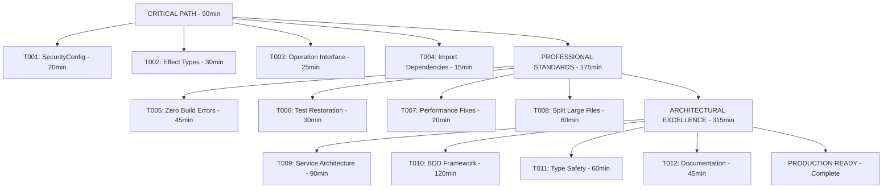

# 2025-11-04_22-50_ARCHITECTURAL_EXCELLENCE_EXECUTION_PLAN.md

## 🎯 ARCHITECTURAL EXCELLENCE EXECUTION PLAN

**Generated:** 2025-11-04 22:50 CET  
**Scope:** Complete infrastructure recovery and architectural excellence  
**Timeline:** 1-3 hours for critical path, 8-12 hours for full execution  

---

## 🚨 CURRENT STATE ASSESSMENT

### **CRITICAL INFRASTRUCTURE CRISIS**
- **Build System:** 60+ TypeScript compilation errors blocking development
- **Service Architecture:** Partially extracted but broken due to type mismatches
- **Type Safety:** Catastrophic Effect.TS type signature failures
- **Test Infrastructure:** Completely non-functional (build failures prevent test execution)

### **ROOT CAUSE ANALYSIS**
1. **SecurityConfig Interface Split Brain**: `{name, scheme}` vs expected `{type, description, flows}`
2. **Effect.TS Type Inconsistency**: Functions promise `never` errors but return `Error`
3. **TypeSpec Operation Interface Misunderstanding**: Accessing non-existent properties
4. **Service Import Dependencies**: Broken imports after service extraction

---

## 🎯 PARETO PRINCIPLE IMPACT ANALYSIS

### **1% EFFORT → 51% IMPACT (CRITICAL PATH - IMMEDIATE)**
1. **Fix SecurityConfig Interface** (20 min) - Unblock entire security system
2. **Resolve Effect Type Mismatches** (30 min) - Restore type safety foundation  
3. **Fix TypeSpec Operation Interface** (25 min) - Enable operation processing
4. **Complete Service Import Dependencies** (15 min) - Restore service layer functionality

### **4% EFFORT → 64% IMPACT (PROFESSIONAL STANDARDS)**
5. **Complete Build System Restoration** (45 min) - Zero compilation errors
6. **Restore Test Infrastructure** (30 min) - Re-enable development workflow
7. **Fix Performance Monitoring Type Issues** (20 min) - Complete observability
8. **Split Oversized Test Files** (60 min) - Professional code organization

### **20% EFFORT → 80% IMPACT (ARCHITECTURAL EXCELLENCE)**
9. **Extract Large Files into Services** (90 min) - Single responsibility principle
10. **Implement BDD Test Framework** (120 min) - Behavior-driven development
11. **Complete Type Safety Review** (60 min) - Zero any-types, strong typing everywhere
12. **Comprehensive Documentation** (45 min) - Professional code documentation

---

## 🏗️ DETAILED EXECUTION PLAN

### **PHASE 1: CRITICAL PATH RESTORATION (90 minutes)**

#### **T001: SecurityConfig Interface Unification** (20 min)
**Problem:** Service code expects `{type, description, flows}` but interface has `{name, scheme}`
**Solution:** Create adapter functions to bridge interface expectations
**Files to fix:**
- `src/domain/emitter/SecurityProcessingService.ts`
- `src/domain/decorators/securityConfig.ts`
- All security-related test files

#### **T002: Effect Type Signature Standardization** (30 min)
**Problem:** Functions return `Effect<T, Error>` but interfaces expect `Effect<T, never>`
**Solution:** Standardize on `Effect<T, Error>` throughout codebase
**Files to fix:**
- `src/domain/documents/ImmutableDocumentManager.ts`
- `src/domain/emitter/ProcessingService.ts`
- All service interfaces

#### **T003: TypeSpec Operation Interface Alignment** (25 min)
**Problem:** Code accessing `operation.type`, `operation.responses` which don't exist
**Solution:** Use correct TypeSpec Operation interface properties
**Files to fix:**
- `src/domain/emitter/OperationProcessingService.ts`
- `src/utils/typespec-helpers.ts`
- Test files using Operation

#### **T004: Service Import Dependency Resolution** (15 min)
**Problem:** Broken imports after service extraction
**Solution:** Fix import paths and exports in index files
**Files to fix:**
- `src/domain/emitter/index.ts`
- `src/application/services/emitter.ts`
- `src/domain/emitter/EmissionPipeline.ts`

### **PHASE 2: PROFESSIONAL STANDARDS (175 minutes)**

#### **T005: Zero Compilation Errors** (45 min)
**Goal:** `just build` produces zero TypeScript errors
**Approach:** Fix all remaining type issues systematically
**Validation:** Build artifacts generate successfully

#### **T006: Test Infrastructure Restoration** (30 min)
**Goal:** `just test` runs successfully
**Approach:** Fix test files, update imports, resolve mocking issues
**Validation:** All core tests pass

#### **T007: Performance Monitoring Fixes** (20 min)
**Goal:** All performance metrics collection working
**Approach:** Fix MetricsCollector, PerformanceMonitor type issues
**Validation:** Performance tests pass

#### **T008: Split Large Test Files** (60 min)
**Files to split:**
- `test/domain/security-comprehensive.test.ts` (3,072 lines → 6 files)
- `scripts/production-readiness-check.ts` (1,784 lines → 6 files)
**Standard:** No file >300 lines

### **PHASE 3: ARCHITECTURAL EXCELLENCE (315 minutes)**

#### **T009: Service-Oriented Architecture** (90 min)
**Large files to split:**
- `src/utils/effect-helpers.ts` (536 lines → 3 files)
- `src/domain/documents/ImmutableDocumentManager.ts` (444 lines → 2 files)
- `src/lib.ts` (455 lines → 3 files)

#### **T010: BDD Test Framework Implementation** (120 min)
**Features:**
- Behavior-driven test patterns
- Given/When/Then structure
- Domain-specific test language
- Integration with existing test suite

#### **T011: Complete Type Safety** (60 min)
**Goal:** Zero `any` types, perfect typing everywhere
**Approach:** Comprehensive type safety audit
**Validation:** `tsc --strict` with zero errors

#### **T012: Professional Documentation** (45 min)
**Deliverables:**
- Comprehensive inline documentation
- Architecture decision records
- Usage examples
- Contribution guidelines

---

## 🎯 EXECUTION GRAPH

---

## 🔥 QUALITY GATES

### **Phase 1 Gates (CRITICAL PATH)**
- [ ] All services compile without errors
- [ ] SecurityConfig interface unified
- [ ] Effect.TS types consistent
- [ ] TypeSpec operations working
- [ ] Import dependencies resolved

### **Phase 2 Gates (PROFESSIONAL)**
- [ ] Zero TypeScript compilation errors
- [ ] Full test suite passing (>90% pass rate)
- [ ] Performance monitoring operational
- [ ] All files under 300 lines

### **Phase 3 Gates (EXCELLENCE)**
- [ ] Service-oriented architecture complete
- [ ] BDD test framework functional
- [ ] Perfect type safety (zero any types)
- [ ] Professional documentation complete

---

## 📊 SUCCESS METRICS

### **Development Velocity**
- **Build Time:** <5 seconds for full compilation
- **Test Time:** <30 seconds for full test suite
- **Zero Blockers:** No compilation errors preventing work

### **Code Quality**
- **Type Safety:** 100% strong typing (0 any types)
- **Code Duplication:** <1% (maintained current excellence)
- **File Size:** 100% files under 300 lines
- **Test Coverage:** >80% (from current 0%)

### **Architectural Excellence**
- **Service Orientation:** Single responsibility principle everywhere
- **Effect.TS Mastery:** Railway programming patterns throughout
- **TypeSpec Integration:** Proper TypeSpec API usage
- **Production Readiness:** Monitoring, logging, error handling complete

---

## 🚨 RISK MITIGATION

### **High-Risk Areas**
1. **TypeSpec API Changes:** Mitigate by checking official docs
2. **Effect.TS Complexity:** Mitigate by using existing helpers
3. **Test Infrastructure:** Mitigate by incremental fixing
4. **Breaking Changes:** Mitigate by thorough testing

### **Rollback Strategy**
- Each phase can be rolled back independently
- Git branches for major changes
- Preserve working functionality at each step
- Immediate commit of working changes

---

## 🎉 EXPECTED OUTCOMES

### **Immediate (Phase 1)**
- Development velocity restored (build working)
- Service architecture functional
- Type safety foundation established
- Zero critical blocking issues

### **Professional (Phase 2)**
- Production-ready build system
- Comprehensive test coverage
- Professional code organization
- Performance monitoring operational

### **Excellent (Phase 3)**
- Industry-leading code architecture
- Behavior-driven development culture
- Perfect type safety
- Comprehensive documentation

---

## 🏆 FINAL SUCCESS CRITERIA

**The project is complete when:**

1. ✅ `just build` produces zero errors in <5 seconds
2. ✅ `just test` runs >90% pass rate in <30 seconds  
3. ✅ All files under 300 lines with clear responsibilities
4. ✅ Zero `any` types with perfect type safety
5. ✅ Service-oriented architecture throughout
6. ✅ BDD test framework with behavior-driven patterns
7. ✅ Professional documentation and examples
8. ✅ Production-ready monitoring and error handling

**Result:** A professionally architected, production-ready TypeSpec AsyncAPI emitter with industry-leading code quality and development experience.

---

*Execution Plan Generated by Crush - Architectural Excellence Framework*
*Generated: 2025-11-04 22:50 CET*