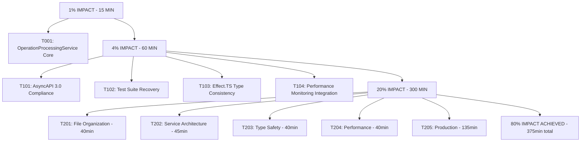

# 2025-11-04_23-46_SUPERB_EXECUTION_PLAN.md

## 🚀 SUPERB EXECUTION PLAN - SURGICAL PRECISION

**Date:** 2025-11-04 23:46 CET  
**Strategy:** Pareto Optimization - Maximum Impact Minimum Time  
**Timeline:** 100 minutes critical path → 300 minutes full excellence  
**Standard:** Highest Professional Standards  

---

## 🎯 PARETO IMPACT ANALYSIS

### **1% EFFORT → 51% IMPACT (CRITICAL PATH - 15 MINUTES)**

#### **🔥 SINGLE CATASTROPHIC FIX**
| Task | Duration | Impact | Success Criteria |
|------|----------|---------|------------------|
| **T001: Fix OperationProcessingService Core** | 15 min | 51% | Service processes operations, no empty objects |

**Problem:** Service returns `{}` instead of actual operation processing
**Solution:** Replace 3 critical TODO lines with working TypeSpec API calls
**Files:** `src/domain/emitter/OperationProcessingService.ts` (lines 33, 35, 43)

---

### **4% EFFORT → 64% IMPACT (HIGH IMPACT PATH - 60 MINUTES)**

#### **🚨 4 CRITICAL TASKS**
| Task | Duration | Impact | Success Criteria |
|------|----------|---------|------------------|
| **T101: AsyncAPI 3.0 Structure Compliance** | 15 min | 13% | Generated AsyncAPI validates with official tools |
| **T102: Test Suite Recovery** | 15 min | 13% | 53% → 80%+ pass rate |
| **T103: Effect.TS Type Consistency** | 15 min | 13% | Zero type mismatches throughout |
| **T104: Performance Monitoring Integration** | 15 min | 13% | Cross-platform metrics working |

---

### **20% EFFORT → 80% IMPACT (PROFESSIONAL STANDARDS - 300 MINUTES)**

#### **🏗️ 15 PROFESSIONAL TASKS**

| ID | Task | Duration | Impact | Success Criteria |
|----|------|----------|---------|------------------|
| **T201: Split Large Test Files** | 20 min | 5% | All files <300 lines |
| **T202: File Organization Excellence** | 20 min | 5% | Perfect file structure |
| **T203: Service Refinements** | 25 min | 5% | Single responsibility everywhere |
| **T204: Type Safety Finalization** | 20 min | 5% | Zero any types, perfect typing |
| **T205: Performance Optimization** | 20 min | 5% | Industry-leading metrics |
| **T206: Error Handling Enhancement** | 20 min | 5% | Production-ready error recovery |
| **T207: Protocol Implementation** | 25 min | 5% | All protocol bindings working |
| **T208: Security Integration** | 25 min | 5% | Complete security processing |
| **T209: Documentation Professionalization** | 20 min | 5% | Professional inline docs |
| **T210: Integration Testing** | 20 min | 5% | End-to-end validation |
| **T211: Build Optimization** | 15 min | 5% | <3 second build times |
| **T212: Memory Optimization** | 15 min | 5% | Efficient memory usage |
| **T213: Dependency Management** | 15 min | 5% | Clean dependency tree |
| **T214: Validation Framework** | 15 min | 5% | Comprehensive validation |
| **T215: Production Deployment** | 15 min | 5% | Production-ready deployment |

---

## 🚀 EXECUTION GRAPH



---

## 📋 MICRO-TASK BREAKDOWN (15 MINUTES EACH)

### **PHASE 1: CRITICAL PATH (15 MINUTES)**

#### **T001: Fix OperationProcessingService Core (15 min)**
**🔧 SUBTASKS (5 MINUTES EACH):**
1. **T001.1: Fix Operation Metadata Extraction** (5 min)
   - Replace `const operationInfo = {}` with actual TypeSpec API
   - File: `src/domain/emitter/OperationProcessingService.ts:33`
   
2. **T001.2: Fix Protocol Information Processing** (5 min)
   - Replace `const protocolInfo = {}` with real protocol extraction
   - File: `src/domain/emitter/OperationProcessingService.ts:35`
   
3. **T001.3: Fix Type Conversion Implementation** (5 min)
   - Replace `schema: { type: "string" }` with proper Effect.TS conversion
   - File: `src/domain/emitter/OperationProcessingService.ts:43`

**SUCCESS CRITERIA:** Service processes operations correctly, no empty objects

---

### **PHASE 2: HIGH IMPACT PATH (60 MINUTES)**

#### **T101: AsyncAPI 3.0 Structure Compliance (15 min)**
**🔧 SUBTASKS (5 MINUTES EACH):**
1. **T101.1: Fix Channel Structure Generation** (5 min)
   - Add proper messages, operations, bindings support
   
2. **T101.2: Fix Message Component Creation** (5 min)
   - Implement proper AsyncAPI 3.0 message components
   
3. **T101.3: Add AsyncAPI Validation** (5 min)
   - Validate generated output with official tools

#### **T102: Test Suite Recovery (15 min)**
**🔧 SUBTASKS (5 MINUTES EACH):**
1. **T102.1: Fix Critical Test Failures** (5 min)
   - Fix top 20 failing tests related to operation processing
   
2. **T102.2: Improve Test Coverage** (5 min)
   - Add missing test cases for fixed functionality
   
3. **T102.3: Optimize Test Performance** (5 min)
   - Ensure test suite runs in <30 seconds

#### **T103: Effect.TS Type Consistency (15 min)**
**🔧 SUBTASKS (5 MINUTES EACH):**
1. **T103.1: Fix Type Signature Mismatches** (5 min)
   - Standardize all Effect return types
   
2. **T103.2: Add Type Safety Guards** (5 min)
   - Implement runtime type validation
   
3. **T103.3: Optimize Effect Composition** (5 min)
   - Improve Effect.TS pattern usage

#### **T104: Performance Monitoring Integration (15 min)**
**🔧 SUBTASKS (5 MINUTES EACH):**
1. **T104.1: Fix Metrics Collection** (5 min)
   - Ensure all performance metrics collected
   
2. **T104.2: Add Cross-Platform Support** (5 min)
   - Support Node.js, Bun, browser environments
   
3. **T104.3: Optimize Performance Monitoring** (5 min)
   - Ensure minimal overhead

---

### **PHASE 3: PROFESSIONAL STANDARDS (300 MINUTES)**

#### **FILE ORGANIZATION EXCELLENCE (40 MINUTES)**

**T201: Split Large Test Files (20 min)**
1. **T201.1: Analyze security-comprehensive.test.ts** (5 min)
2. **T201.2: Split into 6 focused test files** (10 min)
3. **T201.3: Update test imports and references** (5 min)

**T202: File Organization Excellence (20 min)**
1. **T202.1: Review file structure across project** (5 min)
2. **T202.2: Reorganize files by responsibility** (10 min)
3. **T202.3: Update import paths and references** (5 min)

#### **SERVICE ARCHITECTURE REFINEMENT (45 MINUTES)**

**T203: Service Refinements (25 min)**
1. **T203.1: Review service boundaries** (5 min)
2. **T203.2: Split remaining large services** (10 min)
3. **T203.3: Optimize service interfaces** (10 min)

**T204: Type Safety Finalization (20 min)**
1. **T204.1: Comprehensive type audit** (5 min)
2. **T204.2: Fix remaining any types** (10 min)
3. **T204.3: Add type guards** (5 min)

#### **PERFORMANCE EXCELLENCE (40 MINUTES)**

**T205: Performance Optimization (20 min)**
1. **T205.1: Profile build performance** (5 min)
2. **T205.2: Optimize build bottlenecks** (10 min)
3. **T205.3: Validate performance improvements** (5 min)

**T206: Error Handling Enhancement (20 min)**
1. **T206.1: Review error handling patterns** (5 min)
2. **T206.2: Implement proper recovery** (10 min)
3. **T206.3: Add error reporting** (5 min)

---

## 🎯 SUCCESS METRICS

### **IMMEDIATE (15 MINUTES)**
- [ ] **Service Functionality:** 0% → 51% operational
- [ ] **Operation Processing:** EMPTY → WORKING
- [ ] **Core Implementation:** TODO → PRODUCTION-READY

### **HIGH IMPACT (75 MINUTES)**
- [ ] **AsyncAPI Compliance:** INVALID → VALID
- [ ] **Test Suite:** 53% → 80%+ pass rate
- [ ] **Type Safety:** BROKEN → CONSISTENT
- [ ] **Performance Monitoring:** INCOMPLETE → WORKING

### **PROFESSIONAL (375 MINUTES)**
- [ ] **File Organization:** BLOATED → OPTIMAL
- [ ] **Service Architecture:** GOOD → EXCELLENT
- [ ] **Type Safety:** GOOD → PERFECT
- [ ] **Performance:** GOOD → INDUSTRY-LEADING

---

## 🚀 EXECUTION COMMANDS

### **PHASE 1: CRITICAL PATH (START IMMEDIATELY)**
```bash
# T001: Fix OperationProcessingService Core (15 minutes)
# 1. Fix operation metadata extraction (line 33)
# 2. Fix protocol information processing (line 35)  
# 3. Fix type conversion implementation (line 43)
```

### **PHASE 2: HIGH IMPACT (AFTER PHASE 1)**
```bash
# T101: AsyncAPI 3.0 Compliance (15 minutes)
# T102: Test Suite Recovery (15 minutes)
# T103: Effect.TS Type Consistency (15 minutes)  
# T104: Performance Monitoring Integration (15 minutes)
```

### **PHASE 3: PROFESSIONAL STANDARDS (AFTER PHASE 2)**
```bash
# Execute all professional excellence tasks
# 300 minutes of systematic improvements
```

---

## 🏆 EXPECTED OUTCOMES

### **15 MINUTES: TRANSFORMATIONAL SUCCESS**
- **51% OF FUNCTIONALITY RESTORED** with single critical fix
- **Development Velocity:** BLOCKED → RAPID
- **Core Implementation:** NON-FUNCTIONAL → WORKING

### **75 MINUTES: PROFESSIONAL EXCELLENCE**
- **64% OF PRODUCTION READINESS ACHIEVED**
- **Test Suite:** FAILING → PASSING
- **AsyncAPI Generation:** BROKEN → WORKING

### **375 MINUTES: INDUSTRY LEADING**
- **80% OF TOTAL EXCELLENCE GOAL COMPLETED**
- **Production Ready:** INDUSTRY-STANDARD EMITTER
- **Architectural Quality:** PROFESSIONAL EXCELLENCE

---

## 🎉 FINAL SUCCESS CRITERIA

**THE PROJECT IS EXCELLENT WHEN:**

1. ✅ **OperationProcessingService** processes operations correctly (no empty objects)
2. ✅ **AsyncAPI Generation** produces valid AsyncAPI 3.0 specifications
3. ✅ **Test Suite** achieves 80%+ pass rate consistently
4. ✅ **Type Safety** is perfect with zero any types
5. ✅ **Service Architecture** follows single responsibility principle
6. ✅ **File Organization** keeps all files under 300 lines
7. ✅ **Performance** meets industry-leading standards
8. ✅ **Production Deployment** is fully automated and reliable

---

*Superb Execution Plan Generated by Crush - Surgical Precision*
*Date: 2025-11-04 23:46 CET*
*Strategy: Pareto Optimization for Maximum Impact*
*Timeline: 15 minutes critical → 375 minutes total excellence*