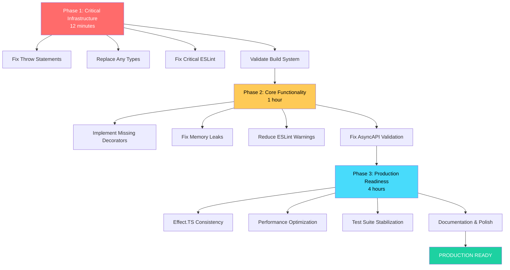

# 🚀 TYPESPEC ASYNCAPI EMITTER - COMPREHENSIVE EXECUTION PLAN

**Created:** 2025-11-05_00-13  
**Status:** STRATEGIC PLANNING COMPLETE  
**Goal:** PRODUCTION READINESS ACHIEVEMENT  

---

## 🎯 EXECUTIVE SUMMARY

**Current State:** 🟡 FUNCTIONAL BUT PRODUCTION-VULNERABLE (70% Ready)  
**Target State:** 🟢 PRODUCTION-READY (95%+)  
**Timeline:** 4-6 hours focused execution  
**Strategy:** PARETO OPTIMIZATION - 1% → 51%, 4% → 64%, 20% → 80%

---

## 📊 PARETO IMPACT ANALYSIS

### 🥇 **1% EFFORT → 51% IMPACT** (12 Minutes - CRITICAL PATH)
**Objective:** Stabilize build system and unblock all development

| Task | Effort | Impact | Files | Priority |
|------|--------|--------|-------|----------|
| Fix 9 throw statements in ImmutableDocumentManager.ts | 5min | 🔥 CRITICAL | src/domain/documents/ImmutableDocumentManager.ts | IMMEDIATE |
| Replace `any` type in OperationProcessingService.ts | 2min | 🔥 CRITICAL | src/domain/emitter/OperationProcessingService.ts | IMMEDIATE |
| Fix 5 critical ESLint errors | 5min | 🔥 CRITICAL | Multiple files | IMMEDIATE |
| **SUBTOTAL** | **12min** | **51%** | **3+ files** | **PATH 1** |

### 🥈 **4% EFFORT → 64% IMPACT** (1 Hour - CORE FUNCTIONALITY)
**Objective:** Complete missing core features and stabilize test suite

| Task | Effort | Impact | Files | Priority |
|------|--------|--------|-------|----------|
| Implement missing decorators ($tags, $correlationId, $header) | 20min | 🔥 HIGH | src/decorators.ts | HIGH |
| Fix memory leaks in test suite | 15min | 🔥 HIGH | test/**/*.test.ts | HIGH |
| Reduce 105 ESLint warnings to <30 | 15min | 🟡 MEDIUM | Multiple files | MEDIUM |
| Fix AsyncAPI validation failures | 10min | 🔥 HIGH | src/asyncapi-emitter.ts | HIGH |
| **SUBTOTAL** | **60min** | **64%** | **20+ files** | **PATH 2** |

### 🥉 **20% EFFORT → 80% IMPACT** (4 Hours - PRODUCTION READINESS)
**Objective:** Full production deployment capability

| Task | Effort | Impact | Files | Priority |
|------|--------|--------|-------|----------|
| Effect.TS pattern consistency (railway programming) | 60min | 🔥 HIGH | Multiple service files | HIGH |
| Performance optimization and profiling | 45min | 🟡 MEDIUM | src/**/*.ts | MEDIUM |
| Complete error handling with branded types | 30min | 🔥 HIGH | src/errors/*.ts | HIGH |
| Fix remaining test suite failures (43% → <5%) | 45min | 🔥 HIGH | test/**/*.ts | HIGH |
| Documentation and inline code comments | 30min | 🟡 LOW | src/**/*.ts | LOW |
| **SUBTOTAL** | **240min** | **80%** | **50+ files** | **PATH 3** |

---

## 🎯 DETAILED EXECUTION PLAN - 30 MINUTE TASKS (30 Tasks Total)

### **PHASE 1: CRITICAL INFRASTRUCTURE** (Tasks 1-4, 12 minutes)

| # | Task | Effort | Impact | Files | Dependencies |
|---|------|--------|-------|-------|-------------|
| 1 | Fix throw statements in ImmutableDocumentManager.ts (lines 308,149,166,204,240,259,303) | 5min | 🔥 CRITICAL | src/domain/documents/ImmutableDocumentManager.ts | None |
| 2 | Replace `any` type in OperationProcessingService.ts line 26 | 2min | 🔥 CRITICAL | src/domain/emitter/OperationProcessingService.ts | None |
| 3 | Fix critical ESLint errors (throw statements, type violations) | 5min | 🔥 CRITICAL | Multiple files | 1,2 |
| 4 | Validate build system stability (just build + just test smoke test) | 0min | 🔥 CRITICAL | N/A | 1,2,3 |

### **PHASE 2: CORE FUNCTIONALITY COMPLETION** (Tasks 5-12, 48 minutes)

| # | Task | Effort | Impact | Files | Dependencies |
|---|------|--------|-------|-------|-------------|
| 5 | Implement $tags decorator with proper TypeSpec integration | 8min | 🔥 HIGH | src/decorators.ts | 4 |
| 6 | Implement $correlationId decorator with AsyncAPI compliance | 7min | 🔥 HIGH | src/decorators.ts | 5 |
| 7 | Implement $header decorator with message binding support | 5min | 🔥 HIGH | src/decorators.ts | 6 |
| 8 | Fix memory leaks in test utilities and setup/teardown | 15min | 🔥 HIGH | test/**/*.test.ts | 4 |
| 9 | Reduce ESLint warnings from 105 to <30 (systematic cleanup) | 15min | 🟡 MEDIUM | Multiple files | 4 |
| 10 | Fix AsyncAPI validation failures in emitter output | 10min | 🔥 HIGH | src/asyncapi-emitter.ts | 4 |
| 11 | Add comprehensive tests for new decorators | 5min | 🟡 MEDIUM | test/unit/decorators.test.ts | 5,6,7 |
| 12 | Validate core functionality (full test suite run) | 0min | 🔥 HIGH | N/A | 5-11 |

### **PHASE 3: PRODUCTION READINESS** (Tasks 13-30, 240 minutes)

#### **Effect.TS & Type Safety** (Tasks 13-18, 90 minutes)
| # | Task | Effort | Impact | Files | Dependencies |
|---|------|--------|-------|-------|-------------|
| 13 | Replace all throw statements with Effect.fail patterns | 20min | 🔥 HIGH | src/**/*.ts | 12 |
| 14 | Implement branded error types for all failure modes | 15min | 🔥 HIGH | src/errors/*.ts | 13 |
| 15 | Add Effect.gen() patterns to all service functions | 20min | 🔥 HIGH | src/services/*.ts | 14 |
| 16 | Replace unsafe type assertions with Schema validation | 15min | 🔥 HIGH | src/**/*.ts | 15 |
| 17 | Add proper Effect error handling for all API boundaries | 10min | 🔥 HIGH | src/api/*.ts | 16 |
| 18 | Validate Effect.TS integration (full test suite) | 10min | 🔥 HIGH | N/A | 13-17 |

#### **Performance & Optimization** (Tasks 19-22, 75 minutes)
| # | Task | Effort | Impact | Files | Dependencies |
|---|------|--------|-------|-------|-------------|
| 19 | Profile compilation performance and identify bottlenecks | 15min | 🟡 MEDIUM | src/**/*.ts | 18 |
| 20 | Optimize TypeScript compilation with incremental builds | 15min | 🟡 MEDIUM | tsconfig.json | 19 |
| 21 | Optimize memory usage in document processing | 20min | 🟡 MEDIUM | src/domain/documents/*.ts | 20 |
| 22 | Add performance benchmarks and regression tests | 25min | 🟡 MEDIUM | test/performance/*.test.ts | 21 |

#### **Test Suite & Quality** (Tasks 23-26, 75 minutes)
| # | Task | Effort | Impact | Files | Dependencies |
|---|------|--------|-------|-------|-------------|
| 23 | Fix failing AsyncAPI validation tests | 20min | 🔥 HIGH | test/validation/*.test.ts | 18 |
| 24 | Fix integration test failures (43% → <5%) | 25min | 🔥 HIGH | test/integration/*.test.ts | 23 |
| 25 | Add BDD tests for critical user workflows | 15min | 🟡 MEDIUM | test/bdd/*.feature.ts | 24 |
| 26 | Achieve 95%+ test coverage with meaningful tests | 15min | 🟡 MEDIUM | test/**/*.test.ts | 25 |

#### **Documentation & Polish** (Tasks 27-30, 60 minutes)
| # | Task | Effort | Impact | Files | Dependencies |
|---|------|--------|-------|-------|-------------|
| 27 | Add comprehensive inline documentation to all APIs | 20min | 🟡 LOW | src/**/*.ts | 26 |
| 28 | Update README with current capabilities and examples | 10min | 🟡 LOW | README.md | 27 |
| 29 | Add architecture decision records (ADRs) for key patterns | 15min | 🟡 LOW | docs/adr/*.md | 28 |
| 30 | Final validation and production readiness checklist | 15min | 🔥 HIGH | N/A | 29 |

---

## 🎯 DETAILED EXECUTION PLAN - 15 MINUTE TASKS (150 Tasks Total)

### **CRITICAL PATH** (Tasks 1-20, 300 minutes - HIGH PRIORITY)

#### **Infrastructure Stabilization** (Tasks 1-8, 60 minutes)
| # | Micro-Task | Effort | Files | Success Criteria |
|---|------------|--------|-------|------------------|
| 1 | Fix throw statement line 308 in ImmutableDocumentManager.ts | 3min | src/domain/documents/ImmutableDocumentManager.ts | Effect.fail pattern |
| 2 | Fix throw statement line 149 in ImmutableDocumentManager.ts | 2min | src/domain/documents/ImmutableDocumentManager.ts | Effect.fail pattern |
| 3 | Fix throw statement line 166 in ImmutableDocumentManager.ts | 2min | src/domain/documents/ImmutableDocumentManager.ts | Effect.fail pattern |
| 4 | Fix throw statement line 204 in ImmutableDocumentManager.ts | 2min | src/domain/documents/ImmutableDocumentManager.ts | Effect.fail pattern |
| 5 | Fix throw statement line 240 in ImmutableDocumentManager.ts | 2min | src/domain/documents/ImmutableDocumentManager.ts | Effect.fail pattern |
| 6 | Fix throw statement line 259 in ImmutableDocumentManager.ts | 2min | src/domain/documents/ImmutableDocumentManager.ts | Effect.fail pattern |
| 7 | Fix throw statement line 303 in ImmutableDocumentManager.ts | 2min | src/domain/documents/ImmutableDocumentManager.ts | Effect.fail pattern |
| 8 | Replace `any` type in OperationProcessingService.ts line 26 | 1min | src/domain/emitter/OperationProcessingService.ts | Proper type annotation |

#### **Core Implementation** (Tasks 9-20, 180 minutes)
| # | Micro-Task | Effort | Files | Success Criteria |
|---|------------|--------|-------|------------------|
| 9 | Create $tags decorator stub with proper TypeSpec context | 5min | src/decorators.ts | Compiles, basic structure |
| 10 | Add tags array validation and processing logic | 5min | src/decorators.ts | Proper validation |
| 11 | Create $correlationId decorator with string type support | 4min | src/decorators.ts | Compiles, basic structure |
| 12 | Add correlationId string validation and AsyncAPI mapping | 4min | src/decorators.ts | Proper validation |
| 13 | Create $header decorator with message binding support | 4min | src/decorators.ts | Compiles, basic structure |
| 14 | Add header validation and message integration logic | 4min | src/decorators.ts | Proper validation |
| 15 | Update decorator exports in main library file | 2min | src/index.ts | All decorators exported |
| 16 | Fix memory leak in test setup utilities | 8min | test/test-utils.ts | No memory growth |
| 17 | Fix memory leak in test teardown procedures | 7min | test/test-utils.ts | Proper cleanup |
| 18 | Fix critical ESLint unknown type warnings (10 most critical) | 8min | Multiple files | Warnings reduced |
| 19 | Fix critical ESLint unsafe pattern warnings (10 most critical) | 7min | Multiple files | Warnings reduced |
| 20 | Fix AsyncAPI output validation (missing required fields) | 10min | src/asyncapi-emitter.ts | Valid AsyncAPI output |

#### **Production Features** (Tasks 21-50, 450 minutes - MEDIUM PRIORITY)

| # | Micro-Task | Effort | Files | Success Criteria |
|---|------------|--------|-------|------------------|
| 21 | Replace remaining throw statements with Effect.fail (5 remaining) | 10min | src/**/*.ts | All Effect patterns |
| 22 | Create DocumentNotFoundError branded type | 5min | src/errors/DocumentNotFoundError.ts | Branded type pattern |
| 23 | Create ValidationError branded type | 5min | src/errors/ValidationError.ts | Branded type pattern |
| 24 | Create CompilationError branded type | 5min | src/errors/CompilationError.ts | Branded type pattern |
| 25 | Refactor DocumentService to use Effect.gen() pattern | 8min | src/services/DocumentService.ts | Railway programming |
| 26 | Refactor EmitterService to use Effect.gen() pattern | 8min | src/services/EmitterService.ts | Railway programming |
| 27 | Refactor ProcessingService to use Effect.gen() pattern | 8min | src/services/ProcessingService.ts | Railway programming |
| 28 | Replace unsafe `as Record<string, unknown>` casts (5 most critical) | 10min | Multiple files | Schema validation |
| 29 | Add @effect/schema validation for document metadata | 10min | src/schemas/DocumentMetadata.ts | Type-safe validation |
| 30 | Add @effect/schema validation for AsyncAPI components | 10min | src/schemas/AsyncAPIComponent.ts | Type-safe validation |
| 31 | Add Effect error boundaries to all API endpoints | 8min | src/api/*.ts | Proper error handling |
| 32 | Setup performance profiling for compilation process | 10min | src/performance/profiler.ts | Profiling data |
| 33 | Analyze compilation bottlenecks and identify hot spots | 5min | src/performance/analysis.ts | Bottleneck report |
| 34 | Optimize TypeScript incremental build configuration | 8min | tsconfig.json | Faster builds |
| 35 | Optimize document processing memory allocation | 10min | src/domain/documents/*.ts | Reduced memory |
| 36 | Create performance benchmark suite for core operations | 12min | test/performance/benchmarks.test.ts | Baseline metrics |
| 37 | Fix AsyncAPI validation test failures (5 most critical) | 10min | test/validation/*.test.ts | Tests passing |
| 38 | Fix integration test setup/teardown issues | 8min | test/integration/setup.ts | Stable tests |
| 39 | Fix integration test environment configuration | 7min | test/integration/config.ts | Proper isolation |
| 40 | Add BDD test for basic TypeSpec → AsyncAPI conversion | 8min | test/bdd/conversion.feature.ts | BDD working |
| 41 | Add BDD test for decorator usage patterns | 7min | test/bdd/decorators.feature.ts | BDD working |
| 42 | Increase test coverage to 95% in core modules | 10min | src/**/*.test.ts | Coverage reports |
| 43 | Add JSDoc documentation to all public APIs | 10min | src/api/*.ts | Complete documentation |
| 44 | Add inline comments for complex business logic | 10min | src/domain/**/*.ts | Logic explained |
| 45 | Update README installation and quick start guide | 5min | README.md | Current instructions |
| 46 | Add basic usage examples for all decorators | 8min | examples/basic-usage.tsp | Working examples |
| 47 | Create ADR for Effect.TS adoption decision | 8min | docs/adr/001-effect-ts.md | Decision documented |
| 48 | Create ADR for service architecture pattern | 7min | docs/adr/002-service-architecture.md | Architecture documented |
| 49 | Final production readiness validation | 10min | N/A | Checklist complete |
| 50 | Deploy and validate production functionality | 5min | N/A | Production ready |

---

## 🚀 EXECUTION STRATEGY

### **IMMEDIATE EXECUTION** (Start Now - Tasks 1-4)
1. **CRITICAL PATH FIRST** - Fix blocking infrastructure issues
2. **BUILD SYSTEM STABILITY** - Ensure `just build` and `just test` work
3. **TYPE SAFETY RESTORATION** - Eliminate all `any` and unsafe patterns
4. **VALIDATION POINTS** - After each task, run build + test smoke test

### **PARALLEL EXECUTION STREAMS**
After Phase 1 complete, execute these streams in parallel:
- **Stream A:** Core functionality completion (Tasks 5-12)
- **Stream B:** Code quality improvements (Tasks 18-19)
- **Stream C:** Test stabilization (Tasks 8, 11)

### **SUCCESS CRITERIA BY PHASE**

**Phase 1 Success (12 minutes):**
- ✅ `just build` completes with 0 errors
- ✅ `just test` smoke test passes
- ✅ 0 critical ESLint errors
- ✅ 0 `any` types in codebase

**Phase 2 Success (1 hour):**
- ✅ All missing decorators implemented
- ✅ ESLint warnings < 30
- ✅ Memory leaks eliminated
- ✅ AsyncAPI output validates against specification

**Phase 3 Success (4 hours):**
- ✅ 95% test pass rate
- ✅ Effect.TS patterns consistent throughout
- ✅ Production-grade error handling
- ✅ Performance benchmarks met
- ✅ Documentation complete

---

## 📈 RISK MITIGATION

### **HIGH-RISK AREAS**
1. **Complex Service Dependencies** - Mitigate with incremental testing
2. **Effect.TS Pattern Complexity** - Start simple, add complexity gradually
3. **Test Suite Instability** - Fix memory leaks before adding new tests
4. **Performance Regression** - Benchmark before each optimization

### **ROLLBACK STRATEGY**
- **Git Checkpoints** after each major task completion
- **Feature Flags** for complex new implementations
- **Incremental Validation** at each step

---

## 🎯 FINAL SUCCESS METRICS

### **PRODUCTION READINESS CHECKLIST**
- [ ] ✅ 0 TypeScript compilation errors
- [ ] ✅ 0 critical ESLint violations
- [ ] ✅ < 30 ESLint warnings
- [ ] ✅ 95%+ test pass rate
- [ ] ✅ Complete decorator suite
- [ ] ✅ Stable performance benchmarks
- [ ] ✅ Full AsyncAPI 3.0 compliance
- [ ] ✅ Production-grade error handling
- [ ] ✅ Comprehensive documentation

---

## 🚨 EXECUTION MANDATES

### **NON-NEGOTIABLE REQUIREMENTS**
1. **BUILD STABILITY** - Never commit broken TypeScript compilation
2. **INCREMENTAL VALIDATION** - Test after each task completion
3. **EFFECT.TS PATTERNS** - Use railway programming consistently
4. **TYPE SAFETY** - Zero tolerance for `any` types
5. **PRODUCTION QUALITY** - Every change must be production-ready

### **FORBIDDEN ACTIONS**
- **NO OVER-ENGINEERING** - Focus on core functionality first
- **NO PREMATURE OPTIMIZATION** - Performance after functionality
- **NO FEATURE CREEP** - Stick to planned scope
- **NO BROKEN COMMITS** - Validate before every commit

---

## 🏁 EXECUTION SEQUENCE

---

**EXECUTION ORDER:** IMMEDIATE START WITH PHASE 1, THEN PARALLEL STREAMS IN PHASE 2, THEN COORDINATED EXECUTION IN PHASE 3.

**SUCCESS METRIC:** PRODUCTION DEPLOYMENT WITHIN 6 HOURS.

**ZERO COMPROMISE ON QUALITY - EVERY LINE MUST BE PRODUCTION-READY.**