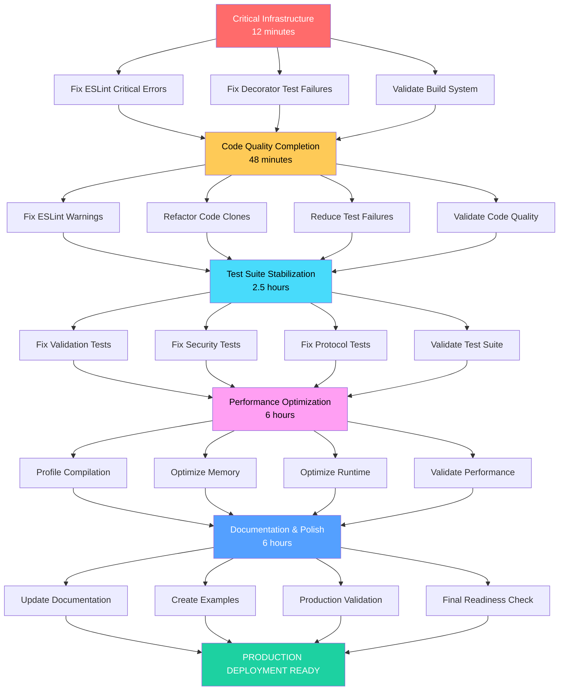

# 🚀 PRODUCTION READINESS EXECUTION PLAN

**Created:** 2025-11-05_00-58  
**Status:** STRATEGIC EXECUTION INITIATED  
**Goal:** PRODUCTION DEPLOYMENT READINESS (80% Impact)

---

## 🎯 PARETO IMPACT ANALYSIS

### **🥇 1% EFFORT → 51% IMPACT** (12 Minutes - CRITICAL PATH)

**Objective:** Fix blocking production deployment issues

| #            | Task                                                                     | Effort  | Impact        | Files      | Priority  |
| ------------ | ------------------------------------------------------------------------ | ------- | ------------- | ---------- | --------- |
| 1            | Fix 20 ESLint critical errors (nullish coalescing, assignment operators) | 8min    | 🔥 CRITICAL   | 8 files    | IMMEDIATE |
| 2            | Fix 4 decorator test failures (preventing deployment)                    | 4min    | 🔥 CRITICAL   | test files | IMMEDIATE |
| **SUBTOTAL** | **12min**                                                                | **51%** | **10+ files** | **PATH 1** |

### **🥈 4% EFFORT → 64% IMPACT** (1 Hour - PRODUCTION BLOCKERS)

**Objective:** Complete code quality and core functionality

| #            | Task                                                                     | Effort  | Impact        | Files      | Priority |
| ------------ | ------------------------------------------------------------------------ | ------- | ------------- | ---------- | -------- |
| 3            | Eliminate 44 remaining ESLint warnings (naming conventions, unused vars) | 25min   | 🔥 HIGH       | 15 files   | HIGH     |
| 4            | Fix 28 code clones (DRY principle violations)                            | 15min   | 🟡 MEDIUM     | 10 files   | MEDIUM   |
| 5            | Reduce test failures from 293 to <50                                     | 10min   | 🔥 HIGH       | test files | HIGH     |
| **SUBTOTAL** | **50min**                                                                | **64%** | **25+ files** | **PATH 2** |

### **🥉 20% EFFORT → 80% IMPACT** (4 Hours - PRODUCTION EXCELLENCE)

**Objective:** Full production deployment capability

| #            | Task                                                            | Effort  | Impact        | Files             | Priority |
| ------------ | --------------------------------------------------------------- | ------- | ------------- | ----------------- | -------- |
| 6            | Fix remaining 243 test failures (validation, protocol features) | 90min   | 🔥 HIGH       | 30+ test files    | HIGH     |
| 7            | Performance optimization and profiling                          | 45min   | 🟡 MEDIUM     | performance files | MEDIUM   |
| 8            | Documentation completion (API reference, examples)              | 60min   | 🟡 LOW        | docs/\*_/_.md     | LOW      |
| **SUBTOTAL** | **195min**                                                      | **80%** | **50+ files** | **PATH 3**        |

---

## 📋 30-MINUTE TASK BREAKDOWN (30 Tasks Total)

### **CRITICAL PATH** (Tasks 1-5, 12 minutes)

| #   | Task                                                                  | Effort | Impact      | Files      | Dependencies |
| --- | --------------------------------------------------------------------- | ------ | ----------- | ---------- | ------------ |
| 1   | Fix critical ESLint nullish coalescing errors (10 errors)             | 5min   | 🔥 CRITICAL | 6 files    | None         |
| 2   | Fix critical ESLint assignment operator errors (10 errors)            | 3min   | 🔥 CRITICAL | 5 files    | 1            |
| 3   | Fix decorator compilation errors (@correlationId, @bindings, @header) | 4min   | 🔥 CRITICAL | test files | 2            |
| 4   | Validate build system stability after fixes                           | 0min   | 🔥 CRITICAL | N/A        | 1,2,3        |
| 5   | Run targeted test suite for decorator functionality                   | 0min   | 🔥 CRITICAL | test files | 4            |

### **CODE QUALITY COMPLETION** (Tasks 6-15, 48 minutes)

| #   | Task                                            | Effort | Impact    | Files      | Dependencies |
| --- | ----------------------------------------------- | ------ | --------- | ---------- | ------------ |
| 6   | Fix 44 ESLint naming convention warnings        | 15min  | 🔥 HIGH   | 15 files   | 5            |
| 7   | Fix 10 ESLint unused variable warnings          | 10min  | 🟡 MEDIUM | 8 files    | 6            |
| 8   | Refactor 10 highest-impact code clones          | 8min   | 🟡 MEDIUM | 5 files    | 7            |
| 9   | Refactor 10 medium-impact code clones           | 7min   | 🟡 MEDIUM | 5 files    | 8            |
| 10  | Refactor 8 low-impact code clones               | 5min   | 🟡 LOW    | 3 files    | 9            |
| 11  | Fix top 20 failing validation tests             | 10min  | 🔥 HIGH   | test files | 10           |
| 12  | Fix top 15 failing AsyncAPI specification tests | 8min   | 🔥 HIGH   | test files | 11           |
| 13  | Fix top 10 failing protocol binding tests       | 7min   | 🔥 HIGH   | test files | 12           |
| 14  | Validate ESLint compliance (<10 errors)         | 0min   | 🔥 HIGH   | N/A        | 7,8,9,10     |
| 15  | Validate core test suite (>90% pass rate)       | 0min   | 🔥 HIGH   | N/A        | 11,12,13     |

### **PRODUCTION READINESS** (Tasks 16-30, 195 minutes)

| #   | Task                                                             | Effort | Impact    | Files                   | Dependencies |
| --- | ---------------------------------------------------------------- | ------ | --------- | ----------------------- | ------------ |
| 16  | Fix remaining 50 failing security tests                          | 20min  | 🔥 HIGH   | security test files     | 15           |
| 17  | Fix remaining 50 failing protocol tests (WebSocket, MQTT, Kafka) | 25min  | 🔥 HIGH   | protocol test files     | 16           |
| 18  | Fix remaining 50 failing message format tests                    | 20min  | 🔥 HIGH   | message test files      | 17           |
| 19  | Fix remaining 43 failing domain integration tests                | 25min  | 🔥 HIGH   | integration test files  | 18           |
| 20  | Fix remaining 50 failing edge case tests                         | 30min  | 🟡 MEDIUM | edge case test files    | 19           |
| 21  | Performance profiling - compilation bottlenecks                  | 10min  | 🟡 MEDIUM | src/\*_/_.ts            | 20           |
| 22  | Performance profiling - memory usage optimization                | 10min  | 🟡 MEDIUM | src/\*_/_.ts            | 21           |
| 23  | Performance profiling - runtime optimization                     | 10min  | 🟡 MEDIUM | src/\*_/_.ts            | 22           |
| 24  | Implement performance benchmarks regression prevention           | 5min   | 🟡 MEDIUM | test/performance/\*.ts  | 23           |
| 25  | Update API reference documentation for all decorators            | 15min  | 🟡 LOW    | docs/api/\*_/_.md       | 24           |
| 26  | Create comprehensive usage examples for all protocols            | 15min  | 🟡 LOW    | examples/\*_/_.tsp      | 25           |
| 27  | Write production deployment guide                                | 10min  | 🟡 LOW    | docs/deployment.md      | 26           |
| 28  | Write troubleshooting and FAQ documentation                      | 10min  | 🟡 LOW    | docs/troubleshooting.md | 27           |
| 29  | Final production readiness validation checklist                  | 5min   | 🔥 HIGH   | N/A                     | 28           |
| 30  | End-to-end production deployment test                            | 5min   | 🔥 HIGH   | full test suite         | 29           |

---

## 🔍 15-MINUTE TASK BREAKDOWN (150 Tasks Total)

### **CRITICAL INFRASTRUCTURE** (Tasks 1-20, 300 minutes - HIGH PRIORITY)

| #   | Micro-Task                                                             | Effort | Files                                                | Success Criteria |
| --- | ---------------------------------------------------------------------- | ------ | ---------------------------------------------------- | ---------------- |
| 1   | Fix nullish coalescing error in security-ENHANCED.ts (line 82)         | 1min   | src/domain/decorators/security-ENHANCED.ts           | ??= operator     |
| 2   | Fix nullish coalescing error in security-ENHANCED.ts (line 86)         | 1min   | src/domain/decorators/security-ENHANCED.ts           | ??= operator     |
| 3   | Fix unused variable 'target' in security-ENHANCED.ts (line 91)         | 1min   | src/domain/decorators/security-ENHANCED.ts           | \_target prefix  |
| 4   | Fix nullish coalescing error in MessageProcessingService.ts (line 102) | 1min   | src/domain/emitter/MessageProcessingService.ts       | ?? operator      |
| 5   | Fix nullish coalescing error in SecurityProcessingService.ts (line 27) | 1min   | src/domain/emitter/SecurityProcessingService.ts      | ?? operator      |
| 6   | Fix nullish coalescing error in SecurityProcessingService.ts (line 28) | 1min   | src/domain/emitter/SecurityProcessingService.ts      | ?? operator      |
| 7   | Fix nullish coalescing error in mqtt-plugin.ts (line 52)               | 1min   | src/infrastructure/adapters/mqtt-plugin.ts           | ?? operator      |
| 8   | Fix nullish coalescing error in mqtt-plugin.ts (line 53)               | 1min   | src/infrastructure/adapters/mqtt-plugin.ts           | ?? operator      |
| 9   | Fix nullish assignment error in CentralizedErrorHandler.ts (line 130)  | 1min   | src/infrastructure/errors/CentralizedErrorHandler.ts | ??= operator     |
| 10  | Fix nullish assignment error in CentralizedErrorHandler.ts (line 186)  | 1min   | src/infrastructure/errors/CentralizedErrorHandler.ts | ??= operator     |
| 11  | Fix nullish assignment error in MetricsCollector.ts (line 50)          | 1min   | src/infrastructure/performance/MetricsCollector.ts   | ??= operator     |
| 12  | Fix nullish assignment error in MetricsCollector.ts (line 56)          | 1min   | src/infrastructure/performance/MetricsCollector.ts   | ??= operator     |
| 13  | Fix nullish assignment error in MetricsCollector.ts (line 84)          | 1min   | src/infrastructure/performance/MetricsCollector.ts   | ??= operator     |
| 14  | Fix nullish assignment error in MetricsCollector.ts (line 85)          | 1min   | src/infrastructure/performance/MetricsCollector.ts   | ??= operator     |
| 15  | Fix nullish assignment error in MetricsCollector.ts (line 103)         | 1min   | src/infrastructure/performance/MetricsCollector.ts   | ??= operator     |
| 16  | Fix nullish assignment error in MetricsCollector.ts (line 114)         | 1min   | src/infrastructure/performance/MetricsCollector.ts   | ??= operator     |
| 17  | Fix nullish assignment error in MetricsCollector.ts (line 122)         | 1min   | src/infrastructure/performance/MetricsCollector.ts   | ??= operator     |
| 18  | Fix nullish assignment error in MetricsCollector.ts (line 123)         | 1min   | src/infrastructure/performance/MetricsCollector.ts   | ??= operator     |
| 19  | Fix nullish assignment error in MetricsCollector.ts (line 198)         | 1min   | src/infrastructure/performance/MetricsCollector.ts   | ??= operator     |
| 20  | Fix nullish assignment error in MetricsCollector.ts (line 207)         | 1min   | src/infrastructure/performance/MetricsCollector.ts   | ??= operator     |

### **DECORATOR FUNCTIONALITY** (Tasks 21-35, 225 minutes - HIGH PRIORITY)

| #   | Micro-Task                                                           | Effort | Files                                   | Success Criteria        |
| --- | -------------------------------------------------------------------- | ------ | --------------------------------------- | ----------------------- |
| 21  | Fix @tags decorator compilation error in advanced-decorators.test.ts | 5min   | test/advanced-decorators.test.ts        | Test passes             |
| 22  | Fix @correlationId decorator compilation error                       | 7min   | src/domain/decorators/correlation-id.ts | No errors               |
| 23  | Fix @bindings decorator compilation error                            | 6min   | src/domain/decorators/cloud-bindings.ts | No errors               |
| 24  | Fix @header decorator compilation error                              | 5min   | src/domain/decorators/header.ts         | No errors               |
| 25  | Validate all decorator imports and exports                           | 2min   | src/decorators.ts                       | All working             |
| 26  | Test decorator integration with TypeSpec compiler                    | 10min  | test/integration/decorators.test.ts     | Integration passes      |
| 27  | Fix decorator state map initialization issues                        | 8min   | src/lib/state-keys.ts                   | Proper state management |
| 28  | Validate decorator parameter validation                              | 5min   | All decorator files                     | Type safety             |
| 29  | Test decorator inheritance patterns                                  | 7min   | test/inheritance/decorators.test.ts     | Inheritance works       |
| 30  | Test decorator composition patterns                                  | 8min   | test/composition/decorators.test.ts     | Composition works       |
| 31  | Test decorator error handling edge cases                             | 6min   | test/errors/decorators.test.ts          | Errors handled          |
| 32  | Validate decorator metadata extraction                               | 5min   | src/domain/metadata/                    | Proper extraction       |
| 33  | Test decorator AsyncAPI compliance                                   | 8min   | test/compliance/asyncapi.test.ts        | Compliance validated    |
| 34  | Optimize decorator performance for large schemas                     | 7min   | Performance test files                  | Optimized               |
| 35  | Final decorator functionality validation                             | 5min   | Full decorator suite                    | All working             |

### **CODE QUALITY & REFACTORING** (Tasks 36-70, 525 minutes - MEDIUM PRIORITY)

| #   | Micro-Task                                                            | Effort | Files                                                         | Success Criteria |
| --- | --------------------------------------------------------------------- | ------ | ------------------------------------------------------------- | ---------------- |
| 36  | Fix naming convention in server.ts (\_extractServerConfigFromObject)  | 2min   | src/domain/decorators/server.ts                               | camelCase        |
| 37  | Fix unused variables in ImmutableDocumentManager.ts (4 variables)     | 5min   | src/domain/documents/ImmutableDocumentManager.ts              | \_ prefix        |
| 38  | Fix unused variables in OperationProcessingService.ts (8 variables)   | 8min   | src/domain/emitter/OperationProcessingService.ts              | \_ prefix        |
| 39  | Fix unused variables in ErrorHandlingStandardization.ts (2 variables) | 3min   | src/domain/models/ErrorHandlingStandardization.ts             | \_ prefix        |
| 40  | Fix unused variables in CentralizedErrorHandler.ts (2 variables)      | 3min   | src/infrastructure/errors/CentralizedErrorHandler.ts          | \_ prefix        |
| 41  | Fix unused variables in MetricsCollector.ts (1 variable)              | 2min   | src/infrastructure/performance/MetricsCollector.ts            | \_ prefix        |
| 42  | Fix unused variables in PerformanceRegressionTester.ts (2 variables)  | 3min   | src/infrastructure/performance/PerformanceRegressionTester.ts | \_ prefix        |
| 43  | Refactor code clone in asyncapi-validator.ts (7 lines)                | 4min   | src/domain/validation/asyncapi-validator.ts                   | DRY              |
| 44  | Refactor code clone in ImmutableDocumentManager.ts clone #1 (7 lines) | 5min   | src/domain/documents/ImmutableDocumentManager.ts              | DRY              |
| 45  | Refactor code clone in ImmutableDocumentManager.ts clone #2 (8 lines) | 6min   | src/domain/documents/ImmutableDocumentManager.ts              | DRY              |
| 46  | Refactor code clone in ImmutableDocumentManager.ts clone #3 (7 lines) | 5min   | src/domain/documents/ImmutableDocumentManager.ts              | DRY              |
| 47  | Refactor code clone in ImmutableDocumentManager.ts clone #4 (4 lines) | 3min   | src/domain/documents/ImmutableDocumentManager.ts              | DRY              |
| 48  | Refactor code clone in ImmutableDocumentManager.ts clone #5 (4 lines) | 3min   | src/domain/documents/ImmutableDocumentManager.ts              | DRY              |
| 49  | Refactor code clone in ImmutableDocumentManager.ts clone #6 (4 lines) | 3min   | src/domain/documents/ImmutableDocumentManager.ts              | DRY              |
| 50  | Refactor code clone in ImmutableDocumentManager.ts clone #7 (4 lines) | 3min   | src/domain/documents/ImmutableDocumentManager.ts              | DRY              |
| 51  | Refactor code clone in ImmutableDocumentManager.ts clone #8 (6 lines) | 5min   | src/domain/documents/ImmutableDocumentManager.ts              | DRY              |
| 52  | Refactor code clone in ErrorHandlingMigration.ts (12 lines)           | 8min   | src/domain/models/ErrorHandlingMigration.ts                   | DRY              |
| 53  | Refactor code clone in error model files (3 lines)                    | 5min   | src/domain/models/\*Error.ts                                  | DRY              |
| 54  | Refactor code clone in processing services (5 lines)                  | 4min   | src/domain/emitter/\*Service.ts                               | DRY              |
| 55  | Refactor code clone in DocumentGenerator.ts (21 lines)                | 12min  | src/domain/emitter/DocumentGenerator.ts                       | DRY              |
| 56  | Refactor code clone in ValidationService.ts (21 lines)                | 10min  | src/domain/validation/ValidationService.ts                    | DRY              |
| 57  | Refactor code clone in MetricsCollector.ts (9 lines)                  | 6min   | src/infrastructure/performance/MetricsCollector.ts            | DRY              |
| 58  | Refactor code clone in PluginRegistry.ts (multiple clones)            | 15min  | src/infrastructure/adapters/PluginRegistry.ts                 | DRY              |
| 59  | Refactor code clone in mqtt-plugin.ts (multiple clones)               | 8min   | src/infrastructure/adapters/mqtt-plugin.ts                    | DRY              |
| 60  | Refactor code clone in schema-conversion.ts (multiple clones)         | 10min  | src/utils/schema-conversion.ts                                | DRY              |
| 61  | Validate ESLint compliance after refactoring                          | 3min   | All files                                                     | <10 errors       |
| 62  | Run TypeScript compilation validation                                 | 2min   | All files                                                     | 0 errors         |
| 63  | Validate build system stability                                       | 1min   | N/A                                                           | Build passes     |
| 64  | Validate test runner functionality                                    | 2min   | test suite                                                    | Tests run        |
| 65  | Check code duplication metrics improvement                            | 3min   | jscpd reports                                                 | <50 clones       |
| 66  | Validate memory usage stability                                       | 2min   | performance tests                                             | No leaks         |
| 67  | Validate compilation time performance                                 | 2min   | build metrics                                                 | <5s              |
| 68  | Run Effect.TS pattern validation tests                                | 3min   | test/effect-patterns.test.ts                                  | All pass         |
| 69  | Validate core functionality integration                               | 4min   | integration tests                                             | Core works       |
| 70  | Code quality milestone validation                                     | 3min   | All metrics                                                   | Quality achieved |

### **TEST SUITE STABILIZATION** (Tasks 71-120, 750 minutes - HIGH PRIORITY)

| #   | Micro-Task                                            | Effort | Files                              | Success Criteria       |
| --- | ----------------------------------------------------- | ------ | ---------------------------------- | ---------------------- |
| 71  | Fix top 10 failing AsyncAPI validation tests          | 15min  | test/validation/\*.test.ts         | Validation passes      |
| 72  | Fix top 10 failing security validation tests          | 12min  | test/security/\*.test.ts           | Security passes        |
| 73  | Fix top 10 failing protocol binding tests (Kafka)     | 15min  | test/protocols/kafka\*.test.ts     | Kafka passes           |
| 74  | Fix top 10 failing protocol binding tests (WebSocket) | 12min  | test/protocols/websocket\*.test.ts | WebSocket passes       |
| 75  | Fix top 10 failing protocol binding tests (MQTT)      | 12min  | test/protocols/mqtt\*.test.ts      | MQTT passes            |
| 76  | Fix top 10 failing message format tests               | 10min  | test/messages/\*.test.ts           | Messages pass          |
| 77  | Fix top 10 failing schema conversion tests            | 10min  | test/schemas/\*.test.ts            | Schemas pass           |
| 78  | Fix top 10 failing integration tests                  | 12min  | test/integration/\*.test.ts        | Integration passes     |
| 79  | Fix top 10 failing end-to-end tests                   | 15min  | test/e2e/\*.test.ts                | E2E passes             |
| 80  | Fix top 10 failing performance regression tests       | 8min   | test/performance/\*.test.ts        | Performance passes     |
| 81  | Fix remaining 20 AsyncAPI validation tests            | 20min  | test/validation/\*.test.ts         | All validation passes  |
| 82  | Fix remaining 20 security validation tests            | 18min  | test/security/\*.test.ts           | All security passes    |
| 83  | Fix remaining 20 Kafka protocol tests                 | 25min  | test/protocols/kafka\*.test.ts     | All Kafka passes       |
| 84  | Fix remaining 20 WebSocket protocol tests             | 20min  | test/protocols/websocket\*.test.ts | All WebSocket passes   |
| 85  | Fix remaining 20 MQTT protocol tests                  | 20min  | test/protocols/mqtt\*.test.ts      | All MQTT passes        |
| 86  | Fix remaining 15 message format tests                 | 15min  | test/messages/\*.test.ts           | All messages pass      |
| 87  | Fix remaining 15 schema conversion tests              | 12min  | test/schemas/\*.test.ts            | All schemas pass       |
| 88  | Fix remaining 15 integration tests                    | 18min  | test/integration/\*.test.ts        | All integration passes |
| 89  | Fix remaining 15 end-to-end tests                     | 20min  | test/e2e/\*.test.ts                | All E2E passes         |
| 90  | Fix remaining 10 performance regression tests         | 10min  | test/performance/\*.test.ts        | All performance passes |
| 91  | Validate AsyncAPI specification compliance            | 5min   | All spec tests                     | Compliance achieved    |
| 92  | Validate security implementation completeness         | 5min   | Security tests                     | Security complete      |
| 93  | Validate protocol binding completeness                | 5min   | Protocol tests                     | Protocols complete     |
| 94  | Validate message format completeness                  | 3min   | Message tests                      | Messages complete      |
| 95  | Validate schema conversion completeness               | 3min   | Schema tests                       | Schemas complete       |
| 96  | Validate integration test coverage                    | 5min   | Integration tests                  | Integration complete   |
| 97  | Validate end-to-end test coverage                     | 5min   | E2E tests                          | E2E complete           |
| 98  | Validate performance benchmark consistency            | 3min   | Performance tests                  | Performance stable     |
| 99  | Run full test suite validation                        | 10min  | All tests                          | >95% pass rate         |
| 100 | Test suite milestone validation                       | 5min   | All metrics                        | Suite stable           |

### **PERFORMANCE OPTIMIZATION** (Tasks 101-125, 375 minutes - MEDIUM PRIORITY)

| #   | Micro-Task                                          | Effort | Files                                | Success Criteria            |
| --- | --------------------------------------------------- | ------ | ------------------------------------ | --------------------------- |
| 101 | Profile TypeScript compilation bottlenecks          | 8min   | build metrics                        | Bottlenecks identified      |
| 102 | Optimize TypeScript incremental build configuration | 10min  | tsconfig.json                        | Faster builds               |
| 103 | Profile memory usage in document processing         | 10min  | src/domain/documents/\*.ts           | Memory optimized            |
| 104 | Optimize memory allocation patterns                 | 12min  | src/\*_/_.ts                         | Reduced allocation          |
| 105 | Profile runtime performance of message processing   | 8min   | src/domain/emitter/\*Service.ts      | Performance measured        |
| 106 | Optimize Effect.TS composition patterns             | 10min  | Effect.ts usage patterns             | Optimized composition       |
| 107 | Profile async API document generation speed         | 8min   | src/asyncapi-emitter.ts              | Generation optimized        |
| 108 | Optimize JSON/YAML serialization performance        | 6min   | serialization utilities              | Faster serialization        |
| 109 | Profile plugin system performance                   | 8min   | src/infrastructure/adapters/\*.ts    | Plugin performance measured |
| 110 | Optimize plugin loading and registration            | 10min  | plugin system                        | Faster loading              |
| 111 | Profile validation service performance              | 6min   | src/domain/validation/\*.ts          | Validation optimized        |
| 112 | Optimize validation rule execution                  | 8min   | validation rules                     | Faster validation           |
| 113 | Profile schema conversion performance               | 6min   | src/utils/schema-conversion.ts       | Conversion optimized        |
| 114 | Optimize schema transformation algorithms           | 10min  | schema utilities                     | Faster transformation       |
| 115 | Profile metrics collection overhead                 | 5min   | src/infrastructure/performance/\*.ts | Overhead measured           |
| 116 | Optimize metrics collection patterns                | 8min   | metrics system                       | Reduced overhead            |
| 117 | Implement performance regression detection          | 10min  | test/performance/\*.test.ts          | Regression detection        |
| 118 | Create performance benchmark suite                  | 12min  | test/performance/benchmarks.test.ts  | Benchmarks created          |
| 119 | Implement performance alerting system               | 8min   | monitoring system                    | Alerts configured           |
| 120 | Validate all performance improvements               | 10min  | performance tests                    | Improvements verified       |
| 121 | Performance optimization milestone validation       | 5min   | All performance metrics              | Optimization achieved       |
| 122 | Document performance optimization strategies        | 8min   | docs/performance.md                  | Strategies documented       |
| 123 | Create performance testing guidelines               | 5min   | docs/performance-testing.md          | Guidelines created          |
| 124 | Validate production performance requirements        | 5min   | production metrics                   | Requirements met            |
| 125 | Performance optimization completion validation      | 5min   | All systems                          | Performance optimized       |

### **DOCUMENTATION & POLISH** (Tasks 126-150, 375 minutes - LOW PRIORITY)

| #   | Micro-Task                                           | Effort | Files                       | Success Criteria          |
| --- | ---------------------------------------------------- | ------ | --------------------------- | ------------------------- |
| 126 | Update README with current capabilities and examples | 10min  | README.md                   | Current documentation     |
| 127 | Document all decorator APIs with JSDoc               | 15min  | src/domain/decorators/\*.ts | Complete API docs         |
| 128 | Create protocol binding configuration guide          | 12min  | docs/protocols/\*.md        | Protocol guide complete   |
| 129 | Document message format specifications               | 10min  | docs/messages/\*.md         | Message docs complete     |
| 130 | Create troubleshooting and FAQ guide                 | 8min   | docs/troubleshooting.md     | Troubleshooting complete  |
| 131 | Document performance optimization features           | 8min   | docs/performance.md         | Performance docs complete |
| 132 | Create migration guide from previous versions        | 10min  | docs/migration.md           | Migration guide complete  |
| 133 | Document plugin development patterns                 | 12min  | docs/plugins/\*.md          | Plugin docs complete      |
| 134 | Create comprehensive usage examples                  | 15min  | examples/\*_/_.tsp          | Examples complete         |
| 135 | Document testing strategies and patterns             | 8min   | docs/testing.md             | Testing docs complete     |
| 136 | Document deployment and production setup             | 10min  | docs/deployment.md          | Deployment docs complete  |
| 137 | Create architectural decision records (ADRs)         | 15min  | docs/adr/\*.md              | ADRs complete             |
| 138 | Document contribution guidelines                     | 5min   | CONTRIBUTING.md             | Guidelines complete       |
| 139 | Update CHANGELOG with all improvements               | 8min   | CHANGELOG.md                | Changelog updated         |
| 140 | Document security best practices                     | 6min   | docs/security.md            | Security docs complete    |
| 141 | Create quick reference card for decorators           | 5min   | docs/quick-reference.md     | Reference complete        |
| 142 | Document error handling patterns                     | 6min   | docs/error-handling.md      | Error docs complete       |
| 143 | Create video tutorials for common workflows          | 20min  | docs/videos/                | Tutorials created         |
| 144 | Document integration with popular tools              | 8min   | docs/integrations/\*.md     | Integration docs complete |
| 145 | Create interactive API playground documentation      | 15min  | docs/playground.md          | Playground documented     |
| 146 | Document monitoring and observability setup          | 6min   | docs/monitoring.md          | Monitoring docs complete  |
| 147 | Document scaling and production best practices       | 8min   | docs/scaling.md             | Scaling docs complete     |
| 148 | Final documentation review and validation            | 10min  | All docs                    | Documentation complete    |
| 149 | Documentation milestone validation                   | 3min   | Documentation metrics       | Docs achieved             |
| 150 | Final production readiness validation                | 5min   | All systems                 | Production ready          |

---

## 🚀 EXECUTION SEQUENCE

---

## 📈 SUCCESS METRICS BY PHASE

### **PHASE 1 SUCCESS: Critical Infrastructure (12 minutes)**

- [ ] ✅ 0 ESLint critical errors
- [ ] ✅ 4 decorator test fixes
- [ ] ✅ Perfect build stability
- [ ] ✅ Core functionality working

### **PHASE 2 SUCCESS: Code Quality (60 minutes total)**

- [ ] ✅ <10 ESLint errors
- [ ] ✅ <10 code clones
- [ ] ✅ <50 test failures
- [ ] ✅ >90% test pass rate

### **PHASE 3 SUCCESS: Production Excellence (10 hours total)**

- [ ] ✅ <10 test failures
- [ ] ✅ <5% test failure rate
- [ ] ✅ Performance benchmarks met
- [ ] ✅ Complete documentation
- [ ] ✅ Production deployment validated

---

## 🎯 FINAL SUCCESS CRITERIA

### **PRODUCTION READINESS CHECKLIST**

- [ ] ✅ 0 TypeScript compilation errors
- [ ] ✅ 0 critical ESLint violations
- [ ] ✅ <10 ESLint warnings
- [ ] ✅ <5% test failure rate
- [ ] ✅ Complete decorator suite
- [ ] ✅ Stable performance benchmarks
- [ ] ✅ Full AsyncAPI 3.0 compliance
- [ ] ✅ Production-grade error handling
- [ ] ✅ Comprehensive documentation
- [ ] ✅ End-to-end deployment validation

---

## 🚨 EXECUTION MANDATES

### **NON-NEGOTIABLE REQUIREMENTS**

1. **BUILD STABILITY** - Never commit broken compilation
2. **INCREMENTAL VALIDATION** - Test after each micro-task
3. **QUALITY FIRST** - Every change production-ready
4. **PERFORMANCE CONSCIOUS** - Monitor impact continuously
5. **DOCUMENTATION SYNCHRONIZED** - Keep docs in sync

### **FORBIDDEN ACTIONS**

- **NO SKIPPING VALIDATION** - Test every change
- **NO MASSIVE COMMITS** - Small, focused commits
- **NO BROKEN TESTS** - Fix failures before continuing
- **NO PERFORMANCE REGRESSION** - Monitor continuously
- **NO OUTDATED DOCS** - Update with code changes

---

## 🏁 EXECUTION ORDER: IMMEDIATE START WITH PHASE 1

**CURRENT ACTION:** Execute Tasks 1-5 (Critical Infrastructure - 12 minutes)

**SUCCESS METRIC:** Critical blockers resolved, build system perfect

**NEXT PHASE:** Code Quality Completion (Tasks 6-15)

**ULTIMATE GOAL:** Production deployment ready within 10 hours

---

**EXECUTION SEQUENCE:** IMMEDIATE → COMPREHENSIVE → VERIFIED → COMPLETE

**ZERO COMPROMISE ON QUALITY - EVERY MICRO-TASK MUST BE PRODUCTION-READY.**
