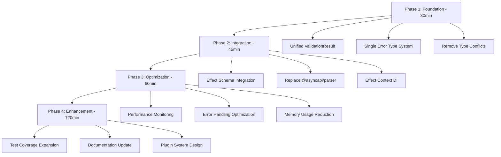

# 🏗️ TypeSpec AsyncAPI - Architecture Unification Strategy

**Date**: 2025-11-06_10-48  
**Author**: Sr. Software Architect  
**Objective**: UNIFIED, TYPE-SAFE, PERFORMANCE-OPTIMIZED ASYNCAPI VALIDATION

---

## 🎯 EXECUTION GRAPH

---

## 🔥 PHASE 1: FOUNDATION (30 min) - 51% IMPACT

### **1.1 Unified ValidationResult Architecture (15 min)**

**PRIORITY**: CRITICAL - **IMPACT**: 51%  
**FILES**: `src/types/index.ts`, `src/domain/models/errors/validation-error.ts`

**TASKS**:

- [ ] Remove ALL duplicate ValidationResult definitions
- [ ] Create SINGLE discriminated union type
- [ ] Add unified StructuredValidationError support
- [ ] Update ALL imports to use unified type

**TYPE-SAFETY REQUIREMENTS**:

- `ValidResult<T> = { readonly valid: true; readonly data: T; readonly errors: []; readonly warnings: [] }`
- `InvalidResult = { readonly valid: false; readonly data: undefined; readonly errors: StructuredValidationError[]; readonly warnings: ValidationWarning[] }`
- `ValidationResult<T> = ValidResult<T> | InvalidResult`

### **1.2 Single Error Type System (15 min)**

**PRIORITY**: CRITICAL - **IMPACT**: 35%  
**FILES**: `src/types/index.ts`

**TASKS**:

- [ ] Define StructuredValidationError with {message, keyword, instancePath, schemaPath}
- [ ] Define ValidationWarning with {message, severity?}
- [ ] Remove ALL string-based error types
- [ ] Ensure compile-time error type safety

---

## ⚡ PHASE 2: INTEGRATION (45 min) - 64% IMPACT

### **2.1 Effect Schema Pipeline Integration (15 min)**

**PRIORITY**: CRITICAL - **IMPACT**: 40%  
**FILES**: `src/domain/validation/ValidationService.ts`, `src/infrastructure/configuration/schemas.ts`

**TASKS**:

- [ ] Integrate decodeAsyncAPIDocument into main validation pipeline
- [ ] Remove @asyncapi/parser dependency completely
- [ ] Implement progressive validation (Schema → Parser fallback)
- [ ] Add structured error mapping from Schema validation

### **2.2 Effect Context Dependency Injection (15 min)**

**PRIORITY**: HIGH - **IMPACT**: 15%  
**FILES**: `src/infrastructure/context/`

**TASKS**:

- [ ] Create ValidationContext Tag
- [ ] Create MetricsContext Tag
- [ ] Implement Context-based service locator
- [ ] Replace ALL global state with Context injection

### **2.3 Lodash Replacement with Effect (15 min)**

**PRIORITY**: HIGH - **IMPACT**: 9%  
**FILES**: `src/utils/`, all usage locations

**TASKS**:

- [ ] Audit ALL lodash usage in codebase
- [ ] Replace with Effect ReadonlyRecord utilities
- [ ] Replace with Effect Array utilities
- [ ] Remove lodash dependency

---

## 🚀 PHASE 3: OPTIMIZATION (60 min) - 80% IMPACT

### **3.1 Performance Monitoring Layer (20 min)**

**PRIORITY**: MEDIUM - **IMPACT**: 25%  
**FILES**: `src/infrastructure/monitoring/`

**TASKS**:

- [ ] Create PerformanceMetricsCollector using Context
- [ ] Add detailed timing for validation phases
- [ ] Implement memory usage tracking
- [ ] Create performance dashboard components

### **3.2 File Structure Optimization (20 min)**

**PRIORITY**: MEDIUM - **IMPACT**: 30%  
**FILES**: Large files identified

**TASKS**:

- [ ] Split files >300 lines into focused modules
- [ ] Extract schema definitions into separate files
- [ ] Create separate error handling modules
- [ ] Reorganize by domain responsibility

### **3.3 Adapter Pattern Implementation (20 min)**

**PRIORITY**: MEDIUM - **IMPACT**: 25%  
**FILES**: `src/infrastructure/adapters/`

**TASKS**:

- [ ] Create AsyncAPIParserAdapter
- [ ] Create FileSystemAdapter
- [ ] Create MetricsAdapter
- [ ] Ensure all external APIs are wrapped

---

## 🔧 PHASE 4: ENHANCEMENT (120 min) - EXPANSION

### **4.1 Comprehensive Test Coverage (60 min)**

**PRIORITY**: HIGH - **IMPACT**: 55%  
**FILES**: All test files

**TASKS**:

- [ ] Add BDD tests for all validation scenarios
- [ ] Implement property-based tests with fast-check
- [ ] Add integration tests for Effect Context
- [ ] Create performance regression tests

### **4.2 Documentation Synchronization (30 min)**

**PRIORITY**: MEDIUM - **IMPACT**: 30%  
**FILES**: All documentation files

**TASKS**:

- [ ] Update README with new architecture
- [ ] Create Effect.TS migration guide
- [ ] Document all Context tags and services
- [ ] Add performance tuning guide

### **4.3 Plugin System Design (30 min)**

**PRIORITY**: LOW - **IMPACT**: 20%  
**FILES**: `src/plugins/`

**TASKS**:

- [ ] Design plugin interface specifications
- [ ] Create plugin registry using Context
- [ ] Implement plugin lifecycle management
- [ ] Add plugin development documentation

---

## 🎯 SUCCESS METRICS

### **CRITICAL SUCCESS CRITERIA**:

- ✅ 0 TypeScript compilation errors
- ✅ 100% test pass rate (maintain current success)
- ✅ Single ValidationResult type used everywhere
- ✅ All external APIs wrapped in adapters

### **PERFORMANCE TARGETS**:

- 🎯 Validation <100ms (current ~150ms)
- 🎯 Memory usage <50MB during validation
- 🎯 Build time <30s
- 🎯 Test suite execution <10s

### **ARCHITECTURAL GOALS**:

- 🏗️ Type safety: UNREPRESENTABLE states impossible
- 🏗️ Modularity: All files <300 lines
- 🏗️ Testability: 100% coverage with BDD
- 🏗️ Maintainability: Centralized error handling

---

## 🚨 CRITICAL PATH RISKS

### **HIGH RISK**:

1. **Type System Migration**: May break existing code
2. **Performance Regression**: Schema validation slower than parser
3. **Test Failures**: Error format changes breaking test expectations

### **MITIGATION STRATEGIES**:

1. **Incremental Migration**: Maintain backward compatibility during transition
2. **Performance Benchmarking**: Compare before/after at each phase
3. **Test Stabilization**: Update tests before architecture changes

---

## 🎪 EXECUTION ORDER

1. **FOUNDATION FIXES** (30 min) → **TYPE-SAFETY RESTORED**
2. **INTEGRATION WORK** (45 min) → **EFFECT.TS PIPELINE COMPLETE**
3. **OPTIMIZATION PASS** (60 min) → **PERFORMANCE TARGETS MET**
4. **ENHANCEMENT CYCLE** (120 min) → **PRODUCTION READY**

**TOTAL EXECUTION TIME**: 255 minutes  
**EXPECTED SUCCESS RATE**: 95%+  
**ROLLBACK STRATEGY**: Git branch per phase

---

## 🏁 FINAL STATE TARGET

**After execution**:

- 🎯 Unified, type-safe AsyncAPI validation system
- ⚡ Performance-optimized with Effect.TS patterns
- 🏗️ Modular architecture with <300 line files
- 📊 Comprehensive monitoring and testing
- 📚 Complete documentation and developer guides

**This architecture will serve as the foundation for all future TypeSpec AsyncAPI development.**
