# Comprehensive Architecture Recovery & Type Safety Plan
## TypeSpec AsyncAPI Emitter - Production Hardening

**Created:** 2025-11-15 07:35
**Architect:** Senior Software Architect (Claude Code)
**Scope:** Complete architectural refactoring with DDD principles
**Timeline:** 60-74 hours (~8-9 working days)

---

## 🎯 EXECUTIVE SUMMARY

This plan transforms the TypeSpec AsyncAPI Emitter from "basic features working" to "production-grade architecture" through systematic application of:

- **Domain-Driven Design** (value objects, aggregates, repositories)
- **Type Safety** (eliminate `any`, branded types, discriminated unions)
- **SOLID Principles** (single responsibility, dependency inversion)
- **Effect.TS Patterns** (railway programming, error handling)
- **Clean Architecture** (layer separation, dependency flow)

**Pareto Analysis:**
- **1% effort → 51% value:** Type safety foundation (8 hours)
- **4% effort → 64% value:** Critical fixes (10 hours)
- **20% effort → 80% value:** Architecture refactoring (22 hours)

---

## 📊 PARETO BREAKDOWN

### 🔥 THE 1% (Delivers 51% of Value)

**Investment:** 8 hours
**Return:** Foundational type safety, prevents security issues

| # | Task | Hours | Impact |
|---|------|-------|--------|
| 1 | Fix `any` types in security-ENHANCED.ts | 2-3h | 🔥 SECURITY |
| 2 | Create core value objects (ChannelPath, etc.) | 4-6h | 🔥 TYPE SAFETY |

**Why This Matters:**
- Security code with `any` types = security vulnerabilities
- Value objects = compile-time validation, impossible to mix up parameters
- Foundation for all other improvements

---

### ⚡ THE 4% (Delivers 64% of Value)

**Investment:** 10 hours
**Return:** Eliminates critical architectural flaws

| # | Task | Hours | Impact |
|---|------|-------|--------|
| 3 | Fix circular dependencies | 2h | 🔥 BUILD STABILITY |
| 4 | Add PipelineContext immutability | 1h | 🔥 SAFETY |
| 5 | Fix split brain patterns | 3-4h | 🔥 CORRECTNESS |
| 6 | Complete quick wins #6-10 | 1h | ⚡ CLEANUP |

**Why This Matters:**
- Circular dependencies cause build issues
- Immutability prevents accidental state mutations
- Split brains = impossible states become possible
- Quick wins = clean up technical debt

---

### 🎯 THE 20% (Delivers 80% of Value)

**Investment:** 22 hours
**Return:** Maintainable, extensible architecture

| # | Task | Hours | Impact |
|---|------|-------|--------|
| 7 | Split ValidationService (537→3 modules) | 4h | 📈 MAINTAINABILITY |
| 8 | Split effect-helpers (536→3 modules) | 4h | 📈 MAINTAINABILITY |
| 9 | Split PluginRegistry (509→3 modules) | 4h | 📈 MAINTAINABILITY |
| 10 | Eliminate document validation duplication | 1h | 🔄 DRY |
| 11 | Add global error boundary | 2h | 🛡️ RELIABILITY |
| 12 | Repository pattern for documents | 4-6h | 🏛️ CLEAN ARCH |

**Why This Matters:**
- Files >350 lines = hard to understand/test
- Duplication = bugs in multiple places
- Global error boundary = graceful failure
- Repository = testable, flexible persistence

---

## 📋 COMPREHENSIVE TASK LIST (30 Tasks, 30-100min each)

### Phase 1: Type Safety Foundation (THE 1%)

| # | Task | Effort | Priority | Dependencies |
|---|------|--------|----------|--------------|
| 1.1 | Design SecurityScheme discriminated union | 60min | P0 | - |
| 1.2 | Create SecurityScheme type hierarchy | 90min | P0 | 1.1 |
| 1.3 | Implement type guards for all SecurityScheme variants | 60min | P0 | 1.2 |
| 1.4 | Replace `any` in validateSecurityScheme | 45min | P0 | 1.3 |
| 1.5 | Add unit tests for type-safe security validation | 45min | P0 | 1.4 |
| 2.1 | Design value object architecture | 45min | P0 | - |
| 2.2 | Implement ChannelPath value object | 60min | P0 | 2.1 |
| 2.3 | Implement ServerUrl value object | 60min | P0 | 2.1 |
| 2.4 | Implement ProtocolName value object | 45min | P0 | 2.1 |
| 2.5 | Implement SchemaName value object | 45min | P0 | 2.1 |
| 2.6 | Update codebase to use value objects | 90min | P0 | 2.2-2.5 |

**Subtotal Phase 1:** ~10 hours

---

### Phase 2: Critical Architectural Fixes (THE 4%)

| # | Task | Effort | Priority | Dependencies |
|---|------|--------|----------|--------------|
| 3.1 | Extract PluginTypes.ts to break circular dependency | 45min | P0 | - |
| 3.2 | Refactor IPlugin imports to use shared types | 30min | P0 | 3.1 |
| 3.3 | Extract CloudBindingTypes.ts | 45min | P0 | - |
| 4.1 | Add readonly to all PipelineContext properties | 15min | P1 | - |
| 4.2 | Create factory with validation for PipelineContext | 45min | P1 | 4.1 |
| 5.1 | Design ErrorHandlingMode discriminated union | 30min | P1 | - |
| 5.2 | Design LoggingMode discriminated union | 30min | P1 | - |
| 5.3 | Refactor ErrorHandlingConfig to use unions | 60min | P1 | 5.1-5.2 |
| 5.4 | Update all usage sites of ErrorHandlingConfig | 90min | P1 | 5.3 |
| 6.1 | Fix naming conventions in CentralizedErrorHandler | 20min | P1 | - |
| 6.2 | Fix naming conventions in MetricsCollector | 20min | P1 | - |
| 6.3 | Remove unused variables from security-ENHANCED.ts | 15min | P1 | 1.4 |
| 6.4 | Prefix unused params in security-ENHANCED.ts | 15min | P1 | 1.4 |

**Subtotal Phase 2:** ~8 hours

---

### Phase 3: File Splitting (Part of THE 20%)

| # | Task | Effort | Priority | Dependencies |
|---|------|--------|----------|--------------|
| 7.1 | Design ValidationService module split | 30min | P1 | - |
| 7.2 | Extract BasicValidator module | 90min | P1 | 7.1 |
| 7.3 | Extract CrossReferenceValidator module | 90min | P1 | 7.1 |
| 7.4 | Extract ComponentValidator module | 90min | P1 | 7.1 |
| 8.1 | Design effect-helpers module split | 30min | P1 | - |
| 8.2 | Extract RailwayLogging module | 90min | P1 | 8.1 |
| 8.3 | Extract RailwayValidation module | 90min | P1 | 8.1 |
| 8.4 | Extract RailwayErrorRecovery module | 90min | P1 | 8.1 |
| 9.1 | Design PluginRegistry module split | 30min | P1 | - |
| 9.2 | Extract PluginLifecycle module | 90min | P1 | 9.1 |
| 9.3 | Extract PluginDependencyManager module | 90min | P1 | 9.1 |
| 9.4 | Extract PluginHealthMonitor module | 90min | P1 | 9.1 |

**Subtotal Phase 3:** ~13.5 hours

---

### Phase 4: Code Quality & Patterns (Rest of THE 20%)

| # | Task | Effort | Priority | Dependencies |
|---|------|--------|----------|--------------|
| 10.1 | Extract shared validation logic from ValidationService | 60min | P2 | 7.2-7.4 |
| 11.1 | Design global error boundary pattern | 30min | P1 | - |
| 11.2 | Implement withGlobalErrorBoundary utility | 60min | P1 | 11.1 |
| 11.3 | Integrate error boundary into emitter entry point | 30min | P1 | 11.2 |
| 12.1 | Design DocumentRepository interface | 45min | P2 | - |
| 12.2 | Implement InMemoryDocumentRepository | 90min | P2 | 12.1 |
| 12.3 | Create DocumentRepositoryLive layer | 30min | P2 | 12.2 |
| 12.4 | Refactor ImmutableDocumentManager to use repository | 90min | P2 | 12.3 |
| 12.5 | Update all document access to use repository | 90min | P2 | 12.4 |

**Subtotal Phase 4:** ~9 hours

---

## 🔬 MICRO-TASKS BREAKDOWN (150 Tasks, ~15min each)

### Phase 1.1: Design SecurityScheme Discriminated Union (60min)

| # | Micro-Task | Minutes |
|---|------------|---------|
| 1.1.1 | Review AsyncAPI 3.0 security scheme specification | 15 |
| 1.1.2 | List all security scheme types (OAuth2, HTTP, ApiKey, etc.) | 10 |
| 1.1.3 | Identify required fields for each type | 15 |
| 1.1.4 | Design discriminated union structure | 20 |

### Phase 1.2: Create SecurityScheme Type Hierarchy (90min)

| # | Micro-Task | Minutes |
|---|------------|---------|
| 1.2.1 | Create ApiKeySecurityScheme interface | 15 |
| 1.2.2 | Create HttpSecurityScheme interface | 15 |
| 1.2.3 | Create OAuth2SecurityScheme interface | 20 |
| 1.2.4 | Create SaslSecurityScheme interface | 15 |
| 1.2.5 | Create X509SecurityScheme interface | 10 |
| 1.2.6 | Create SymmetricEncryptionSecurityScheme interface | 10 |
| 1.2.7 | Create AsymmetricEncryptionSecurityScheme interface | 10 |
| 1.2.8 | Create SecurityScheme union type | 5 |

### Phase 1.3: Implement Type Guards (60min)

| # | Micro-Task | Minutes |
|---|------------|---------|
| 1.3.1 | Implement isApiKeyScheme type guard | 10 |
| 1.3.2 | Implement isHttpScheme type guard | 10 |
| 1.3.3 | Implement isOAuth2Scheme type guard (already exists, enhance) | 10 |
| 1.3.4 | Implement isSaslScheme type guard | 10 |
| 1.3.5 | Implement isX509Scheme type guard | 5 |
| 1.3.6 | Implement isSymmetricEncryptionScheme type guard | 5 |
| 1.3.7 | Implement isAsymmetricEncryptionScheme type guard | 5 |
| 1.3.8 | Add unit tests for all type guards | 15 |

### Phase 1.4: Replace `any` in validateSecurityScheme (45min)

| # | Micro-Task | Minutes |
|---|------------|---------|
| 1.4.1 | Update function signature to accept SecurityScheme | 5 |
| 1.4.2 | Replace unsafe member access with discriminated union pattern | 15 |
| 1.4.3 | Add exhaustive switch for scheme types | 10 |
| 1.4.4 | Update validation logic for each scheme type | 10 |
| 1.4.5 | Verify all ESLint errors are resolved | 5 |

### Phase 1.5: Add Unit Tests (45min)

| # | Micro-Task | Minutes |
|---|------------|---------|
| 1.5.1 | Test OAuth2 scheme validation | 10 |
| 1.5.2 | Test HTTP scheme validation | 10 |
| 1.5.3 | Test ApiKey scheme validation | 10 |
| 1.5.4 | Test SASL scheme validation | 10 |
| 1.5.5 | Test invalid scheme rejection | 5 |

### Phase 2.1: Design Value Object Architecture (45min)

| # | Micro-Task | Minutes |
|---|------------|---------|
| 2.1.1 | Review Effect.TS branded type patterns | 10 |
| 2.1.2 | Define value object interface pattern | 15 |
| 2.1.3 | Design validation strategy (Effect-based) | 10 |
| 2.1.4 | Create value object template | 10 |

### Phase 2.2: Implement ChannelPath Value Object (60min)

| # | Micro-Task | Minutes |
|---|------------|---------|
| 2.2.1 | Create ChannelPath branded type | 5 |
| 2.2.2 | Implement ChannelPath.create with validation | 15 |
| 2.2.3 | Implement variable syntax validation | 15 |
| 2.2.4 | Add ChannelPath.unsafe for trusted inputs | 5 |
| 2.2.5 | Add ChannelPath.toString helper | 5 |
| 2.2.6 | Write unit tests | 15 |

### Phase 2.3: Implement ServerUrl Value Object (60min)

| # | Micro-Task | Minutes |
|---|------------|---------|
| 2.3.1 | Create ServerUrl branded type | 5 |
| 2.3.2 | Implement ServerUrl.create with URL validation | 15 |
| 2.3.3 | Add protocol validation (http/https/ws/wss/kafka/amqp) | 15 |
| 2.3.4 | Add ServerUrl.parse to extract components | 10 |
| 2.3.5 | Add ServerUrl.toString helper | 5 |
| 2.3.6 | Write unit tests | 10 |

### Phase 2.4: Implement ProtocolName Value Object (45min)

| # | Micro-Task | Minutes |
|---|------------|---------|
| 2.4.1 | Create ProtocolName branded type | 5 |
| 2.4.2 | Define allowed protocols enum | 10 |
| 2.4.3 | Implement ProtocolName.create with validation | 10 |
| 2.4.4 | Add ProtocolName.toString helper | 5 |
| 2.4.5 | Write unit tests | 15 |

### Phase 2.5: Implement SchemaName Value Object (45min)

| # | Micro-Task | Minutes |
|---|------------|---------|
| 2.5.1 | Create SchemaName branded type | 5 |
| 2.5.2 | Define naming convention (camelCase/PascalCase) | 10 |
| 2.5.3 | Implement SchemaName.create with validation | 10 |
| 2.5.4 | Add SchemaName.toString helper | 5 |
| 2.5.5 | Write unit tests | 15 |

### Phase 2.6: Update Codebase to Use Value Objects (90min)

| # | Micro-Task | Minutes |
|---|------------|---------|
| 2.6.1 | Find all ChannelPath usages | 10 |
| 2.6.2 | Replace string with ChannelPath in function signatures | 20 |
| 2.6.3 | Update channel creation to use ChannelPath.create | 15 |
| 2.6.4 | Find all ServerUrl usages | 10 |
| 2.6.5 | Replace string with ServerUrl in function signatures | 15 |
| 2.6.6 | Update server creation to use ServerUrl.create | 15 |
| 2.6.7 | Run tests to verify no regressions | 10 |

### Phase 3.1: Extract PluginTypes.ts (45min)

| # | Micro-Task | Minutes |
|---|------------|---------|
| 3.1.1 | Identify shared types between IPlugin and IPluginContext | 10 |
| 3.1.2 | Create src/infrastructure/adapters/PluginTypes.ts | 5 |
| 3.1.3 | Move shared types to PluginTypes.ts | 15 |
| 3.1.4 | Update imports in IPlugin.ts | 5 |
| 3.1.5 | Update imports in IPluginContext.ts | 5 |
| 3.1.6 | Verify circular dependency is broken | 5 |

### Phase 3.2: Refactor IPlugin Imports (30min)

| # | Micro-Task | Minutes |
|---|------------|---------|
| 3.2.1 | Update IPluginRegistry to import from PluginTypes | 10 |
| 3.2.2 | Update PluginRegistry implementation | 10 |
| 3.2.3 | Run build to verify no errors | 5 |
| 3.2.4 | Run tests to verify no regressions | 5 |

### Phase 3.3: Extract CloudBindingTypes.ts (45min)

| # | Micro-Task | Minutes |
|---|------------|---------|
| 3.3.1 | Identify shared types in cloud binding circular dependency | 10 |
| 3.3.2 | Create CloudBindingTypes.ts | 5 |
| 3.3.3 | Move shared types | 15 |
| 3.3.4 | Update cloud-binding-plugin imports | 5 |
| 3.3.5 | Update cloud-binding-plugin-registry imports | 5 |
| 3.3.6 | Verify circular dependency is broken | 5 |

### Phase 4.1: Add Readonly to PipelineContext (15min)

| # | Micro-Task | Minutes |
|---|------------|---------|
| 4.1.1 | Add readonly to program property | 3 |
| 4.1.2 | Add readonly to asyncApiDoc property | 3 |
| 4.1.3 | Add readonly to emitter property | 3 |
| 4.1.4 | Run TypeScript compilation to check for errors | 3 |
| 4.1.5 | Fix any mutation attempts | 3 |

### Phase 4.2: Create Factory with Validation (45min)

| # | Micro-Task | Minutes |
|---|------------|---------|
| 4.2.1 | Design createPipelineContext signature | 10 |
| 4.2.2 | Implement program validation | 10 |
| 4.2.3 | Implement asyncApiDoc validation | 10 |
| 4.2.4 | Add metadata fields (createdAt, version) | 5 |
| 4.2.5 | Write unit tests | 10 |

### Phase 5.1: Design ErrorHandlingMode Union (30min)

| # | Micro-Task | Minutes |
|---|------------|---------|
| 5.1.1 | Identify all error recovery configurations | 10 |
| 5.1.2 | Design 'no-recovery' variant | 5 |
| 5.1.3 | Design 'with-recovery' variant with strategy | 10 |
| 5.1.4 | Document recovery mode state transitions | 5 |

### Phase 5.2: Design LoggingMode Union (30min)

| # | Micro-Task | Minutes |
|---|------------|---------|
| 5.2.1 | Identify all logging configurations | 10 |
| 5.2.2 | Design 'none' variant | 5 |
| 5.2.3 | Design 'basic' variant | 5 |
| 5.2.4 | Design 'detailed' variant with stack traces | 10 |

### Phase 5.3: Refactor ErrorHandlingConfig (60min)

| # | Micro-Task | Minutes |
|---|------------|---------|
| 5.3.1 | Create new ErrorHandlingConfig type | 10 |
| 5.3.2 | Update recovery field to use ErrorHandlingMode | 10 |
| 5.3.3 | Update logging field to use LoggingMode | 10 |
| 5.3.4 | Add helper functions for mode checking | 15 |
| 5.3.5 | Write unit tests | 15 |

### Phase 5.4: Update Usage Sites (90min)

| # | Micro-Task | Minutes |
|---|------------|---------|
| 5.4.1 | Find all ErrorHandlingConfig usages | 10 |
| 5.4.2 | Update error recovery code to pattern match on mode | 20 |
| 5.4.3 | Update logging code to pattern match on mode | 20 |
| 5.4.4 | Update configuration creation sites | 15 |
| 5.4.5 | Run tests to verify behavior unchanged | 15 |
| 5.4.6 | Fix any type errors | 10 |

### Phase 6.1-6.4: Complete Quick Wins (70min total)

| # | Micro-Task | Minutes |
|---|------------|---------|
| 6.1.1 | Rename ErrorHandler to ERROR_HANDLER | 5 |
| 6.1.2 | Rename CentralizedErrorHandler to CENTRALIZED_ERROR_HANDLER | 5 |
| 6.1.3 | Rename ErrorHandlerLive to ERROR_HANDLER_LIVE | 5 |
| 6.1.4 | Rename ErrorFactory to ERROR_FACTORY | 5 |
| 6.2.1 | Rename MetricsCollector to METRICS_COLLECTOR | 5 |
| 6.2.2 | Rename MemoryMetricsCollector to MEMORY_METRICS_COLLECTOR | 5 |
| 6.2.3 | Rename MetricsCollectorLive to METRICS_COLLECTOR_LIVE | 5 |
| 6.2.4 | Rename PerformanceMonitor to PERFORMANCE_MONITOR | 5 |
| 6.3.1 | Remove unused OAUTH2_LIBRARIES import | 3 |
| 6.3.2 | Remove unused SASL_LIBRARIES import | 3 |
| 6.3.3 | Remove unused OPENID_LIBRARIES import | 3 |
| 6.3.4 | Remove unused IANA_HTTP_SCHEMES import | 3 |
| 6.3.5 | Remove unused IANA_SASL_MECHANISMS import | 3 |
| 6.4.1 | Prefix validateSecurityScheme parameter | 3 |
| 6.4.2 | Prefix unusedTarget variable | 3 |
| 6.4.3 | Prefix $lib variable | 3 |

### Phase 7.1: Design ValidationService Module Split (30min)

| # | Micro-Task | Minutes |
|---|------------|---------|
| 7.1.1 | Analyze ValidationService responsibilities | 10 |
| 7.1.2 | Identify basic validation logic | 5 |
| 7.1.3 | Identify cross-reference validation logic | 5 |
| 7.1.4 | Identify component validation logic | 5 |
| 7.1.5 | Design module interfaces | 5 |

### Phase 7.2: Extract BasicValidator (90min)

| # | Micro-Task | Minutes |
|---|------------|---------|
| 7.2.1 | Create BasicValidator.ts file | 5 |
| 7.2.2 | Move schema validation functions | 20 |
| 7.2.3 | Move format validation functions | 15 |
| 7.2.4 | Export BasicValidator interface | 5 |
| 7.2.5 | Update imports in ValidationService | 10 |
| 7.2.6 | Write unit tests | 20 |
| 7.2.7 | Run full test suite | 10 |

### Phase 7.3: Extract CrossReferenceValidator (90min)

| # | Micro-Task | Minutes |
|---|------------|---------|
| 7.3.1 | Create CrossReferenceValidator.ts file | 5 |
| 7.3.2 | Move $ref validation logic | 20 |
| 7.3.3 | Move channel reference validation | 15 |
| 7.3.4 | Move operation reference validation | 15 |
| 7.3.5 | Export CrossReferenceValidator interface | 5 |
| 7.3.6 | Update imports in ValidationService | 10 |
| 7.3.7 | Write unit tests | 15 |
| 7.3.8 | Run full test suite | 5 |

### Phase 7.4: Extract ComponentValidator (90min)

| # | Micro-Task | Minutes |
|---|------------|---------|
| 7.4.1 | Create ComponentValidator.ts file | 5 |
| 7.4.2 | Move message component validation | 15 |
| 7.4.3 | Move schema component validation | 15 |
| 7.4.4 | Move security scheme validation | 15 |
| 7.4.5 | Export ComponentValidator interface | 5 |
| 7.4.6 | Update imports in ValidationService | 10 |
| 7.4.7 | Write unit tests | 15 |
| 7.4.8 | Run full test suite | 10 |

### Phase 8.1-8.4: Extract effect-helpers Modules (6 hours)

*(Similar breakdown for RailwayLogging, RailwayValidation, RailwayErrorRecovery)*

### Phase 9.1-9.4: Extract PluginRegistry Modules (6 hours)

*(Similar breakdown for PluginLifecycle, PluginDependencyManager, PluginHealthMonitor)*

### Phase 10.1: Extract Shared Validation Logic (60min)

| # | Micro-Task | Minutes |
|---|------------|---------|
| 10.1.1 | Identify duplicated validation patterns | 15 |
| 10.1.2 | Create ValidationHelpers.ts | 5 |
| 10.1.3 | Extract requireDocumentState helper | 10 |
| 10.1.4 | Extract validateDocumentCore helper | 15 |
| 10.1.5 | Update all usage sites | 10 |
| 10.1.6 | Run tests | 5 |

### Phase 11.1: Design Global Error Boundary (30min)

| # | Micro-Task | Minutes |
|---|------------|---------|
| 11.1.1 | Review Effect.TS error handling patterns | 10 |
| 11.1.2 | Design withGlobalErrorBoundary signature | 10 |
| 11.1.3 | Design error logging strategy | 5 |
| 11.1.4 | Design fallback value strategy | 5 |

### Phase 11.2: Implement Error Boundary (60min)

| # | Micro-Task | Minutes |
|---|------------|---------|
| 11.2.1 | Create GlobalErrorBoundary.ts | 5 |
| 11.2.2 | Implement withGlobalErrorBoundary function | 20 |
| 11.2.3 | Add error logging integration | 15 |
| 11.2.4 | Add fallback value handling | 10 |
| 11.2.5 | Write unit tests | 10 |

### Phase 11.3: Integrate Error Boundary (30min)

| # | Micro-Task | Minutes |
|---|------------|---------|
| 11.3.1 | Wrap main emitter entry point with error boundary | 10 |
| 11.3.2 | Add error boundary to critical Effect chains | 10 |
| 11.3.3 | Test error boundary with intentional failures | 5 |
| 11.3.4 | Verify graceful degradation works | 5 |

### Phase 12.1: Design DocumentRepository Interface (45min)

| # | Micro-Task | Minutes |
|---|------------|---------|
| 12.1.1 | Review repository pattern best practices | 10 |
| 12.1.2 | Define repository interface methods | 15 |
| 12.1.3 | Design Effect.TS context integration | 10 |
| 12.1.4 | Design error types for repository operations | 10 |

### Phase 12.2: Implement InMemoryDocumentRepository (90min)

| # | Micro-Task | Minutes |
|---|------------|---------|
| 12.2.1 | Create DocumentRepository.ts | 5 |
| 12.2.2 | Define DocumentRepository interface | 15 |
| 12.2.3 | Implement InMemoryDocumentRepository class | 30 |
| 12.2.4 | Implement save method | 10 |
| 12.2.5 | Implement findById method | 10 |
| 12.2.6 | Implement getCurrentVersion method | 5 |
| 12.2.7 | Write unit tests | 15 |

### Phase 12.3: Create DocumentRepositoryLive Layer (30min)

| # | Micro-Task | Minutes |
|---|------------|---------|
| 12.3.1 | Create DocumentRepository Context tag | 5 |
| 12.3.2 | Create DocumentRepositoryLive layer | 10 |
| 12.3.3 | Add layer to main Effect runtime | 10 |
| 12.3.4 | Test layer provides repository correctly | 5 |

### Phase 12.4: Refactor ImmutableDocumentManager (90min)

| # | Micro-Task | Minutes |
|---|------------|---------|
| 12.4.1 | Replace global state with repository calls | 30 |
| 12.4.2 | Update createInitialDocument to use repository | 15 |
| 12.4.3 | Update applyMutation to use repository | 15 |
| 12.4.4 | Update getDocumentHistory to use repository | 10 |
| 12.4.5 | Remove global state variable | 5 |
| 12.4.6 | Run tests | 10 |

### Phase 12.5: Update Document Access (90min)

| # | Micro-Task | Minutes |
|---|------------|---------|
| 12.5.1 | Find all direct document state access | 15 |
| 12.5.2 | Replace with repository.findById calls | 30 |
| 12.5.3 | Replace with repository.save calls | 20 |
| 12.5.4 | Update Effect.provide chains to include repository | 15 |
| 12.5.5 | Run full test suite | 10 |

---

## 🗺️ EXECUTION FLOW (Mermaid Diagram)

```mermaid
graph TB
    Start([Start Architecture Recovery]) --> P0{THE 1%<br/>8 hours}

    P0 --> T1[1. Fix Security any Types<br/>2-3h]
    T1 --> T1_1[Design SecurityScheme Union]
    T1_1 --> T1_2[Create Type Hierarchy]
    T1_2 --> T1_3[Implement Type Guards]
    T1_3 --> T1_4[Replace any in Validation]
    T1_4 --> T1_5[Add Unit Tests]

    T1_5 --> T2[2. Create Value Objects<br/>4-6h]
    T2 --> T2_1[Design VO Architecture]
    T2_1 --> T2_2[ChannelPath VO]
    T2_2 --> T2_3[ServerUrl VO]
    T2_3 --> T2_4[ProtocolName VO]
    T2_4 --> T2_5[SchemaName VO]
    T2_5 --> T2_6[Update Codebase]

    T2_6 --> P1{THE 4%<br/>10 hours}

    P1 --> T3[3. Fix Circular Dependencies<br/>2h]
    T3 --> T3_1[Extract PluginTypes]
    T3_1 --> T3_2[Refactor IPlugin]
    T3_2 --> T3_3[Extract CloudBindingTypes]

    T3_3 --> T4[4. Add Immutability<br/>1h]
    T4 --> T4_1[Add readonly Properties]
    T4_1 --> T4_2[Create Factory]

    T4_2 --> T5[5. Fix Split Brains<br/>3-4h]
    T5 --> T5_1[Design ErrorHandlingMode]
    T5_1 --> T5_2[Design LoggingMode]
    T5_2 --> T5_3[Refactor Config]
    T5_3 --> T5_4[Update Usage Sites]

    T5_4 --> T6[6. Quick Wins<br/>1h]
    T6 --> T6_1[Fix Naming Conventions]
    T6_1 --> T6_2[Remove Unused Vars]

    T6_2 --> P2{THE 20%<br/>22 hours}

    P2 --> T7[7. Split ValidationService<br/>4h]
    T7 --> T7_1[Design Module Split]
    T7_1 --> T7_2[BasicValidator]
    T7_2 --> T7_3[CrossReferenceValidator]
    T7_3 --> T7_4[ComponentValidator]

    T7_4 --> T8[8. Split effect-helpers<br/>4h]
    T8 --> T8_1[Design Module Split]
    T8_1 --> T8_2[RailwayLogging]
    T8_2 --> T8_3[RailwayValidation]
    T8_3 --> T8_4[RailwayErrorRecovery]

    T8_4 --> T9[9. Split PluginRegistry<br/>4h]
    T9 --> T9_1[Design Module Split]
    T9_1 --> T9_2[PluginLifecycle]
    T9_2 --> T9_3[PluginDependencyManager]
    T9_3 --> T9_4[PluginHealthMonitor]

    T9_4 --> T10[10. Eliminate Duplication<br/>1h]
    T10 --> T10_1[Extract Shared Validation]

    T10_1 --> T11[11. Global Error Boundary<br/>2h]
    T11 --> T11_1[Design Pattern]
    T11_1 --> T11_2[Implement Boundary]
    T11_2 --> T11_3[Integrate]

    T11_3 --> T12[12. Repository Pattern<br/>4-6h]
    T12 --> T12_1[Design Interface]
    T12_1 --> T12_2[Implement InMemory]
    T12_2 --> T12_3[Create Layer]
    T12_3 --> T12_4[Refactor Manager]
    T12_4 --> T12_5[Update Access]

    T12_5 --> Verify{Verification}
    Verify --> V1[Run Build]
    V1 --> V2[Run ESLint]
    V2 --> V3[Run Tests]
    V3 --> V4{All Pass?}

    V4 -->|Yes| Done([Complete!<br/>Production Ready])
    V4 -->|No| Debug[Debug & Fix]
    Debug --> Verify

    style P0 fill:#ff6b6b,stroke:#c92a2a,stroke-width:3px
    style P1 fill:#ffa94d,stroke:#d97706,stroke-width:3px
    style P2 fill:#51cf66,stroke:#2f9e44,stroke-width:3px
    style Done fill:#4dabf7,stroke:#1971c2,stroke-width:3px
```



---

## 📊 PROGRESS TRACKING

### Completion Criteria

| Phase | Tasks | Criteria |
|-------|-------|----------|
| THE 1% | 11 tasks | ✅ Zero `any` types in security code<br/>✅ All core value objects created<br/>✅ ESLint errors reduced to <5 |
| THE 4% | 13 tasks | ✅ Zero circular dependencies<br/>✅ All split brains eliminated<br/>✅ Quick wins complete |
| THE 20% | 22 tasks | ✅ All files <350 lines<br/>✅ Code duplication <1%<br/>✅ Repository pattern implemented |

### Quality Gates

After each phase, verify:

1. **Build:** `just build` passes with 0 errors
2. **Lint:** `just lint` shows improvement
3. **Tests:** `just test` passes with no new failures
4. **Type Safety:** No new `any` types introduced
5. **Coverage:** Test coverage maintained or improved

---

## 🎯 SUCCESS METRICS

### Before (Current State)

- ❌ 20 ESLint errors (type safety)
- ❌ 59 ESLint warnings
- ❌ 313 test failures (43% failure rate)
- ❌ 39 code clones (1.82% duplication)
- ❌ 10 files >350 lines
- ❌ 2 circular dependencies
- ❌ Missing value objects (primitive obsession)
- ❌ Split brain patterns in config

### After (Target State)

- ✅ 0 ESLint errors
- ✅ <20 ESLint warnings
- ✅ <50 test failures (<10% failure rate)
- ✅ <10 code clones (<0.5% duplication)
- ✅ 0 files >350 lines
- ✅ 0 circular dependencies
- ✅ Complete value object library
- ✅ Impossible states unrepresentable

---

## 🔍 VERIFICATION STEPS

### After Each Task

```bash
# 1. Ensure build passes
just build

# 2. Run affected tests
bun test [affected-test-files]

# 3. Check ESLint improvements
just lint | tail -20

# 4. Commit with detailed message
git add [files]
git commit -m "[type]: [detailed message]"

# 5. Push after self-contained change
git push
```

### After Each Phase

```bash
# 1. Full quality check
just quality-check

# 2. Check code duplication
just find-duplicates

# 3. Verify test coverage
just test-coverage

# 4. Review architectural decisions
# Document any tradeoffs made
```

---

## 📝 ARCHITECTURAL DECISIONS

### ADR-001: Use Discriminated Unions for Security Schemes

**Context:** Security schemes use `any` types, bypassing type safety

**Decision:** Create discriminated union of all security scheme types

**Consequences:**
- ✅ Compile-time type checking
- ✅ Exhaustive pattern matching
- ✅ Impossible to pass invalid schemes
- ⚠️ More upfront work to define types

### ADR-002: Implement Value Objects for Domain Primitives

**Context:** Primitive strings used for paths, URLs, names

**Decision:** Create branded types with validation

**Consequences:**
- ✅ Compile-time validation
- ✅ Cannot mix up parameters
- ✅ Self-documenting code
- ⚠️ More verbose API

### ADR-003: Use Repository Pattern Instead of Global State

**Context:** `globalThis.__ASYNCAPI_DOCUMENT_STATE` violates clean architecture

**Decision:** Implement repository pattern with Effect.TS Context

**Consequences:**
- ✅ Testable (easy to mock)
- ✅ Flexible (swap implementations)
- ✅ Clean architecture
- ⚠️ More boilerplate

### ADR-004: Split Large Files by Responsibility

**Context:** 10 files exceed 350 lines, hard to maintain

**Decision:** Split by single responsibility principle

**Consequences:**
- ✅ Easier to understand
- ✅ Easier to test
- ✅ Better code organization
- ⚠️ More imports to manage

---

## 🚀 GETTING STARTED

1. **Review this plan** - Ensure understanding of all tasks
2. **Set up environment** - `just build && just test`
3. **Start with THE 1%** - Highest ROI tasks first
4. **Commit frequently** - After each micro-task if possible
5. **Run quality checks** - After each phase
6. **Document decisions** - Add ADRs for major changes

---

## 📚 REFERENCES

- [Effect.TS Documentation](https://effect.website)
- [AsyncAPI 3.0 Specification](https://www.asyncapi.com/docs/reference/specification/v3.0.0)
- [Domain-Driven Design](https://www.domainlanguage.com/ddd/)
- [Clean Architecture](https://blog.cleancoder.com/uncle-bob/2012/08/13/the-clean-architecture.html)
- [TypeScript Branded Types](https://egghead.io/blog/using-branded-types-in-typescript)

---

**End of Comprehensive Architecture Recovery Plan**

*This plan represents 60-74 hours of systematic architectural improvements that will transform the TypeSpec AsyncAPI Emitter into a production-grade, type-safe, maintainable system following DDD principles and clean architecture.*
