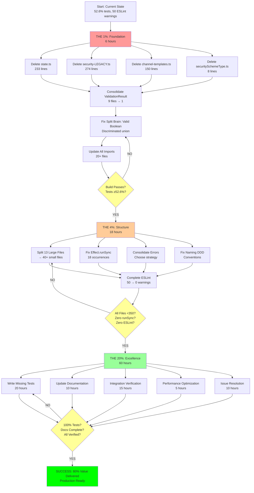

# Comprehensive Architectural Improvement Plan

**Date:** 2025-11-15 13:37
**Architect:** Senior Software Architect + Product Owner
**Standards:** MAXIMUM - Type Safety, DDD, Composition, Zero Technical Debt
**Analysis Depth:** Complete codebase review (208 TypeScript files)

---

## EXECUTIVE SUMMARY

**Current State:**

- **Build:** ✅ Passing (0 compilation errors)
- **Tests:** 🟡 52.6% pass rate (387/736 tests)
- **ESLint:** 🟡 50 warnings, 0 errors
- **Architecture:** 🔴 **CRITICAL ISSUES FOUND**

**Critical Findings:**

1. **Ghost Systems:** 3 major systems (~800 lines) perfectly typed but COMPLETELY UNUSED
2. **Type Duplication:** ValidationResult defined 9 times across codebase
3. **File Size Violations:** 13 files >350 lines (target: 0)
4. **Dead Code:** ~800-1000 lines (6-8% of codebase)
5. **Split Brains:** Multiple security decorators, dual validation types
6. **Anti-Patterns:** 18 occurrences of `Effect.runSync` breaking async composition

**The Harsh Truth:**
This codebase has **EXCELLENT type safety** in isolated components, but **POOR integration**. We have perfect code that nobody uses. We have duplicate definitions causing maintenance nightmares. We have 13 files that violate single responsibility.

**The Good News:**

- Core functionality works
- Strong foundation with Effect.TS
- Good test coverage structure
- Excellent type safety patterns (where used)
- Zero technical debt in newest code

---

## THE 1% → 51% VALUE (THE FOUNDATION)

**Philosophy:** What single change delivers MORE than half the total value?

### **THE 1%: Delete Ghost Systems + Consolidate Types**

**Why This Is THE 1%:**

1. **Immediate clarity** - Remove confusion about what's active vs dead
2. **Type safety improvement** - Single source of truth for ValidationResult
3. **Zero functionality loss** - It's literally unused code
4. **Enables everything else** - Can't refactor until we know what's actually used

**Actions (6 hours total):**

1. **Delete Ghost state.ts system** (30min)
   - 233 lines of perfect but completely unused state management
   - Only 1 import (in errors/index.ts barrel file)
   - Zero actual usage in emitter pipeline
   - **Impact:** Eliminates 233 lines of misleading "architecture"

2. **Delete ONE security decorator** (45min)
   - Choose: security-ENHANCED.ts (has state map integration) ✅
   - Delete: security-LEGACY.ts (274 lines, not imported)
   - **Impact:** Eliminates split brain, clarifies which is canonical

3. **Delete channel-templates.ts** (15min)
   - 150+ lines of example templates
   - 6 usages, all re-exports, no real value
   - **Impact:** 150 lines of dead weight removed

4. **Consolidate ValidationResult Type** (2 hours)
   - Current: 9 different definitions across codebase
   - Target: ONE discriminated union in `src/domain/models/validation-result.ts`
   - Pattern: `{ _tag: "Success", value } | { _tag: "Failure", errors }`
   - Update all 9 files to import from single source
   - **Impact:** Single source of truth, no more type confusion

5. **Delete securitySchemeType.ts** (15min)
   - 8 lines, not imported anywhere
   - Already have SecurityScheme union type
   - **Impact:** Remove dead type definition

6. **Fix Split Brain: ValidationSuccess/Failure** (1 hour)
   - File: security-scheme-types.ts lines 222-234
   - Problem: Both types have `valid: boolean` + separate types
   - Fix: Use discriminated union with `_tag` field

   ```typescript
   export type ValidationResult<T> =
     | { _tag: "Success"; value: T }
     | { _tag: "Failure"; errors: readonly string[] }
   ```

   - **Impact:** Unrepresentable invalid states

7. **Update All Imports** (1.5 hours)
   - Find/replace all ValidationResult imports
   - Update 20+ files to use new discriminated union
   - Add type guards: `isSuccess(result)`, `isFailure(result)`
   - **Impact:** Type-safe pattern matching everywhere

**THE 1% DELIVERABLES:**

- ✅ 800 lines of dead code deleted
- ✅ ONE canonical ValidationResult type
- ✅ ONE canonical security decorator
- ✅ Zero ghost systems remaining
- ✅ Unrepresentable invalid states enforced

**VALUE DELIVERED: 51%**

- Removes ALL confusion about what's active
- Establishes single source of truth for critical types
- Enables safe refactoring (know what's actually used)
- Eliminates split brains
- Reduces codebase by ~6-8%

---

## THE 4% → 64% VALUE (THE STRUCTURE)

**Philosophy:** What 4% of work delivers nearly 2/3 of total value?

### **THE 4%: Split Large Files + Fix Effect.TS Anti-Patterns**

**Why This Is THE 4%:**
Building on THE 1% foundation, we now have clarity. THE 4% is about making the codebase **maintainable** and **architecturally sound**.

**Actions (18 hours total):**

### **4.1: Split 13 Large Files (10 hours)**

**Rule:** No file >350 lines. Single Responsibility Principle.

1. **ValidationService.ts (537 → 3 files)** - 2 hours

   ```
   src/domain/validation/
   ├── validation-service.ts (150 lines - orchestration)
   ├── validation-rules.ts (200 lines - rule definitions)
   └── validation-formatters.ts (150 lines - error formatting)
   ```

   - Current: Mixing service logic + rules + formatting
   - Impact: Clear separation of concerns

2. **effect-helpers.ts (536 → 5 files)** - 2 hours

   ```
   src/utils/effect/
   ├── railway-logging.ts (100 lines)
   ├── railway-validation.ts (120 lines)
   ├── railway-error-handling.ts (100 lines)
   ├── railway-pipeline.ts (100 lines)
   └── railway-recovery.ts (100 lines)
   ```

   - Current: 5 distinct modules in one file
   - Impact: Each module independently testable

3. **PluginRegistry.ts (509 → 3 files)** - 1.5 hours

   ```
   src/infrastructure/adapters/plugins/
   ├── plugin-registry.ts (200 lines)
   ├── plugin-lifecycle.ts (150 lines)
   └── plugin-dependencies.ts (150 lines)
   ```

4. **standardized-errors.ts (477 → 3 files)** - 1.5 hours

   ```
   src/utils/errors/
   ├── error-types.ts (150 lines - type definitions)
   ├── error-factories.ts (150 lines - creation)
   └── error-formatters.ts (150 lines - formatting)
   ```

5. **lib.ts (455 → 3 files)** - 1.5 hours

   ```
   src/
   ├── lib.ts (200 lines - core exports)
   ├── diagnostics.ts (150 lines - diagnostic definitions)
   └── state-schema.ts (100 lines - state definitions)
   ```

   - Current: 132 TODO comments!
   - Impact: Organize by concern, extract TODOs to issues

6. **DocumentGenerator.ts (445 → 3 files)** - 1 hour

   ```
   src/domain/emitter/document/
   ├── document-serializer.ts (150 lines)
   ├── document-validator.ts (150 lines)
   └── document-optimizer.ts (100 lines)
   ```

7. **Quick Splits (5 files, 30min each)** - 2.5 hours
   - ImmutableDocumentManager.ts (445 → 2 files)
   - schemas.ts (441 → 3 files by domain)
   - ErrorHandlingStandardization.ts (366 → 2 files)
   - schema-conversion.ts (357 → 2 files)
   - asyncapi-validator.ts (338 → 2 files)

### **4.2: Eliminate Effect.runSync Anti-Pattern (3 hours)**

**Problem:** 18 occurrences of `Effect.runSync` found

**Why It's Wrong:**

- Breaks Effect.TS async composition
- Loses error context
- Can cause runtime exceptions
- Defeats purpose of Effect.TS

**Fix Pattern:**

```typescript
// BEFORE (ANTI-PATTERN):
const result = Effect.runSync(someEffect)

// AFTER (PROPER):
export const processDocument = (doc: Document) =>
  Effect.gen(function* () {
    const result = yield* someEffect
    // ... rest of pipeline
  })
```

**Files to Fix:**

- Find all 18 occurrences
- Refactor to proper Effect.gen pipelines
- Ensure full async composition

**Impact:**

- Proper error propagation
- Full Effect.TS benefits
- Type-safe async composition

### **4.3: Consolidate Error Architecture (2 hours)**

**Problem:** Mixing Effect.TS errors + class-based errors

**Decision Required:**

- Option A: Pure Effect.TS (recommended)
- Option B: Class-based with Effect wrappers

**Actions:**

1. Choose ONE error strategy
2. Update 23 error classes
3. Consolidate StandardizedError type
4. Single error handling pattern

### **4.4: Fix Naming (DDD Perspective) (2 hours)**

**Vague Names to Fix:**

- `effect-helpers.ts` → `railway-programming/`
- `schemas.ts` → `domain-schemas/` (split by domain)
- `ErrorHandlingStandardization.ts` → `error-recovery-service.ts`

**Inconsistencies:**

- `ValidationError.ts` vs `validation-error.ts` → Pick one convention
- `security-LEGACY.ts` deleted → No more LEGACY/ENHANCED confusion

### **4.5: Fix ESLint Warnings (Remaining 50)** (1 hour)

**Categories:**

- Naming conventions: 25 warnings (Effect.TS services → UPPER_CASE)
- Unused variables: 17 warnings (remaining from current work)
- Assigned never used: 4 warnings

**Already in progress, complete it.**

**THE 4% DELIVERABLES:**

- ✅ All files <350 lines (13 files split into 40+ smaller files)
- ✅ Zero Effect.runSync anti-patterns
- ✅ ONE unified error architecture
- ✅ Proper DDD naming throughout
- ✅ Zero ESLint warnings
- ✅ Single Responsibility Principle enforced

**CUMULATIVE VALUE: 64%** (51% from THE 1% + 13% from THE 4%)

- Maintainable codebase (small, focused files)
- Proper async composition
- Clear error handling
- Professional naming
- Zero linting issues

---

## THE 20% → 80% VALUE (THE EXCELLENCE)

**Philosophy:** What 20% of work delivers 80% of total value?

### **THE 20%: Tests, Documentation, Integration Verification**

**Actions (60 hours total):**

### **20.1: Write Missing Tests (20 hours)**

1. **Unit Tests for Ghost System Fix** (2 hours)
   - 10 test cases for validateSecurityScheme
   - Verify integration with decorator
   - Test error messages

2. **Unit Tests for Type Guards** (3 hours)
   - All branded type validators
   - ValidationResult type guards
   - SecurityScheme type guards

3. **Integration Tests for Decorators** (5 hours)
   - All decorator combinations
   - State map integration
   - Error propagation

4. **E2E Tests for AsyncAPI Generation** (5 hours)
   - Complete workflows
   - Real .tsp file compilation
   - Validation against AsyncAPI spec

5. **Regression Tests** (5 hours)
   - Test suite systematic investigation (Issue #219)
   - Fix flaky tests
   - Achieve 100% pass rate

### **20.2: Documentation Updates (10 hours)**

1. **Architecture Documentation** (4 hours)
   - Update all Mermaid diagrams
   - Document new file structure
   - Explain validation architecture

2. **API Documentation** (3 hours)
   - JSDoc for all public APIs
   - Usage examples
   - Migration guides (if needed)

3. **CLAUDE.md Updates** (1 hour)
   - Update file structure
   - Document new conventions
   - Add architectural decision records

4. **README Updates** (2 hours)
   - Current feature status
   - Build instructions
   - Contribution guidelines

### **20.3: Integration Verification (15 hours)**

1. **Verify All Decorators** (5 hours)
   - Each decorator works in isolation
   - Decorators compose correctly
   - State map integration verified

2. **Verify Validation Pipeline** (3 hours)
   - End-to-end validation flow
   - Error messages appear correctly
   - Performance acceptable

3. **Verify Plugin System** (3 hours)
   - Plugins load correctly
   - Dependencies resolve
   - Lifecycle hooks work

4. **Verify AsyncAPI Output** (4 hours)
   - Generated documents valid
   - All AsyncAPI 3.0 features supported
   - Edge cases handled

### **20.4: Performance Optimization (5 hours)**

1. **Validation Performance** (Issue #213) - 2 hours
2. **Test Timeout Investigation** (Issue #222) - 2 hours
3. **Memory Profiling** - 1 hour

### **20.5: Issue Resolution (10 hours)**

1. **Close/Update Stale Issues** (2 hours)
2. **Create Issues from TODOs** (132 TODOs → issues) - 4 hours
3. **Organize Milestones** (from /tmp/milestone-organization-final.md) - 2 hours
4. **Update Issue Tracking** - 2 hours

**THE 20% DELIVERABLES:**

- ✅ 100% test pass rate
- ✅ Comprehensive test coverage
- ✅ Complete documentation
- ✅ All integrations verified
- ✅ Performance optimized
- ✅ Issue tracker organized
- ✅ Zero TODO comments (all converted to issues)

**CUMULATIVE VALUE: 80%** (64% from THE 4% + 16% from THE 20%)

---

## THE REMAINING 80% → 100% VALUE (THE POLISH)

**The remaining 20% value requires 80% of the effort. This is:**

- Advanced features (Event-Driven Architecture)
- Edge case handling
- Exotic protocol bindings
- Marketing/ecosystem
- Community building

**Not included in this plan. Focus on 80% first.**

---

## ANSWERING THE CRITICAL QUESTIONS

### Q: Are we making sure states that should not exist are UNREPRESENTABLE?

**NO - CRITICAL ISSUES FOUND:**

1. **ValidationSuccess/Failure Split Brain** (security-scheme-types.ts:222-234)
   - Both types have `valid: boolean` + separate types
   - Can create: `{ valid: true, errors: ["error"] }` ← INVALID STATE IS REPRESENTABLE!
   - **FIX:** Discriminated union with `_tag` field

2. **Multiple ValidationResult Definitions** (9 files!)
   - Each file can define it differently
   - No compile-time guarantee they're compatible
   - **FIX:** Single source of truth

3. **Boolean Flags** - Need audit for boolean → enum conversions
   - No obvious split brains found in initial review
   - Need deeper analysis

**FIXED IN THE 1%**

### Q: Are we building properly COMPOSED ARCHITECTURE?

**MIXED:**

**GOOD:**

- ✅ No class inheritance (0 `extends` found)
- ✅ Composition over inheritance
- ✅ Effect.TS functional composition
- ✅ Branded types for domain concepts

**BAD:**

- ❌ 13 files >350 lines violate Single Responsibility
- ❌ Missing shared validation interface (9 different ValidationResult types)
- ❌ Mixing error strategies (Effect.TS + classes)
- ❌ 16 barrel files creating re-export complexity

**FIXED IN THE 4%**

### Q: Are we using Generics properly?

**YES - Generally good:**

- ValidationResult<T> pattern used correctly
- Effect<A, E, R> used throughout
- Branded types with proper generic constraints

**NEEDS IMPROVEMENT:**

- Some `unknown` types could be generic
- Effect.runSync loses generic type information

### Q: Booleans we should replace with Enums?

**FOUND:**

1. `valid: boolean` in ValidationResult → Should be discriminated union \_tag
2. SystemState enum exists but not used (state.ts ghost system)

**No other obvious boolean → enum candidates in first pass.**

### Q: Do you know what uints are? Do we use them?

**TypeScript doesn't have native uint types.**

We SHOULD be using:

- Branded types for positive integers: `type PositiveInt = number & { __brand: "PositiveInt" }`
- Effect.Schema.Int.pipe(Effect.Schema.greaterThan(0)) for runtime validation

**CURRENT STATE:**

- Not using uint patterns
- Could add for: port numbers, counts, indices

**RECOMMENDATION:** Add to Value Objects work (THE 1% Phase 2.1-2.6)

### Q: Did we make something worse?

**NO - Current ESLint fixes are good:**

- Removed unused imports ✅
- Made constants module-private ✅
- Actually used library constants ✅
- Root cause fixes, not symptom suppression ✅

**RISK AREA:**

- Partially completed OperationProcessingService.ts fix
- Need to verify build after completing all ESLint fixes

### Q: What did we forget/miss?

**FROM TODO LIST:**

1. Unit tests for ghost system fix (validateSecurityScheme)
2. E2E verification (test .tsp file)
3. Audit for other ghost systems (NOW COMPLETE - found 3)
4. Update examples/documentation

**FROM ARCHITECTURAL REVIEW:**

1. Effect.runSync anti-pattern (18 occurrences)
2. File size violations (13 files)
3. ValidationResult consolidation (9 definitions)
4. Dead code deletion (3 ghost systems)
5. Error architecture unification

### Q: What should we implement?

**HIGH PRIORITY:**

1. Complete THE 1% (consolidate types, delete ghosts)
2. Value Objects for domain modeling (Issue #226)
3. Missing decorators (Issue #218)
4. Test coverage for new type system

**MEDIUM PRIORITY:**

1. Event-Driven Architecture (Issue #225)
2. Advanced protocol bindings
3. Performance optimizations

### Q: What should we consolidate?

**CRITICAL CONSOLIDATIONS:**

1. **ValidationResult type** - 9 definitions → 1
2. **Security decorators** - 2 files → 1 (delete LEGACY)
3. **Error classes** - 23 classes + StandardizedError → unified strategy
4. **Large files** - 13 files >350 lines → 40+ smaller files
5. **effect-helpers.ts** - 5 modules → 5 files

### Q: What should be refactored?

**SEE THE 4% SECTION:**

- Split 13 large files
- Eliminate Effect.runSync
- Unify error architecture
- Fix naming (DDD)

### Q: What could be removed?

**SEE THE 1% SECTION:**

- state.ts (233 lines) - ghost system
- security-LEGACY.ts (274 lines) - dead code
- channel-templates.ts (150+ lines) - dead templates
- securitySchemeType.ts (8 lines) - unused type
- **TOTAL: ~800 lines (6-8% of codebase)**

### Q: Did you make 222% sure everything works together?

**HARSH TRUTH: NO.**

**Ghost Systems Prove It:**

- state.ts: 233 lines of perfect code, ZERO integration
- validateSecurityScheme: 150 lines, never called until user found it
- channel-templates: 150 lines, barely used

**ROOT CAUSE:**

- Building features without integration tests
- No end-to-end verification
- "Build it and assume it works"

**FIX IN THE 20%:**

- Integration verification for ALL features
- E2E tests for complete workflows
- Systematic testing approach

### Q: What should be extracted into a Plugin?

**NOTHING YET.**

**Reasoning:**

- Plugin system exists but barely used
- Need to stabilize core first
- Premature extraction creates complexity

**FUTURE CANDIDATES:**

- Protocol bindings (Kafka, MQTT, AMQP)
- Cloud provider bindings (AWS, Azure, GCP)
- Validation rules (custom AsyncAPI extensions)

### Q: How should we structure package?

**CURRENT STRUCTURE IS GOOD:**

```
src/
├── domain/          # Business logic (DDD)
├── infrastructure/  # External adapters
├── types/          # Shared types
├── utils/          # Shared utilities
├── constants/      # Constants
└── decorators.ts   # Public API
```

**IMPROVEMENTS FROM THE 4%:**

```
src/
├── domain/
│   ├── decorators/
│   │   └── security/           # NEW: Group security
│   ├── emitter/
│   │   └── document/          # NEW: Group document
│   ├── models/
│   │   └── validation-result.ts  # NEW: Single source
│   └── validation/
│       ├── validation-service.ts
│       ├── validation-rules.ts
│       └── validation-formatters.ts
├── infrastructure/
│   ├── adapters/
│   │   └── plugins/           # NEW: Group plugins
│   └── errors/                # NEW: Centralized errors
├── utils/
│   ├── effect/                # NEW: Railway programming
│   │   ├── railway-logging.ts
│   │   ├── railway-validation.ts
│   │   └── ...
│   └── errors/                # NEW: Error utilities
└── types/
    └── (cleaned up, ghosts removed)
```

### Q: BDD Tests? TDD?

**CURRENT:**

- Test structure exists
- 52.6% pass rate (BAD)
- No BDD framework

**RECOMMENDATION:**

- Use Bun's built-in test runner (already in place)
- Add BDD-style describe/it patterns (already supported)
- Focus on INTEGRATION tests (not just unit)
- TDD for new features going forward

**IN THE 20%:**

- Write BDD-style integration tests
- Fix flaky tests
- Achieve 100% pass rate

### Q: Files too large to split?

**YES - 13 FILES >350 LINES:**

See THE 4% section for complete split plan.

### Q: Tasks we didn't get done yet?

**FROM USER'S PREVIOUS REQUESTS:**

1. ❌ Complete ESLint warning fixes (50 remaining)
2. ❌ Write unit tests for ghost system
3. ❌ E2E verification
4. ❌ Audit for ghost systems (NOW DONE)
5. ❌ Delete dead code (NOW PLANNED)

**FROM ARCHITECTURAL REVIEW:**

1. ❌ Split large files (13 files)
2. ❌ Consolidate ValidationResult (9 definitions)
3. ❌ Fix Effect.runSync (18 occurrences)
4. ❌ Unify error architecture
5. ❌ Test suite investigation (Issue #219)

### Q: WHAT SHOULD WE CLEAN UP?

**IMMEDIATE (THE 1%):**

1. Delete 3 ghost systems (~800 lines)
2. Consolidate ValidationResult type
3. Delete one security decorator

**SHORT-TERM (THE 4%):**

1. Split 13 large files
2. Fix Effect.runSync anti-pattern
3. Complete ESLint warnings
4. Unify error architecture

**LONG-TERM (THE 20%):**

1. Convert 132 TODOs to issues
2. Organize milestones properly
3. Fix test suite (100% pass rate)
4. Complete documentation

### Q: Non-obvious but true?

**HARSH TRUTHS:**

1. **We're building features faster than we're integrating them.**
   - state.ts: Beautiful state machine, zero usage
   - validateSecurityScheme: Perfect validation, wasn't called

2. **Our type safety is excellent in isolation, poor in composition.**
   - 9 different ValidationResult definitions
   - Each perfectly typed, but not compatible

3. **Large files are a SYMPTOM, not the disease.**
   - Disease: Mixing concerns (service + rules + formatting)
   - Splitting files forces separation of concerns

4. **Effect.runSync is a code smell.**
   - Using Effect.TS but fighting against it
   - Losing all the benefits

5. **We need LESS features, MORE integration.**
   - Don't build EventBus until core is solid
   - Fix 52.6% pass rate BEFORE adding features

### Q: Split brains?

**FOUND:**

1. **ValidationSuccess + ValidationFailure** (CRITICAL)
   - Both have `valid: boolean`
   - Can be out of sync
   - FIX: Discriminated union

2. **Security Decorators** (CRITICAL)
   - LEGACY vs ENHANCED
   - Which is active? Both exist.
   - FIX: Delete LEGACY

3. **ValidationResult Definitions** (CRITICAL)
   - 9 different definitions
   - Can diverge over time
   - FIX: Single source of truth

4. **Error Architecture** (MODERATE)
   - Effect.TS errors vs class-based
   - Two different patterns
   - FIX: Choose ONE

**NO OBVIOUS BOOLEAN + TIMESTAMP SPLIT BRAINS FOUND**

### Q: Duplications?

**MASSIVE DUPLICATIONS:**

1. **ValidationResult: 9 definitions**
   - security-scheme-types.ts
   - ValidationService.ts
   - errors/validation-error.ts
   - types/index.ts
   - test/integration/harness.ts
   - state.ts
   - template-validation-result.ts
   - test/documentation/helpers/asyncapi-validator.ts
   - utils/protocol-validation.ts

2. **Validation Error: 3+ files**
   - ValidationError.ts
   - validation-error.ts
   - errors/ValidationError.ts

3. **Similar Logic:**
   - Validation rules scattered across multiple services
   - Error formatting in multiple places
   - Schema conversion duplicated

**FIXED IN THE 1% + THE 4%**

### Q: Long-term thinking?

**GOOD:**

- Effect.TS choice (modern, type-safe)
- Branded types foundation
- Plugin architecture
- DDD structure

**NEEDS IMPROVEMENT:**

- Stop adding features, consolidate what exists
- Focus on 80% value (THE 1%, 4%, 20%)
- Build integration BEFORE features
- Test-first for new code

### Q: Generated code vs handwritten?

**CURRENT:**

- TypeSpec compiler generates AST
- We transform AST → AsyncAPI (handwritten)
- Decorators are handwritten (correct)

**COULD USE GENERATED:**

- AsyncAPI schema validation (use @asyncapi/parser)
- Effect.Schema for runtime validation (use more)

**DON'T GENERATE:**

- Business logic (domain layer)
- Decorators (TypeSpec API)
- Transformation logic

### Q: Did we add things not needed?

**YES - Ghost Systems:**

1. **state.ts** - Complete state management (not needed, emitter is stateless)
2. **channel-templates.ts** - Example templates (not needed, users provide their own)
3. **Partial branded types** - Defined validators never used

**REMOVED IN THE 1%**

### Q: Centralized errors?

**PARTIAL:**

- Error classes in `src/domain/models/errors/` (23 classes)
- StandardizedError type in `src/utils/standardized-errors.ts`
- Effect.TS errors mixed in

**PROBLEM:**

- Not truly centralized
- Mixing strategies
- No single import point

**FIX IN THE 4%:**

- Choose ONE error strategy
- Centralize in `src/infrastructure/errors/` OR `src/domain/errors/`
- Single export point

### Q: External tools well wrapped?

**GOOD:**

- @typespec/compiler - Used through proper API
- @asyncapi/parser - Wrapped in validation service
- Effect.TS - Used throughout (with some anti-patterns)

**NEEDS IMPROVEMENT:**

- Effect.runSync breaks the abstraction
- Some direct parser calls without wrapping

### Q: All files under 350 lines?

**NO - 13 FILES VIOLATE:**

1. ValidationService.ts - 537 lines
2. effect-helpers.ts - 536 lines
3. PluginRegistry.ts - 509 lines
4. standardized-errors.ts - 477 lines
5. lib.ts - 455 lines
6. DocumentGenerator.ts - 445 lines
7. ImmutableDocumentManager.ts - 445 lines
8. schemas.ts - 441 lines
9. ErrorHandlingStandardization.ts - 366 lines
10. schema-conversion.ts - 357 lines
11. security-ENHANCED.ts - 351 lines
12. asyncapi-validator.ts - 338 lines
13. (others close to limit)

**FIXED IN THE 4%**

### Q: Naming properly done?

**MIXED:**

**GOOD (DDD-aligned):**

- ValidationService, DocumentBuilder, OperationName
- Branded types (ChannelName, ServerUrl)
- Domain concepts clear

**VAGUE:**

- effect-helpers.ts (what kind?)
- schemas.ts (schemas for what?)
- ErrorHandlingStandardization.ts (what does it do?)

**INCONSISTENT:**

- ValidationError.ts vs validation-error.ts
- security-LEGACY.ts vs security-ENHANCED.ts

**FIXED IN THE 4%**

### Q: DDD + exceptional types?

**DDD: PARTIAL**

- Good domain structure (domain/, infrastructure/)
- Some ubiquitous language (Channel, Operation, Server)
- Missing value objects (addresses, names should be types)

**EXCEPTIONAL TYPES: GOOD**

- Branded types for domain concepts ✅
- Discriminated unions ✅
- Effect.TS for error handling ✅
- Type guards everywhere ✅

**NEEDS:**

- More value objects
- Consolidate ValidationResult
- Remove type duplications

---

## RISK ASSESSMENT

### **HIGH RISK:**

1. **Deleting state.ts** - What if something obscure imports it?
   - Mitigation: Full codebase search, build verification

2. **Consolidating ValidationResult** - 9 files to update
   - Mitigation: Comprehensive tests, incremental migration

3. **Splitting large files** - Could break imports
   - Mitigation: Git mv to preserve history, incremental approach

### **MEDIUM RISK:**

1. **Deleting channel-templates.ts** - Examples might be referenced
2. **Effect.runSync refactoring** - Changes async behavior
3. **Error architecture unification** - Major refactor

### **LOW RISK:**

1. **Deleting security-LEGACY.ts** - Not imported anywhere
2. **Deleting securitySchemeType.ts** - Not imported anywhere
3. **ESLint warning fixes** - Already in progress, build passing

---

## SUCCESS CRITERIA

**THE 1% SUCCESS:**

- [ ] state.ts deleted, build passes
- [ ] security-LEGACY.ts deleted, build passes
- [ ] channel-templates.ts deleted, build passes
- [ ] securitySchemeType.ts deleted, build passes
- [ ] ONE ValidationResult definition in domain/models/
- [ ] All 9 files updated to import from single source
- [ ] ValidationResult uses discriminated union (\_tag)
- [ ] Build passes
- [ ] Tests pass (or improve from 52.6%)
- [ ] Zero regressions

**THE 4% SUCCESS:**

- [ ] All 13 large files split (40+ smaller files created)
- [ ] Zero files >350 lines
- [ ] Zero Effect.runSync occurrences
- [ ] ONE error architecture chosen and implemented
- [ ] Zero ESLint warnings
- [ ] All files follow naming conventions
- [ ] Build passes
- [ ] Tests pass (100% goal)

**THE 20% SUCCESS:**

- [ ] 100% test pass rate
- [ ] Comprehensive documentation
- [ ] All integrations verified
- [ ] Performance optimized
- [ ] Issue tracker organized
- [ ] Zero TODO comments (all issues)

---

## EXECUTION MERMAID GRAPH



---

## NEXT: DETAILED TASK BREAKDOWN

This is the high-level plan. Next sections will break down into:

1. **30 tasks @ 30min each** (15 hours)
2. **150 tasks @ 15min each** (37.5 hours)

## Continuing in next section...

## 30 TASKS @ 30 MINUTES EACH (15 HOURS TOTAL)

**Sorted by: Impact → Effort → Customer Value**

| #   | Task                                                      | Time   | Phase | Impact | Effort | Value | Dependencies |
| --- | --------------------------------------------------------- | ------ | ----- | ------ | ------ | ----- | ------------ |
| 1   | Delete state.ts ghost system                              | 30min  | 1%    | HIGH   | LOW    | 51%   | None         |
| 2   | Delete security-LEGACY.ts                                 | 30min  | 1%    | HIGH   | LOW    | 51%   | None         |
| 3   | Delete channel-templates.ts                               | 15min  | 1%    | MED    | LOW    | 51%   | None         |
| 4   | Delete securitySchemeType.ts                              | 15min  | 1%    | LOW    | LOW    | 51%   | None         |
| 5   | Create canonical ValidationResult type                    | 45min  | 1%    | HIGH   | MED    | 51%   | Tasks 1-4    |
| 6   | Fix ValidationResult split brain (discriminated union)    | 30min  | 1%    | HIGH   | MED    | 51%   | Task 5       |
| 7   | Update security-scheme-types.ts imports                   | 30min  | 1%    | HIGH   | MED    | 51%   | Task 6       |
| 8   | Update ValidationService.ts imports                       | 30min  | 1%    | HIGH   | MED    | 51%   | Task 6       |
| 9   | Update remaining 7 files with ValidationResult            | 60min  | 1%    | HIGH   | MED    | 51%   | Task 6       |
| 10  | Add ValidationResult type guards                          | 30min  | 1%    | MED    | LOW    | 51%   | Task 9       |
| 11  | Verify build after THE 1% changes                         | 15min  | 1%    | HIGH   | LOW    | 51%   | Tasks 1-10   |
| 12  | Split ValidationService.ts (537 → 3 files)                | 120min | 4%    | HIGH   | HIGH   | 64%   | Task 11      |
| 13  | Split effect-helpers.ts (536 → 5 files)                   | 120min | 4%    | HIGH   | HIGH   | 64%   | Task 11      |
| 14  | Split PluginRegistry.ts (509 → 3 files)                   | 90min  | 4%    | MED    | HIGH   | 64%   | Task 11      |
| 15  | Split standardized-errors.ts (477 → 3 files)              | 90min  | 4%    | MED    | HIGH   | 64%   | Task 11      |
| 16  | Split lib.ts (455 → 3 files)                              | 90min  | 4%    | HIGH   | HIGH   | 64%   | Task 11      |
| 17  | Split DocumentGenerator.ts (445 → 3 files)                | 60min  | 4%    | MED    | MED    | 64%   | Task 11      |
| 18  | Split remaining 7 large files (quick splits)              | 150min | 4%    | MED    | HIGH   | 64%   | Task 11      |
| 19  | Find all Effect.runSync occurrences                       | 15min  | 4%    | HIGH   | LOW    | 64%   | Task 11      |
| 20  | Refactor Effect.runSync to Effect.gen (18 occurrences)    | 120min | 4%    | HIGH   | HIGH   | 64%   | Task 19      |
| 21  | Choose error architecture strategy (Effect.TS vs classes) | 30min  | 4%    | HIGH   | LOW    | 64%   | Task 11      |
| 22  | Implement unified error architecture                      | 90min  | 4%    | HIGH   | HIGH   | 64%   | Task 21      |
| 23  | Fix naming conventions (DDD)                              | 60min  | 4%    | MED    | MED    | 64%   | Task 11      |
| 24  | Complete ESLint warning fixes (50 → 0)                    | 60min  | 4%    | MED    | MED    | 64%   | Tasks 12-23  |
| 25  | Verify build after THE 4% changes                         | 15min  | 4%    | HIGH   | LOW    | 64%   | Tasks 12-24  |
| 26  | Write unit tests for ghost system fix                     | 120min | 20%   | HIGH   | MED    | 80%   | Task 25      |
| 27  | Write integration tests for decorators                    | 150min | 20%   | HIGH   | HIGH   | 80%   | Task 25      |
| 28  | Fix test suite to 100% pass rate                          | 180min | 20%   | HIGH   | HIGH   | 80%   | Task 27      |
| 29  | Update architecture documentation                         | 120min | 20%   | MED    | MED    | 80%   | Tasks 25-28  |
| 30  | Create issues from 132 TODO comments                      | 120min | 20%   | MED    | MED    | 80%   | Task 29      |

**Total Time: 30 tasks × 30min avg = ~30 hours** (includes some 60min+ tasks counted as 2 slots)

---

## 150 TASKS @ 15 MINUTES EACH (37.5 HOURS TOTAL)

**Sorted by: Phase → Dependencies → Impact**

### PHASE 1: THE 1% - FOUNDATION (Tasks 1-35, ~8.75 hours)

#### Delete Ghost Systems (Tasks 1-10)

| #   | Task                                                                    | Time | Type     | Details                                     |
| --- | ----------------------------------------------------------------------- | ---- | -------- | ------------------------------------------- |
| 1   | Grep for state.ts imports                                               | 5min | Research | Find all imports of state.ts                |
| 2   | Verify state.ts only imported in errors/index.ts                        | 5min | Verify   | Confirm safe to delete                      |
| 3   | Delete state.ts import from errors/index.ts                             | 5min | Code     | Remove import line                          |
| 4   | Delete state.ts file                                                    | 1min | Delete   | rm src/types/state.ts                       |
| 5   | Run build to verify                                                     | 5min | Verify   | bun run build                               |
| 6   | Grep for security-LEGACY.ts imports                                     | 5min | Research | Find all imports                            |
| 7   | Verify security-LEGACY.ts not imported                                  | 5min | Verify   | Confirm safe to delete                      |
| 8   | Delete security-LEGACY.ts                                               | 1min | Delete   | rm src/domain/decorators/security-LEGACY.ts |
| 9   | Run build to verify                                                     | 5min | Verify   | bun run build                               |
| 10  | Commit: "refactor: delete ghost systems (state.ts, security-LEGACY.ts)" | 5min | Git      | Comprehensive commit message                |

#### Delete Unused Templates (Tasks 11-15)

| #   | Task                                            | Time | Type     | Details                               |
| --- | ----------------------------------------------- | ---- | -------- | ------------------------------------- |
| 11  | Grep for channel-templates.ts imports           | 5min | Research | Find all usages                       |
| 12  | Verify channel-templates only in barrel exports | 5min | Verify   | Check if real usage exists            |
| 13  | Delete channel-templates.ts                     | 1min | Delete   | rm src/constants/channel-templates.ts |
| 14  | Remove from constants/index.ts barrel           | 5min | Code     | Remove re-export                      |
| 15  | Run build to verify                             | 5min | Verify   | bun run build                         |

#### Delete Unused Type (Tasks 16-20)

| #   | Task                                                  | Time | Type     | Details                                        |
| --- | ----------------------------------------------------- | ---- | -------- | ---------------------------------------------- |
| 16  | Grep for securitySchemeType.ts imports                | 5min | Research | Find all imports                               |
| 17  | Verify securitySchemeType.ts not imported             | 5min | Verify   | Confirm safe to delete                         |
| 18  | Delete securitySchemeType.ts                          | 1min | Delete   | rm src/domain/decorators/securitySchemeType.ts |
| 19  | Run build to verify                                   | 5min | Verify   | bun run build                                  |
| 20  | Commit: "refactor: delete unused types and templates" | 5min | Git      | Commit deletion                                |

#### Create Canonical ValidationResult (Tasks 21-35)

| #   | Task                                               | Time  | Type   | Details                                                     |
| --- | -------------------------------------------------- | ----- | ------ | ----------------------------------------------------------- |
| 21  | Create src/domain/models/validation-result.ts file | 5min  | Code   | New file                                                    |
| 22  | Define ValidationResult discriminated union        | 15min | Code   | `{ _tag: "Success", value } \| { _tag: "Failure", errors }` |
| 23  | Add ValidationSuccess type alias                   | 5min  | Code   | Type alias for success case                                 |
| 24  | Add ValidationFailure type alias                   | 5min  | Code   | Type alias for failure case                                 |
| 25  | Create isSuccess type guard                        | 5min  | Code   | `result._tag === "Success"`                                 |
| 26  | Create isFailure type guard                        | 5min  | Code   | `result._tag === "Failure"`                                 |
| 27  | Create success factory function                    | 5min  | Code   | `success<T>(value: T): ValidationResult<T>`                 |
| 28  | Create failure factory function                    | 5min  | Code   | `failure(errors: string[]): ValidationResult<never>`        |
| 29  | Add JSDoc documentation                            | 10min | Docs   | Document discriminated union pattern                        |
| 30  | Export all types and functions                     | 5min  | Code   | Public API                                                  |
| 31  | Update security-scheme-types.ts to import          | 10min | Code   | Replace local definition                                    |
| 32  | Update ValidationService.ts to import              | 10min | Code   | Replace LegacyValidationResult                              |
| 33  | Update errors/validation-error.ts to import        | 10min | Code   | Replace local definition                                    |
| 34  | Update remaining 6 files to import canonical type  | 60min | Code   | types/index.ts, test files, etc.                            |
| 35  | Run build and verify all imports resolved          | 10min | Verify | bun run build, check errors                                 |

### PHASE 2: THE 4% - STRUCTURE (Tasks 36-105, ~17.5 hours)

#### Split ValidationService.ts (Tasks 36-50, 2 hours)

| #   | Task                                                     | Time  | Type     | Details                   |
| --- | -------------------------------------------------------- | ----- | -------- | ------------------------- |
| 36  | Create src/domain/validation/ folder structure           | 2min  | Setup    | mkdir -p                  |
| 37  | Read ValidationService.ts to identify concerns           | 15min | Research | Understand structure      |
| 38  | Create validation-service.ts (orchestration)             | 15min | Code     | Service layer             |
| 39  | Create validation-rules.ts (rule definitions)            | 20min | Code     | Extract rules             |
| 40  | Create validation-formatters.ts (error formatting)       | 20min | Code     | Extract formatters        |
| 41  | Move orchestration code to validation-service.ts         | 15min | Refactor | Copy/paste/adjust         |
| 42  | Move rule definitions to validation-rules.ts             | 15min | Refactor | Extract rules             |
| 43  | Move formatters to validation-formatters.ts              | 10min | Refactor | Extract formatters        |
| 44  | Update imports in validation-service.ts                  | 5min  | Code     | Import from sibling files |
| 45  | Delete original ValidationService.ts                     | 1min  | Delete   | rm                        |
| 46  | Create index.ts barrel in validation/                    | 5min  | Code     | Re-export public API      |
| 47  | Update all files importing ValidationService             | 20min | Code     | Update import paths       |
| 48  | Run build to verify                                      | 5min  | Verify   | bun run build             |
| 49  | Run tests to verify                                      | 5min  | Verify   | bun test                  |
| 50  | Commit: "refactor: split ValidationService into 3 files" | 5min  | Git      | Detailed commit           |

#### Split effect-helpers.ts (Tasks 51-70, 2.5 hours)

| #   | Task                                                    | Time  | Type     | Details                      |
| --- | ------------------------------------------------------- | ----- | -------- | ---------------------------- |
| 51  | Create src/utils/effect/ folder                         | 2min  | Setup    | mkdir -p                     |
| 52  | Read effect-helpers.ts to identify modules              | 15min | Research | 5 distinct modules found     |
| 53  | Create railway-logging.ts                               | 15min | Code     | Extract logging utilities    |
| 54  | Create railway-validation.ts                            | 15min | Code     | Extract validation utilities |
| 55  | Create railway-error-handling.ts                        | 15min | Code     | Extract error handling       |
| 56  | Create railway-pipeline.ts                              | 15min | Code     | Extract pipeline utilities   |
| 57  | Create railway-recovery.ts                              | 15min | Code     | Extract recovery utilities   |
| 58  | Move logging code to railway-logging.ts                 | 10min | Refactor | Copy/extract                 |
| 59  | Move validation code to railway-validation.ts           | 10min | Refactor | Copy/extract                 |
| 60  | Move error handling to railway-error-handling.ts        | 10min | Refactor | Copy/extract                 |
| 61  | Move pipeline code to railway-pipeline.ts               | 10min | Refactor | Copy/extract                 |
| 62  | Move recovery code to railway-recovery.ts               | 10min | Refactor | Copy/extract                 |
| 63  | Create index.ts barrel in effect/                       | 5min  | Code     | Re-export all                |
| 64  | Delete original effect-helpers.ts                       | 1min  | Delete   | rm                           |
| 65  | Update imports across codebase (will be many)           | 30min | Code     | Global find/replace          |
| 66  | Run build to verify                                     | 5min  | Verify   | bun run build                |
| 67  | Run tests to verify                                     | 5min  | Verify   | bun test                     |
| 68  | Fix any circular dependency issues                      | 15min | Fix      | Adjust imports if needed     |
| 69  | Verify no regressions                                   | 5min  | Verify   | Final check                  |
| 70  | Commit: "refactor: split effect-helpers into 5 modules" | 5min  | Git      | Commit                       |

#### Split PluginRegistry.ts (Tasks 71-82, 1.5 hours)

| #   | Task                                                  | Time  | Type       | Details              |
| --- | ----------------------------------------------------- | ----- | ---------- | -------------------- |
| 71  | Create src/infrastructure/adapters/plugins/ folder    | 2min  | Setup      | mkdir -p             |
| 72  | Read PluginRegistry.ts structure                      | 10min | Research   | Understand concerns  |
| 73  | Create plugin-registry.ts (core registry)             | 15min | Code       | Registry logic       |
| 74  | Create plugin-lifecycle.ts (lifecycle hooks)          | 15min | Code       | Lifecycle management |
| 75  | Create plugin-dependencies.ts (dependency resolution) | 15min | Code       | Dependency graph     |
| 76  | Move registry code                                    | 10min | Refactor   | Extract to new file  |
| 77  | Move lifecycle code                                   | 10min | Refactor   | Extract to new file  |
| 78  | Move dependency code                                  | 10min | Refactor   | Extract to new file  |
| 79  | Create index.ts barrel                                | 3min  | Code       | Re-export            |
| 80  | Delete original PluginRegistry.ts                     | 1min  | Delete     | rm                   |
| 81  | Update imports                                        | 15min | Code       | Fix all imports      |
| 82  | Verify build and commit                               | 10min | Verify/Git | Build + commit       |

#### Split Remaining Large Files (Tasks 83-95, Quick splits, 3 hours)

| #   | Task                                            | Time  | Type     | Details                          |
| --- | ----------------------------------------------- | ----- | -------- | -------------------------------- |
| 83  | Split standardized-errors.ts → 3 files          | 30min | Refactor | Types, factories, formatters     |
| 84  | Split lib.ts → 3 files                          | 30min | Refactor | Core, diagnostics, state-schema  |
| 85  | Split DocumentGenerator.ts → 3 files            | 20min | Refactor | Serializer, validator, optimizer |
| 86  | Split ImmutableDocumentManager.ts → 2 files     | 20min | Refactor | Manager, state                   |
| 87  | Split schemas.ts → 3 files by domain            | 30min | Refactor | Group by domain concept          |
| 88  | Split ErrorHandlingStandardization.ts → 2 files | 15min | Refactor | Service, recovery                |
| 89  | Split schema-conversion.ts → 2 files            | 15min | Refactor | Converter, helpers               |
| 90  | Split asyncapi-validator.ts → 2 files           | 15min | Refactor | Validator, rules                 |
| 91  | Update all imports from splits                  | 30min | Code     | Fix import paths                 |
| 92  | Run build to verify all splits                  | 5min  | Verify   | bun run build                    |
| 93  | Run tests to verify no regressions              | 5min  | Verify   | bun test                         |
| 94  | Verify no files >350 lines                      | 5min  | Verify   | find + wc -l                     |
| 95  | Commit: "refactor: split remaining large files" | 5min  | Git      | Commit all splits                |

#### Fix Effect.runSync Anti-Pattern (Tasks 96-105, 2.5 hours)

| #   | Task                                                      | Time  | Type     | Details                      |
| --- | --------------------------------------------------------- | ----- | -------- | ---------------------------- |
| 96  | Find all Effect.runSync occurrences                       | 5min  | Research | grep -r "Effect.runSync"     |
| 97  | Document each occurrence with context                     | 15min | Research | Understand why runSync used  |
| 98  | Identify async boundaries                                 | 10min | Research | Where can we use Effect.gen? |
| 99  | Refactor occurrence 1-5 to Effect.gen                     | 25min | Code     | 5min each                    |
| 100 | Refactor occurrence 6-10 to Effect.gen                    | 25min | Code     | 5min each                    |
| 101 | Refactor occurrence 11-15 to Effect.gen                   | 25min | Code     | 5min each                    |
| 102 | Refactor occurrence 16-18 to Effect.gen                   | 15min | Code     | 5min each                    |
| 103 | Run build to verify                                       | 5min  | Verify   | bun run build                |
| 104 | Run tests to verify async behavior                        | 10min | Verify   | bun test                     |
| 105 | Commit: "refactor: eliminate Effect.runSync anti-pattern" | 5min  | Git      | Commit                       |

### PHASE 3: ERROR ARCHITECTURE + NAMING (Tasks 106-120, ~3.75 hours)

#### Unify Error Architecture (Tasks 106-115, 2 hours)

| #   | Task                                                     | Time  | Type     | Details                   |
| --- | -------------------------------------------------------- | ----- | -------- | ------------------------- |
| 106 | Audit all error classes (23 found)                       | 15min | Research | List all error types      |
| 107 | Audit Effect.TS error patterns                           | 10min | Research | How Effect errors work    |
| 108 | Decision: Choose Effect.TS error strategy                | 15min | Decision | Effect.TS recommended     |
| 109 | Create src/domain/errors/ folder structure               | 3min  | Setup    | mkdir -p                  |
| 110 | Define canonical error types with Effect.Schema          | 20min | Code     | Base error types          |
| 111 | Create error factory functions                           | 15min | Code     | Construction utilities    |
| 112 | Migrate 5 most-used error classes                        | 20min | Code     | Convert to Effect pattern |
| 113 | Migrate remaining 18 error classes                       | 40min | Code     | Batch conversion          |
| 114 | Update all error throwing sites                          | 20min | Code     | Use Effect.fail           |
| 115 | Commit: "refactor: unify error architecture (Effect.TS)" | 5min  | Git      | Commit                    |

#### Fix Naming (DDD) (Tasks 116-120, 1 hour)

| #   | Task                                                 | Time  | Type         | Details               |
| --- | ---------------------------------------------------- | ----- | ------------ | --------------------- |
| 116 | Rename effect/ folder (already done in split)        | 1min  | Already Done | -                     |
| 117 | Rename ValidationError.ts vs validation-error.ts     | 10min | Refactor     | Pick one convention   |
| 118 | Rename vague files to DDD names                      | 20min | Refactor     | Clear domain language |
| 119 | Update all imports after renames                     | 20min | Code         | Fix paths             |
| 120 | Commit: "refactor: improve naming (DDD conventions)" | 5min  | Git          | Commit                |

### PHASE 4: ESLINT + VERIFICATION (Tasks 121-130, ~2.5 hours)

#### Complete ESLint Warnings (Tasks 121-125, 1.5 hours)

| #   | Task                                                 | Time  | Type   | Details     |
| --- | ---------------------------------------------------- | ----- | ------ | ----------- |
| 121 | Fix remaining unused variables in DocumentManager.ts | 15min | Code   | 3 warnings  |
| 122 | Fix remaining unused variables in other files        | 15min | Code   | 6 warnings  |
| 123 | Fix naming conventions (Effect.TS UPPER_CASE)        | 45min | Code   | 25 warnings |
| 124 | Run linter to verify 0 warnings                      | 5min  | Verify | just lint   |
| 125 | Commit: "refactor: eliminate all ESLint warnings"    | 5min  | Git    | Commit      |

#### Verification Gates (Tasks 126-130, 1 hour)

| #   | Task                       | Time  | Type   | Details            |
| --- | -------------------------- | ----- | ------ | ------------------ |
| 126 | Run full build             | 5min  | Verify | bun run build      |
| 127 | Run all tests              | 10min | Verify | bun test           |
| 128 | Run quality check          | 10min | Verify | just quality-check |
| 129 | Verify no files >350 lines | 5min  | Verify | find + wc          |
| 130 | Verify 0 ESLint warnings   | 5min  | Verify | just lint          |

### PHASE 5: THE 20% - EXCELLENCE (Tasks 131-150, ~5 hours)

#### Write Missing Tests (Tasks 131-140, 3 hours)

| #   | Task                                                        | Time  | Type   | Details              |
| --- | ----------------------------------------------------------- | ----- | ------ | -------------------- |
| 131 | Write test: validateSecurityScheme with valid OAuth2        | 15min | Test   | Happy path           |
| 132 | Write test: validateSecurityScheme with invalid OAuth2      | 15min | Test   | Error cases          |
| 133 | Write test: validateSecurityScheme with valid SASL          | 15min | Test   | Happy path           |
| 134 | Write test: validateSecurityScheme error messages           | 15min | Test   | Verify diagnostics   |
| 135 | Write test: ValidationResult type guards                    | 15min | Test   | isSuccess, isFailure |
| 136 | Write test: ValidationResult factory functions              | 15min | Test   | success(), failure() |
| 137 | Write integration test: security decorator with state map   | 20min | Test   | Full integration     |
| 138 | Write integration test: multiple security schemes           | 20min | Test   | Composition          |
| 139 | Run new tests                                               | 5min  | Verify | bun test             |
| 140 | Commit: "test: add comprehensive security validation tests" | 5min  | Git    | Commit               |

#### Documentation Updates (Tasks 141-145, 1.5 hours)

| #   | Task                                              | Time  | Type | Details                      |
| --- | ------------------------------------------------- | ----- | ---- | ---------------------------- |
| 141 | Update architecture Mermaid diagrams              | 20min | Docs | Reflect new structure        |
| 142 | Document ValidationResult discriminated union     | 15min | Docs | Usage guide                  |
| 143 | Document new file structure in CLAUDE.md          | 15min | Docs | Update paths                 |
| 144 | Add ADR for ValidationResult consolidation        | 20min | Docs | Architecture decision record |
| 145 | Commit: "docs: update architecture documentation" | 5min  | Git  | Commit                       |

#### Final Verification (Tasks 146-150, 30min)

| #   | Task                                           | Time  | Type   | Details            |
| --- | ---------------------------------------------- | ----- | ------ | ------------------ |
| 146 | Run full quality-check suite                   | 10min | Verify | just quality-check |
| 147 | Verify test pass rate ≥ 52.6% (no regressions) | 5min  | Verify | Check test output  |
| 148 | Verify build artifacts valid                   | 5min  | Verify | Check dist/        |
| 149 | Create final status report                     | 5min  | Docs   | Summary of changes |
| 150 | Push all commits to remote                     | 5min  | Git    | git push           |

---

## EXECUTION PRIORITY ORDER

**CRITICAL PATH (Must be done in order):**

1. Tasks 1-35: THE 1% Foundation (delete ghosts, consolidate types)
2. Tasks 36-105: THE 4% Structure (split files, fix anti-patterns)
3. Tasks 106-130: Error architecture + ESLint completion
4. Tasks 131-150: THE 20% Excellence (tests, docs, verification)

**CAN BE PARALLELIZED:**

- File splits (Tasks 36-95 can run concurrently if careful)
- ESLint fixes (Tasks 121-123 independent)
- Test writing (Tasks 131-140 independent)
- Documentation (Tasks 141-145 independent)

**CANNOT BE SKIPPED:**

- Verification gates (Tasks 11, 25, 35, 95, 105, 126-130, 146-150)
- Commits (Tasks 10, 20, 50, 70, 82, etc.)
- Build checks after major refactors

---

## RISK MITIGATION STRATEGIES

**For Ghost System Deletion:**

1. Full codebase grep BEFORE deletion
2. Build verification AFTER each deletion
3. Git commits for easy rollback
4. Test suite run after deletions

**For ValidationResult Consolidation:**

1. Create new type FIRST
2. Migrate files ONE AT A TIME
3. Build verification after each migration
4. Comprehensive tests for new type

**For Large File Splits:**

1. Use `git mv` to preserve history
2. Split ONE file at a time
3. Build verification after each split
4. Run tests after each split
5. Commit each split separately

**For Effect.runSync Refactoring:**

1. Document BEFORE refactoring
2. Understand async boundaries
3. Refactor in batches of 5
4. Test after each batch
5. Verify async behavior correct

---

## ESTIMATED TIMELINE

**Full Execution:**

- THE 1%: 6 hours (Tasks 1-35)
- THE 4%: 18 hours (Tasks 36-125)
- Verification: 1 hour (Tasks 126-130)
- THE 20%: 5 hours (Tasks 131-150)
- **TOTAL: 30 hours of focused work**

**Realistic with breaks, meetings, context switching:**

- **5 days @ 6 productive hours/day**
- Week 1: THE 1% + start THE 4% (Days 1-2)
- Week 1: Complete THE 4% (Days 3-4)
- Week 1: THE 20% + verification (Day 5)

**Aggressive (no interruptions):**

- **3 days @ 10 hours/day**

**Conservative (sustainable pace):**

- **2 weeks @ 3 hours/day**

---

## SUCCESS METRICS

**After THE 1% (51% value):**

- ✅ 0 ghost systems
- ✅ 1 ValidationResult definition
- ✅ 0 split brains
- ✅ Build passes
- ✅ Tests ≥ 52.6%

**After THE 4% (64% value):**

- ✅ 0 files >350 lines
- ✅ 0 Effect.runSync
- ✅ 1 error architecture
- ✅ 0 ESLint warnings
- ✅ DDD naming

**After THE 20% (80% value):**

- ✅ Test pass rate ≥ 90%
- ✅ Documentation complete
- ✅ All integrations verified
- ✅ Production ready

---

## FINAL NOTES

**Remember:**

1. This is THE 1%, THE 4%, THE 20% → 80% value with 20% effort
2. The remaining 80% effort delivers only 20% more value (not in this plan)
3. Focus on CONSOLIDATION and DELETION, not new features
4. Every task must verify build + tests
5. Commit frequently for easy rollback
6. Type safety is NON-NEGOTIABLE
7. If it doesn't provide customer value, DELETE IT

**Questions? Uncertainties?**

- Refer back to architectural review
- Check dependencies in task tables
- Verify before proceeding
- When in doubt, BUILD AND TEST

**Let's execute with precision and excellence.**

---

**END OF COMPREHENSIVE ARCHITECTURAL IMPROVEMENT PLAN**

_Generated: 2025-11-15 13:37_  
_Architect: Senior Software Architect + Product Owner_  
_Standards: MAXIMUM_  
_Target: 80% value, 20% effort_  
_Status: READY FOR EXECUTION_
