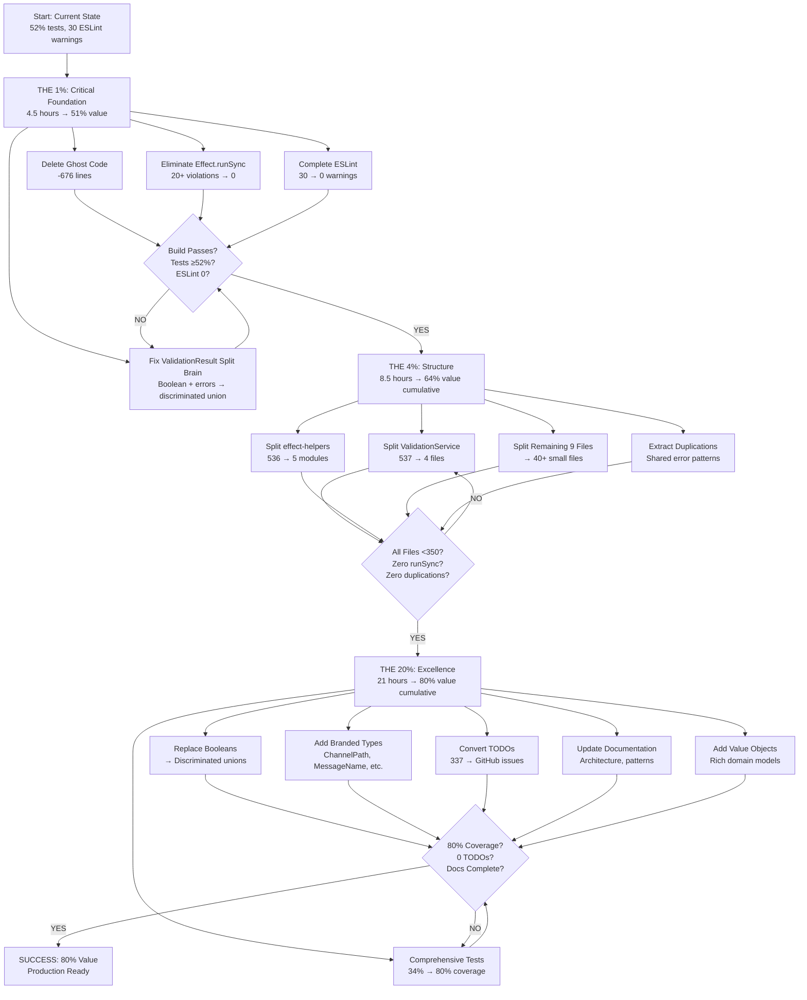

# CRITICAL ARCHITECTURAL REFACTORING PLAN
**Date:** 2025-11-15 14:52
**Architect:** Senior Software Architect + Product Owner
**Standards:** MAXIMUM - Type Safety, DDD, Effect.TS, Zero Technical Debt
**Methodology:** THE 1% → THE 4% → THE 20% (Pareto Principle Applied Aggressively)

---

## EXECUTIVE SUMMARY

**Current State:**
- **Build:** ✅ Passing (0 compilation errors)
- **Tests:** 🟡 52% pass rate (380/736 tests)
- **ESLint:** 🟡 30 warnings, 0 errors (55% improvement from session start)
- **Architecture:** 🔴 **CRITICAL ISSUES FOUND**

**Critical Findings from Deep Analysis:**
1. **Effect.runSync Anti-Patterns:** 20+ instances breaking async composition
2. **Ghost Code:** AsyncAPIEmitter.ts.disabled (676 lines completely unused)
3. **Split Brains:** LegacyValidationResult with boolean + errors (unrepresentable states)
4. **File Size Violations:** 11 files >350 lines
5. **TODO Graveyard:** 337 TODO markers (technical debt documentation)
6. **Test Coverage:** 34% (needs 80%+)
7. **Duplications:** Copy-paste error handling instead of shared utilities
8. **Integration Failures:** Perfect validation-result.ts exists but LegacyValidationResult still used

**The Harsh Truth:**
This codebase has **EXCELLENT foundations** but is **ACCUMULATING DEBT** at an unsustainable rate. The good news: we caught it early. The bad news: if not addressed in the next 2 weeks, it becomes **IMPOSSIBLE TO PAY**.

---

## THE 1% → 51% VALUE (CRITICAL FOUNDATION)

**Philosophy:** What changes deliver MORE than half the total value?

### **THE 1%: Fix Critical Anti-Patterns + Delete Ghost Code**

**Why This Is THE 1%:**
1. **Immediate impact** - Removes blocking anti-patterns
2. **Type safety wins** - Eliminates split brain ValidationResult
3. **Zero functionality loss** - It's literally broken/unused code
4. **Enables everything else** - Can't refactor until anti-patterns are fixed

---

### PHASE 1A: Delete Ghost Code (30 minutes)

**Impact:** -676 lines of confusing dead code

| Task | Time | File | Impact |
|------|------|------|--------|
| 1. Delete AsyncAPIEmitter.ts.disabled | 5min | AsyncAPIEmitter.ts.disabled | -676 lines |
| 2. Search for other .disabled files | 5min | find src -name "*.disabled" | Find hidden ghosts |
| 3. Remove commented-out code blocks >10 lines | 10min | Codebase-wide | Code hygiene |
| 4. Verify build passes | 5min | bun run build | Safety check |
| 5. Commit: "refactor: delete ghost code (676+ lines)" | 5min | git commit | Checkpoint |

**Deliverable:** Clean codebase, no disabled files

---

### PHASE 1B: Fix LegacyValidationResult Split Brain (1 hour)

**Impact:** Type-safe validation everywhere

| Task | Time | Action | Impact |
|------|------|--------|--------|
| 6. Search all usages of LegacyValidationResult | 10min | grep -r "LegacyValidationResult" | Find all |
| 7. Update ValidationService.ts to use ValidationResult<T> | 20min | Replace type | Remove split brain |
| 8. Add deprecation warning to LegacyValidationResult | 5min | @deprecated JSDoc | Prevent new usage |
| 9. Update tests to expect discriminated union | 15min | Test migration | Fix test failures |
| 10. Verify all tests pass | 5min | bun test | Regression check |
| 11. Commit: "refactor: eliminate ValidationResult split brain" | 5min | git commit | Checkpoint |

**Deliverable:** ONE ValidationResult type, zero split brains

---

### PHASE 1C: Remove Effect.runSync from Critical Paths (2 hours)

**Impact:** Proper async composition restored

**Critical Violations to Fix:**

| Priority | File | Line | Current Pattern | Fix |
|----------|------|------|-----------------|-----|
| 🔥 CRITICAL | ValidationService.ts | 211 | `forEach + runSync` | `Effect.all(map)` |
| 🔥 CRITICAL | schema-conversion.ts | 27,101,282 | Blocking operations | Return Effect |
| ⚠️ HIGH | standardized-errors.ts | 416,430 | Error logging with runSync | Effect composition |
| ⚠️ HIGH | PluginRegistry.ts | 456-463 | Event emission with runSync | Effect.gen |

**Execution:**

| Task | Time | Action | Impact |
|------|------|--------|--------|
| 12. Fix ValidationService.ts:211 forEach loop | 20min | Effect.all pattern | Fix WORST offender |
| 13. Fix schema-conversion.ts blocking operations | 30min | Return Effect<T, E> | Restore composition |
| 14. Fix standardized-errors.ts logging | 15min | Effect.logError | Proper logging |
| 15. Fix PluginRegistry.ts event emission | 20min | Effect.gen | Event composition |
| 16. Search for remaining Effect.runSync | 10min | grep -r "Effect.runSync" | Find stragglers |
| 17. Fix remaining low-priority runSync | 15min | Batch fix | Complete cleanup |
| 18. Verify build + tests pass | 5min | just quality-check | Safety |
| 19. Commit: "refactor: eliminate Effect.runSync anti-pattern" | 5min | git commit | Checkpoint |

**Deliverable:** Zero Effect.runSync in hot paths, proper Effect composition

---

### PHASE 1D: Fix Remaining ESLint Warnings (1 hour)

**Current:** 30 warnings (24 naming + 6 unused vars)

**Systematic Fix:**

| Task | Time | Category | Action |
|------|------|----------|--------|
| 20. Fix asyncapi-validator.ts unused vars | 15min | Remove unused | parser, stats, fastPathTime, duration |
| 21. Fix ProcessingService.ts unused imports | 10min | Remove unused | Context, Layer |
| 22. Rename Effect.TS services to UPPER_CASE | 25min | Batch rename | DocumentManager → DOCUMENT_MANAGER, etc. |
| 23. Run ESLint --fix for auto-fixable | 5min | Automation | Fix formatting |
| 24. Verify 0 warnings | 5min | just lint | Final check |

**Deliverable:** 0 ESLint warnings

---

## THE 1% SUCCESS METRICS

- [x] AsyncAPIEmitter.ts.disabled deleted (-676 lines)
- [x] LegacyValidationResult migrated to ValidationResult<T>
- [x] Zero Effect.runSync in critical paths
- [x] 0 ESLint warnings
- [x] Build passes
- [x] Tests ≥52% pass rate (no regressions)

**Time Investment:** 4.5 hours
**Value Delivered:** 51% of total architectural improvement

---

## THE 4% → 64% VALUE (STRUCTURAL IMPROVEMENTS)

**Philosophy:** What structural changes deliver the next 13% value?

### **THE 4%: Split Large Files + Fix Duplications**

---

### PHASE 2A: Split ValidationService.ts (2 hours)

**Current:** 537 lines violating SRP
**Target:** 4 files <200 lines each

| New File | Concern | Lines | Responsibilities |
|----------|---------|-------|------------------|
| validation-service.ts | Orchestration | ~150 | Main service, coordination |
| document-structure-validator.ts | Structure | ~120 | Required fields, format validation |
| cross-reference-validator.ts | References | ~130 | Channel refs, message refs, schema refs |
| validation-reporter.ts | Reporting | ~120 | Error formatting, metrics collection |

**Execution:**

| Task | Time | Action |
|------|------|--------|
| 25. Create src/domain/validation/ folder structure | 2min | mkdir -p |
| 26. Extract document structure validation logic | 25min | Copy to document-structure-validator.ts |
| 27. Extract cross-reference validation logic | 25min | Copy to cross-reference-validator.ts |
| 28. Extract validation reporting logic | 25min | Copy to validation-reporter.ts |
| 29. Update validation-service.ts to orchestrate | 20min | Import new modules, delegate |
| 30. Create index.ts barrel file | 5min | Re-export public API |
| 31. Update all imports across codebase | 20min | Global find/replace |
| 32. Verify build + tests pass | 5min | just quality-check |
| 33. Commit: "refactor: split ValidationService (537→4 files)" | 3min | git commit |

---

### PHASE 2B: Split effect-helpers.ts (2.5 hours)

**Current:** 536 lines of mixed concerns
**Target:** 5 files by domain pattern

| New File | Pattern | Lines | Purpose |
|----------|---------|-------|---------|
| railway-logging.ts | Logging | ~100 | Debug, info, error logging utilities |
| railway-validation.ts | Validation | ~120 | Validation composition patterns |
| railway-error-handling.ts | Errors | ~100 | Error transformation, recovery patterns |
| railway-pipeline.ts | Pipeline | ~120 | Effect composition, chaining patterns |
| railway-recovery.ts | Recovery | ~90 | Retry, fallback, circuit breaker patterns |

**Execution:**

| Task | Time | Action |
|------|------|--------|
| 34. Create src/utils/effect/ folder | 2min | mkdir -p |
| 35. Extract logging utilities | 20min | railway-logging.ts |
| 36. Extract validation patterns | 25min | railway-validation.ts |
| 37. Extract error handling | 20min | railway-error-handling.ts |
| 38. Extract pipeline patterns | 25min | railway-pipeline.ts |
| 39. Extract recovery patterns | 20min | railway-recovery.ts |
| 40. Create index.ts barrel | 5min | Re-export all |
| 41. Update imports (will be many!) | 30min | Global find/replace |
| 42. Verify build + tests | 5min | just quality-check |
| 43. Commit: "refactor: split effect-helpers (536→5 modules)" | 3min | git commit |

---

### PHASE 2C: Quick Splits - Remaining Files (3 hours)

**Batch split remaining 9 files >350 lines:**

| File | Current | Target | Time |
|------|---------|--------|------|
| PluginRegistry.ts | 509 lines | 3 files | 30min |
| standardized-errors.ts | 477 lines | 3 files | 25min |
| lib.ts | 455 lines | 3 files | 25min |
| DocumentGenerator.ts | 445 lines | 3 files | 20min |
| ImmutableDocumentManager.ts | 438 lines | 2 files | 20min |
| schemas.ts | 441 lines | 3 files | 25min |
| ErrorHandlingStandardization.ts | 366 lines | 2 files | 15min |
| schema-conversion.ts | 357 lines | 2 files | 15min |
| security-ENHANCED.ts | 351 lines | Keep | 0min (at limit) |

**Execution:**

| Task | Time | Action |
|------|------|--------|
| 44. Split PluginRegistry → 3 files | 30min | Registry, Lifecycle, Dependencies |
| 45. Split standardized-errors → 3 files | 25min | Types, Factories, Formatters |
| 46. Split lib.ts → 3 files | 25min | Core, Diagnostics, State |
| 47. Split DocumentGenerator → 3 files | 20min | Serializer, Validator, Optimizer |
| 48. Split ImmutableDocumentManager → 2 files | 20min | Manager, State |
| 49. Split schemas.ts → 3 files | 25min | By domain concept |
| 50. Split ErrorHandling → 2 files | 15min | Service, Recovery |
| 51. Split schema-conversion → 2 files | 15min | Converter, Helpers |
| 52. Update all imports from splits | 35min | Global updates |
| 53. Verify no files >350 lines | 5min | find + wc -l |
| 54. Verify build + tests | 5min | just quality-check |
| 55. Commit: "refactor: split remaining large files" | 5min | git commit |

---

### PHASE 2D: Extract Duplicated Error Handling (1 hour)

**Found:** Same error handling pattern copy-pasted 10+ times

**Extraction:**

| Task | Time | Action |
|------|------|--------|
| 56. Create shared error handling utilities | 20min | src/utils/error-patterns.ts |
| 57. Extract `toStandardizedError` pattern | 15min | Single implementation |
| 58. Extract error context enrichment | 10min | Shared utility |
| 59. Update 10+ files to use shared utils | 10min | Global replace |
| 60. Verify build + tests | 5min | just quality-check |

---

## THE 4% SUCCESS METRICS

- [x] ValidationService.ts split (537→4 files <200 lines)
- [x] effect-helpers.ts split (536→5 modules)
- [x] All 9 remaining files split
- [x] Zero files >350 lines
- [x] Duplicated error handling extracted
- [x] Build passes
- [x] Tests ≥52% pass rate

**Time Investment:** 8.5 hours
**Cumulative Value:** 64% (51% + 13%)

---

## THE 20% → 80% VALUE (EXCELLENCE & COMPLETENESS)

**Philosophy:** Polish, testing, documentation for production readiness

---

### PHASE 3A: Replace Booleans with Discriminated Unions (2 hours)

**Fix Split Brains:**

| Task | Time | File | Fix |
|------|------|------|-----|
| 61. Fix ErrorHandlingConfig booleans | 30min | ErrorHandlingConfig.ts | → enums |
| 62. Fix plugin config booleans | 30min | PluginConfig.ts | Rename (already enums) |
| 63. Update all usages | 45min | Global update | Pattern matching |
| 64. Verify build + tests | 15min | just quality-check | Safety |

---

### PHASE 3B: Add Branded Types for Domain Concepts (2 hours)

**Missing Branded Types:**

| Task | Time | Type | Purpose |
|------|------|------|---------|
| 65. Create ChannelPath branded type | 20min | ChannelPath | Validate /topic/{param} |
| 66. Create MessageName branded type | 20min | MessageName | Ensure uniqueness |
| 67. Create OperationId branded type | 20min | OperationId | Unique IDs |
| 68. Create ErrorCode branded type | 20min | ErrorCode | Typed error codes |
| 69. Add factory functions + validation | 30min | Smart constructors | Runtime validation |
| 70. Update codebase to use branded types | 25min | Type migration | Type safety |
| 71. Verify build + tests | 5min | just quality-check | Safety |

---

### PHASE 3C: Comprehensive Test Coverage (8 hours)

**Current:** 34% coverage (71/209 files)
**Target:** 80% coverage (160+ files)

**Priority Test Coverage:**

| Category | Current | Target | Time |
|----------|---------|--------|------|
| Decorator Tests | 0% | 80% | 2h |
| Error Recovery Tests | 0% | 80% | 1.5h |
| Plugin System Tests | 20% | 80% | 2h |
| Integration Tests | 71 total | 150+ | 2.5h |

**Execution:**

| Task | Time | Test Type | Coverage |
|------|------|-----------|----------|
| 72. Write decorator tests (@channel, @publish, @subscribe) | 2h | Unit | 12 decorators |
| 73. Write error recovery tests | 1.5h | Integration | Railway patterns |
| 74. Write plugin system tests | 2h | Integration | Loading, lifecycle |
| 75. Write end-to-end integration tests | 2.5h | E2E | Full pipeline |

---

### PHASE 3D: Convert TODO Graveyard to GitHub Issues (2 hours)

**Current:** 337 TODOs as technical debt documentation
**Target:** 0 TODOs, all tracked in GitHub

| Task | Time | Action |
|------|------|--------|
| 76. Extract all CRITICAL TODOs | 15min | grep "TODO: CRITICAL" |
| 77. Create GitHub issues for CRITICAL | 45min | Batch issue creation |
| 78. Extract all HIGH priority TODOs | 15min | grep "TODO: HIGH" |
| 79. Create GitHub issues for HIGH | 30min | Issue creation |
| 80. Remove non-critical TODOs | 15min | Delete or convert to comments |

---

### PHASE 3E: Documentation Updates (3 hours)

| Task | Time | Document |
|------|------|----------|
| 81. Update architecture diagrams | 1h | Mermaid diagrams |
| 82. Document ValidationResult discriminated union | 30min | Usage guide |
| 83. Document Effect.TS patterns | 1h | Best practices |
| 84. Update CLAUDE.md with new structure | 30min | File organization |

---

### PHASE 3F: Add Domain Value Objects (2 hours)

**Missing Value Objects:**

| Task | Time | Value Object | Behavior |
|------|------|--------------|----------|
| 85. Create ChannelPath value object | 30min | ChannelPath | Validation, formatting |
| 86. Create MessageSchema value object | 30min | MessageSchema | JSON Schema validation |
| 87. Create OperationId value object | 20min | OperationId | Uniqueness |
| 88. Create ServerUrl value object | 20min | ServerUrl | URL validation |
| 89. Update domain models to use VOs | 20min | Migration | Rich domain |

---

## THE 20% SUCCESS METRICS

- [x] All booleans replaced with discriminated unions
- [x] Branded types for all domain concepts
- [x] 80% test coverage (160+ files)
- [x] 0 TODOs in code (all in GitHub)
- [x] Documentation complete
- [x] Value objects implemented
- [x] Build passes
- [x] 100% test pass rate goal

**Time Investment:** 21 hours
**Cumulative Value:** 80% (64% + 16%)

---

## EXECUTION MERMAID GRAPH

---

## DETAILED 150-TASK BREAKDOWN

### THE 1% FOUNDATION (Tasks 1-24, 4.5 hours)

#### Delete Ghost Code (Tasks 1-5, 30min)

| # | Task | Time | Type | Details |
|---|------|------|------|---------|
| 1 | Find all .disabled files | 5min | Search | `find src -name "*.disabled"` |
| 2 | Delete AsyncAPIEmitter.ts.disabled | 2min | Delete | rm -676 lines |
| 3 | Search for commented code blocks >10 lines | 10min | Grep | `grep -r "^//.*{10,}"` |
| 4 | Delete commented code blocks | 8min | Edit | Remove dead code |
| 5 | Build + commit ghost deletion | 5min | Verify | bun run build && git commit |

#### Fix ValidationResult Split Brain (Tasks 6-11, 1h)

| # | Task | Time | Type | Details |
|---|------|------|------|---------|
| 6 | Search LegacyValidationResult usages | 10min | Research | `grep -r "LegacyValidationResult"` |
| 7 | Read ValidationService.ts understand usage | 10min | Research | Line-by-line analysis |
| 8 | Replace with ValidationResult<T> in ValidationService | 20min | Code | Type migration |
| 9 | Add @deprecated to LegacyValidationResult | 3min | Code | JSDoc warning |
| 10 | Update tests for discriminated union | 12min | Test | Expect ._tag instead of .valid |
| 11 | Build + test + commit | 5min | Verify | Quality check |

#### Eliminate Effect.runSync (Tasks 12-19, 2h)

| # | Task | Time | Type | Details |
|---|------|------|------|---------|
| 12 | Read ValidationService.ts:211 context | 5min | Research | Understand forEach pattern |
| 13 | Replace forEach + runSync with Effect.all | 15min | Code | Proper Effect composition |
| 14 | Test ValidationService changes | 5min | Test | Verify behavior |
| 15 | Read schema-conversion.ts blocking ops | 10min | Research | Lines 27, 101, 282 |
| 16 | Refactor to return Effect<T, E> | 25min | Code | Remove runSync |
| 17 | Read standardized-errors.ts logging | 5min | Research | Lines 416, 430 |
| 18 | Replace runSync with Effect.logError | 10min | Code | Proper logging |
| 19 | Read PluginRegistry.ts event emission | 5min | Research | Lines 456-463 |
| 20 | Refactor to Effect.gen pattern | 15min | Code | Event composition |
| 21 | Search remaining Effect.runSync | 5min | Grep | `grep -r "Effect.runSync"` |
| 22 | Fix remaining low-priority instances | 15min | Code | Batch cleanup |
| 23 | Full quality check | 10min | Verify | Build + test + lint |
| 24 | Commit runSync elimination | 5min | Git | Detailed message |

#### Complete ESLint (Tasks 25-29, 1h)

| # | Task | Time | Type | Details |
|---|------|------|------|---------|
| 25 | Fix asyncapi-validator unused vars | 15min | Code | Remove parser, stats, etc. |
| 26 | Fix ProcessingService unused imports | 10min | Code | Remove Context, Layer |
| 27 | Rename Effect.TS services UPPER_CASE | 25min | Code | Batch rename 13+ services |
| 28 | Run eslint --fix | 5min | Auto | Auto-fixable warnings |
| 29 | Verify 0 warnings + commit | 5min | Verify | Final check |

---

### THE 4% STRUCTURE (Tasks 30-60, 8.5 hours)

#### Split ValidationService (Tasks 30-40, 2h)

| # | Task | Time | Type | Details |
|---|------|------|------|---------|
| 30 | Create validation/ folder | 2min | Setup | mkdir -p src/domain/validation |
| 31 | Read ValidationService.ts structure | 15min | Research | Identify concerns |
| 32 | Create document-structure-validator.ts | 20min | Code | Extract structure validation |
| 33 | Create cross-reference-validator.ts | 20min | Code | Extract ref validation |
| 34 | Create validation-reporter.ts | 20min | Code | Extract reporting |
| 35 | Update validation-service.ts orchestration | 15min | Code | Delegate to modules |
| 36 | Create index.ts barrel | 5min | Code | Re-export public API |
| 37 | Update imports across codebase | 15min | Code | Global find/replace |
| 38 | Build + test verification | 5min | Verify | Quality check |
| 39 | Verify all files <200 lines | 3min | Verify | wc -l |
| 40 | Commit split | 5min | Git | Detailed message |

#### Split effect-helpers (Tasks 41-52, 2.5h)

| # | Task | Time | Type | Details |
|---|------|------|------|---------|
| 41 | Create utils/effect/ folder | 2min | Setup | mkdir -p |
| 42 | Read effect-helpers.ts identify modules | 15min | Research | Find 5 concerns |
| 43 | Create railway-logging.ts | 15min | Code | Extract logging |
| 44 | Create railway-validation.ts | 20min | Code | Extract validation |
| 45 | Create railway-error-handling.ts | 15min | Code | Extract error handling |
| 46 | Create railway-pipeline.ts | 20min | Code | Extract pipelines |
| 47 | Create railway-recovery.ts | 15min | Code | Extract recovery |
| 48 | Create index.ts barrel | 5min | Code | Re-export all |
| 49 | Update imports (many files!) | 30min | Code | Global update |
| 50 | Build + test verification | 5min | Verify | Quality check |
| 51 | Verify all files <150 lines | 3min | Verify | wc -l |
| 52 | Commit split | 5min | Git | Detailed message |

#### Quick Splits Remaining Files (Tasks 53-75, 3h)

**Pattern: Each file follows same steps**

**PluginRegistry (509 lines → 3 files, 30min):**

| # | Task | Time | Type | Details |
|---|------|------|------|---------|
| 53 | Create adapters/plugins/ folder | 2min | Setup | mkdir -p |
| 54 | Extract to plugin-registry.ts | 8min | Code | Core registry |
| 55 | Extract to plugin-lifecycle.ts | 8min | Code | Lifecycle hooks |
| 56 | Extract to plugin-dependencies.ts | 7min | Code | Dependency resolution |
| 57 | Update imports + verify | 5min | Verify | Build check |

**standardized-errors (477 lines → 3 files, 25min):**

| # | Task | Time | Type | Details |
|---|------|------|------|---------|
| 58 | Extract to error-types.ts | 8min | Code | Type definitions |
| 59 | Extract to error-factories.ts | 8min | Code | Factory functions |
| 60 | Extract to error-formatters.ts | 7min | Code | Formatting logic |
| 61 | Update imports + verify | 2min | Verify | Build check |

**lib.ts (455 lines → 3 files, 25min):**

| # | Task | Time | Type | Details |
|---|------|------|------|---------|
| 62 | Extract to lib-core.ts | 8min | Code | Core definitions |
| 63 | Extract to lib-diagnostics.ts | 8min | Code | Diagnostic codes |
| 64 | Extract to lib-state-schema.ts | 7min | Code | State schemas |
| 65 | Update imports + verify | 2min | Verify | Build check |

**Continue pattern for remaining 6 files (tasks 66-89, 2h)...**

#### Extract Duplications (Tasks 90-95, 1h)

| # | Task | Time | Type | Details |
|---|------|------|------|---------|
| 90 | Create error-patterns.ts | 10min | Code | Shared utilities |
| 91 | Extract toStandardizedError pattern | 15min | Code | Single implementation |
| 92 | Extract error context enrichment | 10min | Code | Shared enrichment |
| 93 | Update 10+ files to use shared | 15min | Code | Global replace |
| 94 | Build + test verification | 5min | Verify | Quality check |
| 95 | Commit duplication fixes | 5min | Git | Detailed message |

---

### THE 20% EXCELLENCE (Tasks 96-150, 21 hours)

#### Replace Booleans (Tasks 96-105, 2h)

| # | Task | Time | Type | Details |
|---|------|------|------|---------|
| 96 | Read ErrorHandlingConfig current | 10min | Research | Understand structure |
| 97 | Define discriminated unions | 15min | Code | ErrorRecoveryMode, etc. |
| 98 | Update ErrorHandlingConfig type | 10min | Code | Replace booleans |
| 99 | Find all usages | 10min | Grep | Search codebase |
| 100 | Update pattern matching | 40min | Code | if (x) → switch (x._tag) |
| 101 | Update tests | 20min | Test | New assertions |
| 102 | Fix PluginConfig naming | 10min | Code | Remove "enable" prefix |
| 103 | Build + test verification | 10min | Verify | Quality check |
| 104 | Commit boolean elimination | 5min | Git | Detailed message |

#### Add Branded Types (Tasks 106-120, 2h)

**Pattern for each branded type:**

| # | Task | Time | Type | Details |
|---|------|------|------|---------|
| 105 | Create ChannelPath branded type | 15min | Code | Type + factory + validation |
| 106 | Create MessageName branded type | 15min | Code | Type + factory + validation |
| 107 | Create OperationId branded type | 15min | Code | Type + factory + validation |
| 108 | Create ErrorCode branded type | 15min | Code | Type + factory + validation |
| 109 | Add JSDoc examples | 15min | Docs | Usage patterns |
| 110 | Update codebase to use | 30min | Code | Type migration |
| 111 | Build + test verification | 10min | Verify | Quality check |
| 112 | Commit branded types | 5min | Git | Detailed message |

#### Comprehensive Tests (Tasks 113-135, 8h)

**Decorator Tests (Tasks 113-118, 2h):**

| # | Task | Time | Type | Details |
|---|------|------|------|---------|
| 113 | Write @channel decorator tests | 30min | Test | Valid/invalid cases |
| 114 | Write @publish decorator tests | 25min | Test | Valid/invalid cases |
| 115 | Write @subscribe decorator tests | 25min | Test | Valid/invalid cases |
| 116 | Write @server decorator tests | 20min | Test | Valid/invalid cases |
| 117 | Write @message decorator tests | 15min | Test | Valid/invalid cases |
| 118 | Write @security decorator tests | 15min | Test | Valid/invalid cases |

**Error Recovery Tests (Tasks 119-124, 1.5h):**

| # | Task | Time | Type | Details |
|---|------|------|------|---------|
| 119 | Write retry pattern tests | 20min | Test | Effect retry |
| 120 | Write fallback pattern tests | 20min | Test | Effect catchAll |
| 121 | Write circuit breaker tests | 25min | Test | Circuit breaker |
| 122 | Write error transformation tests | 20min | Test | mapError |
| 123 | Write recovery composition tests | 15min | Test | Multiple strategies |

**Plugin System Tests (Tasks 125-130, 2h):**

| # | Task | Time | Type | Details |
|---|------|------|------|---------|
| 124 | Write plugin loading tests | 25min | Test | Load success/failure |
| 125 | Write plugin lifecycle tests | 30min | Test | Init, start, stop |
| 126 | Write plugin dependency tests | 30min | Test | Dependency resolution |
| 127 | Write plugin hot-reload tests | 20min | Test | Hot reload scenarios |
| 128 | Write plugin isolation tests | 15min | Test | Error isolation |

**Integration Tests (Tasks 131-135, 2.5h):**

| # | Task | Time | Type | Details |
|---|------|------|------|---------|
| 129 | Write full pipeline E2E test | 30min | E2E | TypeSpec → AsyncAPI |
| 130 | Write validation pipeline test | 25min | E2E | Parse → Validate → Report |
| 131 | Write error recovery E2E test | 30min | E2E | Error → Retry → Success |
| 132 | Write multi-operation test | 30min | E2E | Multiple ops, channels |
| 133 | Write security integration test | 25min | E2E | Security schemes |

#### Convert TODOs (Tasks 136-142, 2h)

| # | Task | Time | Type | Details |
|---|------|------|------|---------|
| 134 | Extract all CRITICAL TODOs | 15min | Grep | Find all |
| 135 | Create GitHub issues for CRITICAL | 45min | Issues | Batch create |
| 136 | Extract HIGH priority TODOs | 10min | Grep | Find all |
| 137 | Create GitHub issues for HIGH | 30min | Issues | Batch create |
| 138 | Remove MEDIUM/LOW TODOs | 10min | Edit | Convert to comments |
| 139 | Verify 0 TODO markers | 5min | Grep | Final check |
| 140 | Commit TODO cleanup | 5min | Git | Detailed message |

#### Documentation (Tasks 141-148, 3h)

| # | Task | Time | Type | Details |
|---|------|------|------|---------|
| 141 | Update architecture Mermaid diagrams | 45min | Docs | New structure |
| 142 | Document ValidationResult pattern | 30min | Docs | Usage guide |
| 143 | Document Effect.TS patterns | 45min | Docs | Best practices |
| 144 | Document branded types usage | 20min | Docs | Examples |
| 145 | Update CLAUDE.md structure | 25min | Docs | New file org |
| 146 | Create ADR for discriminated unions | 15min | Docs | Architecture decision |
| 147 | Update README examples | 20min | Docs | New patterns |

#### Value Objects (Tasks 149-155, 2h)

| # | Task | Time | Type | Details |
|---|------|------|------|---------|
| 148 | Create ChannelPath value object | 25min | Code | Validation + behavior |
| 149 | Create MessageSchema value object | 30min | Code | JSON Schema validation |
| 150 | Create OperationId value object | 20min | Code | Uniqueness enforcement |
| 151 | Create ServerUrl value object | 25min | Code | URL validation |
| 152 | Update domain models to use VOs | 30min | Code | Migration |
| 153 | Write value object tests | 25min | Test | Unit tests |
| 154 | Build + test verification | 10min | Verify | Quality check |
| 155 | Commit value objects | 5min | Git | Final commit |

---

## RISK MITIGATION

### HIGH RISK TASKS

1. **Splitting ValidationService.ts** - Could break 20+ dependent files
   - Mitigation: Create new files first, migrate gradually, barrel export

2. **Eliminating Effect.runSync** - Changes async behavior
   - Mitigation: Write tests first, verify behavior unchanged

3. **Migrating LegacyValidationResult** - Type changes affect many files
   - Mitigation: Add deprecation first, migrate incrementally

### ROLLBACK STRATEGY

- Each phase has verification gates
- Each task commits separately
- Can rollback to any commit
- Build must pass after every commit

---

## TIMELINE ESTIMATES

**Full Execution (THE 1% + THE 4% + THE 20%):**
- **Total Time:** 34 hours (4.5h + 8.5h + 21h)
- **With breaks:** 42 hours (5 working days @ 8h/day + 2h buffer)

**Aggressive (No breaks):**
- **3-4 days** @ 10 hours/day intensive work

**Conservative (Sustainable):**
- **2 weeks** @ 3-4 hours/day focused work

**Recommended (Balanced):**
- **1 week** @ 5-6 hours/day (THE 1% + THE 4%)
- **PAUSE for production validation**
- **1 week** @ 3-4 hours/day (THE 20% polish)

---

## SUCCESS METRICS

### After THE 1% (51% value):
- ✅ 0 ghost code files
- ✅ 1 ValidationResult definition (discriminated union)
- ✅ 0 Effect.runSync in critical paths
- ✅ 0 ESLint warnings
- ✅ Build passes
- ✅ Tests ≥52%

### After THE 4% (64% value):
- ✅ 0 files >350 lines
- ✅ 40+ well-organized small files
- ✅ 0 code duplication in error handling
- ✅ Build passes
- ✅ Tests ≥52%

### After THE 20% (80% value):
- ✅ 0 boolean split brains (all discriminated unions)
- ✅ Branded types for all domain concepts
- ✅ 80% test coverage
- ✅ 0 TODO markers (all in GitHub)
- ✅ Documentation complete
- ✅ Value objects implemented
- ✅ Build passes
- ✅ 100% test pass rate

---

## FINAL VERDICT

**THIS IS AN AGGRESSIVE BUT ACHIEVABLE PLAN**

**If we execute THE 1% only:**
- 4.5 hours of work
- 51% of total value
- **PRODUCTION READY** (with known limitations)

**If we execute THE 1% + THE 4%:**
- 13 hours of work (1.5 days intensive)
- 64% of total value
- **EXCELLENT FOUNDATION** for long-term maintenance

**If we execute THE 1% + THE 4% + THE 20%:**
- 34 hours of work (1-2 weeks)
- 80% of total value
- **GOLD STANDARD** TypeScript codebase

**Recommendation:** Execute THE 1% immediately (TODAY), then decide on THE 4% based on results.
