# 🎯 PARETO EXECUTION PLAN - SYSTEMATIC QUALITY IMPROVEMENT

**Date:** 2025-11-17 12:30 CET
**Architect:** Senior Software Architect Mode
**Standard:** HIGHEST POSSIBLE - NO COMPROMISES
**Approach:** Pareto Principle (80/20 Rule) - Focus on High Impact × Low Effort

---

## 📊 CURRENT STATE ANALYSIS

### Build & Quality Status

- ✅ **TypeScript Compilation:** 0 errors (EXCELLENT)
- ❌ **ESLint:** 2 ERRORS + 33 warnings (CRITICAL)
  - 2 ERRORS: try/catch blocks in `standardized-errors.ts:416,428`
  - 33 warnings: naming conventions, unused vars
- ⚠️ **Test Suite:** 384 pass / 323 fail / 29 skip (52.2% pass rate) - UNACCEPTABLE
- ⚠️ **Code Duplication:** 39 clones (2.58% of codebase)

### Critical Issues Identified

**1. ESLint Errors (BLOCKER)**

- `src/utils/standardized-errors.ts:416` - try/catch block (banned pattern)
- `src/utils/standardized-errors.ts:428` - try/catch block (banned pattern)
- **Impact:** Blocks CI pipeline, violates Effect.TS patterns
- **Fix Time:** 15 minutes

**2. Code Duplications (39 clones)**

- `ImmutableDocumentManager.ts` - 10 clones (WORST)
- `schemas.ts` - 10 clones (WORST)
- `PluginRegistry.ts` - 5 clones
- `ValidationService.ts` - 2 clones
- `mqtt-plugin.ts` - 3 clones

**3. Large Files (11 files >350 lines)**
| File | Lines | Over Limit | Clones |
|------|-------|------------|--------|
| ValidationService.ts | 644 | 84% | 2 |
| effect-helpers.ts | 536 | 53% | 0 |
| PluginRegistry.ts | 509 | 45% | 5 |
| standardized-errors.ts | 471 | 35% | 0 |
| lib.ts | 455 | 30% | 0 |
| DocumentGenerator.ts | 445 | 27% | 0 |
| schemas.ts | 441 | 26% | 10 |
| ImmutableDocumentManager.ts | 438 | 25% | 10 |
| schema-conversion.ts | 372 | 6% | 2 |
| ErrorHandlingStandardization.ts | 366 | 5% | 0 |
| security-ENHANCED.ts | 351 | 0.3% | 0 |

**4. Effect.runSync Misuse (~10 remaining instances)**

- Blocking event loop
- Violates Effect.TS async-first principles
- Performance impact

**5. Branded Types Split Brain**

- DEFINED: ChannelId, OperationId, MessageId, etc.
- USED: 0% (NOT AT ALL)
- Type safety NOT enforced at boundaries

---

## 🎯 PARETO ANALYSIS - THE POWER LAW

### THE 1% (Delivers 51% Value) ⚡⚡⚡

**Total Time:** 30 minutes
**Value Delivered:** 51%

| Task                                           | Time  | Impact  | Why Critical                          |
| ---------------------------------------------- | ----- | ------- | ------------------------------------- |
| 1.1 Fix ESLint errors (try/catch → Effect.TS)  | 15min | BLOCKER | Unblocks CI, enables pre-commit hooks |
| 1.2 Add pre-commit hooks (husky + lint-staged) | 15min | HIGH    | Prevents ALL future quality issues    |

**Why This is 51% Value:**

- Unblocks entire pipeline (ESLint passing)
- Pre-commit hooks prevent 80%+ future issues
- Foundation for all other improvements
- Immediate quality gate enforcement

---

### THE 4% (Delivers 64% Value) ⚡⚡

**Total Time:** 3 hours (180 minutes)
**Value Delivered:** 64%

Includes THE 1% plus:

| Task                                            | Time  | Impact | Why Critical               |
| ----------------------------------------------- | ----- | ------ | -------------------------- |
| 4.1 Fix ImmutableDocumentManager duplications   | 60min | HIGH   | Worst offender (10 clones) |
| 4.2 Fix Effect.runSync in asyncapi-validator.ts | 45min | HIGH   | Critical validation path   |
| 4.3 Fix Effect.runSync in typespec-helpers.ts   | 45min | MEDIUM | Core utility functions     |

**Why This is 64% Value:**

- Eliminates worst duplication (26% of all clones)
- Fixes highest-impact async blocking
- Improves core validation performance
- Compound effect with pre-commit hooks

---

### THE 20% (Delivers 80% Value) ⚡

**Total Time:** 9.5 hours (565 minutes)
**Value Delivered:** 80%

Includes THE 4% plus:

| Task                                    | Time   | Impact   | Why Critical                     |
| --------------------------------------- | ------ | -------- | -------------------------------- |
| 20.1 Fix schemas.ts duplications        | 60min  | HIGH     | 26% of all clones                |
| 20.2 Fix PluginRegistry.ts duplications | 45min  | MEDIUM   | 13% of all clones                |
| 20.3 Test suite critical triage         | 120min | CRITICAL | Identify top 10 failure patterns |
| 20.4 Fix top 5 test failure patterns    | 60min  | CRITICAL | Improve pass rate to 70%+        |
| 20.5 Apply branded types (ChannelId)    | 60min  | HIGH     | Most critical type safety        |

**Why This is 80% Value:**

- Eliminates 65% of all code duplications
- Improves test stability significantly
- Adds type safety at most critical boundary
- Sets pattern for remaining work

---

## 📋 COMPREHENSIVE TASK BREAKDOWN (27 Tasks, 30-100min each)

### Phase 1: CRITICAL FIXES (Do First) - 3.5 hours

#### T1.1 Fix ESLint Errors - 15 minutes ⚡⚡⚡

**Priority:** P0 | **Impact:** BLOCKER | **Effort:** 15min

**Current Issue:**

```typescript
// ❌ BANNED: try/catch blocks (standardized-errors.ts:416,428)
try {
    const toStringResult = value.toString()
    // ...
} catch {
    // Fall through
}
```

**Solution:**

```typescript
// ✅ CORRECT: Effect.TS pattern
Effect.gen(function* () {
    const result = yield* Effect.try({
        try: () => value.toString(),
        catch: () => null
    })
    return result
})
```

**Files to Fix:**

- `src/utils/standardized-errors.ts:416-424`
- `src/utils/standardized-errors.ts:428-437`

**Success Criteria:**

- ✅ ESLint errors: 2 → 0
- ✅ Effect.TS patterns used correctly
- ✅ Build passes
- ✅ Tests pass (or stay same)

---

#### T1.2 Add Pre-commit Hooks - 15 minutes ⚡⚡⚡

**Priority:** P0 | **Impact:** HIGH | **Effort:** 15min

**Installation:**

```bash
bun add -D husky lint-staged
bunx husky init

# .husky/pre-commit
#!/bin/sh
just build || exit 1
just lint || exit 1
bun test || exit 1
```

**Success Criteria:**

- ✅ Pre-commit hook installed
- ✅ Runs build, lint, test
- ✅ Blocks commits on failure
- ✅ Tested with deliberate error

---

#### T1.3 Fix ImmutableDocumentManager Duplications - 60 minutes ⚡⚡

**Priority:** P0 | **Impact:** HIGH | **Effort:** 60min

**10 Clones Found:**

- Lines 122-129 vs 112-119 (7 lines, 74 tokens)
- Lines 221-229 vs 137-145 (8 lines, 58 tokens)
- Lines 249-256 vs 164-171 (7 lines, 101 tokens)
- Lines 264-268 vs 175-179 (4 lines, 75 tokens)
- Lines 275-279 vs 186-190 (4 lines, 46 tokens)
- Lines 286-290 vs 112-116 (4 lines, 50 tokens)
- Lines 288-294 vs 139-145 (6 lines, 53 tokens)
- Lines 418-426 vs 112-294 (8 lines, 76 tokens)
- +2 more clones

**Strategy:**

1. Extract common validation patterns
2. Create `DocumentValidationHelpers.ts`
3. Extract common transformation patterns
4. Create `DocumentTransformHelpers.ts`
5. Replace all 10 duplications with helper calls

**Success Criteria:**

- ✅ Duplications: 10 → 0
- ✅ File size: 438 → ~300 lines
- ✅ 2 new helper files created
- ✅ Build passes
- ✅ Tests pass

---

#### T1.4 Fix schemas.ts Duplications - 60 minutes ⚡⚡

**Priority:** P0 | **Impact:** HIGH | **Effort:** 60min

**10 Clones Found:**

- Configuration schema duplications
- Validation pattern duplications

**Strategy:**

1. Extract common schema patterns
2. Create schema factory functions
3. DRY principle for validation schemas

**Success Criteria:**

- ✅ Duplications: 10 → 0
- ✅ File size: 441 → ~300 lines
- ✅ Schema factories created
- ✅ Build passes
- ✅ Tests pass

---

#### T1.5 Fix Effect.runSync in asyncapi-validator.ts - 45 minutes ⚡

**Priority:** P0 | **Impact:** HIGH | **Effort:** 45min

**Instances:** 2 (lines 85-86)

**Current:**

```typescript
const result = Effect.runSync(validateEffect)
```

**Target:**

```typescript
const result = await Effect.runPromise(validateEffect)
```

**Success Criteria:**

- ✅ Effect.runSync → Effect.runPromise
- ✅ Async/await properly handled
- ✅ Build passes
- ✅ Validation tests pass

---

#### T1.6 Fix Effect.runSync in typespec-helpers.ts - 45 minutes ⚡

**Priority:** P1 | **Impact:** MEDIUM | **Effort:** 45min

**Instance:** 1 (line 233)

**Success Criteria:**

- ✅ Effect.runSync → Effect.runPromise
- ✅ Build passes
- ✅ Tests pass

---

### Phase 2: TEST SUITE RECOVERY - 3 hours

#### T2.1 Test Suite Triage & Analysis - 120 minutes ⚡⚡

**Priority:** P0 | **Impact:** CRITICAL | **Effort:** 120min

**Process:**

```bash
bun test --reporter=verbose > test-output.txt 2>&1
grep "error:" test-output.txt | sort | uniq -c | sort -rn
```

**Categorize Failures:**

1. Effect.TS async not awaited
2. Shared state pollution
3. Mock state not cleaned
4. Test order dependencies
5. Actual bugs
6. Schema assertion issues

**Deliverable:**

- `docs/status/2025-11-17_test-triage-report.md`
- Top 10 failure patterns identified
- Impact assessment for each pattern
- Fix priority order

**Success Criteria:**

- ✅ All 323 failures categorized
- ✅ Top 10 patterns identified
- ✅ Root causes understood
- ✅ Fix plan created

---

#### T2.2 Fix Top 5 Test Failure Patterns - 60 minutes ⚡⚡

**Priority:** P0 | **Impact:** CRITICAL | **Effort:** 60min

**Strategy:**

- Fix highest-impact patterns first
- Add test isolation where needed
- Clean up shared state
- Fix async/await issues

**Success Criteria:**

- ✅ Pass rate: 52% → 70%+
- ✅ Top 5 patterns fixed
- ✅ Test stability improved

---

### Phase 3: TYPE SAFETY IMPROVEMENTS - 3 hours

#### T3.1 Apply Branded Types - ChannelId - 60 minutes ⚡

**Priority:** P1 | **Impact:** HIGH | **Effort:** 60min

**Current:**

```typescript
// ❌ WEAK: Plain strings
function createChannel(id: string): Channel
```

**Target:**

```typescript
// ✅ STRONG: Branded types
import {ChannelId} from "./types/branded-types.js"

function createChannel(id: ChannelId): Channel

// Constructor with validation
export const ChannelId = {
    create: (value: string): ChannelId => {
        if (!value.startsWith("/")) {
            throw new Error("Channel ID must start with /")
        }
        return value as ChannelId
    }
}
```

**Files to Update:**

- All channel creation functions
- All channel ID parameters
- All channel ID return types

**Success Criteria:**

- ✅ ChannelId branded type enforced
- ✅ Constructor with validation
- ✅ Type errors at boundaries
- ✅ Build passes
- ✅ Tests pass

---

#### T3.2 Replace Booleans with Enums - 30 minutes

**Priority:** P2 | **Impact:** MEDIUM | **Effort:** 30min

**Candidates:**

```typescript
// ❌ BEFORE
retain: boolean

// ✅ AFTER
export enum RetainPolicy {
    Always = "always",
    Never = "never"
}
retainPolicy: RetainPolicy
```

**Success Criteria:**

- ✅ 3+ booleans replaced with enums
- ✅ More expressive domain model
- ✅ Invalid states unrepresentable

---

#### T3.3 Replace Magic Strings with Const Enums - 30 minutes

**Priority:** P2 | **Impact:** MEDIUM | **Effort:** 30min

**Current:**

```typescript
// ❌ WEAK
action: "send" | "receive"
```

**Target:**

```typescript
// ✅ STRONG
export enum OperationAction {
    Send = "send",
    Receive = "receive"
}
```

**Success Criteria:**

- ✅ No magic strings in operation actions
- ✅ No magic strings in protocol names
- ✅ Const enums for optimization

---

### Phase 4: FILE SPLITTING - 4 hours

#### T4.1 Split ValidationService.ts (644→<350 lines) - 60 minutes

**Priority:** P2 | **Impact:** MEDIUM | **Effort:** 60min

**Split Into:**

1. `ValidationService.ts` - Core orchestration (<200 lines)
2. `ContentValidator.ts` - Content validation (150 lines)
3. `StructureValidator.ts` - Structure validation (150 lines)
4. `ValidationHelpers.ts` - Utilities (100 lines)

**Success Criteria:**

- ✅ All files <350 lines
- ✅ Clear SRP separation
- ✅ Build passes
- ✅ All tests pass

---

#### T4.2 Split effect-helpers.ts (536→<350 lines) - 45 minutes

**Priority:** P2 | **Impact:** MEDIUM | **Effort:** 45min

**Split Into:**

1. `effect-helpers.ts` - Core helpers (<200 lines)
2. `effect-logging.ts` - Logging utilities (150 lines)
3. `effect-railway.ts` - Railway patterns (150 lines)

---

#### T4.3 Split PluginRegistry.ts (509→<350 lines) - 60 minutes

**Priority:** P2 | **Impact:** MEDIUM | **Effort:** 60min

**Split Into:**

1. `PluginRegistry.ts` - Core registry (<250 lines)
2. `PluginLoader.ts` - Plugin loading (150 lines)
3. `PluginValidator.ts` - Plugin validation (100 lines)

---

#### T4.4 Split standardized-errors.ts (471→<350 lines) - 45 minutes

**Priority:** P3 | **Impact:** LOW | **Effort:** 45min

**Split Into:**

1. `standardized-errors.ts` - Core error handling (<250 lines)
2. `error-formatters.ts` - Formatting (150 lines)
3. `error-types.ts` - Type definitions (100 lines)

---

### Phase 5: REMAINING QUALITY FIXES - 3 hours

#### T5.1 Fix Remaining Effect.runSync Instances - 60 minutes

**Priority:** P1 | **Impact:** MEDIUM | **Effort:** 60min

**Remaining:**

- `path-templates.ts:121` (1)
- `correlation-id.ts:171,256` (2)
- `protocol.ts:71` (1)
- `configuration/utils.ts:19,88` (2)
- `PluginRegistry.ts:456` (1)

**Success Criteria:**

- ✅ All unjustified runSync removed
- ✅ All justified runSync documented
- ✅ Event loop not blocked

---

#### T5.2 Fix Remaining Duplications - 90 minutes

**Priority:** P2 | **Impact:** MEDIUM | **Effort:** 90min

**Remaining Clones:**

- ValidationService.ts (2)
- mqtt-plugin.ts (3)
- Other minor duplications

---

#### T5.3 Apply Remaining Branded Types - 90 minutes

**Priority:** P2 | **Impact:** MEDIUM | **Effort:** 90min

**Types to Apply:**

- OperationId
- MessageId
- ServerId
- SchemaId

---

## 📊 EXECUTION ROADMAP

```mermaid
graph TB
    Start[Start: Current State Analysis] --> P0[PHASE 0: IMMEDIATE FIXES - 30min]

    P0 --> T1_1[T1.1: Fix ESLint Errors - 15min]
    P0 --> T1_2[T1.2: Add Pre-commit Hooks - 15min]

    T1_1 --> Checkpoint1{✅ THE 1%<br/>51% Value Delivered}
    T1_2 --> Checkpoint1

    Checkpoint1 --> P1[PHASE 1: HIGH-IMPACT FIXES - 2.5h]

    P1 --> T1_3[T1.3: Fix ImmutableDocumentManager - 60min]
    P1 --> T1_4[T1.4: Fix schemas.ts - 60min]
    P1 --> T1_5[T1.5: Fix asyncapi-validator runSync - 45min]
    P1 --> T1_6[T1.6: Fix typespec-helpers runSync - 45min]

    T1_3 --> Checkpoint2{✅ THE 4%<br/>64% Value Delivered}
    T1_4 --> Checkpoint2
    T1_5 --> Checkpoint2
    T1_6 --> Checkpoint2

    Checkpoint2 --> P2[PHASE 2: TEST SUITE - 3h]

    P2 --> T2_1[T2.1: Test Triage - 120min]
    T2_1 --> T2_2[T2.2: Fix Top 5 Patterns - 60min]

    T2_2 --> P3[PHASE 3: TYPE SAFETY - 2h]

    P3 --> T3_1[T3.1: Branded Types ChannelId - 60min]
    T3_1 --> T3_2[T3.2: Booleans→Enums - 30min]
    T3_2 --> T3_3[T3.3: Magic Strings→Enums - 30min]

    T3_3 --> Checkpoint3{✅ THE 20%<br/>80% Value Delivered}

    Checkpoint3 --> P4[PHASE 4: FILE SPLITTING - 4h]

    P4 --> T4_1[T4.1: Split ValidationService - 60min]
    P4 --> T4_2[T4.2: Split effect-helpers - 45min]
    P4 --> T4_3[T4.3: Split PluginRegistry - 60min]
    P4 --> T4_4[T4.4: Split standardized-errors - 45min]

    T4_1 --> P5[PHASE 5: REMAINING FIXES - 3h]
    T4_2 --> P5
    T4_3 --> P5
    T4_4 --> P5

    P5 --> T5_1[T5.1: Remaining Effect.runSync - 60min]
    P5 --> T5_2[T5.2: Remaining Duplications - 90min]
    P5 --> T5_3[T5.3: Remaining Branded Types - 90min]

    T5_1 --> Final{✅ 100% COMPLETE<br/>All Quality Targets Met}
    T5_2 --> Final
    T5_3 --> Final

    Final --> Verify[Verify & Commit]
    Verify --> Done[✅ DONE]

    style Start fill:#e1f5ff
    style Checkpoint1 fill:#90EE90
    style Checkpoint2 fill:#90EE90
    style Checkpoint3 fill:#90EE90
    style Final fill:#FFD700
    style Done fill:#32CD32
```



---

## 📋 DETAILED 15-MINUTE TASK BREAKDOWN (100 Tasks)

### Phase 0: IMMEDIATE FIXES (THE 1%) - 30 minutes

**T1.1: Fix ESLint Errors - 15 minutes**

1. [5min] Read standardized-errors.ts:416-424 - understand current try/catch
2. [5min] Replace with Effect.try pattern
3. [5min] Read standardized-errors.ts:428-437 - understand current try/catch
4. [5min] Replace with Effect.try pattern
5. [5min] Run `just lint` - verify 2 errors → 0
6. [5min] Run `just test` - verify no regressions

**T1.2: Add Pre-commit Hooks - 15 minutes** 7. [5min] Install husky and lint-staged 8. [5min] Configure .husky/pre-commit with build, lint, test 9. [5min] Test hook with deliberate error, verify blocking

---

### Phase 1: HIGH-IMPACT FIXES - 2.5 hours

**T1.3: Fix ImmutableDocumentManager Duplications - 60 minutes** 10. [15min] Analyze all 10 clones, identify patterns 11. [15min] Create DocumentValidationHelpers.ts 12. [15min] Extract validation patterns (clones 1-5) 13. [15min] Create DocumentTransformHelpers.ts 14. [15min] Extract transform patterns (clones 6-10) 15. [15min] Replace all clone call sites with helpers 16. [15min] Run tests, verify no regressions

**T1.4: Fix schemas.ts Duplications - 60 minutes** 17. [15min] Analyze all 10 clones, identify schema patterns 18. [15min] Create SchemaFactory.ts with factory functions 19. [15min] Replace clones 1-5 with factory calls 20. [15min] Replace clones 6-10 with factory calls 21. [15min] Run tests, verify schemas still valid 22. [15min] Cleanup and documentation

**T1.5: Fix asyncapi-validator.ts Effect.runSync - 45 minutes** 23. [15min] Analyze current runSync usage (2 instances) 24. [15min] Replace with Effect.runPromise + await 25. [15min] Update caller signatures to async 26. [15min] Run validation tests, verify correctness

**T1.6: Fix typespec-helpers.ts Effect.runSync - 45 minutes** 27. [15min] Analyze current runSync usage 28. [15min] Replace with Effect.runPromise + await 29. [15min] Run tests, verify no regressions

---

### Phase 2: TEST SUITE RECOVERY - 3 hours

**T2.1: Test Triage - 120 minutes** 30. [15min] Run tests with verbose output, capture all failures 31. [15min] Extract and categorize error messages 32. [15min] Count failures by pattern (Effect.TS, state, order, etc.) 33. [15min] Identify top 10 failure patterns 34. [15min] Analyze root cause for pattern #1 35. [15min] Analyze root cause for pattern #2 36. [15min] Analyze root cause for pattern #3 37. [15min] Analyze root cause for patterns #4-10 38. [15min] Write comprehensive triage report

**T2.2: Fix Top 5 Patterns - 60 minutes** 39. [15min] Fix pattern #1 (highest impact) 40. [15min] Fix pattern #2 41. [15min] Fix pattern #3 42. [15min] Fix patterns #4-5 43. [15min] Run full test suite, verify improvements 44. [15min] Document fixes and patterns

---

### Phase 3: TYPE SAFETY - 2 hours

**T3.1: Apply Branded Types - ChannelId - 60 minutes** 45. [15min] Create ChannelId.create() constructor with validation 46. [15min] Update channel creation function signatures 47. [15min] Update all call sites (20+ locations) 48. [15min] Run tests, fix type errors 49. [15min] Verify type safety at boundaries

**T3.2: Booleans → Enums - 30 minutes** 50. [15min] Identify boolean flags, create enums 51. [15min] Replace all boolean usages with enums

**T3.3: Magic Strings → Enums - 30 minutes** 52. [15min] Create OperationAction, Protocol enums 53. [15min] Replace all magic string usages

---

### Phase 4: FILE SPLITTING - 4 hours

**T4.1: Split ValidationService.ts - 60 minutes** 54. [15min] Analyze current structure, plan split 55. [15min] Create ContentValidator.ts, move content validation 56. [15min] Create StructureValidator.ts, move structure validation 57. [15min] Create ValidationHelpers.ts, move utilities 58. [15min] Update ValidationService.ts to use new modules 59. [15min] Run tests, verify all validation works

**T4.2: Split effect-helpers.ts - 45 minutes** 60. [15min] Analyze helpers, plan split 61. [15min] Create effect-logging.ts, move logging 62. [15min] Create effect-railway.ts, move railway patterns 63. [15min] Update imports, run tests

**T4.3: Split PluginRegistry.ts - 60 minutes** 64. [15min] Analyze registry, plan split 65. [15min] Create PluginLoader.ts, move loading 66. [15min] Create PluginValidator.ts, move validation 67. [15min] Update PluginRegistry.ts to use new modules 68. [15min] Run plugin tests, verify all plugins load

**T4.4: Split standardized-errors.ts - 45 minutes** 69. [15min] Analyze errors, plan split 70. [15min] Create error-formatters.ts, move formatters 71. [15min] Create error-types.ts, move types 72. [15min] Update imports, run tests

---

### Phase 5: REMAINING FIXES - 3 hours

**T5.1: Remaining Effect.runSync - 60 minutes** 73. [15min] Fix path-templates.ts:121 74. [15min] Fix correlation-id.ts:171,256 75. [15min] Fix protocol.ts:71 76. [15min] Fix configuration/utils.ts:19,88 and PluginRegistry.ts:456

**T5.2: Remaining Duplications - 90 minutes** 77. [15min] Fix ValidationService.ts duplications (2) 78. [15min] Fix mqtt-plugin.ts duplications (3) 79. [15min] Fix DocumentGenerator.ts duplications 80. [15min] Fix MessageProcessingService duplications 81. [15min] Fix remaining minor duplications 82. [15min] Verify duplication report shows improvement

**T5.3: Remaining Branded Types - 90 minutes** 83. [15min] Apply OperationId branded type 84. [15min] Apply MessageId branded type 85. [15min] Apply ServerId branded type 86. [15min] Apply SchemaId branded type 87. [15min] Update all call sites 88. [15min] Verify type safety across boundaries

**Final Verification - 90 minutes** 89. [15min] Run full build: `just build` 90. [15min] Run full lint: `just lint` 91. [15min] Run full test suite: `just test` 92. [15min] Run duplication check: `just find-duplicates` 93. [15min] Verify all metrics improved 94. [15min] Write final status report 95. [15min] Create comprehensive commit messages 96. [15min] Push all changes 97. [15min] Update GitHub issues with results 98. [15min] Verify CI pipeline passes 99. [15min] Document lessons learned 100. [15min] Celebrate! 🎉

---

## 📊 SUCCESS METRICS

### Before (Current State)

- ❌ ESLint: 2 errors + 33 warnings
- ⚠️ Tests: 52.2% pass rate (384/736)
- ⚠️ Duplications: 39 clones (2.58%)
- ⚠️ Effect.runSync: ~10 instances
- ⚠️ Large files: 11 files >350 lines
- ⚠️ Branded types: 0% applied

### After (Target State)

- ✅ ESLint: 0 errors + <10 warnings
- ✅ Tests: 85%+ pass rate (625+/736)
- ✅ Duplications: <10 clones (<0.5%)
- ✅ Effect.runSync: All justified or removed
- ✅ Large files: 0 files >350 lines
- ✅ Branded types: 100% applied at boundaries
- ✅ Pre-commit hooks: Enforcing quality

---

## 🎯 CUSTOMER VALUE DELIVERED

### THE 1% (30 minutes)

**Value:** 51%

- ✅ CI pipeline unblocked
- ✅ Quality gates enforced
- ✅ Future issues prevented

### THE 4% (3 hours)

**Value:** 64%

- ✅ Code duplication cut by 51%
- ✅ Async performance improved
- ✅ Core paths optimized

### THE 20% (9.5 hours)

**Value:** 80%

- ✅ Test reliability restored
- ✅ Type safety at boundaries
- ✅ Maintainability improved
- ✅ Technical debt reduced

### 100% COMPLETE (~20 hours)

**Value:** 100%

- ✅ All quality metrics green
- ✅ All architectural issues resolved
- ✅ Foundation for future work
- ✅ Professional codebase

---

## 🎓 ARCHITECTURAL PRINCIPLES

### DDD (Domain-Driven Design)

- ✅ Branded types for domain identifiers
- ✅ Value objects with validation
- ✅ Invalid states unrepresentable
- ✅ Discriminated unions for type safety

### Effect.TS Patterns

- ✅ No Effect.runSync in async paths
- ✅ Effect.gen for composition
- ✅ Effect.runPromise for execution
- ✅ Railway-oriented programming

### Code Quality

- ✅ Files <350 lines (SRP)
- ✅ No code duplication
- ✅ Strong type safety
- ✅ Comprehensive testing

### Process

- ✅ Pre-commit quality gates
- ✅ BDD/TDD approach
- ✅ Continuous improvement
- ✅ Systematic execution

---

**This plan is COMPREHENSIVE, ACTIONABLE, and PARETO-OPTIMIZED.**

**No lies. No sugarcoating. Just systematic execution delivering maximum value.** 🎯

🤖 Generated with [Claude Code](https://claude.com/claude-code)

Co-Authored-By: Claude <noreply@anthropic.com>
