# PARETO COMPREHENSIVE EXECUTION PLAN - HIGHEST STANDARDS

**Date:** 2025-11-17 16:39
**Architect:** Sr. Software Architect Mode - HIGHEST Standards
**Approach:** Pareto Principle (80/20 Rule) - Start with 1% → 4% → 20% → 100%

---

## 🎯 EXECUTIVE SUMMARY

**Current State Analysis:**

- **Build:** ✅ PASSING (0 TypeScript errors)
- **Lint:** ✅ 0 errors, 34 warnings (naming conventions - non-critical)
- **Tests:** 🔴 **52.3% PASS RATE** (382/730) - **CRITICAL P0 BLOCKER**
- **Duplications:** 28 clones (1.84% token duplication)
- **Architecture:** Split brains detected, ghost systems present
- **Type Safety:** Branded types defined but 0% utilized - WASTED INVESTMENT
- **DDD:** Value objects missing, invalid states representable

**Sr. Software Architect Assessment:**

> This codebase has **FUNDAMENTAL ARCHITECTURAL ISSUES** that MUST be addressed:
>
> 1. **52% test pass rate** - Production deployment IMPOSSIBLE
> 2. **Branded types unused** - Type safety theater, not reality
> 3. **Invalid states representable** - Runtime errors guaranteed
> 4. **Split brains everywhere** - State contradictions rampant
> 5. **Ghost systems** - Perfect code providing ZERO value

---

## 📊 PARETO ANALYSIS

### THE 1% (30 min → 51% value) - CRITICAL QUICK WINS

**Focus:** Eliminate critical blockers preventing ALL other work

#### T1.1: Fix Critical ESLint Warnings Blocking Development (15 min)

- **Problem:** 34 warnings create noise, hide real issues
- **Quick Win:** Prefix unused vars with underscore (5 min each)
- **Impact:** Clean development environment
- **Files:** 8 files total
- **Value:** 25% (enables focused development)

#### T1.2: Document Pre-commit Hook Success (15 min)

- **Current:** Pre-commit hooks operational but undocumented
- **Action:** Create GitHub issue documenting this success
- **Value:** 26% (prevents future quality issues, knowledge preservation)

**THE 1% Total:** 30 minutes → 51% value delivered

---

### THE 4% (4 hours → 64% value) - ARCHITECTURAL FOUNDATIONS

#### T2.1: Test Suite Triage & Isolation (120 min) - **TOP PRIORITY**

- **Problem:** 52% pass rate blocks production deployment
- **Root Cause:** Non-deterministic failures (state pollution, test order dependencies)
- **Action:**
  1. Run verbose tests, categorize all 320 failures (60 min)
  2. Add test isolation infrastructure (30 min)
     - Clean `globalThis.__ASYNCAPI_DOCUMENT_STATE` before each test
     - Reset `__ASYNCAPI_ERROR_REGISTRY` between tests
     - Proper setup/teardown hooks
  3. Fix top 5 failure patterns (30 min)
- **Expected Outcome:** 52% → 70%+ pass rate
- **Value:** 30% (unblocks production deployment)

#### T2.2: Apply ChannelId Branded Type (60 min) - **TYPE SAFETY**

- **Problem:** Branded types defined but 0% utilized - WASTED INVESTMENT
- **Current:**
  ```typescript
  // ❌ CURRENT: String confusion possible
  function createChannel(id: string, path: string): Channel
  // Can accidentally swap arguments - compiles!
  createChannel("/path", "channel-123") // BUG!
  ```
- **Target:**
  ```typescript
  // ✅ AFTER: Type-safe branded types
  function createChannel(id: ChannelId, path: ChannelPath): Effect.Effect<Channel, ValidationError>
  // Can't swap - compile error!
  createChannel(ChannelPath.create("/path"), ChannelId.create("channel-123")) // ✅
  ```
- **Action:**
  1. Create `ChannelId.create()` with validation (15 min)
  2. Update channel creation signatures (15 min)
  3. Update all call sites (~20 locations) (30 min)
- **Value:** 15% (prevents runtime string confusion bugs)

#### T2.3: Eliminate Split Brains in Document State (45 min)

- **Problem:** State contradictions everywhere
- **Examples Found:**

  ```typescript
  // ❌ SPLIT BRAIN 1: ImmutableDocumentManager
  {
    currentVersion: 5,
    versions: [] // CONTRADICTION! Where are versions 1-4?
  }

  // ❌ SPLIT BRAIN 2: ValidationResult
  {
    valid: true,
    errors: ["Invalid schema"] // CONTRADICTION!
  }

  // ❌ SPLIT BRAIN 3: AsyncAPI Document
  {
    channels: { "/user": {...} },
    operations: [] // CONTRADICTION! Operations reference channels
  }
  ```

- **Solution:** Discriminated unions make invalid states unrepresentable
  ```typescript
  // ✅ NO SPLIT BRAIN POSSIBLE
  type ValidationResult<T> =
    | { readonly status: "valid"; readonly data: T }
    | { readonly status: "invalid"; readonly errors: readonly ValidationError[] }
  ```
- **Action:**
  1. Identify all split brains (15 min)
  2. Create discriminated union types (15 min)
  3. Update usage sites (15 min)
- **Value:** 10% (eliminates entire class of bugs)

#### T2.4: Fix Remaining Effect.runSync (45 min)

- **Problem:** 7 instances still blocking event loop
- **Current:** 59% complete (10 of 17 fixed)
- **Remaining:**
  - path-templates.ts (1)
  - PluginRegistry.ts (1)
  - configuration/utils.ts (2)
  - correlation-id.ts (2)
  - protocol.ts (1)
- **Action:**
  1. Review each instance (15 min)
  2. Replace with Effect.runPromise or try/catch (20 min)
  3. Test changes (10 min)
- **Value:** 9% (eliminates event loop blocking)

**THE 4% Total:** 4 hours → 64% value delivered

---

### THE 20% (12 hours → 80% value) - COMPREHENSIVE QUALITY

#### T3.1: Complete Test Suite Fixes (3 hours)

- **Target:** 70% → 90%+ pass rate
- **Action:**
  1. Fix AsyncAPI validation failures (60 min)
  2. Fix protocol binding tests (60 min)
  3. Add BDD test structure (Given/When/Then) (60 min)

#### T3.2: Split ValidationService.ts (60 min)

- **Problem:** 644 lines (115% over 350-line SRP target) - WORST OFFENDER
- **Action:** Split into 4 files @ ~160 lines each
  - ValidationService.ts - Core interface
  - ContentValidator.ts - Content validation
  - StructureValidator.ts - Structure validation
  - ValidationHelpers.ts - Shared utilities

#### T3.3: Split effect-helpers.ts (45 min)

- **Problem:** 536 lines (79% over SRP target)
- **Action:** Split into 3 files @ ~178 lines each
  - effect-helpers.ts - Core utilities
  - effect-logging.ts - Railway logging
  - effect-railway.ts - Railway patterns

#### T3.4: Split PluginRegistry.ts (60 min)

- **Problem:** 509 lines (70% over SRP target)
- **Action:** Split into 3 files @ ~170 lines each
  - PluginRegistry.ts - Registration interface
  - PluginLoader.ts - Loading & initialization
  - PluginValidator.ts - Validation logic

#### T3.5: Apply Remaining Branded Types (90 min)

- **Types:** OperationId, MessageId, ServerId, SchemaId
- **Action:** Same pattern as ChannelId for each type

#### T3.6: Eliminate Remaining Duplications (90 min)

- **Current:** 28 clones
- **Target:** <5 clones
- **Focus:** ValidationService (2 clones), PluginRegistry (5 clones), mqtt-plugin (3 clones)

#### T3.7: Replace Booleans with Enums (45 min)

- **Examples:**

  ```typescript
  // ❌ BEFORE: Boolean flags
  retain: boolean
  clean_session: boolean

  // ✅ AFTER: Expressive enums
  retainPolicy: RetainPolicy.RETAIN | RetainPolicy.DISCARD
  sessionPolicy: SessionPolicy.CLEAN | SessionPolicy.PERSISTENT
  ```

#### T3.8: Replace Magic Strings with Enums (30 min)

- **Examples:**

  ```typescript
  // ❌ BEFORE: Magic strings
  action: "send" | "receive"
  protocol: "kafka" | "mqtt"

  // ✅ AFTER: Type-safe enums
  action: OperationAction.SEND | OperationAction.RECEIVE
  protocol: Protocol.KAFKA | Protocol.MQTT
  ```

**THE 20% Total:** 12 hours → 80% value delivered

---

## 📋 COMPREHENSIVE TASK BREAKDOWN (27 Tasks, 30-100min each)

### PHASE 1: THE 1% - CRITICAL QUICK WINS (30 min)

| #    | Task                                     | Time  | Value | Priority | Status     |
| ---- | ---------------------------------------- | ----- | ----- | -------- | ---------- |
| T1.1 | Fix ESLint warnings (prefix unused vars) | 15min | 25%   | P0       | ⏳ Pending |
| T1.2 | Document pre-commit hook success         | 15min | 26%   | P0       | ⏳ Pending |

**THE 1% Total:** 30 minutes → 51% value

---

### PHASE 2: THE 4% - ARCHITECTURAL FOUNDATIONS (4 hours)

| #    | Task                                     | Time   | Value | Priority | Status     |
| ---- | ---------------------------------------- | ------ | ----- | -------- | ---------- |
| T2.1 | Test suite triage & isolation            | 120min | 30%   | P0       | ⏳ Pending |
| T2.2 | Apply ChannelId branded type             | 60min  | 15%   | P1       | ⏳ Pending |
| T2.3 | Eliminate split brains in document state | 45min  | 10%   | P1       | ⏳ Pending |
| T2.4 | Fix remaining Effect.runSync instances   | 45min  | 9%    | P1       | ⏳ Pending |

**THE 4% Total:** 4 hours → 64% value

---

### PHASE 3: THE 20% - COMPREHENSIVE QUALITY (12 hours)

| #    | Task                                          | Time   | Value | Priority | Status     |
| ---- | --------------------------------------------- | ------ | ----- | -------- | ---------- |
| T3.1 | Complete test suite fixes (70% → 90%+)        | 180min | 12%   | P0       | ⏳ Pending |
| T3.2 | Split ValidationService.ts (644 → ~160 lines) | 60min  | 3%    | P2       | ⏳ Pending |
| T3.3 | Split effect-helpers.ts (536 → ~178 lines)    | 45min  | 2%    | P2       | ⏳ Pending |
| T3.4 | Split PluginRegistry.ts (509 → ~170 lines)    | 60min  | 2%    | P2       | ⏳ Pending |
| T3.5 | Apply remaining branded types                 | 90min  | 3%    | P1       | ⏳ Pending |
| T3.6 | Eliminate remaining duplications (28 → <5)    | 90min  | 2%    | P2       | ⏳ Pending |
| T3.7 | Replace booleans with enums                   | 45min  | 1%    | P2       | ⏳ Pending |
| T3.8 | Replace magic strings with enums              | 30min  | 1%    | P2       | ⏳ Pending |

**THE 20% Total:** 12 hours → 80% value

---

### PHASE 4: REMAINING WORK - COMPLETE EXCELLENCE (20 hours)

| #     | Task                                                              | Time   | Value | Priority | Status     |
| ----- | ----------------------------------------------------------------- | ------ | ----- | -------- | ---------- |
| T4.1  | Split standardized-errors.ts (471 → ~157 lines)                   | 45min  | 1%    | P3       | ⏳ Pending |
| T4.2  | Split schemas.ts (442 → ~147 lines)                               | 45min  | 1%    | P3       | ⏳ Pending |
| T4.3  | Split DocumentGenerator.ts (445 → ~148 lines)                     | 60min  | 1%    | P3       | ⏳ Pending |
| T4.4  | Split ImmutableDocumentManager.ts (391 → ~130 lines)              | 45min  | 1%    | P3       | ⏳ Pending |
| T4.5  | Implement missing decorators (@correlationId, @header, @bindings) | 180min | 3%    | P2       | ⏳ Pending |
| T4.6  | Complete value objects (ChannelPath, ServerUrl, ProtocolName)     | 300min | 4%    | P1       | ⏳ Pending |
| T4.7  | Add BDD test coverage (Given/When/Then structure)                 | 180min | 2%    | P2       | ⏳ Pending |
| T4.8  | Add test coverage reporting                                       | 60min  | 1%    | P3       | ⏳ Pending |
| T4.9  | Fix AsyncAPI 3.0 generation issues                                | 120min | 2%    | P1       | ⏳ Pending |
| T4.10 | Fix OperationProcessingService                                    | 120min | 2%    | P1       | ⏳ Pending |

**PHASE 4 Total:** 20 hours → 20% value

---

## 🔬 MICRO-TASK BREAKDOWN (100 Tasks @ 15min each)

### THE 1% MICRO-TASKS (4 tasks, 30 min)

| #    | Micro-Task                                         | Time  | Files   | Priority |
| ---- | -------------------------------------------------- | ----- | ------- | -------- |
| M1.1 | Fix security-ENHANCED.ts unused vars               | 5min  | 1 file  | P0       |
| M1.2 | Fix ImmutableDocumentManager.ts naming conventions | 5min  | 1 file  | P0       |
| M1.3 | Fix asyncapi-validator.ts unused vars              | 5min  | 1 file  | P0       |
| M1.4 | Document pre-commit hook in GitHub issue           | 15min | 0 files | P0       |

---

### THE 4% MICRO-TASKS (16 tasks, 270 min)

#### T2.1: Test Suite Triage (8 tasks, 120 min)

| #    | Micro-Task                             | Time  | Action                                             | Priority |
| ---- | -------------------------------------- | ----- | -------------------------------------------------- | -------- |
| M2.1 | Run tests with verbose output to file  | 15min | `bun test --reporter=verbose > test-output.txt`    | P0       |
| M2.2 | Extract error patterns from output     | 15min | `grep "error:" test-output.txt \| sort \| uniq -c` | P0       |
| M2.3 | Categorize failures (state/async/mock) | 15min | Manual analysis + spreadsheet                      | P0       |
| M2.4 | Create test isolation infrastructure   | 15min | beforeEach/afterEach cleanup hooks                 | P0       |
| M2.5 | Clean globalThis before each test      | 15min | `globalThis.__ASYNCAPI_DOCUMENT_STATE = undefined` | P0       |
| M2.6 | Reset error registry between tests     | 15min | `globalThis.__ASYNCAPI_ERROR_REGISTRY = new Map()` | P0       |
| M2.7 | Fix top 3 failure patterns             | 30min | Based on categorization from M2.3                  | P0       |
| M2.8 | Verify test pass rate improvement      | 15min | Run full suite, expect 70%+                        | P0       |

#### T2.2: Apply ChannelId Branded Type (4 tasks, 60 min)

| #     | Micro-Task                                  | Time  | Action                       | Priority |
| ----- | ------------------------------------------- | ----- | ---------------------------- | -------- |
| M2.9  | Create ChannelId branded type + create()    | 15min | `src/types/branded-types.ts` | P1       |
| M2.10 | Update channel creation function signatures | 15min | 3 functions in emitter/      | P1       |
| M2.11 | Update all ChannelId call sites (part 1)    | 15min | 10 locations                 | P1       |
| M2.12 | Update all ChannelId call sites (part 2)    | 15min | 10 locations                 | P1       |

#### T2.3: Eliminate Split Brains (3 tasks, 45 min)

| #     | Micro-Task                            | Time  | Action                          | Priority |
| ----- | ------------------------------------- | ----- | ------------------------------- | -------- |
| M2.13 | Identify all split brains in codebase | 15min | Search for state contradictions | P1       |
| M2.14 | Create discriminated union types      | 15min | ValidationResult, DocumentState | P1       |
| M2.15 | Update usage sites with new types     | 15min | 8 files to update               | P1       |

#### T2.4: Fix Effect.runSync (1 task, 45 min)

| #     | Micro-Task                                   | Time  | Action                               | Priority |
| ----- | -------------------------------------------- | ----- | ------------------------------------ | -------- |
| M2.16 | Fix all 7 remaining Effect.runSync instances | 45min | Replace with runPromise or try/catch | P1       |

---

### THE 20% MICRO-TASKS (48 tasks, 720 min)

#### T3.1: Complete Test Suite Fixes (12 tasks, 180 min)

| #     | Micro-Task                                      | Time  | Action           | Priority |
| ----- | ----------------------------------------------- | ----- | ---------------- | -------- |
| M3.1  | Fix AsyncAPI validation test failures (batch 1) | 15min | 10 tests         | P0       |
| M3.2  | Fix AsyncAPI validation test failures (batch 2) | 15min | 10 tests         | P0       |
| M3.3  | Fix AsyncAPI validation test failures (batch 3) | 15min | 10 tests         | P0       |
| M3.4  | Fix AsyncAPI validation test failures (batch 4) | 15min | 10 tests         | P0       |
| M3.5  | Fix protocol binding tests - Kafka              | 15min | 8 tests          | P0       |
| M3.6  | Fix protocol binding tests - MQTT               | 15min | 7 tests          | P0       |
| M3.7  | Fix protocol binding tests - WebSocket          | 15min | 6 tests          | P0       |
| M3.8  | Fix protocol binding tests - HTTP               | 15min | 5 tests          | P0       |
| M3.9  | Add BDD structure - Given/When/Then (batch 1)   | 15min | 10 test files    | P0       |
| M3.10 | Add BDD structure - Given/When/Then (batch 2)   | 15min | 10 test files    | P0       |
| M3.11 | Add BDD structure - Given/When/Then (batch 3)   | 15min | 10 test files    | P0       |
| M3.12 | Verify 90%+ test pass rate achieved             | 15min | Final validation | P0       |

#### T3.2: Split ValidationService.ts (4 tasks, 60 min)

| #     | Micro-Task                                 | Time  | Action    | Priority |
| ----- | ------------------------------------------ | ----- | --------- | -------- |
| M3.13 | Create ValidationService.ts core interface | 15min | 160 lines | P2       |
| M3.14 | Extract ContentValidator.ts                | 15min | 160 lines | P2       |
| M3.15 | Extract StructureValidator.ts              | 15min | 162 lines | P2       |
| M3.16 | Extract ValidationHelpers.ts               | 15min | 162 lines | P2       |

#### T3.3-T3.8: Continue pattern for remaining tasks...

---

## 📊 SUCCESS METRICS

### THE 1% Success Criteria

- [ ] ESLint warnings: 34 → 10 (71% reduction)
- [ ] Pre-commit hook documented in GitHub
- [ ] Clean development environment

### THE 4% Success Criteria

- [ ] Test pass rate: 52% → 70%+ (35% improvement)
- [ ] ChannelId branded type: 0% → 100% utilization
- [ ] Split brains: Identified and eliminated (0 remaining)
- [ ] Effect.runSync: 7 → 0 instances (100% fixed)

### THE 20% Success Criteria

- [ ] Test pass rate: 70% → 90%+ (77% improvement from start)
- [ ] Files >350 lines: 11 → 4 (64% reduction)
- [ ] Code duplications: 28 → <5 clones (82% reduction)
- [ ] Branded types: All 5 types applied (ChannelId, OperationId, MessageId, ServerId, SchemaId)
- [ ] Booleans → Enums: All critical flags converted
- [ ] Magic strings → Enums: All action/protocol strings converted

### COMPLETE SUCCESS Criteria

- [ ] Test pass rate: 90% → 98%+ (production ready)
- [ ] Files >350 lines: 4 → 0 (100% SRP compliance)
- [ ] Code duplications: <5 → 0 clones (perfect DRY)
- [ ] All value objects implemented (ChannelPath, ServerUrl, ProtocolName, SchemaName)
- [ ] BDD test structure: 100% coverage
- [ ] Code coverage: 80%+ core, 70%+ utilities, 90%+ validators

---

## 🎯 EXECUTION STRATEGY

### Rule 1: Start with THE 1% (30 min → 51% value)

**Rationale:** Quick wins build momentum, unblock development

### Rule 2: Then THE 4% (4 hours → 64% value)

**Rationale:** Architectural foundations enable all other work

### Rule 3: Then THE 20% (12 hours → 80% value)

**Rationale:** Comprehensive quality reaches production readiness

### Rule 4: Execute Sequentially, Verify Continuously

- Complete each micro-task
- Verify with `just build lint test`
- Commit with detailed messages
- Push frequently
- NEVER break build

### Rule 5: Apply DDD Principles Throughout

- Value objects with validation
- Aggregates for consistency boundaries
- Discriminated unions for domain states
- Railway programming for error handling
- Make invalid states unrepresentable

---

## 🔗 MERMAID EXECUTION GRAPH

```mermaid
graph TB
    START[Start: Current State Analysis]

    %% THE 1% %%
    START --> T1_1[T1.1: Fix ESLint Warnings<br/>15 min]
    T1_1 --> T1_2[T1.2: Document Pre-commit Hook<br/>15 min]
    T1_2 --> MILESTONE_1{THE 1% COMPLETE<br/>51% Value}

    %% THE 4% %%
    MILESTONE_1 --> T2_1[T2.1: Test Suite Triage<br/>120 min<br/>🔴 CRITICAL]
    T2_1 --> T2_2[T2.2: Apply ChannelId Branded Type<br/>60 min]
    T2_2 --> T2_3[T2.3: Eliminate Split Brains<br/>45 min]
    T2_3 --> T2_4[T2.4: Fix Effect.runSync<br/>45 min]
    T2_4 --> MILESTONE_2{THE 4% COMPLETE<br/>64% Value}

    %% THE 20% %%
    MILESTONE_2 --> T3_1[T3.1: Complete Test Fixes<br/>180 min<br/>Target: 90%+ pass rate]
    T3_1 --> T3_2[T3.2: Split ValidationService.ts<br/>60 min]
    T3_2 --> T3_3[T3.3: Split effect-helpers.ts<br/>45 min]
    T3_3 --> T3_4[T3.4: Split PluginRegistry.ts<br/>60 min]
    T3_4 --> T3_5[T3.5: Apply Remaining Branded Types<br/>90 min]
    T3_5 --> T3_6[T3.6: Eliminate Duplications<br/>90 min]
    T3_6 --> T3_7[T3.7: Booleans → Enums<br/>45 min]
    T3_7 --> T3_8[T3.8: Magic Strings → Enums<br/>30 min]
    T3_8 --> MILESTONE_3{THE 20% COMPLETE<br/>80% Value}

    %% PHASE 4 %%
    MILESTONE_3 --> T4_GROUP[PHASE 4: Remaining Work<br/>20 hours<br/>Files splitting, value objects,<br/>missing decorators, etc.]
    T4_GROUP --> END[END: 100% Complete<br/>Production Ready]

    %% Styling %%
    classDef critical fill:#ff6b6b,stroke:#c92a2a,color:#fff
    classDef high fill:#ffd43b,stroke:#f08c00,color:#000
    classDef medium fill:#74c0fc,stroke:#1971c2,color:#000
    classDef milestone fill:#51cf66,stroke:#2f9e44,color:#fff,stroke-width:3px

    class T2_1,T3_1 critical
    class T2_2,T2_3,T2_4,T3_5 high
    class T3_2,T3_3,T3_4,T3_6,T3_7,T3_8 medium
    class MILESTONE_1,MILESTONE_2,MILESTONE_3,END milestone
```



---

## 🚨 CRITICAL ISSUES IDENTIFIED

### 1. Test Suite 52% Pass Rate - **PRODUCTION BLOCKER**

**Impact:** CRITICAL - Cannot deploy with failing tests
**Root Cause:** State pollution, test order dependencies, async issues
**Solution:** THE 1% (T2.1) - Test suite triage & isolation

### 2. Branded Types 0% Utilization - **WASTED INVESTMENT**

**Impact:** HIGH - Type safety theater, runtime string bugs guaranteed
**Root Cause:** Types defined but never applied
**Solution:** THE 4% (T2.2, T3.5) - Apply all 5 branded types

### 3. Split Brains Everywhere - **ARCHITECTURE FAILURE**

**Impact:** HIGH - State contradictions cause runtime errors
**Root Cause:** Invalid states are representable
**Solution:** THE 4% (T2.3) - Discriminated unions make invalid states impossible

### 4. Files >350 Lines Violate SRP - **MAINTAINABILITY**

**Impact:** MEDIUM - Hard to understand, test, and modify
**Root Cause:** Single Responsibility Principle violations
**Solution:** THE 20% (T3.2-T3.4, T4.1-T4.4) - Systematic file splitting

### 5. Effect.runSync Blocking Event Loop - **PERFORMANCE**

**Impact:** MEDIUM - Event loop blocking in production
**Root Cause:** Synchronous execution in async context
**Solution:** THE 4% (T2.4) - Replace with Effect.runPromise

---

## 📝 NOTES FOR EXECUTION

### DDD Principles to Apply

1. **Value Objects:** ChannelPath, ServerUrl, ProtocolName, SchemaName
2. **Entities:** Channel, Operation, Message with identity
3. **Aggregates:** AsyncAPIDocument as consistency boundary
4. **Domain Events:** ChannelCreated, OperationProcessed, ValidationFailed
5. **Discriminated Unions:** Make invalid states unrepresentable

### Type Safety Checklist

- [ ] All branded types utilized (not just defined)
- [ ] No `any` types (use `unknown` with type guards)
- [ ] Discriminated unions for domain states
- [ ] Readonly everywhere (immutability)
- [ ] Effect.TS for error handling (no throw/catch)

### Test Quality Standards

- [ ] BDD structure (Given/When/Then)
- [ ] Test isolation (no shared state)
- [ ] Deterministic results (no flaky tests)
- [ ] 80%+ code coverage
- [ ] Performance benchmarks included

---

**READY FOR EXECUTION - LET'S BUILD PRODUCTION-READY SOFTWARE!** 🚀

---

**Generated:** 2025-11-17 16:39
**Architect:** Sr. Software Architect Mode
**Standard:** HIGHEST - No Compromises
**Approach:** Pareto Principle (1% → 4% → 20% → 100%)
